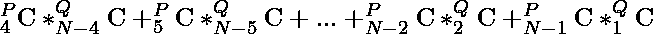
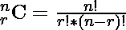
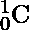
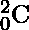
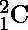
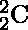
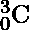
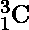
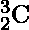
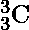

# 从 P 个男生和 Q 个女生中选择至少包含 4 个男生和 1 个女生的 N 个人的方式数|第 2 集

> 原文:[https://www . geesforgeks . org/count-of-to-choice-n-people-至少包含-4 个男孩和-1 个女孩-来自-p-boys-q-girls-set-2/](https://www.geeksforgeeks.org/count-of-ways-to-choose-n-people-containing-at-least-4-boys-and-1-girl-from-p-boys-and-q-girls-set-2/)

给定整数 **N，P，Q** 的任务是从 **P 男生**和 **Q 女生中找出至少有 4 个男生**和 **1 个女生**组成一群 **N 人**。

**示例:**

> **输入:** P = 5，Q = 2，N = 5
> **输出:** 10
> **说明:**假设给定池为{m1，m2，m3，m4，m5}和{w1，w2}。那么可能的组合是:
> m1 m2 m3 M4 w1
> m2 m3 M4 M5 w1
> m1 m3 M4 M5 w1
> m1 m2 M4 M5 w1
> m1 m2 m3 M5 w1
> m1 m2 m3 M4 w2
> m2 m3 M4 M5 w2
> m1 m3 M4 M5 w2
> m1 m2 M4 M5 w2
> m1 m2 m3 M5 w2
> 
> 因此计数是 10。
> 
> **输入:** P = 5，Q = 2，N = 6
> T3】输出: 7

**天真法:**这个问题是基于 [**组合学**](https://www.geeksforgeeks.org/combinatorics-gq/)**而天真法的细节已经在这个问题的 [**集-1**](https://www.geeksforgeeks.org/count-of-ways-to-choose-n-people-containing-at-least-4-boys-and-1-girl-from-p-boys-and-q-girls/) 中讨论过了。**

**对于一些 P，Q 和 N 的一般值，我们可以用下面的公式计算总的可能方式:**

> ****
> 
> **在哪里**
> 
> ****

**在这种方法中，每一步我们都在计算每一种可能方式的价值。
**时间复杂度:** O(N <sup>2</sup> )
**辅助空间:** O(1)**

****高效方法:**为了高效地解决这个问题，我们可以使用 [**帕斯卡三角形**](https://www.geeksforgeeks.org/calculate-ncr-using-pascals-triangle/) 属性来计算，即**

> **1
> 1 1
> 1 2 1
> 1 3 3 1
> 。
> 。
> 。**

**这不过是**

> **
> 
> 
> 
> 。
> 。
> 。**

**遵循以下步骤:**

*   **使用 [**帕斯卡三角形**](https://www.geeksforgeeks.org/pascal-triangle/) 预先计算组合的值。**
*   **开始从 **i = 4** 到 **i = P** 的循环迭代，每次迭代执行以下操作。**
*   **检查 **(N-i) ≥ 1** 、 **(N-i) ≤ Q** 。**
*   **如果条件满足，则**计算 **i 男**和 **(N-i)女**的可能方式**，否则跳过该步骤。**
*   ****用**总数**相加**计数方式。**
*   **返回总计数作为您的答案。**

**以下是该方法的实施情况:**

## **C++**

```
#include <bits/stdc++.h>
using namespace std;

long long int pascal[31][31];

// Function to calculate the pascal triangle
void pascalTriangle()
{
    pascal[0][0] = 1;
    pascal[1][0] = 1;
    pascal[1][1] = 1;

    // Loop to calculate values of
    // pascal triangle
    for (int i = 2; i < 31; i++) {
        pascal[i][0] = 1;
        for (int j = 1; j < i; j++)
            pascal[i][j]
                = pascal[i - 1][j]
                  + pascal[i - 1][j - 1];
        pascal[i][i] = 1;
    }
}

// Function to calculate the number of ways
long long int countWays(int n, int p, int q)
{

    // Variable to store the answer
    long long int sum = 0;

    // Loop to calculate the number of ways
    for (long long int i = 4; i <= p; i++) {
        if (n - i >= 1 && n - i <= q)
            sum += pascal[p][i]
                   * pascal[q][n - i];
    }
    return sum;
}

// Driver code
int main()
{
    pascalTriangle();

    int P = 5, Q = 2, N = 5;

    // Calculate possible ways for given
    // N, P, and Q
    cout << countWays(N, P, Q) << endl;
    return 0;
}
```

## **Java 语言(一种计算机语言，尤用于创建网站)**

```
import java.util.*;
public class GFG
{

static long [][]pascal = new long[31][31];

// Function to calculate the pascal triangle
static void pascalTriangle()
{
    pascal[0][0] = 1;
    pascal[1][0] = 1;
    pascal[1][1] = 1;

    // Loop to calculate values of
    // pascal triangle
    for (int i = 2; i < 31; i++) {
        pascal[i][0] = (int)1;
        for (int j = 1; j < i; j++)
            pascal[i][j]
                = pascal[i - 1][j]
                  + pascal[i - 1][j - 1];
        pascal[i][i] = 1;
    }
}

// Function to calculate the number of ways
static long countWays(int n, int p, int q)
{

    // Variable to store the answer
    long sum = 0;

    // Loop to calculate the number of ways
    for (int i = 4; i <= p; i++) {
        if (n - i >= 1 && n - i <= q) {
            sum += (int)pascal[p][i]
                   * (int)pascal[q][n - i];
        }
    }
    return sum;
}

// Driver code
public static void main(String args[])
{
    pascalTriangle();

    int P = 5, Q = 2, N = 5;

    // Calculate possible ways for given
    // N, P, and Q
    System.out.print(countWays(N, P, Q));

}
}
// This code is contributed by Samim Hossain Mondal.
```

## **蟒蛇 3**

```
# Python3 program for the above approach
import numpy as np

pascal = np.zeros((31,31));

# Function to calculate the pascal triangle
def pascalTriangle() :

    pascal[0][0] = 1;
    pascal[1][0] = 1;
    pascal[1][1] = 1;

    # Loop to calculate values of
    # pascal triangle
    for i in range(2, 31) :

        pascal[i][0] = 1;
        for j in range(1, i) :
            pascal[i][j] = pascal[i - 1][j] + pascal[i - 1][j - 1];

        pascal[i][i] = 1;

# Function to calculate the number of ways
def countWays(n, p, q) :

    # Variable to store the answer
    sum = 0;

    # Loop to calculate the number of ways
    for i in range(4, p + 1) :

        if (n - i >= 1 and n - i <= q) :

            sum += pascal[p][i] * pascal[q][n - i];

    return int(sum);

# Driver code
if __name__ ==  "__main__" :

    pascalTriangle();

    P = 5; Q = 2; N = 5;

    # Calculate possible ways for given
    # N, P, and Q
    print(countWays(N, P, Q));

    # This code is contributed by AnkThon
```

## **C#**

```
using System;
class GFG
{

static long [,]pascal = new long[31, 31];

// Function to calculate the pascal triangle
static void pascalTriangle()
{
    pascal[0, 0] = 1;
    pascal[1, 0] = 1;
    pascal[1, 1] = 1;

    // Loop to calculate values of
    // pascal triangle
    for (int i = 2; i < 31; i++) {
        pascal[i, 0] = (int)1;
        for (int j = 1; j < i; j++)
            pascal[i, j]
                = pascal[i - 1, j]
                  + pascal[i - 1, j - 1];
        pascal[i, i] = 1;
    }
}

// Function to calculate the number of ways
static long countWays(int n, int p, int q)
{

    // Variable to store the answer
    long sum = 0;

    // Loop to calculate the number of ways
    for (int i = 4; i <= p; i++) {
        if (n - i >= 1 && n - i <= q) {
            sum += (int)pascal[p, i]
                   * (int)pascal[q, n - i];
        }
    }
    return sum;
}

// Driver code
public static void Main()
{
    pascalTriangle();

    int P = 5, Q = 2, N = 5;

    // Calculate possible ways for given
    // N, P, and Q
    Console.Write(countWays(N, P, Q));

}
}
// This code is contributed by Samim Hossain Mondal.
```

## **java 描述语言**

```
<script>

    let pascal = new Array(31).fill(0).map(() => new Array(31).fill(0));

    // Function to calculate the pascal triangle
    const pascalTriangle = () => {
        pascal[0][0] = 1;
        pascal[1][0] = 1;
        pascal[1][1] = 1;

        // Loop to calculate values of
        // pascal triangle
        for (let i = 2; i < 31; i++) {
            pascal[i][0] = 1;
            for (let j = 1; j < i; j++)
                pascal[i][j]
                    = pascal[i - 1][j]
                    + pascal[i - 1][j - 1];
            pascal[i][i] = 1;
        }
    }

    // Function to calculate the number of ways
    const countWays = (n, p, q) => {

        // Variable to store the answer
        let sum = 0;

        // Loop to calculate the number of ways
        for (let i = 4; i <= p; i++) {
            if (n - i >= 1 && n - i <= q)
                sum += pascal[p][i]
                    * pascal[q][n - i];
        }
        return sum;
    }

    // Driver code
    pascalTriangle();

    let P = 5, Q = 2, N = 5;

    // Calculate possible ways for given
    // N, P, and Q
    document.write(countWays(N, P, Q));

// This code is contributed by rakeshsahni

</script>
```

****Output**

```
10
```** 

****时间复杂度:**O(N)
T3】辅助空间: O(N <sup>2</sup>**