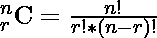
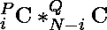

# 从 P 个男生和 Q 个女生中选择至少包含 4 个男生和 1 个女生的 N 个人的方式数

> 原文:[https://www . geesforgeks . org/从 p-boys-and-q-girls/中选择 n 人-至少包含 4 个男孩和 1 个女孩的方法计数](https://www.geeksforgeeks.org/count-of-ways-to-choose-n-people-containing-at-least-4-boys-and-1-girl-from-p-boys-and-q-girls/)

给定整数 **N** 、 **P** 、 **Q** 任务是从 **P 男生**、 **Q 女生**中，找出形成一群 **N 人**至少有 4 个男生、 **1 个女生**的方法数。

**示例:**

> **输入:** P = 5，Q = 2，N = 5
> **输出:** 10
> **说明:**假设给定池为{m1，m2，m3，m4，m5}和{w1，w2}。那么可能的组合是:
> 
> m1 m2 m3 m4w 1
> 【m2 m3 m3 m5w 1】
> 【m1 m3 m3 m5w 1】
> 【m1 m2 m3 m5w 1】
> 【m1 m2 m3 m5w 1】
> m1 m2 m3 m4w 2
> 【m2 m3 m3 m5w 2】
> 
> 因此计数是 10。
> 
> **输入:** P = 5，Q = 2，N = 6
> T3】输出: 7

**做法:**这个问题是基于 [**组合学**](https://www.geeksforgeeks.org/mathematics-combinatorics-basics/) 这里我们需要从 **1** 的男生中至少选择 **4** 的男生可用，从 **Q** 的女生中至少选择 **Y** 的女生可用，这样选择出来的总人数就是 N.
考虑一下例子:

> P = 5，Q = 2，N = 6
> 在这种情况下，可能的选择是:
> (5 个男孩中的 4 个)* (2 个女孩中的 2 个)+ (5 个男孩中的 5 个)*(2 个女孩中的 1 个)
> = 5C4 * 2C2 + 5C5 * 2C1

所以对于一些**P****Q**和 **N** 的**一般值**，该方法可以可视化为:


在哪里


按照下面提到的步骤来实现它:

*   开始从 **i = 4** 到 **i = P** 的循环迭代。
*   在每次迭代中，如果我们选择 **i 男孩**和 **(N-i)女孩，**使用组合
    计算可能的方式数
*   **将每次迭代的可能值加**为**总**路数。
*   返回最后计算出的总数。

以下是该方法的实施情况:

## C++

```
#include <bits/stdc++.h>
using namespace std;

// Function to calculate factorial
long long int fact(int f)
{
    f++;
    long long int ans = 1;

    // Loop to calculate factorial of f
    while (--f > 0)
        ans = ans * f;
    return ans;
}

// Function to calculate combinaion nCr
long long int ncr(int n, int r)
{
    return (fact(n) / (fact(r) * fact(n - r)));
}

// Function to calculate the number of ways
long long int countWays(int n, int p, int q)
{
    long long int sum = 0;

    // Loop to calculate the number of ways
    for (long long int i = 4; i <= p; i++) {
        if (n - i >= 1 && n - i <= q)
            sum += (ncr(p, i) * ncr(q, n - i));
    }
    return sum;
}

// Driver code
int main()
{
    int P = 5, Q = 2, N = 5;
    cout << countWays(N, P, Q) << endl;
    return 0;
}
```

## Java 语言(一种计算机语言，尤用于创建网站)

```
import java.util.*;

class GFG{

// Function to calculate factorial
static int fact(int f)
{
    f++;
    int ans = 1;

    // Loop to calculate factorial of f
    while (--f > 0)
        ans = ans * f;
    return ans;
}

// Function to calculate combinaion nCr
static int ncr(int n, int r)
{
    return (fact(n) / (fact(r) * fact(n - r)));
}

// Function to calculate the number of ways
static int countWays(int n, int p, int q)
{
    int sum = 0;

    // Loop to calculate the number of ways
    for (int i = 4; i <= p; i++) {
        if (n - i >= 1 && n - i <= q)
            sum += (ncr(p, i) * ncr(q, n - i));
    }
    return sum;
}

// Driver code
public static void main(String[] args)
{
    int P = 5, Q = 2, N = 5;
    System.out.print(countWays(N, P, Q) +"\n");
}
}

// This code is contributed by 29AjayKumar
```

## 蟒蛇 3

```
# Function to calculate factorial
def fact(f):
    ans = 1

    # Loop to calculate factorial of f
    while (f):
        ans = ans * f
        f -= 1
    return ans

# Function to calculate combinaion nCr
def ncr(n, r):
    return (fact(n) / (fact(r) * fact(n - r)))

# Function to calculate the number of ways
def countWays(n, p, q):
    sum = 0

    # Loop to calculate the number of ways
    for i in range(4, p + 1):
        if (n - i >= 1 and n - i <= q):
            sum += (ncr(p, i) * ncr(q, n - i))

    return (int)(sum)

# Driver code
P = 5
Q = 2
N = 5
print(countWays(N, P, Q))

 # This code is contributed by gfgking.
```

## C#

```
// C# program for the above approach
using System;
using System.Collections.Generic;

class GFG {

// Function to calculate factorial
static int fact(int f)
{
    f++;
    int ans = 1;

    // Loop to calculate factorial of f
    while (--f > 0)
        ans = ans * f;
    return ans;
}

// Function to calculate combinaion nCr
static int ncr(int n, int r)
{
    return (fact(n) / (fact(r) * fact(n - r)));
}

// Function to calculate the number of ways
static int countWays(int n, int p, int q)
{
    int sum = 0;

    // Loop to calculate the number of ways
    for (int i = 4; i <= p; i++) {
        if (n - i >= 1 && n - i <= q)
            sum += (ncr(p, i) * ncr(q, n - i));
    }
    return sum;
}

    // Driver Code
    public static void Main()
    {
        int P = 5, Q = 2, N = 5;
        Console.Write(countWays(N, P, Q));
    }
}

// This code is contributed by sanjoy_62.
```

## java 描述语言

```
<script>

    // Function to calculate factorial
    const fact = (f) => {
        f++;
        let ans = 1;

        // Loop to calculate factorial of f
        while (--f > 0)
            ans = ans * f;
        return ans;
    }

    // Function to calculate combinaion nCr
    const ncr = (n, r) => {
        return (fact(n) / (fact(r) * fact(n - r)));
    }

    // Function to calculate the number of ways
    const countWays = (n, p, q) => {
        let sum = 0;

        // Loop to calculate the number of ways
        for (let i = 4; i <= p; i++) {
            if (n - i >= 1 && n - i <= q)
                sum += (ncr(p, i) * ncr(q, n - i));
        }
        return sum;
    }

    // Driver code

    let P = 5, Q = 2, N = 5;
    document.write(countWays(N, P, Q));

    // This code is contributed by rakeshsahni

</script>
```

**Output**

```
10
```

**时间复杂度:**O(N<sup>2</sup>)
T5】辅助空间: O(1)