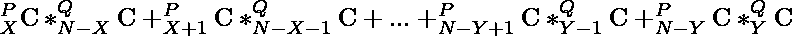
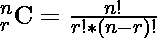

# 从 P 男 Q 女中选择至少有 X 男 Y 女的 N 个人的方式数|第 2 集

> 原文:[https://www . geesforgeks . org/count-of-way-to-choice-n-people-with-至少-x-men-y-women-from-p-men-q-women-set-2/](https://www.geeksforgeeks.org/count-of-ways-to-choose-n-people-with-at-least-x-men-and-y-women-from-p-men-and-q-women-set-2/)

给定整数 **N、P、Q、X、Y，**任务是从 **P 男、Q 女、**其中(X + Y ≤ N、X ≤ P、Y ≤ Q)找到组成一群 **N 人**至少有**X 男**和 **Y 女**的途径数。

**示例:**

> **输入:** P = 4，Q = 2，N = 5，X = 3，Y = 1
> **输出:** 6
> **说明:**假设给定池为{m1，m2，m3，m4}和{w1，w2}。那么可能的组合是:
> m1 m2 m3 M4 w1
> m1 m2 m3 M4 w2
> m1 m2 m3 w1 w2
> m1 m2 M4 w1 w2
> m1 m3 M4 w1 w2
> m2 m3 M4 w1 w2
> 因此计数为 6。
> 
> **输入:** P = 5，Q = 2，N = 6，X = 4，Y = 1
> T3】输出: 7

**天真法:**这个问题是基于 [**组合学**](https://www.geeksforgeeks.org/combinatorics-gq/)**而天真法的细节已经在这个问题的 [**集-1**](https://www.geeksforgeeks.org/count-of-all-possible-ways-to-choose-n-people-with-at-least-x-men-and-y-women-from-p-men-and-q-women/) 中讨论过了。**

**对于 P、Q、N、X 和 Y 的一些一般值，我们可以使用以下公式计算总的可能方式:**

> ****
> 
> **在哪里**
> 
> ****

**在这种方法中，每一步我们都在计算每一种可能方式的价值。**

****时间复杂度:**O(N<sup>2</sup>)
T5】辅助空间: O(1)**

****高效方法:**为了高效地解决这个问题，我们可以使用 [**帕斯卡三角形**](https://www.geeksforgeeks.org/calculate-ncr-using-pascals-triangle/) 属性来计算，即**

> **1
> 1 1
> 1 2 1
> 1 3 3 1
> 。
> 。
> 。**

**这不过是**

> **
> 
> 
> 
> 。
> 。
> 。**

**遵循以下步骤:**

*   **使用 [**帕斯卡三角形**](https://www.geeksforgeeks.org/pascal-triangle/) 预先计算组合的值。**
*   **开始迭代一个从 **i = X** 到 **i = P** 的循环，并在每次迭代中执行以下操作。**
*   **检查**(N-I)≥Y****(N-I)≤Q**。**
*   **如果条件满足，则**计算 **i 男**和 **(N-i)女**的可能方式**，否则跳过该步骤。**
*   ****用**总数**相加**计数方式。**
*   **返回总计数作为您的答案。**

**以下是该方法的实施情况:**

## **C++**

```
#include <bits/stdc++.h>
using namespace std;

long long int pascal[31][31];

// Function to calculate the pascal triangle
void pascalTriangle()
{
    pascal[0][0] = 1;
    pascal[1][0] = 1;
    pascal[1][1] = 1;

    // Loop to calculate values of
    // pascal triangle
    for (int i = 2; i < 31; i++) {
        pascal[i][0] = 1;
        for (int j = 1; j < i; j++)
            pascal[i][j]
                = pascal[i - 1][j]
                  + pascal[i - 1][j - 1];
        pascal[i][i] = 1;
    }
}

// Function to calculate the number of ways
long long int countWays(int n, int p,
                        int q, int x,
                        int y)
{

    // Variable to store the answer
    long long int sum = 0;

    // Loop to calculate the number of ways
    for (long long int i = x; i <= p; i++) {
        if (n - i >= y && n - i <= q)
            sum += pascal[p][i]
                   * pascal[q][n - i];
    }
    return sum;
}

// Driver code
int main()
{
    pascalTriangle();

    int P = 4, Q = 2, N = 5, X = 3, Y = 1;

    // Calculate possible ways for given
    // N, P, Q, X and Y
    cout << countWays(N, P, Q, X, Y)
         << endl;
    return 0;
}
```

## **Java 语言(一种计算机语言，尤用于创建网站)**

```
// Java code for the above approach
import java.io.*;
class GFG {

    static long pascal[][] = new long[31][31];

    // Function to calculate the pascal triangle
    static void pascalTriangle()
    {
        pascal[0][0] = 1;
        pascal[1][0] = 1;
        pascal[1][1] = 1;

        // Loop to calculate values of
        // pascal triangle
        for (int i = 2; i < 31; i++) {
            pascal[i][0] = 1;
            for (int j = 1; j < i; j++)
                pascal[i][j] = pascal[i - 1][j]
                               + pascal[i - 1][j - 1];
            pascal[i][i] = 1;
        }
    }

    // Function to calculate the number of ways
    static long countWays(int n, int p, int q, int x, int y)
    {

        // Variable to store the answer
        long sum = 0;

        // Loop to calculate the number of ways
        for (int i = x; i <= p; i++) {
            if (n - i >= y && n - i <= q)
                sum += pascal[p][i] * pascal[q][n - i];
        }
        return sum;
    }

    // Driver code
    public static void main(String[] args)
    {
        pascalTriangle();
        int P = 4, Q = 2, N = 5, X = 3, Y = 1;

        // Calculate possible ways for given
        // N, P, Q, X and Y
        System.out.println(countWays(N, P, Q, X, Y));
    }
}

// This code is contributed by Potta Lokesh
```

## **蟒蛇 3**

```
pascal = [[0 for i in range(31)] for j in range(31)]

# Function to calculate the pascal triangle
def pascalTriangle():
  pascal[0][0] = 1;
  pascal[1][0] = 1;
  pascal[1][1] = 1;

  # Loop to calculate values of
  # pascal triangle
  for i in range(2, 31):
    pascal[i][0] = 1;
    for j in range(i):
      pascal[i][j] = pascal[i - 1][j] + pascal[i - 1][j - 1];
    pascal[i][i] = 1;

# Function to calculate the number of ways
def countWays(n, p, q, x, y):

  # Variable to store the answer
  sum = 0;

  # Loop to calculate the number of ways
  for i in range(x, p + 1):
    if (n - i >= y and n - i <= q):
      sum += pascal[p][i] * pascal[q][n - i];
  return sum;

# Driver code
pascalTriangle();

P = 4
Q = 2
N = 5
X = 3
Y = 1;

# Calculate possible ways for given
# N, P, Q, X and Y
print(countWays(N, P, Q, X, Y))

# This code is contributed by Saurabh Jaiswal
```

## **C#**

```
// C# code for the above approach
using System;

class GFG{

static long [,]pascal = new long[31, 31];

// Function to calculate the pascal triangle
static void pascalTriangle()
{
    pascal[0, 0] = 1;
    pascal[1, 0] = 1;
    pascal[1, 1] = 1;

    // Loop to calculate values of
    // pascal triangle
    for(int i = 2; i < 31; i++)
    {
        pascal[i, 0] = 1;
        for(int j = 1; j < i; j++)
            pascal[i, j] = pascal[i - 1, j] +
                           pascal[i - 1, j - 1];
        pascal[i, i] = 1;
    }
}

// Function to calculate the number of ways
static long countWays(int n, int p, int q, int x, int y)
{

    // Variable to store the answer
    long sum = 0;

    // Loop to calculate the number of ways
    for(int i = x; i <= p; i++)
    {
        if (n - i >= y && n - i <= q)
            sum += pascal[p, i] * pascal[q, n - i];
    }
    return sum;
}

// Driver code
public static void Main(String[] args)
{
    pascalTriangle();

    int P = 4, Q = 2, N = 5, X = 3, Y = 1;

    // Calculate possible ways for given
    // N, P, Q, X and Y
    Console.WriteLine(countWays(N, P, Q, X, Y));
}
}

// This code is contributed by shikhasingrajput
```

## **java 描述语言**

```
<script>
let pascal = new Array(31).fill(0).map(() => new Array(31).fill(0));

// Function to calculate the pascal triangle
function pascalTriangle() {
  pascal[0][0] = 1;
  pascal[1][0] = 1;
  pascal[1][1] = 1;

  // Loop to calculate values of
  // pascal triangle
  for (let i = 2; i < 31; i++) {
    pascal[i][0] = 1;
    for (let j = 1; j < i; j++)
      pascal[i][j]
        = pascal[i - 1][j]
        + pascal[i - 1][j - 1];
    pascal[i][i] = 1;
  }
}

// Function to calculate the number of ways
function countWays(n, p, q, x, y) {

  // Variable to store the answer
  let sum = 0;

  // Loop to calculate the number of ways
  for (let i = x; i <= p; i++) {
    if (n - i >= y && n - i <= q)
      sum += pascal[p][i]
        * pascal[q][n - i];
  }
  return sum;
}

// Driver code
pascalTriangle();

let P = 4, Q = 2, N = 5, X = 3, Y = 1;

// Calculate possible ways for given
// N, P, Q, X and Y
document.write(countWays(N, P, Q, X, Y))

// This code is contributed by gfgking.
</script>
```

****Output**

```
6
```** 

****时间复杂度:**O(N)
T3】辅助空间: O(N <sup>2</sup>**