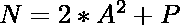
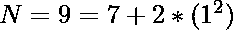
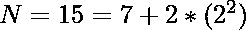

# 将 N 表示为一个素数和一个平方的两倍之和的方法计数

> 原文:[https://www . geesforgeks . org/将 n 表示为一个素数和一个平方的两倍之和的方法计数/](https://www.geeksforgeeks.org/count-of-ways-to-represent-n-as-sum-of-a-prime-number-and-twice-of-a-square/)

给定一个整数 **N** ，任务是计算路数，使 N 可以写成一个素数和一个平方的两倍之和，即



，其中 P 可以是任意素数，A 可以是任意正整数。
**注:**


**示例:**

> **输入:** N = 9
> **输出:** 1
> **说明:**
> 9 可以表示为质数和一个平方的两次之和，只有一种方式–
> 
> 
> 
> **输入:** N = 15
> **输出:** 2
> **说明:**
> 15 可以用质数和两次平方之和两种方式表示–
> 
> [特克斯]n = 15 = 13+2 *(1^{2})[/特克斯]

**方法:**想法是使用厄拉多塞[筛](https://www.geeksforgeeks.org/sieve-of-eratosthenes/)找到所有素数，然后针对每个素数检查从 1 开始的每个可能的数。如果任何质数和两次平方等于给定的数，则将路的计数增加 1。
以下是上述办法的实施情况:

## C++

```
// C++ implementation to count the
// number of ways a number can be
// written as sum of prime number
// and twice a square

#include <bits/stdc++.h>

using namespace std;
long long int n = 500000 - 2;
vector<long long int> v;

// Function to mark all the
// prime numbers using sieve
void sieveoferanthones()
{
    bool prime[n + 1];

    // Initially all the numbers
    // are marked as prime
    memset(prime, true,
           sizeof(prime));

    // Loop to mark the prime numbers
    // upto the Square root of N
    for (long long int i = 2; i <= sqrt(n);
         i++) {
        if (prime[i])
            for (long long int j = i * i;
                 j <= n; j += i) {
                prime[j] = false;
            }
    }

    // Loop to store the prime
    // numbers in an array
    for (long long int i = 2; i < n; i++) {
        if (prime[i])
            v.push_back(i);
    }
}

// Function to find the number
// ways to represent a number
// as the sum of prime number and
// square of a number
void numberOfWays(long long int n)
{
    long long int count = 0;

    // Loop to iterate over all the
    // possible prime numbers
    for (long long int j = 1;
         2 * (pow(j, 2)) < n; j++) {
        for (long long int i = 1;
             v[i] + 2 <= n; i++) {

            // Increment the count if
            // the given number is a
            // valid number
            if (n == v[i]
+ (2 * (pow(j, 2))))
                count++;
        }
    }
    cout << count << endl;
}

// Driver Code
int main()
{
    sieveoferanthones();
    long long int n = 9;

    // Function Call
    numberOfWays(n);
    return 0;
}
```

## Java 语言(一种计算机语言，尤用于创建网站)

```
// Java implementation to count the
// number of ways a number can be
// written as sum of prime number
// and twice a square
import java.util.*;
class GFG{

static int n = 500000 - 2;
static Vector<Integer> v =
              new Vector<>();

// Function to mark all the
// prime numbers using sieve
static void sieveoferanthones()
{
  boolean []prime = new boolean[n + 1];

  // Initially all the numbers
  // are marked as prime
  Arrays.fill(prime, true);

  // Loop to mark the prime numbers
  // upto the Square root of N
  for (int i = 2;
           i <= Math.sqrt(n); i++)
  {
    if (prime[i])
      for (int j = i * i;
               j <= n; j += i)
      {
        prime[j] = false;
      }
  }

  // Loop to store the prime
  // numbers in an array
  for (int i = 2; i < n; i++)
  {
    if (prime[i])
      v.add(i);
  }
}

// Function to find the number
// ways to represent a number
// as the sum of prime number and
// square of a number
static void numberOfWays(int n)
{
  int count = 0;

  // Loop to iterate over all the
  // possible prime numbers
  for (int j = 1; 2 *
      (Math.pow(j, 2)) < n; j++)
  {
    for (int i = 1; v.get(i) +
             2 <= n; i++)
    {
      // Increment the count if
      // the given number is a
      // valid number
      if (n == v.get(i) +
         (2 * (Math.pow(j, 2))))
        count++;
    }
  }
  System.out.print(count + "\n");
}

// Driver Code
public static void main(String[] args)
{
  sieveoferanthones();
  int n = 9;

  // Function Call
  numberOfWays(n);
}
}

// This code is contributed by Princi Singh
```

## 蟒蛇 3

```
# Python3 implementation to count the
# number of ways a number can be
# written as sum of prime number
# and twice a square
import math

n = 500000 - 2
v = []

# Function to mark all the
# prime numbers using sieve
def sieveoferanthones():

    prime = [1] * (n + 1)

    # Loop to mark the prime numbers
    # upto the Square root of N
    for i in range(2, int(math.sqrt(n)) + 1):
        if (prime[i] != 0):

            for j in range(i * i, n + 1, i):
                prime[j] = False

    # Loop to store the prime
    # numbers in an array
    for i in range(2, n):
        if (prime[i] != 0):
            v.append(i)

# Function to find the number
# ways to represent a number
# as the sum of prime number and
# square of a number
def numberOfWays(n):

    count = 0

    # Loop to iterate over all the
    # possible prime numbers
    j = 1
    while (2 * (pow(j, 2)) < n):
        i = 1
        while (v[i] + 2 <= n):

            # Increment the count if
            # the given number is a
            # valid number
            if (n == v[i] +
               (2 * (math.pow(j, 2)))):
                count += 1

            i += 1

        j += 1

    print(count)

# Driver Code
sieveoferanthones()
n = 9

# Function call
numberOfWays(n)

# This code is contributed by sanjoy_62
```

## C#

```
// C# implementation to count the
// number of ways a number can be
// written as sum of prime number
// and twice a square        
using System;
using System.Collections;
using System.Collections.Generic;

class GFG{        

static int n = 500000 - 2;

static ArrayList v = new ArrayList();

// Function to mark all the
// prime numbers using sieve
static void sieveoferanthones()
{
    bool []prime = new bool[n + 1];

    // Initially all the numbers
    // are marked as prime
    Array.Fill(prime, true);

    // Loop to mark the prime numbers
    // upto the Square root of N
    for(int i = 2;
            i <= (int)Math.Sqrt(n); i++)
    {
        if (prime[i])
        {
            for(int j = i * i;
                    j <= n; j += i)
            {
                prime[j] = false;
            }
        }
    }

    // Loop to store the prime
    // numbers in an array
    for(int i = 2; i < n; i++)
    {
        if (prime[i])
            v.Add(i);
    }
}

// Function to find the number
// ways to represent a number
// as the sum of prime number and
// square of a number
static void numberOfWays(int n)
{
    int count = 0;

    // Loop to iterate over all the
    // possible prime numbers
    for(int j = 1;
            2 * (Math.Pow(j, 2)) < n; j++)
    {
        for(int i = 1;
           (int)v[i] + 2 <= n; i++)
        {

            // Increment the count if
            // the given number is a
            // valid number
            if (n == (int)v[i] +
                     (2 * (Math.Pow(j, 2))))
                count++;
        }
    }
    Console.Write(count);
}        

// Driver Code        
public static void Main (string[] args)
{        
    sieveoferanthones();
    int n = 9;

    // Function call
    numberOfWays(n);
}        
}

// This code is contributed by rutvik_56
```

## java 描述语言

```
<script>

// JavaScript implementation to count the
// number of ways a number can be
// written as sum of prime number
// and twice a square

let n = 500000 - 2;
let v = [];

// Function to mark all the
// prime numbers using sieve
function sieveoferanthones()
{
  let prime = Array.from({length: n+1},
                          (_, i) => true);

  // Loop to mark the prime numbers
  // upto the Square root of N
  for (let i = 2;
           i <= Math.sqrt(n); i++)
  {
    if (prime[i])
      for (let j = i * i;
               j <= n; j += i)
      {
        prime[j] = false;
      }
  }

  // Loop to store the prime
  // numbers in an array
  for (let i = 2; i < n; i++)
  {
    if (prime[i])
      v.push(i);
  }
}

// Function to find the number
// ways to represent a number
// as the sum of prime number and
// square of a number
function numberOfWays(n)
{
  let count = 0;

  // Loop to iterate over all the
  // possible prime numbers
  for (let j = 1; 2 *
      (Math.pow(j, 2)) < n; j++)
  {
    for (let i = 1; v[i] +
             2 <= n; i++)
    {
      // Increment the count if
      // the given number is a
      // valid number
      if (n == v[i] +
         (2 * (Math.pow(j, 2))))
        count++;
    }
  }
  document.write(count + "<br/>");
}

  // Driver Code

    sieveoferanthones();
  let N = 9;

  // Function Call
  numberOfWays(N);

</script>
```

**Output:** 

```
1
```