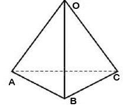

# 在三角金字塔中以 N 步的方式行进循环路径的次数

> 原文:[https://www . geeksforgeeks . org/旅行路线计数-三角形金字塔中 n 步循环路径/](https://www.geeksforgeeks.org/count-of-ways-to-travel-a-cyclic-path-in-n-steps-in-a-triangular-pyramid/)

给定一个顶点标记为 **O、A、B 和 C** 的**三棱锥**和一个数字 **N** ，任务是找到一个人从原点 **O** 开始以 N 步回到原点的方法数。只需一步，一个人就可以到达它的任何相邻顶点。



**例:**

> **输入:** N = 1
> **输出:** 0
> **解释:**
> 在 1 步中， 不可能再次处于位置 O.
> **输入:** N = 2
> **输出:** 3
> **解释:**
> 两步到达回 O 的三种方式为:
> O->A->O
> O->B->O
> O->C->O
> **输入 分三步走分别是:
> O->A->B->O
> O->A->C->O
> O->B->A->O
> O->B->C->O->C->A->O
> O-**

**方法:**思路是使用[动态规划](https://www.geeksforgeeks.org/dynamic-programming/)的概念。

1.  创建一个表 **T[][]** ，其中行代表路数，列代表位置。
2.  为了填满表格，需要进行一次观察。也就是说，如果上一步我们不在 0，我们可以回到 0 的位置。
3.  因此，在当前步骤中到达原点 O 的途径数等于该人在前几个步骤中不在原点 O 的途径数之和。
4.  让我们了解 N = 3 时表格是如何填充的:

```
    0   1    2   3
O   1   0    3   6
A   0   1    2   7
B   0   1    2   7
C   0   1    2   7
```

1.  该表的基本情况是当 N = 1 时。我们可以从除 o 以外的所有位置一步到达原点。

下面是上述方法的实现:
**使用制表方法**

## C++

```
// C++ program for Dynamic
// Programming implementation of
// Number of Path in a Triangular
// pyramid

#include <bits/stdc++.h>
using namespace std;

// Function to return the number of
// ways we can reach back to the
// initial position O

int fun(int n)
{
    int sum=0;
    for(int i=1;i<n;i++)
    {
      sum=sum*3;
      if(i%2)
      {
        sum+=3;
      }
      else
      {
        sum-=3;
      }
     }
     return sum;
}

// Driver code
int main()
{

    int n = 3;
    cout << fun(n) << endl;

    n = 4;
    cout << fun(n) << endl;

    return 0;
}
```

## Java 语言(一种计算机语言，尤用于创建网站)

```
// Java program for dynamic programming
// implementation of number of path in
// a triangular pyramid
class GFG{

// Function to return the number of
// ways we can reach back to the
// initial position O
static int count(int n)
{

    // If n is 0 then there is
    // 1 solution
    if (n == 0)
        return 1;

    // If n is equal to 1 then we
    // can't reach at position O
    if (n == 1)
        return 0;

    int [][]dp = new int[4][n + 1];

    // Initial Conditions

    // Represents position O
    dp[0][0] = 1;

    // Represents position A
    dp[1][0] = 0;

    // Represents position B
    dp[2][0] = 0;

    // Represents position C
    dp[3][0] = 0;

    // Filling the table
    for(int i = 1; i <= n; i++)
    {

       // The number of ways to reach
       // a particular position (say X)
       // at the i'th step is equivalent
       // to the sum of the number
       // of ways the person is not at
       // position X in the last step.
       int countPositionO = dp[1][i - 1] +
                            dp[2][i - 1] +
                            dp[3][i - 1];
       int countPositionA = dp[0][i - 1] +
                            dp[2][i - 1] +
                            dp[3][i - 1];
       int countPositionB = dp[0][i - 1] +
                            dp[1][i - 1] +
                            dp[3][i - 1];
       int countPositionC = dp[0][i - 1] +
                            dp[1][i - 1] +
                            dp[2][i - 1];

       dp[0][i] = countPositionO;
       dp[1][i] = countPositionA;
       dp[2][i] = countPositionB;
       dp[3][i] = countPositionC;
    }
    return dp[0][n];
}

// Driver code
public static void main(String[] args)
{
    int n = 3;
    System.out.print(count(n) + "\n");

    n = 4;
    System.out.print(count(n) + "\n");
}
}

// This code is contributed by sapnasingh4991
```

## 蟒蛇 3

```
# Python3 program for Dynamic
# Programming implementation of
# Number of Path in a Triangular
# pyramid

# Function to return the number of
# ways we can reach back to the
# initial position O
def count(n):

    # If n is 0 then there is
    # 1 solution
    if (n == 0):
        return 1

    # If n is equal to 1
    # then we can't reach at position O
    if (n == 1):
        return 0

    dp = [[0 for i in range(n + 1)]
             for j in range(4)]

    # Initial Conditions

    # Represents position O
    dp[0][0] = 1

    # Represents position A
    dp[1][0] = 0

    # Represents position B
    dp[2][0] = 0

    # Represents position C
    dp[3][0] = 0

    # Filling the table
    for i in range(1, n + 1):

        # The number of ways to reach
        # a particular position (say X)
        # at the i'th step is equivalent
        # to the sum of the number
        # of ways the person is not at
        # position X in the last step.

        countPositionO = (dp[1][i - 1] +
                          dp[2][i - 1] +
                          dp[3][i - 1])

        countPositionA = (dp[0][i - 1] +
                          dp[2][i - 1] +
                          dp[3][i - 1])

        countPositionB = (dp[0][i - 1] +
                          dp[1][i - 1] +
                          dp[3][i - 1])

        countPositionC = (dp[0][i - 1] +
                          dp[1][i - 1] +
                          dp[2][i - 1])

        dp[0][i] = countPositionO
        dp[1][i] = countPositionA
        dp[2][i] = countPositionB
        dp[3][i] = countPositionC

    return dp[0][n]

# Driver code
if __name__ == "__main__":

    n = 3
    print(count(n))

    n = 4
    print(count(n))

# This code is contributed by ChitraNayal
```

## C#

```
// C# program for dynamic programming
// implementation of number of path in
// a triangular pyramid
using System;

class GFG{

// Function to return the number
// of ways we can reach back to
// the initial position O
static int count(int n)
{

    // If n is 0 then there is
    // 1 solution
    if (n == 0)
        return 1;

    // If n is equal to 1 then we
    // can't reach at position O
    if (n == 1)
        return 0;

    int [,]dp = new int[4, n + 1];

    // Initial Conditions

    // Represents position O
    dp[0, 0] = 1;

    // Represents position A
    dp[1, 0] = 0;

    // Represents position B
    dp[2, 0] = 0;

    // Represents position C
    dp[3, 0] = 0;

    // Filling the table
    for(int i = 1; i <= n; i++)
    {

       // The number of ways to reach
       // a particular position (say X)
       // at the i'th step is equivalent
       // to the sum of the number
       // of ways the person is not at
       // position X in the last step.
       int countPositionO = dp[1, i - 1] +
                            dp[2, i - 1] +
                            dp[3, i - 1];
       int countPositionA = dp[0, i - 1] +
                            dp[2, i - 1] +
                            dp[3, i - 1];
       int countPositionB = dp[0, i - 1] +
                            dp[1, i - 1] +
                            dp[3, i - 1];
       int countPositionC = dp[0, i - 1] +
                            dp[1, i - 1] +
                            dp[2, i - 1];

       dp[0, i] = countPositionO;
       dp[1, i] = countPositionA;
       dp[2, i] = countPositionB;
       dp[3, i] = countPositionC;
    }
    return dp[0, n];
}

// Driver code
public static void Main(String[] args)
{
    int n = 3;
    Console.Write(count(n) + "\n");

    n = 4;
    Console.Write(count(n) + "\n");
}
}

// This code is contributed by sapnasingh4991
```

## java 描述语言

```
<script>
// Javascript program for dynamic programming
// implementation of number of path in
// a triangular pyramid

// Function to return the number of
// ways we can reach back to the
// initial position O
function count(n)
{

    // If n is 0 then there is
    // 1 solution
    if (n == 0)
        return 1;

    // If n is equal to 1 then we
    // can't reach at position O
    if (n == 1)
        return 0;

    let dp = new Array(4);
    for(let i = 0; i < 4; i++)
    {
        dp[i] = new Array(n + 1);
        for(let j = 0; j < (n + 1); j++)
        {
            dp[i][j] = 0;
        }
    }

    // Initial Conditions

    // Represents position O
    dp[0][0] = 1;

    // Represents position A
    dp[1][0] = 0;

    // Represents position B
    dp[2][0] = 0;

    // Represents position C
    dp[3][0] = 0;

    // Filling the table
    for(let i = 1; i <= n; i++)
    {

       // The number of ways to reach
       // a particular position (say X)
       // at the i'th step is equivalent
       // to the sum of the number
       // of ways the person is not at
       // position X in the last step.
       let countPositionO = dp[1][i - 1] +
                            dp[2][i - 1] +
                            dp[3][i - 1];
       let countPositionA = dp[0][i - 1] +
                            dp[2][i - 1] +
                            dp[3][i - 1];
       let countPositionB = dp[0][i - 1] +
                            dp[1][i - 1] +
                            dp[3][i - 1];
       let countPositionC = dp[0][i - 1] +
                            dp[1][i - 1] +
                            dp[2][i - 1];

       dp[0][i] = countPositionO;
       dp[1][i] = countPositionA;
       dp[2][i] = countPositionB;
       dp[3][i] = countPositionC;
    }
    return dp[0][n];
}

// Driver code
let n = 3;
    document.write(count(n) + "<br>");

    n = 4;
    document.write(count(n) + "<br>");

// This code is contributed by avanitrachhadiya2155
</script>
```

**Output:** 

```
6
21
```

***时间复杂度:** O(N)。*
***辅助空间复杂度:** O(1)*
**注:**

*   如果我们在表中填充查询集合中数量最大的查询，这个程序在对多个查询进行预处理后，可以更有效地在恒定时间内找到路的数量..