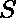
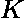
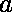
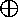
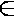
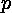
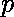

# 对有序的正数对进行计数，使它们的和为 S，异或为 K

> 原文:[https://www . geesforgeks . org/count-ordered-对正数-这样-它们的和是 s-和-xor-是-k/](https://www.geeksforgeeks.org/count-ordered-pairs-of-positive-numbers-such-that-their-sum-is-s-and-xor-is-k/)

给定一个和和一个数。任务是计算所有可能的正数有序对 **(a，b)** ，使得两个正整数 **a** 和 **b** 的和为 **S** 和 **K** 的按位异或。
**示例** :

```
Input : S = 9, K = 5
Output : 4
The ordered pairs are  (2, 7), (3, 6), (6, 3), (7, 2)

Input : S = 2, K = 2
Output : 0
There are no such ordered pair.
```

**方法:**
对于任意两个整数和，

> 求和 **S = a + b** 可以写成 S = (a  b) + (a & b)*2
> 其中 a  b 是按位异或，a & b 分别是 a 和 b 两个数的按位与。

这是因为是非进位二进制加法。这样我们就可以写出 **a & b = (S-K)/2** 其中 **S=(a + b)** 和 **K = (a**

```
*** QuickLaTeX cannot compile formula:

*** Error message:
Error: Nothing to show, formula is empty

```

**b)** 。
如果(S-K)为奇数或(S-K)小于 0，

*   那么就没有这样的有序对。

**现在，对于每个位**，a & b  {0，1}和(a  b)  {0，1}。

*   如果，(a  b) = 0 那么 a <sub> i </sub> = b <sub>i</sub> ，那么我们有一种可能:a<sub>I</sub>= b<sub>I</sub>=(a<sub>I</sub>T13】b<sub>I</sub>)。
*   如果，(a  b) = 1，那么我们必须有(a <sub> i </sub> & b <sub> i </sub> ) = 0(否则输出为 0)，我们有两个选择:要么(a <sub> i </sub> = 1，b <sub> i </sub> = 0)要么(a <sub> i </sub> = 0，b <sub> i </sub> = 1)。

其中 a <sub>i</sub> 是 a 和 b 中的第 I 位 <sub>i</sub> 是 b 中的第 I 位。
因此，答案是 2 ，其中是 K 中的设定位数。
如果 S 和 K 相等，我们将减去 2，因为 a 和 b 必须为正(> 0)。
以下是上述方法的实施:

## C++

```
// C++ program to count ordered pairs of
// positive numbers such that their
// sum is S and XOR is K

#include <bits/stdc++.h>
using namespace std;

// Function to count ordered pairs of
// positive numbers such that their
// sum is S and XOR is K
int countPairs(int s, int K)
{
    // Check if no such pair exists
    if (K > s || (s - K) % 2) {
        return 0;
    }

    if ((s - K) / 2 & K) {
        return 0;
    }

    // Calculate set bits in K
    int setBits = __builtin_popcount(K);

    // Calculate pairs
    int pairsCount = pow(2, setBits);

    // If s = k, subtract 2 from result
    if (s == K)
        pairsCount -= 2;

    return pairsCount;
}

// Driver code
int main()
{
    int s = 9, K = 5;

    cout << countPairs(s, K);

    return 0;
}
```

## Java 语言(一种计算机语言，尤用于创建网站)

```
// Java program to count ordered pairs of
// positive numbers such that their
// sum is S and XOR is K

class GFG {

// Function to count ordered pairs of
// positive numbers such that their
// sum is S and XOR is K
    static int countPairs(int s, int K) {
        // Check if no such pair exists
        if (K > s || (s - K) % 2 ==1) {
            return 0;
        }

        if ((s - K) / 2 == 1 & K == 1) {
            return 0;
        }

        // Calculate set bits in K
        int setBits = __builtin_popcount(K);

        // Calculate pairs
        int pairsCount = (int) Math.pow(2, setBits);

        // If s = k, subtract 2 from result
        if (s == K) {
            pairsCount -= 2;
        }

        return pairsCount;
    }

    static int __builtin_popcount(int n) {
        /* Function to get no of set 
    bits in binary representation 
    of positive integer n */

        int count = 0;
        while (n > 0) {
            count += n & 1;
            n >>= 1;
        }
        return count;
    }

// Driver program to test above function
    public static void main(String[] args) {
        int s = 9, K = 5;
        System.out.println(countPairs(s, K));

    }

}
```

## 蟒蛇 3

```
# Python3 program to count ordered pairs of
# positive numbers such that their
# sum is S and XOR is K

# Function to count ordered pairs of
# positive numbers such that their
# sum is S and XOR is K
def countPairs(s,K):
    if(K>s or (s-K)%2==1):
        return 0

    # Calculate set bits in k
    setBits=(str(bin(K))[2:]).count("1")

    # Calculate pairs
    pairsCount = pow(2,setBits)

    # If s = k, subtract 2 from result
    if(s==K):
        pairsCount-=2

    return pairsCount

# Driver code
if __name__=='__main__':
    s,K=9,5
    print(countPairs(s,K))

# This code is contributed by
# Indrajit Sinha.
```

## C#

```
// C# program to count ordered pairs
// of positive numbers such that their
// sum is S and XOR is K
using System;

class GFG
{

// Function to count ordered pairs of
// positive numbers such that their
// sum is S and XOR is K
static int countPairs(int s, int K)
{
    // Check if no such pair exists
    if (K > s || (s - K) % 2 ==1)
    {
        return 0;
    }

    if ((s - K) / 2 == 1 & K == 1)
    {
        return 0;
    }

    // Calculate set bits in K
    int setBits = __builtin_popcount(K);

    // Calculate pairs
    int pairsCount = (int) Math.Pow(2, setBits);

    // If s = k, subtract 2 from result
    if (s == K)
    {
        pairsCount -= 2;
    }

    return pairsCount;
}

static int __builtin_popcount(int n)
{
    /* Function to get no of set
    bits in binary representation
    of positive integer n */
    int count = 0;
    while (n > 0)
    {
        count += n & 1;
        n >>= 1;
    }
    return count;
}

// Driver Code
public static void Main()
{
    int s = 9, K = 5;
    Console.Write(countPairs(s, K));
}
}

// This code is contributed
// by Rajput-Ji
```

## 服务器端编程语言（Professional Hypertext Preprocessor 的缩写）

```
<?php
// PHP program to count ordered
// pairs of positive numbers such
// that their sum is S and XOR is K

// Function to count ordered pairs of
// positive numbers such that their
// sum is S and XOR is K
function countPairs($s, $K)
{
    // Check if no such pair exists
    if ($K > $s || ($s - $K) % 2 == 1)
    {
        return 0;
    }

    if (($s - $K) / 2 == 1 & $K == 1)
    {
        return 0;
    }

    // Calculate set bits in K
    $setBits = __builtin_popcount($K);

    // Calculate pairs
    $pairsCount = (int)pow(2, $setBits);

    // If s = k, subtract 2 from result
    if ($s == $K)
    {
        $pairsCount -= 2;
    }

    return $pairsCount;
}

function __builtin_popcount($n)
{
    /* Function to get no of set
    bits in binary representation
    of positive integer n */
    $count = 0;
    while ($n > 0)
    {
        $count += $n & 1;
        $n >>= 1;
    }
    return $count;
}

// Driver Code
$s = 9; $K = 5;
echo countPairs($s, $K) . "\n";

// This code is contributed
// by Akanksha Rai
```

## java 描述语言

```
<script>

// Javascript program to count ordered pairs of
// positive numbers such that their
// sum is S and XOR is K

// Function to count ordered pairs of
// positive numbers such that their
// sum is S and XOR is K
function countPairs(s, K)
{
    // Check if no such pair exists
    if (K > s || (s - K) % 2) {
        return 0;
    }

    if (parseInt((s - K) / 2) & K) {
        return 0;
    }

    // Calculate set bits in K
    let setBits = __builtin_popcount(K);

    // Calculate pairs
    let pairsCount = Math.pow(2, setBits);

    // If s = k, subtract 2 from result
    if (s == K)
        pairsCount -= 2;

    return pairsCount;
}

function __builtin_popcount(n)
{
    /* Function to get no of set
    bits in binary representation
    of positive integer n */
    let count = 0;
    while (n > 0)
    {
        count += n & 1;
        n >>= 1;
    }
    return count;
}

// Driver code
    let s = 9, K = 5;

    document.write(countPairs(s, K));

</script>
```

**Output:** 

```
4
```

**时间复杂度:** O(log(K))