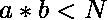

# 计数乘积小于 N 的有序对

> 原文:[https://www . geesforgeks . org/count-ordered-pairs-with-product-小于-n/](https://www.geeksforgeeks.org/count-ordered-pairs-with-product-less-than-n/)

给定一个整数 n，任务是计算有序对(a，b)的数量，使得。
**例:**

```
Input: N = 5
Output: 8
Ordered Pairs are = (1, 1), (1, 2), (1, 3),
(1, 4), (2, 1), (2, 2), (3, 1), (4, 1).

Input: N = 1000
Output: 7053
```

**简单方法:**运行两个循环直到 N–1，并计算乘积小于 N 的有序对。
**高效方法:**让我们考虑一个有序对 **(a，b)** 。那么，如果两个数的乘积小于 n i:e **a * b < n** ，那么它们中至少有一个必须小于 n 的平方根，我们可以通过矛盾证明，如果两个数都大于 n 的平方根，那么它们的乘积不小于 n
所以， 您可以取所有整数 a 至**sqrt(n–1)**而不是所有整数 n，对于每个 a，计算 **b > = a** 的数量，使得 **a * b < n** 。 然后将结果乘以 2，计算你看到的每对(a，b)的对(b，a)。然后减去**sqrt(n–1)**的整数部分，确保对 **(a，a)** 精确计数一次。
以下是上述办法的实施:

## C++

```
// C++ implementation of above approach
#include <bits/stdc++.h>
using namespace std;

// Function to return count of Ordered pairs
// whose product are less than N
int countOrderedPairs(int N)
{
    // Initialize count to 0
    int count_pairs = 0;

    // count total pairs
    for (int i = 1; i <= sqrt(N - 1); ++i) {
        for (int j = i; j * i < N; ++j)
            ++count_pairs;
    }

    // multiply by 2 to get ordered_pairs
    count_pairs *= 2;

    // subtract redundant pairs (a, b) where a==b.
    count_pairs -= int(sqrt(N - 1));

    // return answer
    return count_pairs;
}

// Driver code
int main()
{
    int N = 5;

    // function call to print required answer
    cout << countOrderedPairs(N);

    return 0;
}
```

## Java 语言(一种计算机语言，尤用于创建网站)

```
// Java implementation of above approach

class GFG{
// Function to return count of Ordered pairs
// whose product are less than N
static int countOrderedPairs(int N)
{
    // Initialize count to 0
    int count_pairs = 0;

    // count total pairs
    for (int i = 1; i <= (int)Math.sqrt(N - 1); ++i) {
        for (int j = i; j * i < N; ++j)
            ++count_pairs;
    }

    // multiply by 2 to get ordered_pairs
    count_pairs *= 2;

    // subtract redundant pairs (a, b) where a==b.
    count_pairs -= (int)(Math.sqrt(N - 1));

    // return answer
    return count_pairs;
}

// Driver code
public static void main(String[] args)
{
    int N = 5;

    // function call to print required answer
    System.out.println(countOrderedPairs(N));
}
}
// This code is contributed by mits
```

## 蟒蛇 3

```
# Python3 implementation of above approach

from math import sqrt
# Function to return count of Ordered pairs
# whose product are less than N
def countOrderedPairs(N):
    # Initialize count to 0
    count_pairs = 0

    # count total pairs
    p = int(sqrt(N-1)) + 1
    q = int(sqrt(N))+2
    for i in range(1,p,1):
        for j in range(i,q,1):
            count_pairs += 1

    # multiply by 2 to get ordered_pairs
    count_pairs *= 2

    # subtract redundant pairs (a, b) where a==b.
    count_pairs -= int(sqrt(N - 1))

    # return answer
    return count_pairs

# Driver code
if __name__ == '__main__':
    N = 5

    # function call to print required answer
    print(countOrderedPairs(N))

# This code is contributed by
# Surendra_Gangwar
```

## C#

```
//C# implementation of above approach

using System;

public class GFG{
    // Function to return count of Ordered pairs
// whose product are less than N
static int countOrderedPairs(int N)
{
    // Initialize count to 0
    int count_pairs = 0;

    // count total pairs
    for (int i = 1; i <= (int)Math.Sqrt(N - 1); ++i) {
        for (int j = i; j * i < N; ++j)
            ++count_pairs;
    }

    // multiply by 2 to get ordered_pairs
    count_pairs *= 2;

    // subtract redundant pairs (a, b) where a==b.
    count_pairs -= (int)(Math.Sqrt(N - 1));

    // return answer
    return count_pairs;
}

// Driver code
    static public void Main (){

    int N = 5;
    // function call to print required answer
    Console.WriteLine(countOrderedPairs(N));
}
}
// This code is contributed by Sachin.
```

## 服务器端编程语言（Professional Hypertext Preprocessor 的缩写）

```
<?php
// PHP implementation of above approach

// Function to return count of Ordered
// pairs whose products are less than N
function countOrderedPairs($N)
{
    // Initialize count to 0
    $count_pairs = 0;

    // count total pairs
    for ($i = 1; $i <= sqrt($N - 1); ++$i)
    {
        for ( $j = $i; $j * $i < $N; ++$j)
            ++$count_pairs;
    }

    // multiply by 2 to get ordered_pairs
    $count_pairs *= 2;

    // subtract redundant pairs
    // (a, b) where a==b.
    $count_pairs -= (sqrt($N - 1));

    // return answer
    return $count_pairs;
}

// Driver code
$N = 5;

// function call to print
// required answer
echo countOrderedPairs($N);

// This code is contributed
// by Sach_Code
?>
```

## java 描述语言

```
<script>
//Javascript implementation of above approach

// Function to return count of Ordered pairs
// whose product are less than N
function countOrderedPairs( N)
{
    // Initialize count to 0
    var count_pairs = 0;

    // count total pairs
    for (var i = 1; i <= Math.sqrt(N - 1); ++i) {
        for (var j = i; j * i < N; ++j)
            ++count_pairs;
    }

    // multiply by 2 to get ordered_pairs
    count_pairs *= 2;

    // subtract redundant pairs (a, b) where a==b.
    count_pairs -= parseInt(Math.sqrt(N - 1));

    // return answer
    return count_pairs;
}

var N = 5;
 // function call to print required answer
document.write( countOrderedPairs(N));

// This code is contributed by SoumikMondal
</script>
```

**Output:** 

```
8
```

**时间复杂度:** O(N*sqrt(N))