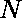

# 从 1 到 N 对配对计数，这样它们的和可以被它们的异或

整除

> 原文:[https://www . geeksforgeeks . org/count-pairs-from-1 to-n-so-它们的和可被它们的 xor 除尽/](https://www.geeksforgeeks.org/count-pairs-from-1-to-n-such-that-their-sum-is-divisible-by-their-xor/)

给定一个数字，任务是对(x，y)进行计数，使得它们的和(x+y)可被它们的异或值(x^y)整除，并且条件 **1 ≤ x < y < N** 成立。
T4 举例:

```
Input: N = 3
Output: 3
Explanation: 
(1, 2), (1, 3), (2, 3) are the valid pairs

Input: N = 6
Output: 11
```

**进场:**

*   将数组作为输入后，首先我们需要[找出该数组](https://www.geeksforgeeks.org/print-all-possible-combinations-of-r-elements-in-a-given-array-of-size-n/)中所有可能的对。
*   所以，从数组中找出配对
*   然后对于每一对，检查该对的和是否能被该对的 xor 值整除。如果是，则将所需计数增加 1。
*   检查完所有配对后，返回或打印该配对的计数。

下面是上述方法的实现:

## C++

```
// C++ program to count pairs from 1 to N
// such that their Sum is divisible by their XOR

#include <bits/stdc++.h>
using namespace std;

// Function to count pairs
int countPairs(int n)
{
    // variable to store count
    int count = 0;

    // Generate all possible pairs such that
    // 1 <= x < y < n
    for (int x = 1; x < n; x++) {
        for (int y = x + 1; y <= n; y++) {
            if ((y + x) % (y ^ x) == 0)
                count++;
        }
    }

    return count;
}

// Driver code
int main()
{
    int n = 6;

    cout << countPairs(n);

    return 0;
}
```

## Java 语言(一种计算机语言，尤用于创建网站)

```
// Java program to count pairs from 1 to N
// such that their Sum is divisible by their XOR
class GFG
{

    // Function to count pairs
    static int countPairs(int n)
    {
        // variable to store count
        int count = 0;

        // Generate all possible pairs such that
        // 1 <= x < y < n
        for (int x = 1; x < n; x++)
        {
            for (int y = x + 1; y <= n; y++)
            {
                if ((y + x) % (y ^ x) == 0)
                    count++;
            }
        }
        return count;
    }

    // Driver code
    public static void main (String[] args)
    {
        int n = 6;
        System.out.println(countPairs(n));
    }
}

// This code is contributed by AnkitRai01
```

## 蟒蛇 3

```
# Python3 program to count pairs from 1 to N
# such that their Sum is divisible by their XOR

# Function to count pairs
def countPairs(n) :

    # variable to store count
    count = 0;

    # Generate all possible pairs such that
    # 1 <= x < y < n
    for x in range(1, n) :
        for y in range(x + 1, n + 1) :
            if ((y + x) % (y ^ x) == 0) :
                count += 1;

    return count;

# Driver code
if __name__ == "__main__" :

    n = 6;

    print(countPairs(n));

# This code is contributed by AnkitRai01
```

## C#

```
// C# program to count pairs from 1 to N
// such that their Sum is divisible by their XOR
using System;

public class GFG
{

    // Function to count pairs
    static int countPairs(int n)
    {
        // variable to store count
        int count = 0;

        // Generate all possible pairs such that
        // 1 <= x < y < n
        for (int x = 1; x < n; x++)
        {
            for (int y = x + 1; y <= n; y++)
            {
                if ((y + x) % (y ^ x) == 0)
                    count++;
            }
        }
        return count;
    }

    // Driver code
    public static void Main()
    {
        int n = 6;
        Console.WriteLine(countPairs(n));
    }
}

// This code is contributed by AnkitRai01
```

## java 描述语言

```
<script>

// JavaScript program to count pairs from 1 to N
// such that their Sum is divisible by their XOR

// Function to count pairs
function countPairs(n)
{
    // variable to store count
    let count = 0;

    // Generate all possible pairs such that
    // 1 <= x < y < n
    for (let x = 1; x < n; x++) {
        for (let y = x + 1; y <= n; y++) {
            if ((y + x) % (y ^ x) == 0)
                count++;
        }
    }

    return count;
}

// Driver code
    let n = 6;

    document.write(countPairs(n));

// This code is contributed by Surbhi Tyagi.

</script>
```

**Output:** 

```
11
```

**时间复杂度:**O(N<sup>2</sup>)
T5】辅助空间: O(1)