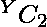

# 从 GCD 等于对中最小元素的数组中计数对

> 原文:[https://www . geesforgeks . org/count-pairs-from-a-array-having-gcd-等于最小元素对/](https://www.geeksforgeeks.org/count-pairs-from-an-array-having-gcd-equal-to-the-minimum-element-in-the-pair/)

给定一个由 **N** 个整数组成的[数组](https://www.geeksforgeeks.org/introduction-to-arrays/)**arr【】**，任务是找出任意一对数组元素的 [GCD 是该对元素中的最小元素。](https://www.geeksforgeeks.org/c-program-find-gcd-hcf-two-numbers/)

**示例:**

> **输入:** arr[ ] = {2，3，1，2}
> **输出:** 4
> **解释:**
> 下面是给定数组中所有可能的对:
> 
> 1.  **(0，1):** 由索引 0 和 2 处的元素组成的对的 GCD 为 gcd(2，1) = 1，等于其对{2，1}的最小值。
> 2.  **(0，3):** 由索引 0 和 3 处的元素组成的对的 GCD 为 gcd(2，2) = 2，等于其对{2，2}的最小值。
> 3.  **(1，2):** 取索引 1 和 2 处的元素形成的对的 GCD 为 gcd(3，1) = 1，等于其对{3，1}的最小值。
> 4.  **(2，3):** 取索引 2 和 3 处的元素形成的对的 GCD 为 gcd(1，2) = 1，等于其对{1，2}的最小值。
> 
> 因此，总共有 4 个可能的对，其 GCD 等于该对的最小元素。
> 
> **输入:** arr[] = {4，6 }
> T3】输出: 0

**天真方法:**解决给定问题的最简单方法是[从给定数组](https://www.geeksforgeeks.org/find-all-pairs-possible-from-the-given-array/)中生成所有可能的对，如果存在任何一对的 [GCD](https://www.geeksforgeeks.org/basic-and-extended-euclidean-algorithms/) 等于该对的最小元素，则计算该对。检查所有对后，打印作为结果获得的**计数**的值。

下面是上述方法的实现:

## C++

```
// C++ program for the above approach

#include <bits/stdc++.h>
using namespace std;

// Function to count pairs from an
// array having GCD equal to
// minimum element of that pair
int countPairs(int arr[], int N)
{
    // Stores the resultant count
    int count = 0;

    // Iterate over the range [0, N - 2]
    for (int i = 0; i < N - 1; i++) {

        // Iterate over the range [i + 1, N]
        for (int j = i + 1; j < N; j++) {

            // If arr[i] % arr[j] is 0
            // or arr[j] % arr[i] is 0
            if (arr[i] % arr[j] == 0
                || arr[j] % arr[i] == 0) {

                // Increment count by 1
                count++;
            }
        }
    }

    // Return the resultant count
    return count;
}

// Driver Code
int main()
{
    int arr[] = { 2, 3, 1, 2 };
    int N = sizeof(arr) / sizeof(arr[0]);
    cout << countPairs(arr, N);

    return 0;
}
```

## Java 语言(一种计算机语言，尤用于创建网站)

```
// java program for the above approach
import java.io.*;
import java.lang.*;
import java.util.*;

public class GFG {

    // Function to count pairs from an
    // array having GCD equal to
    // minimum element of that pair
    static int countPairs(int arr[], int N)
    {

        // Stores the resultant count
        int count = 0;

        // Iterate over the range [0, N - 2]
        for (int i = 0; i < N - 1; i++) {

            // Iterate over the range [i + 1, N]
            for (int j = i + 1; j < N; j++) {

                // If arr[i] % arr[j] is 0
                // or arr[j] % arr[i] is 0
                if (arr[i] % arr[j] == 0
                    || arr[j] % arr[i] == 0) {

                    // Increment count by 1
                    count++;
                }
            }
        }

        // Return the resultant count
        return count;
    }

    // Driver Code
    public static void main(String[] args)
    {

        int arr[] = { 2, 3, 1, 2 };
        int N = arr.length;
        System.out.print(countPairs(arr, N));
    }
}

// This code is contributed by Kingash.
```

## 蟒蛇 3

```
# Python3 program for the above approach

# Function to count pairs from an
# array having GCD equal to
# minimum element of that pair
def countPairs(arr, N):

    # Stores the resultant count
    count = 0

    # Iterate over the range [0, N - 2]
    for i in range(N - 1):

        # Iterate over the range [i + 1, N]
        for j in range(i + 1, N):

            # If arr[i] % arr[j] is 0
            # or arr[j] % arr[i] is 0
            if (arr[i] % arr[j] == 0 or arr[j] % arr[i] == 0):

                # Increment count by 1
                count += 1

    # Return the resultant count
    return count

# Driver Code
if __name__ == '__main__':
    arr = [2, 3, 1, 2]
    N = len(arr)
    print (countPairs(arr, N))

# This code is contributed by mohit kumar 29.
```

## C#

```
// C# program for the above approach

using System;

public class GFG {

    // Function to count pairs from an
    // array having GCD equal to
    // minimum element of that pair
    static int countPairs(int[] arr, int N)
    {

        // Stores the resultant count
        int count = 0;

        // Iterate over the range [0, N - 2]
        for (int i = 0; i < N - 1; i++) {

            // Iterate over the range [i + 1, N]
            for (int j = i + 1; j < N; j++) {

                // If arr[i] % arr[j] is 0
                // or arr[j] % arr[i] is 0
                if (arr[i] % arr[j] == 0
                    || arr[j] % arr[i] == 0) {

                    // Increment count by 1
                    count++;
                }
            }
        }

        // Return the resultant count
        return count;
    }

    // Driver Code
    public static void Main(string[] args)
    {

        int[] arr = { 2, 3, 1, 2 };
        int N = arr.Length;
        Console.WriteLine(countPairs(arr, N));
    }
}

// This code is contributed by ukasp.
```

## java 描述语言

```
<script>
// Javascript implementation of the above approach

    // Function to count pairs from an
    // array having GCD equal to
    // minimum element of that pair
    function countPairs(arr, N)
    {

        // Stores the resultant count
        let count = 0;

        // Iterate over the range [0, N - 2]
        for (let i = 0; i < N - 1; i++) {

            // Iterate over the range [i + 1, N]
            for (let j = i + 1; j < N; j++) {

                // If arr[i] % arr[j] is 0
                // or arr[j] % arr[i] is 0
                if (arr[i] % arr[j] == 0
                    || arr[j] % arr[i] == 0) {

                    // Increment count by 1
                    count++;
                }
            }
        }

        // Return the resultant count
        return count;
    }

  // Driver Code

     let arr = [ 2, 3, 1, 2 ];
        let N = arr.length;
        document.write(countPairs(arr, N));

</script>
```

**Output:** 

```
4
```

***时间复杂度:**O(N<sup>2</sup>)*
***辅助空间:** O(1)*

**高效方法:**上述方法可以基于以下观察进行优化:

*   对的最小元素要除以对的最大元素，可以观察到元素 **1** 总共可以组成**(N–1)对**。
*   每个元素都可以与自身形成对，其中 **Y** 是数组元素的[计数。](https://www.geeksforgeeks.org/counting-frequencies-of-array-elements/)
*   其思想是遍历每个数组元素的[除数，并增加由除数的频率形成的对的数量。](https://www.geeksforgeeks.org/check-if-the-given-array-contains-all-the-divisors-of-some-integer/)

按照以下步骤解决问题:

*   初始化一个变量，比如 **res** ，它存储结果计数。
*   初始化一个[映射](https://www.geeksforgeeks.org/map-associative-containers-the-c-standard-template-library-stl/)，比如说 **mp** ，存储每个数组元素的计数。
*   [遍历数组](https://www.geeksforgeeks.org/c-program-to-traverse-an-array/) **arr[]** ，并在 **mp** 中增加**arr【I】**的计数。
*   [迭代地图对](https://www.geeksforgeeks.org/traversing-a-map-or-unordered_map-in-cpp-stl/) **mp** 并执行以下操作:
    *   将数组元素的值存储在一个变量中，比如说 **X** ，将该数字的频率存储在一个变量中 **Y** 。
    *   如果 **X** 的值为 **1** ，则将 **res** 的值增加**(N-1)**，[继续](https://www.geeksforgeeks.org/continue-statement-cpp/)。
    *   将 **res** 的值增加**(Y *(Y–1))/2**。
    *   现在，我使用变量 **j** 对整数 **X** 的除数进行迭代，并将 **res** 增加**MP【j】**。
*   完成上述步骤后，打印 **res** 的值作为获得的总计数。

下面是上述方法的实现:

## C++

```
// C++ program for the above approach

#include <bits/stdc++.h>
using namespace std;

// Function to count pairs from an
// array having GCD equal to
// minimum element of that pair
int CountPairs(int arr[], int N)
{
    // Stores the resultant count
    int res = 0;

    // Stores the frequency of
    // each array element
    map<int, int> mp;

    // Traverse the array arr[]
    for (int i = 0; i < N; i++) {
        mp[arr[i]]++;
    }
    // Iterate over the Map mp
    for (auto p : mp) {

        // Stores the array element
        int x = p.first;

        // Stores the count
        // of array element x
        int y = p.second;

        // If x is 1
        if (x == 1) {

            // Increment res by N-1
            res += N - 1;
            continue;
        }

        // Increment res by yC2
        res += (y * (y - 1)) / 2;

        // Iterate over the
        // range [2, sqrt(x)]
        for (int j = 2;
             j <= sqrt(x); j++) {

            // If x is divisible by j
            if (x % j == 0) {

                // Increment the value
                // of res by mp[j]
                res += mp[j];

                // If j is not equal to x/j
                if (j != x / j)

                    // Increment res
                    // by mp[x/j]
                    res += mp[x / j];
            }
        }
    }

    // Return the resultant count
    return res;
}

// Driver Code
int main()
{
    int arr[] = { 2, 3, 1, 2 };
    int N = sizeof(arr) / sizeof(arr[0]);
    cout << CountPairs(arr, N);

    return 0;
}
```

## Java 语言(一种计算机语言，尤用于创建网站)

```
// Java program for the above approach
import java.io.*;
import java.util.*;

class GFG {

      // Function to count pairs from an
    // array having GCD equal to
    // minimum element of that pair
    static int CountPairs(int arr[], int N)
    {

        // Stores the resultant count
        int res = 0;

        // Stores the frequency of
        // each array element
        Map<Integer, Integer> mp = new HashMap<>();

        // Traverse the array arr[]
        for (int i = 0; i < N; i++) {
              Integer c = mp.get(arr[i]);
            mp.put(arr[i], (c == null) ? 1 : c + 1);
        }
        // Iterate over the Map mp
          Iterator<Map.Entry<Integer, Integer>> itr = mp.entrySet().iterator();

        while(itr.hasNext())
        {
             Map.Entry<Integer, Integer> entry = itr.next();

            // Stores the array element
            int x = (int)entry.getKey();

            // Stores the count
            // of array element x
            int y = (int)entry.getValue();

            // If x is 1
            if (x == 1) {

                // Increment res by N-1
                res += N - 1;
                continue;
            }

            // Increment res by yC2
            res += (y * (y - 1)) / 2;

            // Iterate over the
            // range [2, sqrt(x)]
            for (int j = 2; j <= Math.sqrt(x); j++) {

                // If x is divisible by j
                if (x % j == 0) {

                    // Increment the value
                    // of res by mp[j]
                    res += mp.get(j);

                    // If j is not equal to x/j
                    if (j != x / j)

                        // Increment res
                        // by mp[x/j]
                        res += mp.get((int)x / j);
                }
            }
        }

        // Return the resultant count
        return res;
    }

    // Driver Code
    public static void main (String[] args) {
        int arr[] = { 2, 3, 1, 2 };
        int N = arr.length;
        System.out.println(CountPairs(arr, N));
    }
}

// This code is contributed by Dharanendra L V.
```

## 蟒蛇 3

```
# Python3 program for the above approach
from math import sqrt

# Function to count pairs from an
# array having GCD equal to
# minimum element of that pair
def CountPairs(arr, N):

    # Stores the resultant count
    res = 0

    # Stores the frequency of
    # each array element
    mp = {}

    # Traverse the array arr[]
    for i in range(N):
        if (arr[i] in mp):
            mp[arr[i]] += 1
        else:
            mp[arr[i]] = 1

    # Iterate over the Map mp
    for key, value in mp.items():

        # Stores the array element
        x = key

        # Stores the count
        # of array element x
        y = value

        # If x is 1
        if (x == 1):

            # Increment res by N-1
            res += N - 1
            continue

        # Increment res by yC2
        res += (y * (y - 1)) // 2

        # Iterate over the
        # range [2, sqrt(x)]
        for j in range(2, int(sqrt(x)) + 1, 1):

            # If x is divisible by j
            if (x % j == 0):

                # Increment the value
                # of res by mp[j]
                res += mp[j]

                # If j is not equal to x/j
                if (j != x // j):

                    # Increment res
                    # by mp[x/j]
                    res += mp[x // j]

    # Return the resultant count
    return res

# Driver Code
if __name__ == '__main__':

    arr = [ 2, 3, 1, 2 ]
    N = len(arr)

    print(CountPairs(arr, N))

# This code is contributed by SURENDRA_GANGWAR
```

## C#

```
// C# program for the above approach
using System;
using System.Collections.Generic;

class GFG{

// Function to count pairs from an
// array having GCD equal to
// minimum element of that pair
static int CountPairs(int []arr, int N)
{

    // Stores the resultant count
    int res = 0;

    // Stores the frequency of
    // each array element
    Dictionary<int,
               int> mp = new Dictionary<int,
                                        int>();

    // Traverse the array arr[]
    for(int i = 0; i < N; i++)
    {
        if (mp.ContainsKey(arr[i]))
            mp[arr[i]]++;
        else
            mp.Add(arr[i], 1);
    }

    // Iterate over the Map mp
    foreach(KeyValuePair<int, int> kvp in mp)
    {

        // Stores the array element
        int x = kvp.Key;

        // Stores the count
        // of array element x
        int y = kvp.Value;

        // If x is 1
        if (x == 1)
        {

            // Increment res by N-1
            res += N - 1;
            continue;
        }

        // Increment res by yC2
        res += (y * (y - 1)) / 2;

        // Iterate over the
        // range [2, sqrt(x)]
        for(int j = 2;
                j <= Math.Sqrt(x); j++)
        {

            // If x is divisible by j
            if (x % j == 0)
            {

                // Increment the value
                // of res by mp[j]
                res += mp[j];

                // If j is not equal to x/j
                if (j != x / j)

                    // Increment res
                    // by mp[x/j]
                    res += mp[x / j];
            }
        }
    }

    // Return the resultant count
    return res;
}

// Driver Code
public static void Main()
{
    int []arr = { 2, 3, 1, 2 };
    int N = arr.Length;

    Console.Write(CountPairs(arr, N));
}
}

// This code is contributed by bgangwar59
```

## java 描述语言

```
<script>

// Javascript program for the above approach

// Function to count pairs from an
// array having GCD equal to
// minimum element of that pair
function CountPairs(arr, N)
{
    // Stores the resultant count
    var res = 0;

    // Stores the frequency of
    // each array element
    var mp = new Map();

    // Traverse the array arr[]
    for (var i = 0; i < N; i++) {
        if(mp.has(arr[i]))
        {
            mp.set(arr[i], mp.get(arr[i])+1);
        }
        else{
            mp.set(arr[i], 1);
        }
    }
    // Iterate over the Map mp
    mp.forEach((value, key) => {
         // Stores the array element
        var x = key;

        // Stores the count
        // of array element x
        var y = value;

        // If x is 1
        if (x == 1) {

            // Increment res by N-1
            res += N - 1;
        }

        // Increment res by yC2
        res += parseInt((y * (y - 1)) / 2);

        // Iterate over the
        // range [2, sqrt(x)]
        for (var j = 2;
             j <= parseInt(Math.sqrt(x)); j++) {

            // If x is divisible by j
            if (x % j == 0) {

                // Increment the value
                // of res by mp[j]
                res += mp.get(j);

                // If j is not equal to x/j
                if (j != parseInt(x / j))

                    // Increment res
                    // by mp[x/j]
                    res += mp.get(parseInt(x / j));
            }
        }
    });

    // Return the resultant count
    return res;
}

// Driver Code
var arr = [2, 3, 1, 2 ];
var N = arr.length;
document.write( CountPairs(arr, N));

</script>
```

**Output:** 

```
4
```

**时间复杂度:** O(N*√M)，其中 M 为数组的[最大元素。
**辅助空间:** O(1)](https://www.geeksforgeeks.org/c-program-find-largest-element-array/)