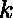

# 从两个数组中计数对，这两个数组的模运算产生 K

> 原文:[https://www . geesforgeks . org/count-pairs-from-two-array-其模运算产生-k/](https://www.geeksforgeeks.org/count-pairs-from-two-arrays-whose-modulo-operation-yields-k/)

给定一个整数和两个数组和，任务是从这些数组中计数总对(从中选择一个元素，从中选择另一个元素后形成)，这些数组的模运算产生。
**注:**如果成对 **(a，b)** 、 **a > b** 则模运算必须按 **a % b** 进行。此外，出现不止一次的配对将只计算一次。
**举例:**

> **输入:** arr1[] = {1，3，7}，arr2[] = {5，3，1}，K = 2
> **输出:** 2
> (3，5)和(7，5)是唯一可能的对。
> 自，5 % 3 = 2 和 7 % 5 = 2
> **输入:** arr1[] = {2，5，99}，arr2[] = {2，8，1，4}，K = 0
> **输出:** 6
> 所有可能的对都是(2，2)，(2，8)，(2，4)，(2，1)，(5，1)和(99，1)。

**进场:**

*   一次从取一个元素，与的所有其他元素逐个进行模运算。
*   如果上一步的结果等于，那么将对(a，b)存储在一个集合中，以避免重复，其中 a 是较小的元素，b 是较大的元素。
*   最终所需的总对数将是集合的大小。

以下是上述方法的实现:

## C++

```
// C++ implementation of above approach
#include <bits/stdc++.h>
using namespace std;

// Function to return the total pairs
// of elements whose modulo yield K
int totalPairs(int arr1[], int arr2[], int K, int n, int m)
{

    // set is used to avoid duplicate pairs
    set<pair<int, int> > s;

    for (int i = 0; i < n; i++) {
        for (int j = 0; j < m; j++) {

            // check which element is greater and
            // proceed according to it
            if (arr1[i] > arr2[j]) {

                // check if modulo is equal to K
                if (arr1[i] % arr2[j] == K)
                    s.insert(make_pair(arr1[i], arr2[j]));
            }
            else {
                if (arr2[j] % arr1[i] == K)
                    s.insert(make_pair(arr2[j], arr1[i]));
            }
        }
    }

    // return size of the set
    return s.size();
}

// Driver code
int main()
{
    int arr1[] = { 8, 3, 7, 50 };
    int arr2[] = { 5, 1, 10, 4 };
    int K = 3;
    int n = sizeof(arr1) / sizeof(arr1[0]);
    int m = sizeof(arr2) / sizeof(arr2[0]);

    cout << totalPairs(arr1, arr2, K, n, m);
    return 0;
}
```

## Java 语言(一种计算机语言，尤用于创建网站)

```
// Java implementation of above approach
import java.util.*;

class GFG
{
    static class pair
    {
        int first, second;
        public pair(int first, int second)
        {
            this.first = first;
            this.second = second;
        }
    }

    // Function to return the total pairs
    // of elements whose modulo yield K
    static int totalPairs(int []arr1, int []arr2,
                          int K, int n, int m)
    {

        // set is used to avoid duplicate pairs
        HashSet<pair> s = new HashSet<pair>();

        for (int i = 0; i < n; i++)
        {
            for (int j = 0; j < m; j++)
            {

                // check which element is greater and
                // proceed according to it
                if (arr1[i] > arr2[j])
                {

                    // check if modulo is equal to K
                    if (arr1[i] % arr2[j] == K)
                        s.add(new pair(arr1[i], arr2[j]));
                }
                else
                {
                    if (arr2[j] % arr1[i] == K)
                        s.add(new pair(arr2[j], arr1[i]));
                }
            }
        }

        // return size of the set
        return s.size();
    }

    // Driver code
    public static void main(String []args)
    {
        int []arr1 = { 8, 3, 7, 50 };
        int []arr2 = { 5, 1, 10, 4 };
        int K = 3;
        int n = arr1.length;
        int m = arr2.length;

        System.out.println(totalPairs(arr1, arr2, K, n, m));
    }
}

// This code is contributed by Princi Singh
```

## 蟒蛇 3

```
# Python3 implementation of above approach

# Function to return the total pairs
# of elements whose modulo yield K
def totalPairs(arr1, arr2, K, n, m):

    # set is used to avoid duplicate pairs
    s={}

    for i in range(n):
        for j in range(m):

            # check which element is greater and
            # proceed according to it
            if (arr1[i] > arr2[j]):

                # check if modulo is equal to K
                if (arr1[i] % arr2[j] == K):
                    s[(arr1[i], arr2[j])]=1
            else:
                if (arr2[j] % arr1[i] == K):
                    s[(arr2[j], arr1[i])]=1

    # return size of the set
    return len(s)

# Driver code

arr1 = [ 8, 3, 7, 50 ]
arr2 = [5, 1, 10, 4 ]
K = 3
n = len(arr1)
m = len(arr2)

print(totalPairs(arr1, arr2, K, n, m))

# This code is contributed by mohit kumar 29
```

## C#

```
// C# implementation of the approach
using System;
using System.Collections.Generic;

class GFG
{
    public class pair
    {
        public int first, second;
        public pair(int first, int second)
        {
            this.first = first;
            this.second = second;
        }
    }

    // Function to return the total pairs
    // of elements whose modulo yield K
    static int totalPairs(int []arr1, int []arr2,
                          int K, int n, int m)
    {

        // set is used to avoid duplicate pairs
        HashSet<pair> s = new HashSet<pair>();

        for (int i = 0; i < n; i++)
        {
            for (int j = 0; j < m; j++)
            {

                // check which element is greater and
                // proceed according to it
                if (arr1[i] > arr2[j])
                {

                    // check if modulo is equal to K
                    if (arr1[i] % arr2[j] == K)
                        s.Add(new pair(arr1[i], arr2[j]));
                }
                else
                {
                    if (arr2[j] % arr1[i] == K)
                        s.Add(new pair(arr2[j], arr1[i]));
                }
            }
        }

        // return size of the set
        return s.Count;
    }

    // Driver code
    public static void Main(String []args)
    {
        int []arr1 = { 8, 3, 7, 50 };
        int []arr2 = { 5, 1, 10, 4 };
        int K = 3;
        int n = arr1.Length;
        int m = arr2.Length;

        Console.WriteLine(totalPairs(arr1, arr2, K, n, m));
    }
}

// This code is contributed by PrinciRaj1992
```

## java 描述语言

```
<script>

// Javascript implementation of above approach

// Function to return the total pairs
// of elements whose modulo yield K
function totalPairs(arr1, arr2, K, n, m)
{

    // set is used to avoid duplicate pairs
    var s = new Set();

    for (var i = 0; i < n; i++) {
        for (var j = 0; j < m; j++) {

            // check which element is greater and
            // proceed according to it
            if (arr1[i] > arr2[j]) {

                // check if modulo is equal to K
                if (arr1[i] % arr2[j] == K)
                    s.add([arr1[i], arr2[j]]);
            }
            else {
                if (arr2[j] % arr1[i] == K)
                    s.add([arr2[j], arr1[i]]);
            }
        }
    }

    // return size of the set
    return s.size;
}

// Driver code
var arr1 = [ 8, 3, 7, 50 ];
var arr2 = [ 5, 1, 10, 4 ];
var K = 3;
var n = arr1.length;
var m = arr2.length;
document.write( totalPairs(arr1, arr2, K, n, m));

</script>   
```

**Output:** 

```
3
```

**注意:**要打印所有对，只需打印集合的元素。