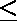

# 对(I，j)进行计数，使得(i+j)可被 A 和 B 整除

> 原文:[https://www . geesforgeks . org/count-pairs-ij-so-ij-是可被 a 和 b 整除的-both/](https://www.geeksforgeeks.org/count-pairs-ij-such-that-ij-is-divisible-by-a-and-b-both/)

给定 n，m，A 和 B，任务是计算整数对(x，y)的数量，使得 1  x  n 和 1  y  m 和(x+y) mod A 和(x+y) mod B 都等于 0。
**例:**

```
Input: n = 60, m = 90, A = 5, B = 10
Output: 540

Input: n = 225, m = 452, A = 10, B = 15
Output: 3389
```

**方法:**如果(x+y)能被 A 和 B 整除，那么基本上 A 和 B 的 LCM 是(x+y)的最小除数。因此，我们计算所有小于或等于 m 且能被它们的 LCM 整除的数，当循环迭代时，我们检查当前数是否能被 A 和 b 的 LCM 整除。
下面是上述方法的实现:

## C++

```
// C++ implementation of above approach
#include <bits/stdc++.h>
using namespace std;

// Function to find the LCM
int find_LCM(int x, int y)
{
    return (x * y) / __gcd(x, y);
}

// Function to count the pairs
int CountPairs(int n, int m, int A, int B)
{
    int cnt = 0;
    int lcm = find_LCM(A, B);

    for (int i = 1; i <= n; i++)
        cnt += (m + (i % lcm)) / lcm;

    return cnt;
}

// Driver code
int main()
{
    int n = 60, m = 90, A = 5, B = 10;

    cout << CountPairs(n, m, A, B);

    return 0;
}
```

## Java 语言(一种计算机语言，尤用于创建网站)

```
//Java implementation of above approach
import java.util.*;
public class ACE {

    static int gcd(int a,int b)
    {
        return b==0 ? a :gcd(b,a%b);
    }

    //Function to find the LCM
    static int find_LCM(int x, int y)
    {
     return (x * y) / gcd(x, y);
    }

    //Function to count the pairs
    static int CountPairs(int n, int m, int A, int B)
    {
     int cnt = 0;
     int lcm = find_LCM(A, B);

     for (int i = 1; i <= n; i++)
         cnt += (m + (i % lcm)) / lcm;

     return cnt;
    }

    //Driver code
    public static void main(String[] args) {

        int n = 60, m = 90, A = 5, B = 10;

        System.out.println(CountPairs(n, m, A, B));

    }

}
```

## 蟒蛇 3

```
# Python3 implementation of
# above approach

# from math lib import gcd method
from math import gcd

# Function to find the LCM
def find_LCM(x, y) :

    return (x * y) // gcd(x, y)

# Function to count the pairs
def CountPairs(n, m, A, B) :

    cnt = 0
    lcm = find_LCM(A, B)

    for i in range(1, n + 1) :
        cnt += (m + (i % lcm)) // lcm

    return cnt

# Driver code    
if __name__ == "__main__" :

    n, m, A, B = 60, 90, 5, 10

    print(CountPairs(n, m, A, B))

# This code is contributed
# by ANKITRAI1
```

## C#

```
// C# implementation of above approach
using System;

class GFG
{
    static int gcd(int a,int b)
    {
        return b == 0 ? a : gcd(b, a % b);
    }

    // Function to find the LCM
    static int find_LCM(int x, int y)
    {
    return (x * y) / gcd(x, y);
    }

    //Function to count the pairs
    static int CountPairs(int n, int m,
                          int A, int B)
    {
        int cnt = 0;
        int lcm = find_LCM(A, B);

        for (int i = 1; i <= n; i++)
            cnt += (m + (i % lcm)) / lcm;

        return cnt;
    }

    // Driver code
    public static void Main()
    {
        int n = 60, m = 90, A = 5, B = 10;

        Console.WriteLine(CountPairs(n, m, A, B));
    }
}

// This Code is contributed by mits
```

## 服务器端编程语言（Professional Hypertext Preprocessor 的缩写）

```
<?php
// PHP implementation of above approach

function gcd($a, $b)
{
    return $b == 0 ? $a : gcd($b, $a % $b);
}

// Function to find the LCM
function find_LCM($x, $y)
{
    return (int)(($x * $y) / gcd($x, $y));
}

// Function to count the pairs
function CountPairs($n, $m, $A, $B)
{
    $cnt = 0;
    $lcm = find_LCM($A, $B);

    for ($i = 1; $i <= $n; $i++)
        $cnt += (int)(($m + ($i % $lcm)) /
                                  $lcm);

    return $cnt;
}

// Driver code
$n = 60; $m = 90; $A = 5; $B = 10;
echo CountPairs($n, $m, $A, $B);

// This code is contributed
// by Akanksha Rai
?>
```

## java 描述语言

```
<script>
//Javascript implementation of above approach

    function gcd(a,b)
    {
        return b==0 ? a :gcd(b,a%b);
    }

    //Function to find the LCM
    function find_LCM(x,y)
    {
        return Math.floor((x * y) / gcd(x, y));
    }

    //Function to count the pairs
    function CountPairs(n,m,A,B)
    {
        let cnt = 0;
     let lcm = find_LCM(A, B);

     for (let i = 1; i <= n; i++)
         cnt += Math.floor((m + (i % lcm)) / lcm);

     return cnt;
    }

    //Driver code
    let n = 60, m = 90, A = 5, B = 10;
    document.write(CountPairs(n, m, A, B));

// This code is contributed by rag2127
</script>
```

**Output:** 

```
540
```

**时间复杂度:** O(n)