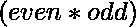
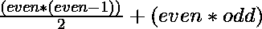

# 对包含至少一个偶数的数组中的对进行计数

> 原文:[https://www . geesforgeks . org/count-pairs-in-a-in-a-array-contain-at-one-even-value/](https://www.geeksforgeeks.org/count-pairs-in-an-array-containing-at-least-one-even-value/)

给定一个数组 **arr[]** ，任务是对成对进行计数，使得每对(arr[i]，arr[j])至少包含一个偶数元素，其中 **i！= j** 。

**示例:**

> **输入:** arr[] = {1，2，3，1，3}
> **输出:** 4
> **解释:**
> 可能的对是:(1，2)，(2，3)，(2，1)，(2，3)。
> 
> **输入:** arr[] = {8，2，3，1，4，2}
> **输出:** 14
> **解释:**
> 可能的对有:(8，2)，(8，3)，(8，1)，(8，4)，(8，2)，(2，3)，(2，1)，(2，4)，(2，2)，(3，4)，(3，2)，(1，4)，(1，2)，(1，2)，(4，2)。

一种简单的方法是运行两个循环。逐个选取每个元素，并为每个元素找到数组右侧保存条件的元素，然后递增计数。
**时间复杂度:**


下面是上述方法的实现:

## C++

```
// C++ implementation to count
// pairs in an array such that
// each pair contains at
// least one even element
#include<bits/stdc++.h>
using namespace std;

// Function to count the pairs in
// the array such as there is at
// least one even element in each pair
int CountPairs(int arr[], int n)
{
    int count = 0;

    // Generate all possible pairs
    // and increment then count
    // if the condition is satisfied
    for(int i = 0; i < n; i++)
    {
       for(int j = i + 1; j < n; j++)
       {
          if (arr[i] % 2 == 0 ||
              arr[j] % 2 == 0)
              count++;
       }
    }
    return count;
}

// Driver code
int main()
{
    int arr[] = { 8, 2, 3, 1, 4, 2 };
    int n = sizeof(arr) / sizeof(int);

    // Function call
    cout << (CountPairs(arr, n));
}

// This code is contributed by rock_cool
```

## Java 语言(一种计算机语言，尤用于创建网站)

```
// Java implementation to Count
// pairs in an array such that
// each pair contains at
// least one even element
import java.util.*;

class GFG {

    // Function to count the pairs in
    // the array such as there is at
    // least one even element in each pair
    static int CountPairs(int[] arr, int n)
    {

        int count = 0;

        // Generate all possible pairs
        // and increment then count
        // if the condition is satisfied
        for (int i = 0; i < n; i++) {
            for (int j = i + 1; j < n; j++) {

                if (arr[i] % 2 == 0
                    || arr[j] % 2 == 0)
                    count++;
            }
        }

        return count;
    }

    // Driver code
    public static void main(String[] args)
    {

        int[] arr = { 8, 2, 3, 1, 4, 2 };
        int n = arr.length;

        // Function Call
        System.out.println(CountPairs(arr, n));
    }
}
```

## 蟒蛇 3

```
# Python3 implementation to count
# pairs in an array such that
# each pair contains at
# least one even element
def CountPairs(arr, n):

    count = 0

    # Generate all possible pairs
    # and increment then count
    # if the condition is satisfied
    for i in range(n):
        for j in range(i + 1, n):
            if (arr[i] % 2 == 0 or
                arr[j] % 2 == 0):
                count += 1

    return count

# Driver code
arr = [ 8, 2, 3, 1, 4, 2 ]
n = len(arr)

# Function call
print(CountPairs(arr, n))

# This code is contributed by rutvik_56
```

## C#

```
// C# implementation to count
// pairs in an array such that
// each pair contains at
// least one even element
using System;

class GFG{

// Function to count the pairs in
// the array such as there is at
// least one even element in each pair
static int CountPairs(int[] arr, int n)
{

    int count = 0;

    // Generate all possible pairs
    // and increment then count
    // if the condition is satisfied
    for(int i = 0; i < n; i++)
    {
       for(int j = i + 1; j < n; j++)
       {
          if (arr[i] % 2 == 0 ||
              arr[j] % 2 == 0)
              count++;
       }
    }
    return count;
}

// Driver code
public static void Main(String[] args)
{
    int[] arr = { 8, 2, 3, 1, 4, 2 };
    int n = arr.Length;

    // Function Call
    Console.WriteLine(CountPairs(arr, n));
}
}

// This code is contributed by PrinciRaj1992
```

## java 描述语言

```
<script>

// Javascript implementation to count
// pairs in an array such that each
// pair contains at least one even element

// Function to count the pairs in
// the array such as there is at
// least one even element in each pair
function CountPairs(arr, n)
{
    let count = 0;

    // Generate all possible pairs
    // and increment then count
    // if the condition is satisfied
    for(let i = 0; i < n; i++)
    {
       for(let j = i + 1; j < n; j++)
       {
          if (arr[i] % 2 == 0 ||
              arr[j] % 2 == 0)
              count++;
       }
    }
    return count;
}

// Driver code
let arr = [ 8, 2, 3, 1, 4, 2 ];
let n = arr.length;

// Function call
document.write(CountPairs(arr, n));

// This code is contributed by divyeshrabadiya07

</script>
```

**Output:** 

```
14
```

**有效方法:**想法是计算数组中的偶数和奇数元素，并包括只有一个偶数元素的对，或者这两个对都是偶数元素。

*   **正好具有一个偶数元素的对:**正好具有一个偶数元素的对的计数将是:



*   **正好具有两个偶数元素的对:**正好具有两个偶数元素的对的计数将为:


因此，具有至少一个偶数元素的对的计数将是


下面是上述方法的实现:

## C++

```
// C++ implementation to Count
// pairs in an array such that
// each pair contains at
// least one even element
#include <bits/stdc++.h>
using namespace std;

// Function to count the pairs in
// the array such as there is at
// least one even element in each pair
int CountPairs(int arr[], int n)
{

    // Store count of even
    // and odd elements
    int even = 0, odd = 0;
    for(int i = 0; i < n; i++)
    {

       // Check element is
       // even or odd
       if (arr[i] % 2 == 0)
           even++;
       else
           odd++;
    }
    return (even * (even - 1)) / 2 +
           (even * odd);
}

// Driver Code
int main()
{
    int arr[] = { 8, 2, 3, 1, 4, 2 };
    int n = sizeof(arr) / sizeof(int);

    cout << CountPairs(arr, n);
}

// This code is contributed by jrishabh99
```

## Java 语言(一种计算机语言，尤用于创建网站)

```
// Java implementation to Count
// pairs in an array such that
// each pair contains at
// least one even element
import java.util.*;

class GFG {

    // Function to count the pairs in
    // the array such as there is at
    // least one even element in each pair
    static int CountPairs(int[] arr, int n)
    {
        // store count of even
        // and odd elements
        int even = 0, odd = 0;

        for (int i = 0; i < n; i++) {

            // check element is
            // even or odd
            if (arr[i] % 2 == 0)
                even++;
            else
                odd++;
        }

        return (even * (even - 1)) / 2
            + (even * odd);
    }

    // Driver Code
    public static void main(String[] args)
    {

        int[] arr = { 8, 2, 3, 1, 4, 2 };
        int n = arr.length;
        System.out.println(CountPairs(arr, n));
    }
}
```

## 蟒蛇 3

```
# Python3 implementation to count
# pairs in an array such that
# each pair contains at
# least one even element

# Function to count the pairs in
# the array such as there is at
# least one even element in each pair
def CountPairs(arr, n):

    # Store count of even
    # and odd elements
    even = 0
    odd = 0

    for i in range(n):

       # Check element is
       # even or odd
       if (arr[i] % 2 == 0):
           even += 1
       else:
           odd += 1

    return ((even * (even - 1)) // 2 +
            (even * odd))

# Driver Code
arr = [ 8, 2, 3, 1, 4, 2 ]
n = len(arr)

print(CountPairs(arr, n))

# This code is contributed by code_hunt
```

## C#

```
// C# implementation to Count
// pairs in an array such that
// each pair contains at
// least one even element
using System;
class GFG{

// Function to count the pairs in
// the array such as there is at
// least one even element in each pair
static int CountPairs(int[] arr, int n)
{

    // Store count of even
    // and odd elements
    int even = 0, odd = 0;

    for(int i = 0; i < n; i++)
    {

       // Check element is
       // even or odd
       if (arr[i] % 2 == 0)
           even++;
       else
           odd++;
    }
    return (even * (even - 1)) / 2 +
           (even * odd);
}

// Driver Code
public static void Main()
{
    int[] arr = { 8, 2, 3, 1, 4, 2 };
    int n = arr.Length;

    Console.Write(CountPairs(arr, n));
}
}

// This code is contributed by Nidhi_biet
```

## java 描述语言

```
<script>
    // Javascript implementation to Count
    // pairs in an array such that
    // each pair contains at
    // least one even element

    // Function to count the pairs in
    // the array such as there is at
    // least one even element in each pair
    function CountPairs(arr, n)
    {

        // Store count of even
        // and odd elements
        let even = 0, odd = 0;
        for(let i = 0; i < n; i++)
        {

           // Check element is
           // even or odd
           if (arr[i] % 2 == 0)
               even++;
           else
               odd++;
        }
        return (even * (even - 1)) / 2 + (even * odd);
    }

    let arr = [ 8, 2, 3, 1, 4, 2 ];
    let n = arr.length;

    document.write(CountPairs(arr, n));

    // This code is contributed by divyesh072019.
</script>
```

**Output:** 

```
14
```

**时间复杂度:**O(N)
T3】空间复杂度: O(1)