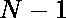

# 从给定的数组中计算可能的相似矩形对

> 原文:[https://www . geesforgeks . org/count-对相似矩形-可能来自给定数组/](https://www.geeksforgeeks.org/count-pairs-of-similar-rectangles-possible-from-a-given-array/)

给定一个大小为**N*****(1≤N≤10<sup>3</sup>)***的 [2D 阵 **A[][2]** ，其中 **A[i][0]** 和 **A[i][1]** 分别表示矩形 **i** 的长度和宽度。](https://www.geeksforgeeks.org/multidimensional-arrays-in-java/)

> 两个矩形 **i** 和 **j** 其中(i < j)如果它们的长宽比相等则是相似的
> 
> A[I][0]/A[I][1]= A[j][0]/A[j][1]

任务是计算几乎相似的一对矩形。

**示例:**

> **输入** : A[][2] = {{4，8}、{15，30}、{3，6}、{10，20}}
> **输出:** 6
> **说明:**成对的相似矩形为(0，1)、{0，2)、(0，3)、(1，2)、(1，3)、(2，3)。对于每个矩形，长宽比为 1 : 2
> 
> **输入** : A[][2] = {{2，3}，{4，5}，{7，8}}
> **输出:** 0
> **说明:**不存在一对相似的矩形。

**方法 1(简单比较法)**

**方法:**按照步骤解决问题

*   [遍历数组](https://www.geeksforgeeks.org/c-program-to-traverse-an-array/)。
*   对于每对这样的( **i < j** ，通过检查条件**A[I][0]/A[I][1]= A[j][0]/A[j][1]**是否满足来检查矩形是否相似。
*   如果发现为真，则增加计数。
*   最后，打印获得的计数。

下面是上述方法的实现:

## C++

```
// C++ Program for the above approach

#include <iostream>
using namespace std;

// Function to calculate the count
// of similar rectangles
int getCount(int rows,
             int columns, int A[][2])
{
    int res = 0;

    for (int i = 0; i < rows; i++) {
        for (int j = i + 1; j < rows; j++) {

            if (A[i][0] * 1LL * A[j][1]
                == A[i][1] * 1LL * A[j][0]) {

                res++;
            }
        }
    }
    return res;
}

// Driver Code
int main()
{
    // Input
    int A[][2]
        = { { 4, 8 }, { 10, 20 }, { 15, 30 }, { 3, 6 } };
    int columns = 2;
    int rows = sizeof(A) / sizeof(A[0]);

    cout << getCount(rows, columns, A);

    return 0;
}
```

## Java 语言(一种计算机语言，尤用于创建网站)

```
// Java program for the above approach
import java.util.*;
class GFG{

// Function to calculate the count
// of similar rectangles
static int getCount(int rows, int columns,
                    int[][] A)
{
    int res = 0;  
    for(int i = 0; i < rows; i++)
    {
        for(int j = i + 1; j < rows; j++)
        {
            if (A[i][0] * A[j][1] ==
                A[i][1] * A[j][0])
            {
                res++;
            }
        }
    }
    return res;
}

// Driver Code
public static void main(String[] args)
{

    // Input
    int[][] A = { { 4, 8 }, { 10, 20 },
                 { 15, 30 }, { 3, 6 } };
    int columns = 2;
    int rows = 4;

    System.out.print(getCount(rows, columns, A));
}
}

// This code is contributed by code_hunt.
```

## 蟒蛇 3

```
# Python3 program for the above approach

# Function to calculate the count
# of similar rectangles
def getCount(rows, columns, A):

    res = 0

    for i in range(rows):
        for j in range(i + 1, rows, 1):
            if (A[i][0] * A[j][1] ==
                A[i][1] * A[j][0]):
                res += 1

    return res

# Driver Code
if __name__ == '__main__':

    # Input
    A =  [ [ 4, 8 ], [ 10, 20 ],
           [ 15, 30 ], [ 3, 6 ] ]
    columns = 2
    rows =  len(A)

    print(getCount(rows, columns, A))

# This code is contributed by SURENDRA_GANGWAR
```

## C#

```
// C# program for the above approach
using System;

class GFG{

// Function to calculate the count
// of similar rectangles
static int getCount(int rows, int columns,
                    int[,] A)
{
    int res = 0;

    for(int i = 0; i < rows; i++)
    {
        for(int j = i + 1; j < rows; j++)
        {
            if (A[i, 0] * A[j, 1] ==
                A[i, 1] * A[j, 0])
            {
                res++;
            }
        }
    }
    return res;
}

// Driver code
static void Main()
{

    // Input
    int[,] A = { { 4, 8 }, { 10, 20 },
                 { 15, 30 }, { 3, 6 } };
    int columns = 2;
    int rows = 4;

    Console.Write(getCount(rows, columns, A));
}
}

// This code is contributed by divyesh072019
```

## java 描述语言

```
<script>

// Javascript program for the above approach

// Function to calculate the count
// of similar rectangles
function getCount(rows, columns, A)
{
    var res = 0;  
    for(var i = 0; i < rows; i++)
    {
        for(var j = i + 1; j < rows; j++)
        {
            if (A[i][0] * A[j][1] ==
                A[i][1] * A[j][0])
            {
                res++;
            }
        }
    }
    return res;
}

// Driver Code

// Input
var A = [ [ 4, 8 ], [ 10, 20 ],
          [ 15, 30 ], [ 3, 6 ] ];
var columns = 2;
var rows = 4;

document.write(getCount(rows, columns, A));

// This code is contributed by kirti

</script>
```

**Output**

```
6
```

***时间复杂度**:O(N<sup>2</sup>)*
***辅助空间** : O(1)*

**方法 2(使用 HashMap)**

我们可以将所有计算出的比率存储在 HashMap 中，而不是直接将一个矩形的比率与另一个矩形的比率进行比较。由于 HashMap 的访问成本为 O(1)，这将允许快速查找具有相同比率的其他矩形，并将它们存储在一起。使用{ N \u 次(N–1)} { 2 }可以从具有相同比率的矩形数量中推导出相似矩形对的数量。之所以可以用上面提到的方程来求相似矩形对的个数，是因为每增加一个比例相同的矩形，对的个数就会增加。

## C++

```
// C++ Program for the hashmap Approach
#include <iostream>
#include <unordered_map>
using namespace std;

// Get the count of all pairs of similar rectangles

int getCount(int rows, int columns, int sides[][2])
{
    // Initialize the result value and
    // map to store the ratio to the rectangles
    int ans = 0;
    unordered_map<double, int> umap;

    // Calculate the rectangular ratio and save them
    for (int i = 0; i < rows; i++)
    {
        double ratio = (double)sides[i][0] / sides[i][1];
        umap[ratio]++;
    }

    // Calculate pairs of similar rectangles from its common ratio
    for (auto x : umap)
    {
        int value = x.second;
        if (value > 1)
        {
            ans += (value * (value - 1)) / 2;
        }
    }
    return ans;
}

int main()
{
    int sides[4][2] = {{4, 8}, {10, 20}, {15, 30}, {3, 6}};
    int rows = 4;
    int columns = 2;
    cout << getCount(rows, columns, sides);
    return 0;

    //this code is contributed by krishna_6431
}
```

## Java 语言(一种计算机语言，尤用于创建网站)

```
import java.util.*;

class GFG {

      // Get the count of all pairs of similar rectangles
    public static int getCount(int rows, int columns,
                                int[][] sides)
    {
          // Initialize the result value and
          // map to store the ratio to the rectangles
        int res = 0;
        Map<Double, Integer> ratio
            = new HashMap<Double, Integer>();

          // Calculate the rectangular ratio and save them
          for (int i = 0; i < rows; i++) {
            double rectRatio = (double) sides[i][0] /
                  sides[i][1];
              if (ratio.get(rectRatio) == null) {
                  ratio.put(rectRatio, 0);
            }
              ratio.put(rectRatio, ratio.get(rectRatio) + 1);
        }

          // Calculate pairs of similar rectangles from
          // its common ratio
        for (double key : ratio.keySet()) {
            int val = ratio.get(key);
            if (val > 1) {
                res += (val * (val - 1)) / 2;
            }
        }

        return res;
    }

      public static void main(String[] args) {
          int[][] A = {{4, 8}, {10, 20}, {15, 30}, {3, 6}};
          int columns = 2;
          int rows = 4;

          System.out.println(getCount(rows, columns, A));
    }
}

// This code is contributed by nathnet
```

## 蟒蛇 3

```
# Python 3 Program for the hashmap Approach
from collections import defaultdict

# Get the count of all pairs of similar rectangles
def getCount(rows,  columns, sides):

    # Initialize the result value and
    # map to store the ratio to the rectangles
    ans = 0
    umap = defaultdict(int)

    # Calculate the rectangular ratio and save them
    for i in range(rows):

        ratio = sides[i][0] / sides[i][1]
        umap[ratio] += 1

    # Calculate pairs of similar rectangles from its common ratio
    for x in umap:

        value = umap[x]
        if (value > 1):
            ans += (value * (value - 1)) / 2

    return ans

# Driver code
if __name__ == "__main__":

    sides = [[4, 8], [10, 20], [15, 30], [3, 6]]
    rows = 4
    columns = 2
    print(int(getCount(rows, columns, sides)))

    # This code is contributed by ukasp.
```

## C#

```
using System;
using System.Collections.Generic;

class GFG {

    // Get the count of all pairs of similar rectangles
    public static int getCount(int rows, int columns,
                               int[, ] sides)
    {
        // Initialize the result value and
        // map to store the ratio to the rectangles
        int res = 0;
        Dictionary<double, int> ratio
            = new Dictionary<double, int>();

        // Calculate the rectangular ratio and save them
        for (int i = 0; i < rows; i++) {
            double rectRatio
                = (double)sides[i, 0] / sides[i, 1];
            if (!ratio.ContainsKey(rectRatio)) {
                ratio[rectRatio] = 0;
            }
            ratio[rectRatio] = ratio[rectRatio] + 1;
        }

        // Calculate pairs of similar rectangles from
        // its common ratio
        foreach(KeyValuePair<double, int> p in ratio)
        {
            int val = p.Value;
            if (val > 1) {
                res += (val * (val - 1)) / 2;
            }
        }

        return res;
    }

  // Driver code
    public static void Main(string[] args)
    {
        int[, ] A = {
            { 4, 8 }, { 10, 20 }, { 15, 30 }, { 3, 6 }
        };
        int columns = 2;
        int rows = 4;

        Console.WriteLine(getCount(rows, columns, A));
    }
}

// This code is contributed by ukasp.
```

**Output**

```
6
```

***时间复杂度** :* O(N)

***辅助空间** :* O(N)