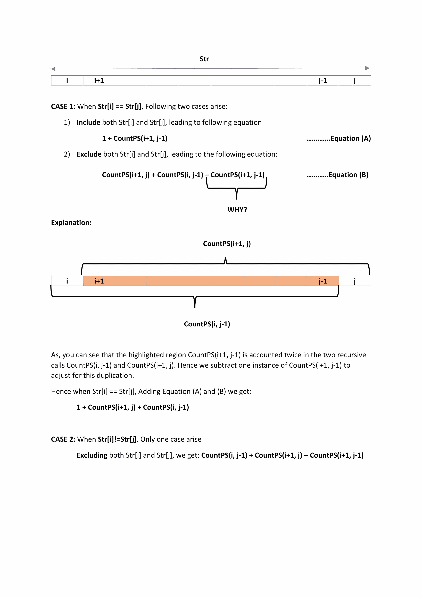

# 统计给定字符串中的所有回文子序列

> 原文:[https://www . geesforgeks . org/count-回文-子序列-给定-string/](https://www.geeksforgeeks.org/count-palindromic-subsequence-given-string/)

找出在一个给定的字符串中可以形成多少回文子序列(不一定是不同的)。请注意，空字符串不被视为回文。
**例:**

```
Input : str = "abcd"
Output : 4
Explanation :- palindromic  subsequence are : "a" ,"b", "c" ,"d" 

Input : str = "aab"
Output : 4
Explanation :- palindromic subsequence are :"a", "a", "b", "aa"

Input : str = "aaaa"
Output : 15
```

上述问题可以递归定义。

```
Initial Values : i= 0, j= n-1;

CountPS(i,j)
// Every single character of a string is a palindrome 
// subsequence 
if i == j
   return 1 // palindrome of length 1

// If first and last characters are same, then we 
// consider it as palindrome subsequence and check
// for the rest subsequence (i+1, j), (i, j-1)
Else if (str[i] == str[j)]
   return   countPS(i+1, j) + countPS(i, j-1) + 1;

else
   // check for rest sub-sequence and  remove common
   // palindromic subsequences as they are counted
   // twice when we do countPS(i+1, j) + countPS(i,j-1)
   return countPS(i+1, j) + countPS(i, j-1) - countPS(i+1, j-1)
```



如果画出上述递归解的递归树，可以观察到[重叠子问题](https://www.geeksforgeeks.org/dynamic-programming-set-1/)。由于问题有重叠的子问题，我们可以使用动态规划来有效地解决它。下面是基于动态规划的解决方案。

## C++

```
// Counts Palindromic Subsequence in a given String
#include <cstring>
#include <iostream>
using namespace std;

// Function return the total palindromic subsequence
int countPS(string str)
{
    int N = str.length();

    // create a 2D array to store the count of palindromic
    // subsequence
    int cps[N + 1][N + 1];
    memset(cps, 0, sizeof(cps));

    // palindromic subsequence of length 1
    for (int i = 0; i < N; i++)
        cps[i][i] = 1;

    // check subsequence of length L is palindrome or not
    for (int L = 2; L <= N; L++) {
        for (int i = 0; i <= N-L; i++) {
            int k = L + i - 1;
            if (str[i] == str[k])
                cps[i][k]
                    = cps[i][k - 1] + cps[i + 1][k] + 1;
            else
                cps[i][k] = cps[i][k - 1] + cps[i + 1][k]
                            - cps[i + 1][k - 1];
        }
    }

    // return total palindromic subsequence
    return cps[0][N - 1];
}

// Driver program
int main()
{
    string str = "abcb";
    cout << "Total palindromic subsequence are : "
         << countPS(str) << endl;
    return 0;
}
```

## Java 语言(一种计算机语言，尤用于创建网站)

```
// Java code to Count Palindromic Subsequence
// in a given String
public class GFG {
    // Function return the total palindromic
    // subsequence
    static int countPS(String str)
    {
        int N = str.length();

        // create a 2D array to store the count
        // of palindromic subsequence
        int[][] cps = new int[N][N];

        // palindromic subsequence of length 1
        for (int i = 0; i < N; i++)
            cps[i][i] = 1;

        // check subsequence of length L is
        // palindrome or not
        for (int L = 2; L <= N; L++) {
            for (int i = 0; i <= N-L; i++) {
                int k = L + i - 1;
              if (str.charAt(i) == str.charAt(k)) {
                cps[i][k] = cps[i][k - 1]
                                    + cps[i + 1][k] + 1;
              }else{
                cps[i][k] = cps[i][k - 1]
                                    + cps[i + 1][k]
                                    - cps[i + 1][k - 1];
              }
            }
        }

        // return total palindromic subsequence
        return cps[0][N - 1];
    }

    // Driver program
    public static void main(String args[])
    {
        String str = "abcb";
        System.out.println("Total palindromic "
                           + "subsequence are : "
                           + countPS(str));
    }
}
// This code is contributed by Sumit Ghosh
```

## 蟒蛇 3

```
# Python3 code to Count Palindromic
# Subsequence in a given String

# Function return the total
# palindromic subsequence

def countPS(str):

    N = len(str)

    # Create a 2D array to store the count
    # of palindromic subsequence
    cps = [[0 for i in range(N + 2)]for j in range(N + 2)]

    # palindromic subsequence of length 1
    for i in range(N):
        cps[i][i] = 1

    # check subsequence of length L
    # is palindrome or not
    for L in range(2, N + 1):

        for i in range(N):
            k = L + i - 1
            if (k < N):
                if (str[i] == str[k]):
                    cps[i][k] = (cps[i][k - 1] +
                                 cps[i + 1][k] + 1)
                else:
                    cps[i][k] = (cps[i][k - 1] +
                                 cps[i + 1][k] -
                                 cps[i + 1][k - 1])

    # return total palindromic subsequence
    return cps[0][N - 1]

# Driver program
str = "abcb"
print("Total palindromic subsequence are : ", countPS(str))

# This code is contributed by Anant Agarwal.
```

## C#

```
// C# code to Count Palindromic Subsequence
// Subsequence in a given String
using System;

class GFG {

    // Function return the total
    // palindromic subsequence
    static int countPS(string str)
    {
        int N = str.Length;

        // create a 2D array to store the
        // count of palindromic subsequence
        int[, ] cps = new int[N + 1, N + 1];

        // palindromic subsequence
        // of length 1
        for (int i = 0; i < N; i++)
            cps[i, i] = 1;

        // check subsequence of length
        // L is palindrome or not
        for (int L = 2; L <= N; L++) {
            for (int i = 0; i <= N-L; i++) {
                int k = L + i - 1;
                if (k < N) {
                    if (str[i] == str[k])
                        cps[i, k] = cps[i, k - 1]
                                    + cps[i + 1, k] + 1;
                    else
                        cps[i, k] = cps[i, k - 1]
                                    + cps[i + 1, k]
                                    - cps[i + 1, k - 1];
                }
            }
        }

        // return total palindromic
        // subsequence
        return cps[0, N - 1];
    }

    // Driver Code
    public static void Main()
    {
        string str = "abcb";
        Console.Write("Total palindromic "
                      + "subsequence are : "
                      + countPS(str));
    }
}

// This code is contributed by nitin mittal.
```

## 服务器端编程语言（Professional Hypertext Preprocessor 的缩写）

```
<?php
// Counts Palindromic Subsequence in
// a given String

// Function return the total
// palindromic subsequence
function countPS($str)
{
    $N = strlen($str);

    // create a 2D array to store the
    // count of palindromic subsequence
    $cps = array_fill(0, $N + 1,
           array_fill(0, $N + 1, NULL));

    // palindromic subsequence of length 1
    for ($i = 0; $i < $N; $i++)
        $cps[$i][$i] = 1;

    // check subsequence of length L
    // is palindrome or not
    for ($L = 2; $L <= $N; $L++)
    {
        for ($i = 0; $i <= $N-$L; $i++)
        {
            $k = $L + $i - 1;
            if ($str[$i] == $str[$k])
                $cps[$i][$k] = $cps[$i][$k - 1] +
                               $cps[$i + 1][$k] + 1;
            else
                $cps[$i][$k] = $cps[$i][$k - 1] +
                               $cps[$i + 1][$k] -
                               $cps[$i + 1][$k - 1];
        }
    }

    // return total palindromic subsequence
    return $cps[0][$N - 1];
}

// Driver Code
$str = "abcb";
echo "Total palindromic subsequence are : " .
                        countPS($str) . "\n";

// This code is contributed by ita_c
?>
```

## java 描述语言

```
<script>

// Javascript code to Count Palindromic Subsequence
// in a given String

    // Function return the total palindromic
    // subsequence
    function countPS(str)
    {
        let N = str.length;

        // create a 2D array to store the count
        // of palindromic subsequence
        let cps = new Array(N);
        for(let i=0;i<N;i++)
        {
            cps[i]=new Array(N);
            for(let j=0;j<N;j++)
            {
                cps[i][j]=0;
            }
        }

        // palindromic subsequence of length 1
        for (let i = 0; i < N; i++)
            cps[i][i] = 1;

        // check subsequence of length L is
        // palindrome or not
        for (let L = 2; L <= N; L++) {
            for (let i = 0; i <= N-L; i++) {
                let k = L + i - 1;
              if (str[i] == str[k]) {
                cps[i][k] = cps[i][k - 1]
                                    + cps[i + 1][k] + 1;
              }else{
                cps[i][k] = cps[i][k - 1]
                                    + cps[i + 1][k]
                                    - cps[i + 1][k - 1];
              }
            }
        }

        // return total palindromic subsequence
        return cps[0][N - 1];
    }

    // Driver program
    let str = "abcb";
    document.write("Total palindromic "
                           + "subsequence are : "
                           + countPS(str));

    // This code is contributed by avanitrachhadiya2155

</script>
```

**输出:**

```
Total palindromic subsequence are : 6
```

**时间复杂度:** O(N <sup>2</sup> )

**另一种方法:**(使用递归)

## C++

```
// C++ program to counts Palindromic Subsequence
// in a given String using recursion
#include <bits/stdc++.h>
using namespace std;

int n, dp[1000][1000];
string str = "abcb";

// Function return the total
// palindromic subsequence
int countPS(int i, int j)
{

    if (i > j)
        return 0;

    if (dp[i][j] != -1)
        return dp[i][j];

    if (i == j)
        return dp[i][j] = 1;

    else if (str[i] == str[j])
        return dp[i][j]
               = countPS(i + 1, j) +
                countPS(i, j - 1) + 1;

    else
        return dp[i][j] = countPS(i + 1, j) +
                          countPS(i, j - 1) -
                          countPS(i + 1, j - 1);
}

// Driver code
int main()
{
    memset(dp, -1, sizeof(dp));
    n = str.size();
    cout << "Total palindromic subsequence are : "
         << countPS(0, n - 1) << endl;
    return 0;
}
// this code is contributed by Kushdeep Mittal
```

## Java 语言(一种计算机语言，尤用于创建网站)

```
// Java program to counts Palindromic Subsequence
// in a given String using recursion

class GFG {
    static int n;
    static int[][] dp = new int[1000][1000];

    static String str = "abcb";

    // Function return the total
    // palindromic subsequence
    static int countPS(int i, int j)
    {

        if (i > j)
            return 0;

        if (dp[i][j] != -1)
            return dp[i][j];

        if (i == j)
            return dp[i][j] = 1;

        else if (str.charAt(i) == str.charAt(j))
            return dp[i][j]
                = countPS(i + 1, j) +
                    countPS(i, j - 1) + 1;

        else
            return dp[i][j] = countPS(i + 1, j) +
                              countPS(i, j - 1) -
                              countPS(i + 1, j - 1);
    }

    // Driver code
    public static void main(String[] args)
    {
        for (int i = 0; i < 1000; i++)
            for (int j = 0; j < 1000; j++)
                dp[i][j] = -1;

        n = str.length();
        System.out.println("Total palindromic subsequence"
                           + "are : " + countPS(0, n - 1));
    }
}

// This code is contributed by Ryuga
```

## 蟒蛇 3

```
# Python 3 program to counts Palindromic
# Subsequence in a given String using recursion

str = "abcb"

# Function return the total
# palindromic subsequence

def countPS(i, j):

    if(i > j):
        return 0

    if(dp[i][j] != -1):
        return dp[i][j]

    if(i == j):
        dp[i][j] = 1
        return dp[i][j]

    elif (str[i] == str[j]):
        dp[i][j] = (countPS(i + 1, j) +
                    countPS(i, j - 1) + 1)
        return dp[i][j]
    else:
        dp[i][j] = (countPS(i + 1, j) +
                    countPS(i, j - 1) -
                    countPS(i + 1, j - 1))
        return dp[i][j]

# Driver code
if __name__ == "__main__":

    dp = [[-1 for x in range(1000)]
          for y in range(1000)]

    n = len(str)
    print("Total palindromic subsequence are :",
          countPS(0, n - 1))

# This code is contributed by ita_c
```

## C#

```
// C# program to counts Palindromic Subsequence
// in a given String using recursion
using System;

class GFG {
    static int n;
    static int[, ] dp = new int[1000, 1000];

    static string str = "abcb";

    // Function return the total
    // palindromic subsequence
    static int countPS(int i, int j)
    {

        if (i > j)
            return 0;

        if (dp[i, j] != -1)
            return dp[i, j];

        if (i == j)
            return dp[i, j] = 1;

        else if (str[i] == str[j])
            return dp[i, j]
                = countPS(i + 1, j) +
                countPS(i, j - 1) + 1;

        else
            return dp[i, j] = countPS(i + 1, j)
                              + countPS(i, j - 1)
                              - countPS(i + 1, j - 1);
    }

    // Driver code
    static void Main()
    {
        for (int i = 0; i < 1000; i++)
            for (int j = 0; j < 1000; j++)
                dp[i, j] = -1;

        n = str.Length;
        Console.Write("Total palindromic subsequence"
                      + "are : " + countPS(0, n - 1));
    }
}

// This code is contributed by DrRoot_
```

## 服务器端编程语言（Professional Hypertext Preprocessor 的缩写）

```
<?php
// PHP program to counts Palindromic Subsequence
// in a given String using recursion
$dp = array_fill(0, 100,
      array_fill(0, 1000, -1));

$str = "abcb";
$n = strlen($str);

// Function return the total
// palindromic subsequence
function countPS($i, $j)
{
    global $str, $dp, $n;

    if($i > $j)
        return 0;

    if($dp[$i][$j] != -1)
        return $dp[$i][$j];

    if($i == $j)
        return $dp[$i][$j] = 1;

    else if ($str[$i] == $str[$j])
        return $dp[$i][$j] = countPS($i + 1, $j) +
                             countPS($i, $j - 1) + 1;

    else
        return $dp[$i][$j] = countPS($i + 1, $j) +
                             countPS($i, $j - 1) -
                             countPS($i + 1, $j - 1);
}

// Driver code
echo "Total palindromic subsequence are : " .
                          countPS(0, $n - 1);

// This code is contributed by mits
?>
```

## java 描述语言

```
<script>
// Javascript program to counts Palindromic Subsequence
// in a given String using recursion

    let n;
    let dp=new Array(1000);
    for(let i=0;i<1000;i++)
    {
        dp[i]=new Array(1000);
        for(let j=0;j<1000;j++)
        {
            dp[i][j]=-1;
        }
    }

    let str = "abcb";

    // Function return the total
    // palindromic subsequence
    function countPS(i,j)
    {
        if (i > j)
            return 0;

        if (dp[i][j] != -1)
            return dp[i][j];

        if (i == j)
            return dp[i][j] = 1;

        else if (str[i] == str[j])
            return dp[i][j]
                = countPS(i + 1, j) +
                    countPS(i, j - 1) + 1;

        else
            return dp[i][j] = countPS(i + 1, j) +
                              countPS(i, j - 1) -
                              countPS(i + 1, j - 1);
    }

    // Driver code
     n = str.length;
     document.write("Total palindromic subsequence"
                           + "are : " + countPS(0, n - 1));

    // This code is contributed by rag2127

</script>
```

**输出:**

```
Total palindromic subsequence are : 6
```

本文由 **Nishant_sing(pintu)** 供稿。如果你喜欢 GeeksforGeeks 并想投稿，你也可以使用[contribute.geeksforgeeks.org](http://www.contribute.geeksforgeeks.org)写一篇文章或者把你的文章邮寄到 contribute@geeksforgeeks.org。看到你的文章出现在极客博客主页上，帮助其他极客。
如果你发现任何不正确的地方，或者你想分享更多关于上面讨论的话题的信息，请写评论。