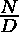

# 对给定数组中的泛数字分数对进行计数

> 原文:[https://www . geesforgeks . org/count-pan digital-fractions-pairs-in-given-array/](https://www.geeksforgeeks.org/count-pandigital-fractions-pairs-in-given-array/)

给定一个数组 **arr[]** ，任务是对数组中的对进行计数，使得 **arr[i]/arr[j]** 是一个**泛数字分数**。

> 分数 **N/D** 被称为**泛数字分数**，如果分数包含从 0 到 9 的所有数字。

**示例:**

> **输入:**arr =【12345，67890，123，4567890】
> **输出:** 3
> **说明:**
> 分数为 12345/67890，12345/4567890，123/4567890
> 
> **输入:** arr = [ 12345，6789 ]
> **输出:** 0

**方法:**想法是使用两个嵌套循环迭代数组的每一个可能的对，并且对于每一对将 **arr[i]** 和 **arr[j]** 连接成一个数字，并且检查 **arr[i]** 和 **arr[j]** 的连接是否是以 10 为基数的[泛数字数字，然后递增计数。](https://www.geeksforgeeks.org/pandigital-number-given-base/)

下面是上述方法的实现:

## 蟒蛇 3

```
# Python3 implementation of the 
# above approach

import math 

# Function to concatenate 
# two numbers into one
def numConcat(num1, num2): 

     # Find number of digits in num2 
     digits = len(str(num2)) 

     # Add zeroes to the end of num1 
     num1 = num1 * (10**digits) 

     # Add num2 to num1 
     num1 += num2 

     return num1 

# Return true if n is pandigit
# else return false.  
def checkPanDigital(n):
    n = str(n)
    b = 10

    # Checking length is 
    # less than base  
    if (len(n) < b):  
        return 0;  

    hash = [0] * b; 

    # Traversing each digit
    # of the number.  
    for i in range(len(n)):  

        # If digit is integer  
        if (n[i] >= '0' and \
            n[i] <= '9'):  
            hash[ord(n[i]) - ord('0')] = 1;  

        # If digit is alphabet  
        elif (ord(n[i]) - ord('A') <= \
                            b - 11):  
            hash[ord(n[i]) - \
                 ord('A') + 10] = 1;  

    # Checking hash array, if any index is  
    # unmarked.  
    for i in range(b):  
        if (hash[i] == 0):  
            return 0;  

    return 1; 

# Returns true if N is a 
# Pandigital Fraction Number
def isPandigitalFraction(N, D):
    join = numConcat(N, D)
    return checkPanDigital(join)

# Returns number pandigital fractions
# in the array
def countPandigitalFraction(v, n) : 

    # iterate over all  
    # pair of strings 
    count = 0
    for i in range(0, n) : 

        for j in range (i + 1,  
                        n) : 

            if (isPandigitalFraction(v[i], 
                             v[j])) : 
                count = count + 1
    return count 

# Driver Code 
if __name__ == "__main__": 

    arr = [ 12345, 67890, 123, 4567890 ] 
    n = len(arr) 

    print(countPandigitalFraction(arr, n))
```

**Output:**

```
3

```

**时间复杂度:***O(N<sup>2</sup>)*
**参考:**[https://mathworld.wolfram.com/PandigitalFraction.html](https://mathworld.wolfram.com/PandigitalFraction.html)