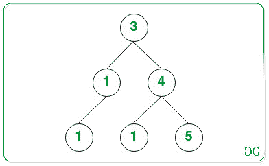
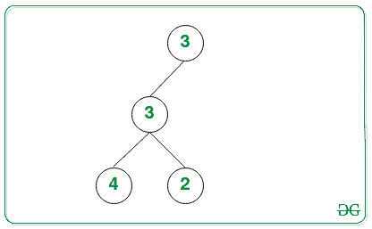

# 对由非递减顺序的节点组成的二叉树中的路径进行计数

> 原文:[https://www . geeksforgeeks . org/count-二叉树中的路径-由非递减顺序的节点组成/](https://www.geeksforgeeks.org/count-paths-in-a-binary-tree-consisting-of-nodes-in-non-decreasing-order/)

给定一个由 **N** 个节点组成的[二叉树](https://www.geeksforgeeks.org/binary-tree-set-3-types-of-binary-tree/)，任务是找出从根到任意节点 X 的[条路径的数量，使得该路径中的所有节点值最多为 X**。**](https://www.geeksforgeeks.org/print-path-root-given-node-binary-tree/)

****示例:****

> ****输入:**下面是给定的树:**
> 
> ****
> 
>  ****输出:**4
> T3】说明:
> 
> 
> 
> 从根节点到任何节点 X 的路径最多具有节点 X 的值，这些路径是:
> 
> *   **节点 3(根节点):**它总是遵循给定的属性。
> *   **节点 4:** 从根到值为 4 的节点的路径有顺序(3 → 4)，节点的最大值为 4。
> *   **节点 5:** 从根到值为 5 的节点的路径有顺序(3 → 4 → 5)，节点的最大值为 5。
> *   **节点 3:** 从根到值为 3 的节点的路径有顺序(3 → 1 → 3)，节点的最大值为 3。
> 
> 因此，所需路径的数量为 4。
> 
> **输入:**下面是给定的树:
> 
> 
> 
> **输出:** 3**

****方法–使用 DFS:** 想法是使用[深度优先搜索](https://www.geeksforgeeks.org/depth-first-search-or-dfs-for-a-graph/)遍历[树](https://www.geeksforgeeks.org/tree-traversals-inorder-preorder-and-postorder/),同时检查从根到任何节点的最大值 **X** 是否等于 **X** 。
按照以下步骤解决问题:**

*   **初始化一个变量，比如**计数**为 **0** 来存储从根到任意节点 X 的[路径的计数，该路径中所有节点值最多为 X**。**](https://www.geeksforgeeks.org/print-path-root-given-node-binary-tree/)**
*   ****使用[深度优先搜索](https://www.geeksforgeeks.org/depth-first-search-or-dfs-for-a-graph/)递归遍历树，并执行以下步骤:

    *   除了**父节点**之外，DFS 遍历的每次递归调用都会传递该路径中到目前为止获得的节点的**最大值**。
    *   检查**当前节点值**是否大于或等于目前获得的最大值，然后将**计数**的值增加 **1** 并将最大值更新为当前节点值。**** 
*   ****完成上述步骤后，打印**计数**的值作为结果。****

****下面是上述方法的实现:****

## ****C++****

```
**// C++ program for the above approach

#include <bits/stdc++.h>
using namespace std;

// Node structure of the binary tree
struct Node {
    int val;
    Node *left, *right;
};

// Function for creating new node
struct Node* newNode(int data)
{
    // Allocate memory for new node
    struct Node* temp = new Node();

    // Assigning data value
    temp->val = data;
    temp->left = NULL;
    temp->right = NULL;

    // Return the Node
    return temp;
}

// Function to perform the DFS Traversal
// to find the number of paths having
// root to node X has value at most X
int countNodes(Node* root, int max)
{
    // If the root node is NULL
    if (!root)
        return 0;

    // Check if the current value is
    // greater than the maximum value
    // in path from root to current node
    if (root->val >= max)
        return 1 + countNodes(root->left,
                              root->val)
               + countNodes(root->right, root->val);

    // Otherwise
    return countNodes(root->left,
                      max)
           + countNodes(root->right,
                        max);
}

// Driver Code
int main()
{
    // Given Binary Tree
    Node* root = NULL;
    root = newNode(3);
    root->left = newNode(1);
    root->right = newNode(4);
    root->left->left = newNode(3);
    root->right->left = newNode(1);
    root->right->right = newNode(5);

    cout << countNodes(root, INT_MIN);

    return 0;
}**
```

## ****Java 语言(一种计算机语言，尤用于创建网站)****

```
**// Java program for the above approach
import java.util.*;

// Class containing left and
// right child of current
// node and key value
class Node {

    int data;
    Node left, right;

    public Node(int item)
    {
        data = item;
        left = right = null;
    }
}

class GFG {

    // Root of the Binary Tree
    Node root;

    public GFG()
    {
        root = null;
    }

    // Function to perform the DFS Traversal
// to find the number of paths having
// root to node X has value at most X
static int countNodes(Node root, int max)
{

    // If the root node is NULL
    if (root == null)
        return 0;

    // Check if the current value is
    // greater than the maximum value
    // in path from root to current node
    if (root.data >= max)
        return 1 + countNodes(root.left,
                              root.data)
               + countNodes(root.right, root.data);

    // Otherwise
    return countNodes(root.left,
                      max)
           + countNodes(root.right,
                        max);
}

  // Driver code
public static void main (String[] args)
{

      GFG tree = new GFG();
        tree.root = new Node(3);
        tree.root.left = new Node(1);
        tree.root.right = new Node(4);
        tree.root.left.left = new Node(3);
        tree.root.right.left = new Node(1);
        tree.root.right.right = new Node(5);
      System.out.println(countNodes(tree.root, Integer.MIN_VALUE));
    }
}

// This code is contributed by offbeat**
```

## ****蟒蛇 3****

```
**# Python3 program for the above approach

# Node structure of the binary tree
class Node:
    def __init__(self, x):
        self.val = x
        self.left = None
        self.right = None

# Function to perform the DFS Traversal
# to find the number of paths having
# root to node X has value at most X
def countNodes(root, max):
    # If the root node is NULL
    if (not root):
        return 0

    # Check if the current value is
    # greater than the maximum value
    #in path from root to current node
    if (root.val >= max):
        return 1 + countNodes(root.left,root.val) + countNodes(root.right, root.val)

    # Otherwise
    return countNodes(root.left, max) + countNodes(root.right, max)

# Driver Code
if __name__ == '__main__':

    # Given Binary Tree
    root = Node(3)
    root.left = Node(1)
    root.right = Node(4)
    root.left.left = Node(3)
    root.right.left = Node(1)
    root.right.right = Node(5)

    print(countNodes(root, -10**19))

# This code is contributed by mohit kumar 29.**
```

## ****C#****

```
**// C# program to count frequencies of array items
using System;

// Class containing left and
// right child of current
// node and key value
class Node {

    public int data;
    public Node left, right;

    public Node(int item)
    {
        data = item;
        left = right = null;
    }
}

public class GFG
{

    // Root of the Binary Tree
    Node root;
    public GFG()
    {
        root = null;
    }

// Function to perform the DFS Traversal
// to find the number of paths having
// root to node X has value at most X
static int countNodes(Node root, int max)
{

    // If the root node is NULL
    if (root == null)
        return 0;

    // Check if the current value is
    // greater than the maximum value
    // in path from root to current node
    if (root.data >= max)
        return 1 + countNodes(root.left,
                              root.data)
               + countNodes(root.right, root.data);

    // Otherwise
    return countNodes(root.left,
                      max)
           + countNodes(root.right,
                        max);
}

// Driver code
public static void Main(String []args)
{
        GFG tree = new GFG();
        tree.root = new Node(3);
        tree.root.left = new Node(1);
        tree.root.right = new Node(4);
        tree.root.left.left = new Node(3);
        tree.root.right.left = new Node(1);
        tree.root.right.right = new Node(5);
        Console.WriteLine(countNodes(tree.root, Int32.MinValue));
    }
}

// This code is contributed by jana_sayantan.**
```

## ****java 描述语言****

```
**<script>
    // Javascript program for the above approach

    // Class containing left and
    // right child of current
    // node and key value
    class Node
    {
        constructor(item) {
           this.left = null;
           this.right = null;
           this.data = item;
        }
    }

    // Root of the Binary Tree
    let root;

    class GFG
    {
        constructor() {
           root = null;
        }
    }

    // Function to perform the DFS Traversal
    // to find the number of paths having
    // root to node X has value at most X
    function countNodes(root, max)
    {

        // If the root node is NULL
        if (root == null)
            return 0;

        // Check if the current value is
        // greater than the maximum value
        // in path from root to current node
        if (root.data >= max)
            return 1 + countNodes(root.left, root.data)
                   + countNodes(root.right, root.data);

        // Otherwise
        return countNodes(root.left, max)
               + countNodes(root.right, max);
    }

    let tree = new GFG();
    tree.root = new Node(3);
    tree.root.left = new Node(1);
    tree.root.right = new Node(4);
    tree.root.left.left = new Node(3);
    tree.root.right.left = new Node(1);
    tree.root.right.right = new Node(5);
      document.write(countNodes(tree.root, Number.MIN_VALUE));

// This code is contributed by sureh07.
</script>**
```

******Output:** 

```
4
```**** 

*******时间复杂度:**O(N)*
T5**辅助空间:** O(N)****

******使用 BFS 的方法:**思路是使用[广度优先搜索](https://www.geeksforgeeks.org/breadth-first-search-or-bfs-for-a-graph/)遍历树，同时检查从根到 **X** 的最大值是否等于 **X** 。按照以下步骤解决问题:****

*   ****初始化一个变量，说**计数**为 **0** 存储从根到任意节点 X 的[路径的计数，该路径中所有节点值最多为 X**，一个**](https://www.geeksforgeeks.org/print-path-root-given-node-binary-tree/)**[队列](https://www.geeksforgeeks.org/queue-data-structure/) **Q** 对执行 BFS 遍历。******
*   ****将 [INT_MIN](https://www.geeksforgeeks.org/int_max-int_min-cc-applications/) 作为队列中最大值的**根**节点推入。****
*   ****现在，直到 **Q** 不为空，执行以下操作:

    *   [从队列中弹出前节点](https://www.geeksforgeeks.org/queuepush-and-queuepop-in-cpp-stl/)。
    *   如果前节点值至少是目前获得的最大值，那么将**计数**的值增加 **1** 。
    *   用当前节点值更新到目前为止出现的最大值。
    *   如果当前弹出的节点存在左右节点，则[将其推入队列](https://www.geeksforgeeks.org/queuepush-and-queuepop-in-cpp-stl/) **Q** 中，并在上述步骤中更新最大值。**** 
*   ****完成上述步骤后，打印**计数**的值作为结果。****

****下面是上述方法的实现:****

## ****C++****

```
**// C++ program for the above approach

#include <bits/stdc++.h>
using namespace std;

// Node of the binary tree
struct Node {
    int val;
    Node *left, *right;
};

// Function for creating new node
struct Node* newNode(int data)
{
    // Allocate memory for new node
    struct Node* temp = new Node();
    temp->val = data;
    temp->left = NULL;
    temp->right = NULL;

    // Return the created node
    return temp;
}

// Function to perform the DFS Traversal
// to find the number of paths having
// root to node X has value at most X
int countNodes(Node* root)
{
    // Initialize queue
    queue<pair<Node*, int> > q;
    int m = INT_MIN;

    // Push root in queue with the
    // maximum value m
    q.push({ root, m });

    // Stores the count of good nodes
    int count = 0;

    // Traverse all nodes
    while (!q.empty()) {

        // Store the front node of
        // the queue
        auto temp = q.front();
        q.pop();
        Node* node = temp.first;
        int num = temp.second;

        // Check is current node is
        // greater than the maximum
        // value in path from root to
        // the current node
        if (node->val >= num)
            count++;

        // Update the maximum value m
        m = max(node->val, num);

        // If left child is not null,
        // push it to queue with the
        // maximum value m
        if (node->left)
            q.push({ node->left, m });

        // If right child is not null,
        // push it to queue with the
        // maximum value m
        if (node->right)
            q.push({ node->right, m });
    }

    // Returns the answer
    return count;
}

// Driver Code
int main()
{
    // Construct a Binary Tree
    Node* root = NULL;
    root = newNode(3);
    root->left = newNode(1);
    root->right = newNode(4);
    root->left->left = newNode(3);
    root->right->left = newNode(1);
    root->right->right = newNode(5);

    cout << countNodes(root);

    return 0;
}**
```

## ****Java 语言(一种计算机语言，尤用于创建网站)****

```
**// Java program for the above approach
import java.util.*;

// Node of the binary tree
class Node {

    int val;
    Node left, right;

    public Node(int data)
    {
        val = data;
        left = right = null;
    }
}

// User defined Pair class
class Pair {
    Node x;
    int y;

    // Constructor
    public Pair(Node x, int y)
    {
        this.x = x;
        this.y = y;
    }
}

public class Main
{
    // Function for creating new node
    static Node newNode(int data)
    {
        // Allocate memory for new node
        Node temp = new Node(data);

        // Return the created node
        return temp;
    }

    // Function to perform the DFS Traversal
    // to find the number of paths having
    // root to node X has value at most X
    static int countNodes(Node root)
    {
        // Initialize queue
        Vector<Pair> q = new Vector<Pair>();
        int m = Integer.MIN_VALUE;

        // Push root in queue with the
        // maximum value m
        q.add(new Pair(root, m));

        // Stores the count of good nodes
        int count = 0;

        // Traverse all nodes
        while (q.size() > 0) {

            // Store the front node of
            // the queue
            Pair temp = q.get(0);
            q.remove(0);
            Node node = temp.x;
            int num = temp.y;

            // Check is current node is
            // greater than the maximum
            // value in path from root to
            // the current node
            if (node.val >= num)
                count++;

            // Update the maximum value m
            m = Math.max(node.val, num);

            // If left child is not null,
            // push it to queue with the
            // maximum value m
            if (node.left != null)
                q.add(new Pair(node.left, m));

            // If right child is not null,
            // push it to queue with the
            // maximum value m
            if (node.right != null)
                q.add(new Pair(node.right, m));
        }

        // Returns the answer
        return count;
    }

    public static void main(String[] args) {
        // Construct a Binary Tree
        Node root = null;
        root = newNode(3);
        root.left = newNode(1);
        root.right = newNode(4);
        root.left.left = newNode(3);
        root.right.left = newNode(1);
        root.right.right = newNode(5);

        System.out.println(countNodes(root));
    }
}

// This code is contributed by mukesh07.**
```

## ****蟒蛇 3****

```
**# Python3 program for the above approach
import sys

# Node of the binary tree
class Node:
    def __init__(self, data):
        self.val = data
        self.left = None
        self.right = None

# Function for creating new node
def newNode(data):
    # Allocate memory for new node
    temp = Node(data)

    # Return the created node
    return temp

# Function to perform the DFS Traversal
# to find the number of paths having
# root to node X has value at most X
def countNodes(root):
    # Initialize queue
    q = []
    m = -sys.maxsize

    # Push root in queue with the
    # maximum value m
    q.append([ root, m ])

    # Stores the count of good nodes
    count = 0

    # Traverse all nodes
    while (len(q) > 0):
        # Store the front node of
        # the queue
        temp = q[0]
        q.pop(0)
        node = temp[0]
        num = temp[1]

        # Check is current node is
        # greater than the maximum
        # value in path from root to
        # the current node
        if (node.val >= num):
            count+=1

        # Update the maximum value m
        m = max(node.val, num)

        # If left child is not null,
        # push it to queue with the
        # maximum value m
        if (node.left != None):
            q.append([ node.left, m ])

        # If right child is not null,
        # push it to queue with the
        # maximum value m
        if (node.right != None):
            q.append([ node.right, m ])

    # Returns the answer
    return count

# Construct a Binary Tree
root = None
root = newNode(3)
root.left = newNode(1)
root.right = newNode(4)
root.left.left = newNode(3)
root.right.left = newNode(1)
root.right.right = newNode(5)

print(countNodes(root))

# This code is contributed by rameshtravel07.**
```

## ****C#****

```
**// C# program for the above approach
using System;
using System.Collections;
class GFG {

    // Node of the binary tree
    class Node {

        public int val;
        public Node left, right;

        public Node(int data)
        {
            val = data;
            left = right = null;
        }
    }

    // Function for creating new node
    static Node newNode(int data)
    {
        // Allocate memory for new node
        Node temp = new Node(data);

        // Return the created node
        return temp;
    }

    // Function to perform the DFS Traversal
    // to find the number of paths having
    // root to node X has value at most X
    static int countNodes(Node root)
    {
        // Initialize queue
        Queue q = new Queue();
        int m = Int32.MinValue;

        // Push root in queue with the
        // maximum value m
        q.Enqueue(new Tuple<Node, int>(root, m));

        // Stores the count of good nodes
        int count = 0;

        // Traverse all nodes
        while (q.Count > 0) {

            // Store the front node of
            // the queue
            Tuple<Node, int> temp = (Tuple<Node, int>)q.Peek();
            q.Dequeue();
            Node node = temp.Item1;
            int num = temp.Item2;

            // Check is current node is
            // greater than the maximum
            // value in path from root to
            // the current node
            if (node.val >= num)
                count++;

            // Update the maximum value m
            m = Math.Max(node.val, num);

            // If left child is not null,
            // push it to queue with the
            // maximum value m
            if (node.left != null)
                q.Enqueue(new Tuple<Node, int>(node.left, m));

            // If right child is not null,
            // push it to queue with the
            // maximum value m
            if (node.right != null)
                q.Enqueue(new Tuple<Node, int>(node.right, m));
        }

        // Returns the answer
        return count;
    }

  // Driver code
  static void Main()
  {

    // Construct a Binary Tree
    Node root = null;
    root = newNode(3);
    root.left = newNode(1);
    root.right = newNode(4);
    root.left.left = newNode(3);
    root.right.left = newNode(1);
    root.right.right = newNode(5);

    Console.Write(countNodes(root));
  }
}

// This code is contributed by decode2207.**
```

## ****java 描述语言****

```
**<script>

    // JavaScript program for the above approach

    class Node
    {
        constructor(data) {
           this.left = null;
           this.right = null;
           this.val = data;
        }
    }

    // Function for creating new node
    function newNode(data)
    {
        // Allocate memory for new node
        let temp = new Node(data);

        // Return the created node
        return temp;
    }

    // Function to perform the DFS Traversal
    // to find the number of paths having
    // root to node X has value at most X
    function countNodes(root)
    {
        // Initialize queue
        let q = [];
        let m = Number.MIN_VALUE;

        // Push root in queue with the
        // maximum value m
        q.push([ root, m ]);

        // Stores the count of good nodes
        let count = 0;

        // Traverse all nodes
        while (q.length > 0) {

            // Store the front node of
            // the queue
            let temp = q[0];
            q.shift();
            let node = temp[0];
            let num = temp[1];

            // Check is current node is
            // greater than the maximum
            // value in path from root to
            // the current node
            if (node.val >= num)
                count++;

            // Update the maximum value m
            m = Math.max(node.val, num);

            // If left child is not null,
            // push it to queue with the
            // maximum value m
            if (node.left)
                q.push([ node.left, m ]);

            // If right child is not null,
            // push it to queue with the
            // maximum value m
            if (node.right)
                q.push([ node.right, m ]);
        }

        // Returns the answer
        return count;
    }

    // Construct a Binary Tree
    let root = null;
    root = newNode(3);
    root.left = newNode(1);
    root.right = newNode(4);
    root.left.left = newNode(3);
    root.right.left = newNode(1);
    root.right.right = newNode(5);

    document.write(countNodes(root));

</script>**
```

******Output:** 

```
4
```**** 

*******时间复杂度:**O(N)*
T5**辅助空间:** O(N)****