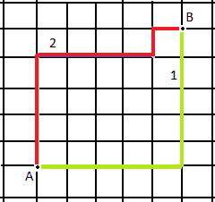

# 计算距离等于曼哈顿距离的路径

> 原文:[https://www . geesforgeks . org/count-path-with-distance-等于 manhattan-distance/](https://www.geeksforgeeks.org/count-paths-with-distance-equal-to-manhattan-distance/)

给定二维坐标系中的两点 **(x1，y1)** 和 **(x2，y2)** 。任务是计算两个给定点之间距离等于[曼哈顿距离](https://www.geeksforgeeks.org/sum-manhattan-distances-pairs-points/)的所有路径。
**举例:**

> **输入:** x1 = 2，y1 = 3，x2 = 4，y2 = 5
> **输出:** 6
> **输入:** x1 = 2，y1 = 6，x2 = 4，y2 = 9
> **输出:** 10

**接近:**点 **(x1，y1)** 和 **(x2，y2)** 之间的曼哈顿距离将为**ABS(x1–x2)+ABS(y1–y2)**
让**ABS(x1–x2)= m**和**ABS(y1–y2)= n**
每条距离等于曼哈顿距离的路径将始终有 **m + n** 条边，【T16 因此，这是组合学的一个基本案例，它是基于群的形成。这背后的想法是 **(m + n)** 不同事物可以分成两组的方式的数量，一组包含 **m** 项，另一组包含 **n** 项，由**T27】m+nC<sub>n</sub>T31】给出，即 **(m + n)！/ m！* n！**。** 



以下是上述方法的实现:

## C++

```
// C++ implementation of the approach
#include <bits/stdc++.h>
using namespace std;
#define ll long long int

// Function to return the value of nCk
ll binomialCoeff(int n, int k)
{
    ll res = 1;

    // Since C(n, k) = C(n, n-k)
    if (k > n - k)
        k = n - k;

    // Calculate value of
    // [n * (n-1) *---* (n-k+1)] /
    // [k * (k-1) *---* 1]
    for (int i = 0; i < k; ++i) {
        res *= (n - i);
        res /= (i + 1);
    }

    return res;
}

// Function to return the number of paths
ll countPaths(int x1, int y1, int x2, int y2)
{

    // Difference between the 'x'
    // coordinates of the given points
    int m = abs(x1 - x2);

    // Difference between the 'y'
    // coordinates of the given points
    int n = abs(y1 - y2);

    return (binomialCoeff(m + n, n));
}

// Driver code
int main()
{
    int x1 = 2, y1 = 3, x2 = 4, y2 = 5;
    cout << countPaths(x1, y1, x2, y2);
    return 0;
}
```

## Java 语言(一种计算机语言，尤用于创建网站)

```
// Java implementation of the approach
class GfG
{

//static long ll long long int

// Function to return the value of nCk
static long binomialCoeff(int n, int k)
{
    long res = 1;

    // Since C(n, k) = C(n, n-k)
    if (k > n - k)
        k = n - k;

    // Calculate value of
    // [n * (n-1) *---* (n-k+1)] /
    // [k * (k-1) *---* 1]
    for (int i = 0; i < k; ++i)
    {
        res *= (n - i);
        res /= (i + 1);
    }

    return res;
}

// Function to return the number of paths
static long countPaths(int x1, int y1, int x2, int y2)
{

    // Difference between the 'x'
    // coordinates of the given points
    int m = Math.abs(x1 - x2);

    // Difference between the 'y'
    // coordinates of the given points
    int n = Math.abs(y1 - y2);

    return (binomialCoeff(m + n, n));
}

// Driver code
public static void main(String[] args)
{
    int x1 = 2, y1 = 3, x2 = 4, y2 = 5;
    System.out.println(countPaths(x1, y1, x2, y2));
}
}

// This code is contributed by
// Prerna Saini.
```

## 蟒蛇 3

```
# Python3 implementation of the approach

# Function to return the value of nCk
def binomialCoeff(n, k):

    res = 1

    # Since C(n, k) = C(n, n-k)
    if (k > n - k):
        k = n - k

    # Calculate value of
    # [n * (n-1) *---* (n-k+1)] /
    # [k * (k-1) *---* 1]
    for i in range(k):
        res *= (n - i)
        res //= (i + 1)

    return res

# Function to return the number
# of paths
def countPaths(x1, y1, x2, y2):

    # Difference between the 'x'
    # coordinates of the given points
    m = abs(x1 - x2)

    # Difference between the 'y'
    # coordinates of the given points
    n = abs(y1 - y2)

    return (binomialCoeff(m + n, n))

# Driver code
x1, y1, x2, y2 = 2, 3, 4, 5
print(countPaths(x1, y1, x2, y2))

# This code is contributed
# by Mohit Kumar
```

## C#

```
// C# implementation of the approach
using System;

class GFG
{

// Function to return the value of nCk
static long binomialCoeff(int n, int k)
{
    long res = 1;

    // Since C(n, k) = C(n, n-k)
    if (k > n - k)
        k = n - k;

    // Calculate value of
    // [n * (n-1) *---* (n-k+1)] /
    // [k * (k-1) *---* 1]
    for (int i = 0; i < k; ++i)
    {
        res *= (n - i);
        res /= (i + 1);
    }

    return res;
}

// Function to return the number of paths
static long countPaths(int x1, int y1,
                       int x2, int y2)
{

    // Difference between the 'x'
    // coordinates of the given points
    int m = Math.Abs(x1 - x2);

    // Difference between the 'y'
    // coordinates of the given points
    int n = Math.Abs(y1 - y2);

    return (binomialCoeff(m + n, n));
}

// Driver code
public static void Main()
{
    int x1 = 2, y1 = 3, x2 = 4, y2 = 5;
    Console.Write(countPaths(x1, y1, x2, y2));
}
}

// This code is contributed by
// Akanksha Rai
```

## 服务器端编程语言（Professional Hypertext Preprocessor 的缩写）

```
<?php
// PHP implementation of the approach
//static long ll long long int

// Function to return the value of nCk
function binomialCoeff($n, $k)
{
    $res = 1;

    // Since C(n, k) = C(n, n-k)
    if ($k > $n - $k)
        $k = $n - $k;

    // Calculate value of
    // [n * (n-1) *---* (n-k+1)] /
    // [k * (k-1) *---* 1]
    for ($i = 0; $i < $k; ++$i)
    {
        $res *= ($n - $i);
        $res /= ($i + 1);
    }

    return $res;
}

// Function to return the number of paths
function countPaths($x1, $y1, $x2, $y2)
{

    // Difference between the 'x'
    // coordinates of the given points
    $m =abs($x1 - $x2);

    // Difference between the 'y'
    // coordinates of the given points
    $n = abs($y1 - $y2);

    return (binomialCoeff($m + $n, $n));
}

// Driver code
{
    $x1 = 2; $y1 = 3; $x2 = 4; $y2 = 5;
    echo(countPaths($x1, $y1, $x2, $y2));
}

// This code is contributed by
// Code_Mech.
```

## java 描述语言

```
<script>

// javascript implementation of the approach

// Function to return the value of nCk
function binomialCoeff(n, k)
{
    var res = 1;
    var i;
    // Since C(n, k) = C(n, n-k)
    if (k > n - k)
        k = n - k;

    // Calculate value of
    // [n * (n-1) *---* (n-k+1)] /
    // [k * (k-1) *---* 1]
    for (i = 0; i < k; ++i) {
        res *= (n - i);
        res /= (i + 1);
    }

    return res;
}

// Function to return the number of paths
function countPaths(x1, y1, x2, y2)
{

    // Difference between the 'x'
    // coordinates of the given points
    var m = Math.abs(x1 - x2);

    // Difference between the 'y'
    // coordinates of the given points
    var n = Math.abs(y1 - y2);

    return (binomialCoeff(m + n, n));
}

// Driver code
    var x1 = 2, y1 = 3, x2 = 4, y2 = 5;
    document.write(countPaths(x1, y1, x2, y2));

</script>
```

**Output:** 

```
6
```