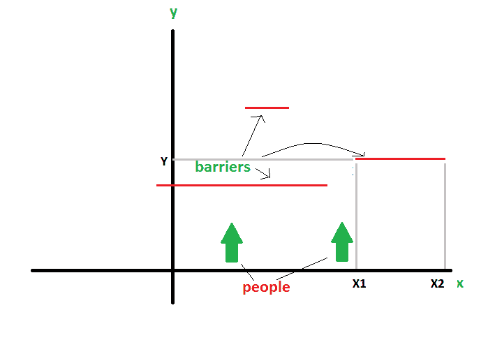

# 计算给定间隔内的点数

> 原文:[https://www . geesforgeks . org/count-points-按给定间隔覆盖/](https://www.geeksforgeeks.org/count-points-covered-by-given-intervals/)

考虑一个无限的 x-y 平面。无限人在平面上向上或+ve Y 方向行走。在 x 轴上的每个整数点，只有一个人行走。假设平行于 x 轴存在几个障碍。屏障由三个管道组成

*   X1–屏障开始的 x 点
*   X2——障碍结束的 x 点。
*   Y–Y 轴上障碍物所在的点。

计算有多少人会因为障碍而被困在任何一点。不允许使用额外的空间来跟踪 x 轴上的不同点。

[](http://contribute.geeksforgeeks.org/?attachment_id=233322)

示例:

```
Input : barriers[] = {{3 6 2}, {-7 4 3}
Output : 14
The barrier from 3 to 6 blocks 3, 4, 5, 6, 
so 4 persons blocked till now.
The barrier from -7 to 4 blocks -7,-6,-5,-4,-
3, -2, -1, 0, 1, 2, 3, 4\. But, 3 and 4 have 
already been blocked.
So, total persons blocked is 14.

```

**问于:微软 IDC 实习。**

一个简单的方法是使用初始化为零的超长数组。然后，我们可以通过循环通过每个屏障，将屏障中的那些值标记为 1。这将解决壁垒重叠的问题。

但是我们不能使用前面提到的另一个数组。因此，我们使用排序和简单的数学。以下是步骤:

**1。**按 x1(起点)
**2 排序所有障碍。**整理后，3 箱到货:
……一、下一道屏障与上一道不重叠。在这种情况下，我们只需添加当前障碍覆盖的点数。
……二。下一个障碍与前一个部分重叠。在这一点上，我们添加了当前障碍覆盖的非重叠点。
……三。下一个障碍与前一个障碍完全重叠。在这种情况下，我们简单地忽略电流屏障。

下面是上述方法的实现。

```
// CPP program to find number of people
// that are stopped by barriers
#include <bits/stdc++.h>
using namespace std;

struct Barrier
{
    int x1, x2, y;
};

// Compares two Barriers according to x1 
bool compareBarrier(Barrier b1, Barrier b2)
{
    return (b1.x1 < b2.x1);
}

// Returns number of people blocked by
// array of barriers arr[0..n-1]
int countStopped(Barrier arr[], int n)
{
    // Sort barriers according to x1.
    sort(arr, arr+n, compareBarrier);

    // End point of previous barrier
    // Initializing with some value
    // smaller than lowest x1.
    int prev_end = arr[0].x1 - 1;

    // Traverse through all bariers
    int count = 0;
    for (int i=0; i<n; i++)
    {
        // If current barrier doesn't overlap
        // with previous
        if (prev_end < arr[i].x1)
        {
            count += (arr[i].x2 - arr[i].x1 + 1);
            prev_end = arr[i].x2;
        }

        // If current barrier overlaps and
        // blocks some more people
        else if (prev_end < arr[i].x2)
        {
            count += (arr[i].x2 - prev_end);
            prev_end = arr[i].x2;
        }
    }

    return count;
}

// Driver code
int main()
{
    Barrier arr[] = {{3, 6, 2}, {-7, 4, 3}};
    int n = sizeof(arr)/sizeof(arr[0]);
    cout << countStopped(arr, n);
    return 0;
}
```

输出:

```
14
```

我们可以很容易地注意到，问题中没有 y 的重要性，所以可能不会存储。

时间复杂度:0(对数 n)

本文由**T1 掌门人**供稿。如果你喜欢 GeeksforGeeks 并想投稿，你也可以使用[contribute.geeksforgeeks.org](http://www.contribute.geeksforgeeks.org)写一篇文章或者把你的文章邮寄到 contribute@geeksforgeeks.org。看到你的文章出现在极客博客主页上，帮助其他极客。

如果你发现任何不正确的地方，或者你想分享更多关于上面讨论的话题的信息，请写评论。