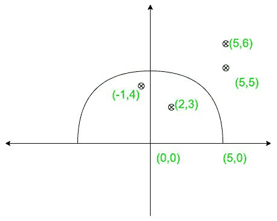
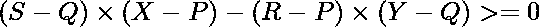

# 从位于半圆内的数组中计数点

> 原文:[https://www . geeksforgeeks . org/从位于半圆内的数组中计算点数/](https://www.geeksforgeeks.org/count-points-from-an-array-that-lies-inside-a-semi-circle/)

给定两对 **(X，Y)、(P，Q)** 和 **R** 半圆中心的坐标、半圆与半圆直径的交点的坐标、半圆的半径，以及一个由几个点的坐标组成的维度为 **N*2** 的[数组](https://www.geeksforgeeks.org/array-data-structure/) **arr【】的数组**，任务是从数组中找出位于
[半圆](https://en.wikipedia.org/wiki/Semicircle)内部或上面的点的个数。
***注:**考虑直径以上的半圆。*

**示例:**

> **输入:** X = 0，Y = 0，R = 5，P = 5，Q = 0，arr[][] = { {2，3}，{5，6}，{-1，4}，{5，5 } }
> T3】输出:2
> T6】说明:点{2，3}和{-1，4}在半圆内。
> 
> [](https://media.geeksforgeeks.org/wp-content/uploads/20210202173248/gfg2.jpg)
> 
> **输入:** X = 2，Y = 3，R = 10，P = 12，Q = 3，arr[][]= {-7，-5}，{0，6}，{11，4} }
> 输出: 2

**方法:**给定的问题可以基于以下观察来解决:

> *   The point on or in the semicircle must be on or above the diameter of the semicircle, and the distance between the center of **and this point should be **≤ r** .**
> *   Let  be the equation of diameter.
>     Point **(R, S)** is above the line if
>     
>     
> *   Point **(r, s)** is above the line formed by the connection of points **(x, y)** and **(p, q)** if 

按照以下步骤解决问题:

*   [从点(X，Y)和(P，Q)求半圆直径的线](https://www.geeksforgeeks.org/program-find-line-passing-2-points/)的方程。
*   初始化一个变量，比如**和**，来存储所需点数。
*   [遍历阵列](https://www.geeksforgeeks.org/c-program-to-traverse-an-array/)**arr【】**并执行以下操作:
    *   计算点 **(X，Y)****(P，Q)** 之间的距离，并将其存储在变量中，比如 **d.**
    *   将 **arr[i][0]** 和 **arr[i][1]** 分别放在公式
        
        中的 **R** 和 **S** 处，并将结果存储在一个变量中，比如 **f** 。
    *   如果 **R ≤ d** 和 **f ≥ 0** ，则**和**的计数增加 **1** 。
*   完成以上步骤后，打印**和**中存储的值。

下面是上述方法的实现:

## C++

```
// C++ program for above approach
#include <bits/stdc++.h>
using namespace std;

int getPointsIns(int x1, int y1, int radius, int x2,
                 int y2, vector<pair<int, int>> points)
{
    int ans = 0;

    // Traverse the array
    for(int i = 0; i < points.size(); i++)
    {

        // Stores if a point lies
        // above the diameter or not
        bool condOne = false, condTwo = false;
        if ((points[i].second - y2) *
              (x2 - x1) - (y2 - y1) *
             (points[i].first - x2) >= 0)
        {
            condOne = true;
        }

        // Stores if the R is less than or
        // equal to the distance between
        // center and point
        if (radius >= (int)sqrt(pow((y1 - points[i].second), 2) +
                                 pow(x1 - points[i].first, 2)))
        {
            condTwo = true;
        }
        if (condOne && condTwo)
        {
            ans += 1;
        }
    }
    return ans;
}

// Driver code
int main()
{
    int X = 0;
    int Y = 0;
    int R = 5;
    int P = 5;
    int Q = 0;

    vector<pair<int, int>> arr = { make_pair(2, 3),
                                   make_pair(5, 6),
                                   make_pair(-1, 4),
                                   make_pair(5, 5) };

    cout << getPointsIns(X, Y, R, P, Q, arr);
    return 0;
}

// This code is contributed by nirajgusain5
```

## Java 语言(一种计算机语言，尤用于创建网站)

```
// Java program for above approach
import java.io.*;

class Gfg {
  public static int getPointsIns(int x1, int y1,int radius,
                                 int x2,int y2, pair points[])
  {
    int ans = 0;
    // Traverse the array
    for (int i = 0; i < points.length; i++)
    {

      // Stores if a point lies
      // above the diameter or not
      boolean condOne = false, condTwo = false;
      if ((points[i].b - y2) *
          (x2 - x1)- (y2 - y1) *
          (points[i].a - x2)>= 0)
      {
        condOne = true;
      }

      // Stores if the R is less than or
      // equal to the distance between
      // center and point
      if (radius >= (int)Math.sqrt(Math.pow((y1 - points[i].b), 2)+
                                   Math.pow(x1 - points[i].a, 2)))
      {
        condTwo = true;
      }
      if (condOne && condTwo)
      {
        ans += 1;
      }
    }
    return ans;
  }

  // Driver code
  public static void main(String[] args)
  {
    int X = 0;
    int Y = 0;
    int R = 5;
    int P = 5;
    int Q = 0;

    pair arr[] = {new pair(2, 3), new pair(5, 6), new pair(-1, 4), new pair(5,5)};

    System.out.print(getPointsIns(X, Y, R, P, Q, arr));
  }
}
class pair
{
  int a;
  int b;
  pair(int a,int b)
  {   
    this.a = a;
    this.b = b;
  }
}
```

## 蟒蛇 3

```
# Python implementation of above approach
def getPointsIns(x1, y1, radius, x2, y2, points):
    # Stores the count of ans
    ans = 0

    # Traverse the array
    for point in points:

        # Stores if a point lies
        # above the diameter or not
        condOne = (point[1] - y2) * (x2 - x1) \
                  - (y2 - y1) * (point[0] - x2) >= 0

        # Stores if the R is less than or
        # equal to the distance between
        # center and point

        condTwo = radius >= ((y1 - point[1]) ** 2 \
                  + (x1 - point[0]) ** 2) ** (0.5)

        if condOne and condTwo:
            ans += 1

    return ans

# Driver Code
# Input
X = 0
Y = 0
R = 5
P = 5
Q = 0
arr = [[2, 3], [5, 6], [-1, 4], [5, 5]]

print(getPointsIns(X, Y, R, P, Q, arr))
```

## C#

```
// C# program for above approach
using System;

class Gfg
{
  public static int getPointsIns(int x1, int y1,
                                 int radius, int x2,
                                 int y2, pair[] points)
  {
    int ans = 0;

    // Traverse the array
    for (int i = 0; i < points.Length; i++) {

      // Stores if a point lies
      // above the diameter or not
      bool condOne = false, condTwo = false;
      if ((points[i].b - y2) * (x2 - x1)
          - (y2 - y1) * (points[i].a - x2)
          >= 0) {
        condOne = true;
      }

      // Stores if the R is less than or
      // equal to the distance between
      // center and point
      if (radius >= (int)Math.Sqrt(
        Math.Pow((y1 - points[i].b), 2)
        + Math.Pow(x1 - points[i].a, 2))) {
        condTwo = true;
      }
      if (condOne && condTwo) {
        ans += 1;
      }
    }
    return ans;
  }

  // Driver code
  public static void Main(string[] args)
  {
    int X = 0;
    int Y = 0;
    int R = 5;
    int P = 5;
    int Q = 0;

    pair[] arr = { new pair(2, 3), new pair(5, 6),
                  new pair(-1, 4), new pair(5, 5) };

    Console.Write(getPointsIns(X, Y, R, P, Q, arr));
  }
}
public class pair {
  public int a;
  public int b;
  public pair(int a, int b)
  {
    this.a = a;
    this.b = b;
  }
}

// This code is contributed by code_hunt.
```

## java 描述语言

```
<script>
// Javascript program for above approach

function getPointsIns(x1,y1,radius,x2,y2,points)
{
    let ans = 0;
    // Traverse the array
    for (let i = 0; i < points.length; i++)
    {

      // Stores if a point lies
      // above the diameter or not
      let condOne = false, condTwo = false;
      if ((points[i][1] - y2) *
          (x2 - x1)- (y2 - y1) *
          (points[i][0] - x2)>= 0)
      {
        condOne = true;
      }

      // Stores if the R is less than or
      // equal to the distance between
      // center and point
      if (radius >= Math.sqrt(Math.pow((y1 - points[i][1]), 2)+
                                   Math.pow(x1 - points[i][0], 2)))
      {
        condTwo = true;
      }

      if (condOne && condTwo)
      {
        ans += 1;
      }

    }
    return ans;
}

// Driver code
let X = 0;
    let Y = 0;
    let R = 5;
    let P = 5;
    let Q = 0;

    let arr = [[2, 3], [5, 6], [-1, 4], [5, 5]];

    document.write(getPointsIns(X, Y, R, P, Q, arr));

// This code is contributed by avanitrachhadiya2155
</script>
```

**Output:** 

```
2
```

**时间复杂度:**O(N)
T3】辅助空间: O(1)