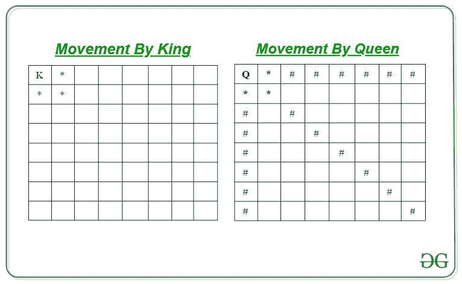

# 统计棋盘中女王可以访问而国王不可以访问的位置

> 原文:[https://www . geesforgeks . org/count-positions-in-a-bodget-the-positions-in-a-the-bodget-the-positions-in-a-a-the-bodget-a-a-a-a-a-a-a-a-a-a-a-a-a-a-a-a-a-a-a-a-a](https://www.geeksforgeeks.org/count-positions-in-a-chessboard-that-can-be-visited-by-the-queen-which-are-not-visited-by-the-king/)

给定两个整数 **N** 和 **M** 表示棋盘的尺寸，两个整数 **X** 和 **Y** 表示国王的位置，即单元格 **(X，Y)** 。任务是找到如果被国王取代，女王可以访问但国王不能访问的细胞数量。国王访问所有相邻的牢房，女王可以对角、水平和垂直移动。

**示例:**

> **输入:** N = 8，M = 8，X = 1，Y = 1
> **输出:** 18
> **说明:**
> 下图为国王和王后的动作展示图:
> 
> 
> 
> 假设 K 代表国王，*代表国王访问过的细胞，Q 代表女王，#代表女王访问过的细胞。
> 所以，女王可以访问的方块总数是 18 个。
> 
> **输入:** N = 2，M = 1，X = 1，Y = 1
> T3】输出: 0

**方法:**思路是先找到女王可以访问的位置总数。然后找出国王可以访问的职位总数。只能被女王访问的单元数量将是国王可以访问的单元数量减去女王可以访问的单元数量。按照以下步骤解决问题:

*   将**女王招式**初始化为 0，计算女王的总招式如下:

> 如果 N–X > 0 和 M–Y > 0，皇后移动=皇后移动+最小值(N–X，M–Y)
> 如果 X–1>0 和 Y–1>0，皇后移动=皇后移动+最小值(Y–1，X–1)
> 如果 X–1>0 和 M–Y>0，皇后移动=皇后移动+最小值(X–1，M–Y)
> 如果 N–X>0 和 Y–1>0， 皇后移动=皇后移动+最小(N–X，Y–1)
> 最后，将水平和垂直移动的答案添加为皇后移动=皇后移动+(N–1)+(M–1)

*   将**王者招式**初始化为 0，按照以下方式计算王者招式:

> 如果 X + 1 <= N,  kingMoves = kingMoves + 1
> 如果 X–1>0，王者移动=王者移动+ 1
> 如果 Y + 1 < = M，王者移动=王者移动+ 1
> 如果 Y–1>0，王者移动=王者移动+ 1
> 如果 X + 1 < = N 和 Y + 1 < = M，王者移动=王者移动+ 1
> 如果 X + 1 < = N 和 Y–1>0， 主移动=主移动+ 1
> 如果 X–1>0 和 Y–1>0，主移动=主移动+ 1
> 如果 X–1>0 和 Y + 1 < = M，主移动=主移动+ 1

*   打印在以上步骤中计算的女王和国王的绝对差异作为结果。

下面是上述方法的实现:

## C++

```
// C++ program for the above approach
#include <iostream>
using namespace std;

// Function to print the number of cells
// only visited by the queen
int Moves_Calculator(int x, int y,
                     int row, int col)
{

    // Find all the moves
    int total_moves = 0;

    // Find all moves for x + 1, y + 1
    if ((row - x) > 0 && (col - y) > 0)
        total_moves += min((row - x),
                           (col - y));

    // Find all moves for x - 1, y - 1
    if ((y - 1) > 0 && (x - 1) > 0)
        total_moves += min((y - 1),
                           (x - 1));

    // Find all moves for x - 1, y + 1
    if ((x - 1) > 0 && (col - y) > 0)
        total_moves += min((x - 1),
                         (col - y));

    // Find all moves for x + 1, y - 1
    if ((row - x) > 0 && (y - 1) > 0)
        total_moves += min((row - x),
                             (y - 1));

    total_moves += (row - 1) + (col - 1);

    // Find all squares visited by King
    // x + 1, in same row
    int king_moves = 0;

    if (x + 1 <= row)
        king_moves += 1;

    // x - 1, in same row
    if (x - 1 > 0)
        king_moves += 1;

    // y + 1, in same column
    if (y + 1 <= col)
        king_moves += 1;

    // y - 1, in same column
    if (y - 1 > 0)
        king_moves += 1;

    if (x + 1 <= row && y + 1 <= col)
        king_moves += 1;

    if (x + 1 <= row && y - 1 > 0)
        king_moves += 1;

    if (x - 1 > 0 && y - 1 > 0)
        king_moves += 1;

    if (x - 1 > 0 && y + 1 <= col)
        king_moves += 1;

    // Return answer
    return total_moves - king_moves;
}

// Driver Code
int main()
{

    // Dimension of Board
    int n = 8, m = 8;

    // Position of Cell
    int x = 1, y = 1;

    // Function Call
    cout << (Moves_Calculator(x, y, m, n));
    return 0;
}

// This code is contributed by akhilsaini
```

## Java 语言(一种计算机语言，尤用于创建网站)

```
// Java program for the above approach
import java.io.*;

class GFG{

// Function to print the number of cells
// only visited by the queen
static int Moves_Calculator(int x, int y,
                            int row, int col)
{

    // Find all the moves
    int total_moves = 0;

    // Find all moves for x + 1, y + 1
    if ((row - x) > 0 && (col - y) > 0)
        total_moves += Math.min((row - x),
                                (col - y));

    // Find all moves for x - 1, y - 1
    if ((y - 1) > 0 && (x - 1) > 0)
        total_moves += Math.min((y - 1),
                                (x - 1));

    // Find all moves for x - 1, y + 1
    if ((x - 1) > 0 && (col - y) > 0)
        total_moves += Math.min((x - 1),
                              (col - y));

    // Find all moves for x + 1, y - 1
    if ((row - x) > 0 && (y - 1) > 0)
        total_moves += Math.min((row - x),
                                  (y - 1));

    total_moves += (row - 1) + (col - 1);

    // Find all squares visited by King
    // x + 1, in same row
    int king_moves = 0;
    if (x + 1 <= row)
        king_moves += 1;

    // x - 1, in same row
    if (x - 1 > 0)
        king_moves += 1;

    // y + 1, in same column
    if (y + 1 <= col)
        king_moves += 1;

    // y - 1, in same column
    if (y - 1 > 0)
        king_moves += 1;

    if (x + 1 <= row && y + 1 <= col)
        king_moves += 1;

    if (x + 1 <= row && y - 1 > 0)
        king_moves += 1;

    if (x - 1 > 0 && y - 1 > 0)
        king_moves += 1;

    if (x - 1 > 0 && y + 1 <= col)
        king_moves += 1;

    // Return answer
    return total_moves - king_moves;
}

// Driver Code
public static void main(String[] args)
{

    // Dimension of Board
    int n = 8, m = 8;

    // Position of Cell
    int x = 1, y = 1;

    // Function Call
    System.out.println(Moves_Calculator(x, y, m, n));
}
}

// This code is contributed by akhilsaini
```

## 蟒蛇 3

```
# Python3 program for the above approach

# Function to print the number of cells
# only visited by the queen
def Moves_Calculator(x, y, row, col):

    # Find all the moves
    total_moves = 0

    # Find all moves for x + 1, y + 1
    if (row - x) > 0 and (col - y) > 0:
        total_moves += min((row - x), (col - y))

    # Find all moves for x - 1, y - 1
    if (y - 1) > 0 and (x - 1) > 0:
        total_moves += min((y - 1), (x - 1))

    # Find all moves for x - 1, y + 1
    if (x - 1) > 0 and (col - y) > 0:
        total_moves += min((x - 1), (col - y))

    # Find all moves for x + 1, y - 1
    if (row - x) > 0 and (y - 1) > 0:
        total_moves += min((row - x), (y - 1))

    total_moves += (row - 1) + (col - 1)

    # Find all squares visited by King
    # x + 1, in same row
    king_moves = 0
    if x + 1 <= m:
        king_moves += 1

    # x - 1, in same row
    if x - 1 > 0:
        king_moves += 1

    # y + 1, in same column
    if y + 1 <= n:
        king_moves += 1

    # y - 1, in same column
    if y - 1 > 0:
        king_moves += 1

    if x + 1 <= m and y + 1 <= n:
        king_moves += 1

    if x + 1 <= m and y - 1 > 0:
        king_moves += 1

    if x - 1 > 0 and y - 1 > 0:
        king_moves += 1

    if x - 1 > 0 and y + 1 <= n:
        king_moves += 1

    # Return answer
    return total_moves - king_moves

# Driver Code
if __name__ == '__main__':

    # Dimension of Board
    n, m = 8, 8

    # Position of Cell
    x, y = 1, 1

    # Function Call
    print(Moves_Calculator(x, y, m, n))
```

## C#

```
// C# program for the above approach
using System;

class GFG{

// Function to print the number of cells
// only visited by the queen
static int Moves_Calculator(int x, int y,
                            int row, int col)
{

    // Find all the moves
    int total_moves = 0;

    // Find all moves for x + 1, y + 1
    if ((row - x) > 0 && (col - y) > 0)
        total_moves += Math.Min((row - x),
                                (col - y));

    // Find all moves for x - 1, y - 1
    if ((y - 1) > 0 && (x - 1) > 0)
        total_moves += Math.Min((y - 1),
                                (x - 1));

    // Find all moves for x - 1, y + 1
    if ((x - 1) > 0 && (col - y) > 0)
        total_moves += Math.Min((x - 1),
                              (col - y));

    // Find all moves for x + 1, y - 1
    if ((row - x) > 0 && (y - 1) > 0)
        total_moves += Math.Min((row - x),
                                  (y - 1));

    total_moves += (row - 1) + (col - 1);

    // Find all squares visited by King
    // x + 1, in same row
    int king_moves = 0;
    if (x + 1 <= row)
        king_moves += 1;

    // x - 1, in same row
    if (x - 1 > 0)
        king_moves += 1;

    // y + 1, in same column
    if (y + 1 <= col)
        king_moves += 1;

    // y - 1, in same column
    if (y - 1 > 0)
        king_moves += 1;

    if (x + 1 <= row && y + 1 <= col)
        king_moves += 1;

    if (x + 1 <= row && y - 1 > 0)
        king_moves += 1;

    if (x - 1 > 0 && y - 1 > 0)
        king_moves += 1;

    if (x - 1 > 0 && y + 1 <= col)
        king_moves += 1;

    // Return answer
    return total_moves - king_moves;
}

// Driver Code
public static void Main()
{

    // Dimension of Board
    int n = 8, m = 8;

    // Position of Cell
    int x = 1, y = 1;

    // Function Call
    Console.WriteLine(Moves_Calculator(x, y, m, n));
}
}

// This code is contributed by akhilsaini
```

## java 描述语言

```
<script>

// Javascript program for the above approach

// Function to print the number of cells
// only visited by the queen
function Moves_Calculator(x, y, row, col)
{

    // Find all the moves
    let total_moves = 0;

    // Find all moves for x + 1, y + 1
    if ((row - x) > 0 && (col - y) > 0)
        total_moves += Math.min((row - x),
                                (col - y));

    // Find all moves for x - 1, y - 1
    if ((y - 1) > 0 && (x - 1) > 0)
        total_moves += Math.min((y - 1),
                                (x - 1));

    // Find all moves for x - 1, y + 1
    if ((x - 1) > 0 && (col - y) > 0)
        total_moves += Math.min((x - 1),
                              (col - y));

    // Find all moves for x + 1, y - 1
    if ((row - x) > 0 && (y - 1) > 0)
        total_moves += Math.min((row - x),
                                  (y - 1));

    total_moves += (row - 1) + (col - 1);

    // Find all squares visited by King
    // x + 1, in same row
    let king_moves = 0;
    if (x + 1 <= row)
        king_moves += 1;

    // x - 1, in same row
    if (x - 1 > 0)
        king_moves += 1;

    // y + 1, in same column
    if (y + 1 <= col)
        king_moves += 1;

    // y - 1, in same column
    if (y - 1 > 0)
        king_moves += 1;

    if (x + 1 <= row && y + 1 <= col)
        king_moves += 1;

    if (x + 1 <= row && y - 1 > 0)
        king_moves += 1;

    if (x - 1 > 0 && y - 1 > 0)
        king_moves += 1;

    if (x - 1 > 0 && y + 1 <= col)
        king_moves += 1;

    // Return answer
    return total_moves - king_moves;
}

// Driver code

// Dimension of Board
let n = 8, m = 8;

// Position of Cell
let x = 1, y = 1;

// Function Call
document.write(Moves_Calculator(x, y, m, n));

// This code is contributed by splevel62  

</script>
```

**Output:** 

```
18
```

***时间复杂度:**O(1)*
T5**辅助空间:** O(1)