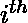
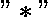
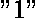

# 计算给定数字序列的可能解码数|集合 2

> 原文:[https://www . geeksforgeeks . org/count-可能-给定数字序列的解码-set-2/](https://www.geeksforgeeks.org/count-possible-decodings-of-a-given-digit-sequence-set-2/)

给定一个由数字和 ***** 组成的编码字符串 **str** ，该字符串可以由任意数字**1–9**填充，任务是找到将该字符串解码为字母序列 **A-Z** 的方法数量。

**注意:**输入字符串只包含 0-9 之间的数字和字符' * '。

**示例:**

> **输入:** str = "1*"
> **输出:** 18
> **解释:**
> 由于*可以被(1-9)中的任意值代替，
> 给定的字符串可以被解码为 A[A-I] + [J-R] = 9 + 9 路
> 
> **输入:**str = " 12 * 3 "
> T3】输出: 28

**天真方法:**一个简单的解决方案是考虑到字符串的所有可能的解码，使用递归来解决问题。

下面是这个问题的递归树:

```
                   12*3
              /             \
           12*(3)           12(*3) 
         /     \            /      \
    12(*)(3)  1(2*)(3)  1(2)(*3)   ""
      /    \      \       /
1(2)(*)(3) ""     ""     ""   
    /
   ""
```

**高效方法:**思路是利用[动态规划](https://www.geeksforgeeks.org/dynamic-programming/)解决问题，利用最优子结构考虑字符串当前和前几个数字的所有情况及其解码字符串的方式数。

**DP 状态的定义:**在这个问题中，![dp[i]    ](img/b27c2e13bda480c9e0c168c91229efd2.png "Rendered by QuickLaTeX.com")表示解码字符串直到索引的方式数。

**初始差压状态:**初始差压状态的值定义如下:

```
// Number of ways to decode 
// an empty string
dp[0] = 1

// Number of ways to decode the
// first character
if (s[0] == '*')
    dp[1] = 9  // 9 ways
else 
    dp[1] = 1
```

**最优子结构:**解码字符串的当前字符一般有两种方式:

*   **将当前字符作为一位数进行解码:**如果当前字符作为一位数使用，则该字符通常有两种情况:
    *   **情况 1:** 如果当前字符等于，那么有 9 种可能的方法可以从[1-9]中提取任意数字，并将其解码为[A-Z]中的任意字符。

```
if (current == "*")
    dp[i] += 9 * dp[i-1]
```

*   **情况 2:** 如果当前字符等于[0-9]中的任何其他数字，则可能的解码方式数等于直到索引的字符串解码方式数。

```
if (current != "*")
     dp[i] += dp[i-1]
```

*   **将当前字符作为两位数解码:**如果当前字符作为两位数解码，则有两种可能的情况:
    *   **情况 1:** 如果前一个字符等于或，那么可能还有两个可能的子情况，这将取决于当前字符:
        *   **情况 1.1:** 如果当前字符等于，那么如果前一个字符为 1，则总的可能解码方式为 9，否则如果前一个字符为 2，则为 6。
        *   **情况 1.2:** 如果当前字符小于或等于 6，那么解码字符串的可能方式总数将仅取决于解码前一个字符的方式数。那就是![dp[i-2]](img/d4d7f5b67ce4c5a9bc437f18609eb2a6.png "Rendered by QuickLaTeX.com")
    *   **情况 2:** 如果前一个角色是，那么根据当前角色，可能还有两个可能的子情况:
        *   **案例 2.1:** 如果当前角色也是，那么案例总数将是![15 * dp[i-2]    ](img/9ca6e1ba7fdbc19f1f0b196ca6b4f51f.png "Rendered by QuickLaTeX.com")，因为之前角色的解码方式的位数必须已经包含了。
        *   **情况 2.2:** 如果当前字符小于 6，那么路的总数将是![2*dp[i-2]    ](img/d0f20c8d982fc630766a7430a121c4be.png "Rendered by QuickLaTeX.com")，因为那么选择第一个字符的位数的路的数量是 2。那就是[1，2]。
        *   **情况 2.3:** 如果当前字符是任意数字，那么路的总数将是只解码上一个数字的路数。那就是![dp[i-2]    ](img/3c925219c42939b3e046ecf338b36856.png "Rendered by QuickLaTeX.com")。

## C++

```
// C++ implementation to count the
// possible decodings of the given
// digit sequence

#include <bits/stdc++.h>
using namespace std;

// Function to count the number of
// ways to decode the given digit
// sequence
int waysToDecode2(string s) {
    int n = s.size();

    // Array to store the dp states
    vector<int> dp(n+1,0);

    // Case of empty string
    dp[0]=1;

    // Condition to check if the
    // first character of string is 0
    if(s[0]=='0')
        return 0;

    // Base case for single length
    // string
    dp[1]= ((s[0]=='*')? 9 : 1);

    // Bottom-up dp for the string
    for(int i=2;i<=n;i++)
    {
        // Previous character
        char first= s[i-2];

        // Current character
        char second= s[i-1];

        // Case to include the Current
        // digit as a single digit for
        // decoding the string
        if(second=='*')
        {
            dp[i]+= 9*dp[i-1];
        }
        else if(second>'0')
            dp[i]+=dp[i-1];

        // Case to include the current
        // character as two-digit for
        // decoding the string
        if(first=='1'|| first=='2')
        {

            // Condition to check if the
            // current character is "*"
            if(second=='*')
            {
                if(first=='1')
                    dp[i]+= 9 * dp[i-2];
                else if(first=='2')
                    dp[i]+= 6 * dp[i-2];
            }

            // Condition to check if the
            // current character is less than
            // or equal to 26
            else if(((first-'0')* 10 +
                    (second-'0'))<= 26)
                dp[i]+=dp[i-2];
        }

        // Condition to check if the
        // Previous digit is equal to "*"
        else if(first=='*')
        {
            if(second=='*')
            {
                dp[i]+= 15 * dp[i-2];
            }
            else if(second<='6')
                dp[i]+= 2* dp[i-2];
            else
                dp [i]+= dp[i-2];
        }
    }
    return dp[n];
}

// Driver Code
int main() {
    string str = "12*3";

    // Function Call
    cout << waysToDecode2(str) << endl;
    return 0;
}
```

## Java 语言(一种计算机语言，尤用于创建网站)

```
// Java implementation to count the
// possible decodings of the given
// digit sequence
class GFG{

// Function to count the number of
// ways to decode the given digit
// sequence
static int waysToDecode2(char []s)
{

    int n = s.length;

    // Array to store the dp states
    int []dp = new int[n + 1];

    // Case of empty String
    dp[0] = 1;

    // Condition to check if the
    // first character of String is 0
    if(s[0] == '0')
        return 0;

    // Base case for single length
    // String
    dp[1] = ((s[0] == '*') ? 9 : 1);

    // Bottom-up dp for the String
    for(int i = 2; i <= n; i++)
    {

    // Previous character
    char first = s[i - 2];

    // Current character
    char second = s[i - 1];

    // Case to include the Current
    // digit as a single digit for
    // decoding the String
    if(second == '*')
    {
        dp[i] += 9 * dp[i - 1];
    }
    else if(second > '0')
        dp[i] += dp[i - 1];

    // Case to include the current
    // character as two-digit for
    // decoding the String
    if(first == '1' || first == '2')
    {

        // Condition to check if the
        // current character is "*"
        if(second == '*')
        {
            if(first == '1')
                dp[i] += 9 * dp[i - 2];
            else if(first == '2')
                dp[i] += 6 * dp[i - 2];
        }

        // Condition to check if the
        // current character is less than
        // or equal to 26
        else if(((first - '0') * 10 +
                (second - '0')) <= 26)
        {
            dp[i] += dp[i - 2];
        }
    }

    // Condition to check if the
    // previous digit is equal to "*"
    else if(first == '*')
    {
        if(second == '*')
        {
            dp[i] += 15 * dp[i - 2];
        }
        else if(second <= '6')
        {
            dp[i] += 2 * dp[i - 2];
        }
        else
        {
            dp[i] += dp[i - 2];
        }
    }
    }
    return dp[n];
}

// Driver Code
public static void main(String[] args)
{
    String str = "12*3";

    // Function Call
    System.out.print(waysToDecode2(
                    str.toCharArray()) + "\n");
}
}

// This code is contributed by amal kumar choubey
```

## C#

```
// C# implementation to count the
// possible decodings of the given
// digit sequence
using System;

class GFG{

// Function to count the number of
// ways to decode the given digit
// sequence
static int waysToDecode2(char []s)
{
    int n = s.Length;

    // Array to store the dp states
    int []dp = new int[n + 1];

    // Case of empty String
    dp[0] = 1;

    // Condition to check if the
    // first character of String is 0
    if(s[0] == '0')
        return 0;

    // Base case for single length
    // String
    dp[1] = ((s[0] == '*') ? 9 : 1);

    // Bottom-up dp for the String
    for(int i = 2; i <= n; i++)
    {

    // Previous character
    char first = s[i - 2];

    // Current character
    char second = s[i - 1];

    // Case to include the current
    // digit as a single digit for
    // decoding the String
    if(second == '*')
    {
        dp[i] += 9 * dp[i - 1];
    }
    else if(second > '0')
    {
        dp[i] += dp[i - 1];
    }

    // Case to include the current
    // character as two-digit for
    // decoding the String
    if(first == '1' || first == '2')
    {

        // Condition to check if the
        // current character is "*"
        if(second == '*')
        {
            if(first == '1')
            {
                dp[i] += 9 * dp[i - 2];
            }
            else if(first == '2')
            {
                dp[i] += 6 * dp[i - 2];
            }
        }

        // Condition to check if the
        // current character is less than
        // or equal to 26
        else if(((first - '0') * 10 +
                (second - '0')) <= 26)
        {
            dp[i] += dp[i - 2];
        }
    }

    // Condition to check if the
    // previous digit is equal to "*"
    else if(first == '*')
    {
        if(second == '*')
        {
            dp[i] += 15 * dp[i - 2];
        }
        else if(second <= '6')
        {
            dp[i] += 2 * dp[i - 2];
        }
        else
        {
            dp[i] += dp[i - 2];
        }
    }
    }
    return dp[n];
}

// Driver Code
public static void Main(String[] args)
{
    String str = "12*3";

    // Function Call
    Console.Write(waysToDecode2(
                str.ToCharArray()) + "\n");
}
}

// This code is contributed by amal kumar choubey
```

## java 描述语言

```
<script>

// JavaScript implementation to count the
// possible decodings of the given
// digit sequence

// Function to count the number of
// ways to decode the given digit
// sequence
function waysToDecode2(s)
{

    let n = s.length;

    // Array to store the dp states
    let dp = Array.from({length: n+1}, (_, i) => 0);

    // Case of empty String
    dp[0] = 1;

    // Condition to check if the
    // first character of String is 0
    if(s[0] == '0')
        return 0;

    // Base case for single length
    // String
    dp[1] = ((s[0] == '*') ? 9 : 1);

    // Bottom-up dp for the String
    for(let i = 2; i <= n; i++)
    {

    // Previous character
    let first = s[i - 2];

    // Current character
    let second = s[i - 1];

    // Case to include the Current
    // digit as a single digit for
    // decoding the String
    if(second == '*')
    {
        dp[i] += 9 * dp[i - 1];
    }
    else if(second > '0')
        dp[i] += dp[i - 1];

    // Case to include the current
    // character as two-digit for
    // decoding the String
    if(first == '1' || first == '2')
    {

        // Condition to check if the
        // current character is "*"
        if(second == '*')
        {
            if(first == '1')
                dp[i] += 9 * dp[i - 2];
            else if(first == '2')
                dp[i] += 6 * dp[i - 2];
        }

        // Condition to check if the
        // current character is less than
        // or equal to 26
        else if(((first - '0') * 10 +
                (second - '0')) <= 26)
        {
            dp[i] += dp[i - 2];
        }
    }

    // Condition to check if the
    // previous digit is equal to "*"
    else if(first == '*')
    {
        if(second == '*')
        {
            dp[i] += 15 * dp[i - 2];
        }
        else if(second <= '6')
        {
            dp[i] += 2 * dp[i - 2];
        }
        else
        {
            dp[i] += dp[i - 2];
        }
    }
    }
    return dp[n];
}

// Driver Code

        let str = "12*3";

    // Function Call
    document.write(waysToDecode2(
                    str.split('')) + "\n");

</script>
```

**输出:**

```
28
```

*   **时间复杂度:** O(N)
*   **辅助空间:** O(N)