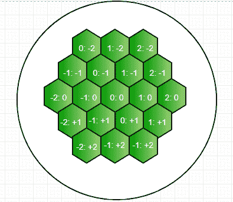
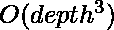

# 可能的六边形行走计数

> 原文:[https://www . geesforgeks . org/count-可能-六边形-walks/](https://www.geeksforgeeks.org/count-possible-hexagonal-walks/)

给我们一个由六边形连接在一起构成的无限二维平面。我们可以把这个平面想象成一个蜂巢。元素 X 出现在其中一个单元/六边形上。
我们被给予 N 个步骤，任务是计算这样的六边形路径的可能数量，其中元素 X 必须执行 N 步的行走并返回到原始六边形，其中![N\in[1, 14] ](img/389ff2dd0e1bcb2409e8f06240039871.png "Rendered by QuickLaTeX.com")
**示例:**

```
Input : 1
Output : Number of walks possible is/are 0
Explanation :
0 because using just one step we can move to
any of the adjacent cells but we cannot trace 
back to the original hexagon.

Input : 2
Output : Number of walks possible is/are 6

Input : 4
Output : Number of walks possible is/are 90 
```

**进场:**

*   六边形行走可以定义为穿过相邻的六边形并返回到原始单元。我们知道一个六边形包含六个边的事实，即一个六边形被六个六边形包围。现在，我们必须计算我们走 N 步的次数，然后回到最初的六边形。
*   现在，让我们假设最初的六边形(元素 X 最初出现的地方)是原点。我们需要所有可能的方法，我们可以采取(N-k)步骤，这样我们就有一些步骤可以追溯到我们最初的六边形。我们可以从下图中看到这个六边形及其相关的坐标系。



*   现在，让我们假设，我们的元素 X 出现在给定图片的 0:0 处。因此，我们可以从一个六边形向六个可能的方向行进。现在，使用上面的方向，我们记住所有可能的运动，这样我们就可以追溯到最初的 0:0 索引。为了记忆，我们使用一个三维数组，并对给定数量的步骤进行预处理，然后进行相应的查询。

以下是上述方法的实现:

## C++

```
// C++ implementation of counting
// number of possible hexagonal walks
#include <iostream>
using namespace std;

int depth = 16;
int ways[16][16][16];
int stepNum;

void preprocess(int list[])
{
    // We initialize our origin with 1
    ways[0][8][8] = 1;

    // For each N = 1 to 14, we traverse in all possible
    // direction. Using this 3D array we calculate the
    // number of ways at each step and the total ways
    // for a given step shall be found at
    // ways[step number][8][8] because all the steps
    // after that will be used to trace back to the
    // original point index 0:0 according to the image.
    for (int N = 1; N <= 14; N++)
    {
        for (int i = 1; i <= depth; i++)
        {
            for (int j = 1; j <= depth; j++)
            {
                ways[N][i][j] = ways[N - 1][i][j + 1]
                                + ways[N - 1][i][j - 1]
                                + ways[N - 1][i + 1][j]
                                + ways[N - 1][i - 1][j]
                                + ways[N - 1][i + 1][j - 1]
                                + ways[N - 1][i - 1][j + 1];
            }
        }

        // This array stores the number of ways
        // possible for a given step
        list[N] = ways[N][8][8];
    }
}

// Driver function
int main()
{
    int list[15];

   // Preprocessing all possible ways
    preprocess(list);
    int steps = 4;
    cout << "Number of walks possible is/are "
         << list[steps] << endl;
    return 0;
}
```

## Java 语言(一种计算机语言，尤用于创建网站)

```
// Java implementation of counting
// number of possible hexagonal walks
import java.util.*;

class GFG {

    static int depth = 14;
    static int ways[][][] = new int[16][16][16];
    static int stepNum;

    static void preprocess(int list[])
    {

        // We initialize our origin with 1
        ways[0][8][8] = 1;

        // For each N = 1 to 14, we traverse in
        // all possible direction. Using this 3D
        // array we calculate the number of ways
        // at each step and the total ways for a
        // given step shall be found at ways[step
        // number][8][8] because all the steps
        // after that will be used to trace back
        // to the original point index 0:0
        // according to the image.
        for (int N = 1; N <= 14; N++)
        {
            for (int i = 1; i < depth; i++)
            {
                for (int j = 1; j < depth; j++)
                {
                    ways[N][i][j] =
                            ways[N - 1][i][j + 1]
                          + ways[N - 1][i][j - 1]
                          + ways[N - 1][i + 1][j]
                          + ways[N - 1][i - 1][j]
                      + ways[N - 1][i + 1][j - 1]
                     + ways[N - 1][i - 1][j + 1];
                }
            }

            // This array stores the number of
            // ways possible for a given step
            list[N] = ways[N][8][8];
        }
    }

    /* Driver program to test above function */
    public static void main(String[] args)
    {
         int list[] = new int[15];

           // Preprocessing all possible ways
            preprocess(list);
            int steps = 4;
            System.out.println( "Number of walks"
                           + " possible is/are "+
                                   list[steps] );
    }
}
```

## 蟒蛇 3

```
# Python 3 implementation of counting
# number of possible hexagonal walks

depth = 16
ways = [[[0 for i in range(17)]
            for i in range(17)]
            for i in range(17)]

def preprocess(list, steps):

    # We initialize our origin with 1
    ways[0][8][8] = 1

    # For each N = 1 to 14, we traverse in
    # all possible direction. Using this 3D
    # array we calculate the number of ways
    # at each step and the total ways for a
    # given step shall be found at ways[step
    # number][8][8] because all the steps after
    # that will be used to trace back to the
    # original point index 0:0 according to the image.
    for N in range(1, 16, 1):
        for i in range(1, depth, 1):
            for j in range(1, depth, 1):
                ways[N][i][j] = (ways[N - 1][i][j + 1] +
                                 ways[N - 1][i][j - 1] +
                                 ways[N - 1][i + 1][j] +
                                 ways[N - 1][i - 1][j] +
                                 ways[N - 1][i + 1][j - 1] +
                                 ways[N - 1][i - 1][j + 1])

        # This array stores the number of ways
        # possible for a given step
        list[N] = ways[N][8][8]

    print("Number of walks possible is/are",
                                list[steps])

# Driver Code
if __name__ == '__main__':
    list = [0 for i in range(16)]
    steps = 4

    # Preprocessing all possible ways
    preprocess(list, steps)

# This code is contributed by
# Surendra_Gangwar
```

## C#

```
// C# implementation of counting
// number of possible hexagonal walks
using System;

class GFG {

    static int depth = 14;
    static int [, ,]ways = new int[16,16,16];
    // static int stepNum;

    static void preprocess(int []list)
    {

        // We initialize our origin with 1
        ways[0,8,8] = 1;

        // For each N = 1 to 14, we traverse in
        // all possible direction. Using this 3D
        // array we calculate the number of ways
        // at each step and the total ways for a
        // given step shall be found at ways[step
        // number][8][8] because all the steps
        // after that will be used to trace back
        // to the original point index 0:0
        // according to the image.
        for (int N = 1; N <= 14; N++)
        {
            for (int i = 1; i < depth; i++)
            {
                for (int j = 1; j < depth; j++)
                {
                    ways[N,i,j] =
                            ways[N - 1,i,j + 1]
                        + ways[N - 1,i,j - 1]
                        + ways[N - 1,i + 1,j]
                        + ways[N - 1,i - 1,j]
                    + ways[N - 1,i + 1,j - 1]
                    + ways[N - 1,i - 1,j + 1];
                }
            }

            // This array stores the number of
            // ways possible for a given step
            list[N] = ways[N,8,8];
        }
    }

    /* Driver program to test above function */
    public static void Main()
    {
        int []list = new int[15];

            // Preprocessing all possible ways
            preprocess(list);
            int steps = 4;
            Console.WriteLine( "Number of walks"
                        + " possible is/are "+
                                list[steps] );
    }
}

// This code is contributed by anuj_67.
```

## java 描述语言

```
<script>
    // Javascript implementation of counting
    // number of possible hexagonal walks

    let depth = 14;
    let ways = new Array(16);
    for (let i = 0; i < 16; i++)
    {
      ways[i] = new Array(16);
      for (let j = 0; j < 16; j++)
      {
        ways[i][j] = new Array(16);
          for (let k = 0; k < 16; k++)
        {
            ways[i][j][k] = 0;
        }
      }
    }
    let stepNum;

    function preprocess(list)
    {

        // We initialize our origin with 1
        ways[0][8][8] = 1;

        // For each N = 1 to 14, we traverse in
        // all possible direction. Using this 3D
        // array we calculate the number of ways
        // at each step and the total ways for a
        // given step shall be found at ways[step
        // number][8][8] because all the steps
        // after that will be used to trace back
        // to the original point index 0:0
        // according to the image.
        for (let N = 1; N <= 14; N++)
        {
            for (let i = 1; i < depth; i++)
            {
                for (let j = 1; j < depth; j++)
                {
                    ways[N][i][j] =
                            ways[N - 1][i][j + 1]
                          + ways[N - 1][i][j - 1]
                          + ways[N - 1][i + 1][j]
                          + ways[N - 1][i - 1][j]
                      + ways[N - 1][i + 1][j - 1]
                     + ways[N - 1][i - 1][j + 1];
                }
            }

            // This array stores the number of
            // ways possible for a given step
            list[N] = ways[N][8][8];
        }
    }

    let list = new Array(15);
    list.fill(0);

    // Preprocessing all possible ways
    preprocess(list);
    let steps = 4;
    document.write( "Number of walks"
                       + " possible is/are "+
                       list[steps] );

</script>
```

输出:

```
Number of walks possible is/are 90
```

上述代码的时间复杂度为，由于使用了 3D 数组，空间复杂度也差不多。