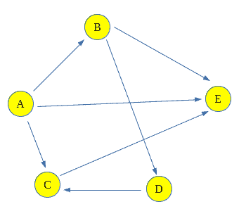
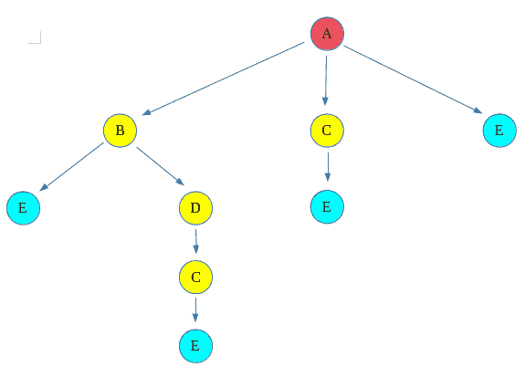
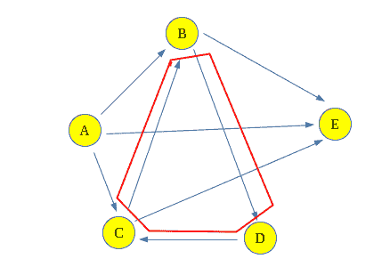

# 计算两个顶点之间所有可能的路径

> 原文:[https://www . geesforgeks . org/count-可能路径-两个顶点/](https://www.geeksforgeeks.org/count-possible-paths-two-vertices/)

计算有向图中两个顶点之间存在的路或路径的总数。这些路径不包含循环，原因很简单，一个循环包含无限多的路径，因此它们会产生一个问题。
**例:**

```
For the following Graph:
```



```

Input: Count paths between A and E
Output : Total paths between A and E are 4
Explanation: The 4 paths between A and E are:
                      A -> E
                      A -> B -> E
                      A -> C -> E
                      A -> B -> D -> C -> E 

Input : Count paths between A and C
Output : Total paths between A and C are 2
Explanation: The 2 paths between A and C are:
                      A -> C
                      A -> B -> D -> C
```

**进场:**
这个问题可以用[回溯](https://www.geeksforgeeks.org/backtracking-algorithms/)来解决，就是说走一条路，开始在上面走，检查它是不是把我们引到目的顶点，然后统计路径，回溯走另一条路。如果路径没有指向目标顶点，则丢弃该路径。
这种类型的图遍历称为回溯。
**上图回溯可以这样显示:**
红色顶点为源顶点，浅蓝色顶点为目的顶点，其余为中间路径或丢弃路径。



这给出了**源(A)** 和**目的地(E)** 顶点之间的四条路径。
**为什么这个解对包含循环的图不起作用？**
与此相关的问题是，现在如果在 C 和 B 之间再增加一条边，就会形成一个循环 **(B - > D - > C - > B)** 。因此，在通过循环的每个循环之后，路径的长度将增加，这将被视为不同的路径，并且由于循环，将有无限多的路径。



**算法:**

1.  创建一个递归函数，获取图的节点索引和目标索引。保留全局或静态变量计数来存储计数。通过按值传递访问过的数组(而不是引用，引用不限于当前路径)，记录当前路径中访问过的节点。
2.  如果当前节点是目的地，则增加计数。
3.  否则，对于所有相邻节点，即可从当前节点访问的节点，使用相邻节点和目的地的索引调用递归函数。
4.  打印计数。

**实施:**

## C++

```
/*
 * C++ program to count all paths from a source to a
 * destination.
 * https://www.geeksforgeeks.org/count-possible-paths-two-vertices/
 * Note that the original example has been refactored.
 */
#include <cassert>
#include <iostream>
#include <list>
#include <vector>
using namespace std;

/*
 * A directed graph using adjacency list representation;
 * every vertex holds a list of all neighbouring vertices
 * that can be reached from it.
 */
class Graph {
public:
    // Construct the graph given the number of vertices...
    Graph(int vertices);
    // Specify an edge between two vertices
    void add_edge(int src, int dst);
    // Call the recursive helper function to count all the
    // paths
    int count_paths(int src, int dst, int vertices);

private:
    int m_vertices;
    list<int>* m_neighbours;
    void path_counter(int src, int dst, int& path_count,
                      vector<bool>& visited);
};

Graph::Graph(int vertices)
{
    m_vertices = vertices; // unused!!
    /* An array of linked lists - each element corresponds
    to a vertex and will hold a list of neighbours...*/
    m_neighbours = new list<int>[vertices];
}

void Graph::add_edge(int src, int dst)
{
    m_neighbours[src].push_back(dst);
}

int Graph::count_paths(int src, int dst, int vertices)
{
    int path_count = 0;
    vector<bool> visited(vertices, false);
    path_counter(src, dst, path_count, visited);
    return path_count;
}

/*
 * A recursive function that counts all paths from src to
 * dst. Keep track of the count in the parameter.
 */
void Graph::path_counter(int src, int dst, int& path_count,
                         vector<bool>& visited)
{
    // If we've reached the destination, then increment
    // count...
    visited[src] = true;
    if (src == dst) {
        path_count++;
    }
    // ...otherwise recurse into all neighbours...
    else {
        for (auto neighbour : m_neighbours[src]) {
            if (!visited[neighbour])
                path_counter(neighbour, dst, path_count,
                             visited);
        }
    }
  visited[src] = false;
}

// Tests...
int main()
{
    // Create a graph given in the above diagram - see link
    Graph g(5);
    g.add_edge(0, 1);
    g.add_edge(0, 2);
    g.add_edge(0, 4);
    g.add_edge(1, 3);
    g.add_edge(1, 4);
    g.add_edge(2, 3);
    g.add_edge(2, 1);
    g.add_edge(3, 2);
    // Validate it...
    cout << g.count_paths(0, 4, 5);

    return 0;
}
```

## Java 语言(一种计算机语言，尤用于创建网站)

```
// Java program to count all paths from a source
// to a destination.
import java.util.Arrays;
import java.util.Iterator;
import java.util.LinkedList;

// This class represents a directed graph using
// adjacency list representation

class Graph {

    // No. of vertices
    private int V;

    // Array of lists for
    // Adjacency List
    // Representation
    private LinkedList<Integer> adj[];

    @SuppressWarnings("unchecked") Graph(int v)
    {
        V = v;
        adj = new LinkedList[v];
        for (int i = 0; i < v; ++i)
            adj[i] = new LinkedList<>();
    }

    // Method to add an edge into the graph
    void addEdge(int v, int w)
    {

        // Add w to v's list.
        adj[v].add(w);
    }

    // A recursive method to count
    // all paths from 'u' to 'd'.
    int countPathsUtil(int u, int d, int pathCount)
    {

        // If current vertex is same as
        // destination, then increment count
        if (u == d) {
            pathCount++;
        }

        // Recur for all the vertices
        // adjacent to this vertex
        else {
            Iterator<Integer> i = adj[u].listIterator();
            while (i.hasNext()) {
                int n = i.next();
                pathCount = countPathsUtil(n, d, pathCount);
            }
        }
        return pathCount;
    }

    // Returns count of
    // paths from 's' to 'd'
    int countPaths(int s, int d)
    {

        // Call the recursive method
        // to count all paths
        int pathCount = 0;
        pathCount = countPathsUtil(s, d, pathCount);
        return pathCount;
    }

    // Driver Code
    public static void main(String args[])
    {
        Graph g = new Graph(5);
        g.addEdge(0, 1);
        g.addEdge(0, 2);
        g.addEdge(0, 3);
        g.addEdge(1, 3);
        g.addEdge(2, 3);
        g.addEdge(1, 4);
        g.addEdge(2, 4);

        int s = 0, d = 3;
        System.out.println(g.countPaths(s, d));
    }
}

// This code is contributed by shubhamjd.
```

## 蟒蛇 3

```
# Python 3 program to count all paths
# from a source to a destination.

# A directed graph using adjacency
# list representation

class Graph:

    def __init__(self, V):
        self.V = V
        self.adj = [[] for i in range(V)]

    def addEdge(self, u, v):

        # Add v to u’s list.
        self.adj[u].append(v)

    # Returns count of paths from 's' to 'd'
    def countPaths(self, s, d):

        # Mark all the vertices
        # as not visited
        visited = [False] * self.V

        # Call the recursive helper
        # function to print all paths
        pathCount = [0]
        self.countPathsUtil(s, d, visited, pathCount)
        return pathCount[0]

    # A recursive function to print all paths
    # from 'u' to 'd'. visited[] keeps track
    # of vertices in current path. path[]
    # stores actual vertices and path_index
    # is current index in path[]
    def countPathsUtil(self, u, d,
                       visited, pathCount):
        visited[u] = True

        # If current vertex is same as
        # destination, then increment count
        if (u == d):
            pathCount[0] += 1

        # If current vertex is not destination
        else:

            # Recur for all the vertices
            # adjacent to current vertex
            i = 0
            while i < len(self.adj[u]):
                if (not visited[self.adj[u][i]]):
                    self.countPathsUtil(self.adj[u][i], d,
                                        visited, pathCount)
                i += 1

        visited[u] = False

# Driver Code
if __name__ == '__main__':

    # Create a graph given in the
    # above diagram
    g = Graph(4)
    g.addEdge(0, 1)
    g.addEdge(0, 2)
    g.addEdge(0, 3)
    g.addEdge(2, 0)
    g.addEdge(2, 1)
    g.addEdge(1, 3)

    s = 2
    d = 3
    print(g.countPaths(s, d))

# This code is contributed by PranchalK
```

## C#

```
// C# program to count all paths from a source
// to a destination.
using System;
using System.Collections.Generic;

// This class represents a directed graph using
// adjacency list representation
public class Graph {

    // No. of vertices
    int V;

    // Array of lists for
    // Adjacency List
    // Representation
    private List<int>[] adj;

    Graph(int v)
    {
        V = v;
        adj = new List<int>[ v ];
        for (int i = 0; i < v; ++i)
            adj[i] = new List<int>();
    }

    // Method to add an edge into the graph
    void addEdge(int v, int w)
    {

        // Add w to v's list.
        adj[v].Add(w);
    }

    // A recursive method to count
    // all paths from 'u' to 'd'.
    int countPathsUtil(int u, int d, int pathCount)
    {

        // If current vertex is same as
        // destination, then increment count
        if (u == d) {
            pathCount++;
        }

        // Recur for all the vertices
        // adjacent to this vertex
        else {
            foreach(int i in adj[u])
            {
                int n = i;
                pathCount = countPathsUtil(n, d, pathCount);
            }
        }
        return pathCount;
    }

    // Returns count of
    // paths from 's' to 'd'
    int countPaths(int s, int d)
    {

        // Call the recursive method
        // to count all paths
        int pathCount = 0;
        pathCount = countPathsUtil(s, d, pathCount);
        return pathCount;
    }

    // Driver Code
    public static void Main(String[] args)
    {
        Graph g = new Graph(5);
        g.addEdge(0, 1);
        g.addEdge(0, 2);
        g.addEdge(0, 3);
        g.addEdge(1, 3);
        g.addEdge(2, 3);
        g.addEdge(1, 4);
        g.addEdge(2, 4);

        int s = 0, d = 3;
        Console.WriteLine(g.countPaths(s, d));
    }
}

// This code is contributed by Rajput-Ji
```

## java 描述语言

```
<script>

// JavaScript program to count all paths from a source
// to a destination.

// No. of vertices
let  V;

// Array of lists for
    // Adjacency List
    // Representation
let adj;

function Graph(v)
{
    V = v;
        adj = new Array(v);
        for (let i = 0; i < v; ++i)
            adj[i] = [];
}

// Method to add an edge into the graph
function addEdge(v,w)
{
    // Add w to v's list.
        adj[v].push(w);
}

// A recursive method to count
    // all paths from 'u' to 'd'.
function countPathsUtil(u,d,pathCount)
{
    // If current vertex is same as
        // destination, then increment count
        if (u == d) {
            pathCount++;
        }

        // Recur for all the vertices
        // adjacent to this vertex
        else {

            for(let i=0;i<adj[u].length;i++) {
                let n = adj[u][i];
                pathCount = countPathsUtil(n, d, pathCount);
            }
        }
        return pathCount;
}

// Returns count of
    // paths from 's' to 'd'
function countPaths(s,d)
{
    // Call the recursive method
        // to count all paths
        let pathCount = 0;
        pathCount = countPathsUtil(s, d,
                                   pathCount);
        return pathCount;
}

 // Driver Code
Graph(5);
addEdge(0, 1);
addEdge(0, 2);
addEdge(0, 3);
addEdge(1, 3);
addEdge(2, 3);
addEdge(1, 4);
addEdge(2, 4);

let s = 0, d = 3;
document.write(countPaths(s, d));

// This code is contributed by avanitrachhadiya2155

</script>
```

**Output**

```
3
```

**复杂度分析:**

*   **时间复杂度:** O(N！).
    如果图形完整，那么可以有 N 个左右！递归调用，所以时间复杂度为 O(N！)
*   **空间复杂度:** O(1)。
    因为不需要额外的空间。