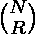

# 计算满足给定条件的给定数组的可能排列

> 原文:[https://www . geesforgeks . org/count-给定数组的可能排列-满足给定条件/](https://www.geeksforgeeks.org/count-possible-permutations-of-given-array-satisfying-the-given-conditions/)

给定一个由 **N** 个不同元素组成的[数组](https://www.geeksforgeeks.org/array-data-structure/)、 **arr[]** ，任务是计算给定数组中满足以下属性的可能排列:

*   两半必须分类。
*   **arr[i]** 必须小于 **arr[N / 2 + i]**

***注:** N 始终为偶数，索引从 **0** 开始。*

**示例:**

> **输入:** arr[] = {10，20，30，40}
> **输出:** 2
> **解释:**
> 满足给定条件的给定数组的可能排列为:{{10，20，30，40}，{10，30，20，40}}。
> 因此，要求的输出为 2。
> 
> **输入:** arr[] = {1，2 }
> T3】输出: 1

**接近**:按照以下步骤解决问题:

*   初始化一个变量，比如 **cntPerm** 来存储满足给定条件的给定数组的排列数。
*   使用以下公式求出 <sup>2N</sup> C <sub>N</sub> 的二项式系数的值:

> =[{ N×(N–1)×…………。×(N–R+1)}/{(R×(R–1)×…..× 1)}]

*   最后计算[加泰罗尼亚文号](https://www.geeksforgeeks.org/program-nth-catalan-number/)=**<sup>2N</sup>C<sub>N</sub>/(N+1)**打印为所需答案。

下面是上述方法的实现:

## C++

```
// C++ Program to implement
// the above approach

#include <bits/stdc++.h>
using namespace std;

// Function to get the value
// of binomial coefficient
int binCoff(int N, int R)
{
    // Stores the value of
    // binomial coefficient
    int res = 1;

    if (R > (N - R)) {

        // Since C(N, R)
        // = C(N, N - R)
        R = (N - R);
    }

    // Calculate the value
    // of C(N, R)
    for (int i = 0; i < R; i++) {
        res *= (N - i);
        res /= (i + 1);
    }
    return res;
}

// Function to get the count of
// permutations of the array
// that satisfy the condition
int cntPermutation(int N)
{
    // Stores count of permutations
    // of the array that satisfy
    // the given condition
    int cntPerm;

    // Stores the value of C(2N, N)
    int C_2N_N = binCoff(2 * N, N);

    // Stores the value of
    // catalan number
    cntPerm = C_2N_N / (N + 1);

    // Return answer
    return cntPerm;
}

// Driver Code
int main()
{

    int arr[] = { 1, 2, 3, 4 };
    int N = sizeof(arr) / sizeof(arr[0]);
    cout << cntPermutation(N / 2);

    return 0;
}
```

## Java 语言(一种计算机语言，尤用于创建网站)

```
// Java Program to implement
// the above approach
import java.io.*;
class GFG{

// Function to get the value
// of binomial coefficient
static int binCoff(int N,
                   int R)
{
  // Stores the value of
  // binomial coefficient
  int res = 1;

  if (R > (N - R))
  {
    // Since C(N, R)
    // = C(N, N - R)
    R = (N - R);
  }

  // Calculate the value
  // of C(N, R)
  for (int i = 0; i < R; i++)
  {
    res *= (N - i);
    res /= (i + 1);
  }
  return res;
}

// Function to get the count of
// permutations of the array
// that satisfy the condition
static int cntPermutation(int N)
{
  // Stores count of permutations
  // of the array that satisfy
  // the given condition
  int cntPerm;

  // Stores the value of C(2N, N)
  int C_2N_N = binCoff(2 * N, N);

  // Stores the value of
  // catalan number
  cntPerm = C_2N_N / (N + 1);

  // Return answer
  return cntPerm;
}

// Driver Code
public static void main (String[] args)
{
  int arr[] = {1, 2, 3, 4};
  int N = arr.length;
  System.out.println(cntPermutation(N / 2));
}
}

// This code is contributed by sanjoy_62
```

## 蟒蛇 3

```
# Python3 program to implement
# the above approach

# Function to get the value
# of binomial coefficient
def binCoff(N, R):

    # Stores the value of
    # binomial coefficient
    res = 1

    if (R > (N - R)):

        # Since C(N, R)
        # = C(N, N - R)
        R = (N - R)

    # Calculate the value
    # of C(N, R)
    for i in range(R):
        res *= (N - i)
        res //= (i + 1)

    return res

# Function to get the count of
# permutations of the array
# that satisfy the condition
def cntPermutation(N):

    # Stores count of permutations
    # of the array that satisfy
    # the given condition

    # Stores the value of C(2N, N)
    C_2N_N = binCoff(2 * N, N)

    # Stores the value of
    # catalan number
    cntPerm = C_2N_N // (N + 1)

    # Return answer
    return cntPerm

# Driver Code
if __name__ == '__main__':

    arr = [ 1, 2, 3, 4 ]
    N = len(arr)

    print(cntPermutation(N // 2))

# This code is contributed by mohit kumar 29
```

## C#

```
// C# Program to implement
// the above approach
using System;
class GFG{

// Function to get the value
// of binomial coefficient
static int binCoff(int N,
                   int R)
{
  // Stores the value of
  // binomial coefficient
  int res = 1;

  if (R > (N - R))
  {
    // Since C(N, R)
    // = C(N, N - R)
    R = (N - R);
  }

  // Calculate the value
  // of C(N, R)
  for (int i = 0; i < R; i++)
  {
    res *= (N - i);
    res /= (i + 1);
  }
  return res;
}

// Function to get the count of
// permutations of the array
// that satisfy the condition
static int cntPermutation(int N)
{
  // Stores count of permutations
  // of the array that satisfy
  // the given condition
  int cntPerm;

  // Stores the value of C(2N, N)
  int C_2N_N = binCoff(2 * N, N);

  // Stores the value of
  // catalan number
  cntPerm = C_2N_N / (N + 1);

  // Return answer
  return cntPerm;
}

// Driver Code
public static void Main(String[] args)
{
  int []arr = {1, 2, 3, 4};
  int N = arr.Length;
  Console.WriteLine(cntPermutation(N / 2));
}
}

// This code is contributed by shikhasingrajput
```

## java 描述语言

```
<script>
// javascript Program to implement
// the above approach

    // Function to get the value
    // of binomial coefficient
    function binCoff(N , R) {
        // Stores the value of
        // binomial coefficient
        var res = 1;

        if (R > (N - R)) {
            // Since C(N, R)
            // = C(N, N - R)
            R = (N - R);
        }

        // Calculate the value
        // of C(N, R)
        for (i = 0; i < R; i++) {
            res *= (N - i);
            res /= (i + 1);
        }
        return res;
    }

    // Function to get the count of
    // permutations of the array
    // that satisfy the condition
    function cntPermutation(N) {
        // Stores count of permutations
        // of the array that satisfy
        // the given condition
        var cntPerm;

        // Stores the value of C(2N, N)
        var C_2N_N = binCoff(2 * N, N);

        // Stores the value of
        // catalan number
        cntPerm = C_2N_N / (N + 1);

        // Return answer
        return cntPerm;
    }

    // Driver Code

        var arr = [ 1, 2, 3, 4 ];
        var N = arr.length;
        document.write(cntPermutation(N / 2));

// This code contributed by umadevi9616
</script>
```

**Output**

```
2
```

***时间复杂度** : O(N)*
***辅助空间** : O(1)*