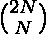

# 计数给定长度的序列，这些序列具有可以由给定值

生成的非负前缀和

> 原文:[https://www . geesforgeks . org/count-给定长度序列-具有非负前缀-可由给定值生成的和/](https://www.geeksforgeeks.org/count-sequences-of-given-length-having-non-negative-prefix-sums-that-can-be-generated-by-given-values/)

给定两个整数 **M** 和 **X** ，任务是找到长度为 **M** 的序列的数量，该数量可以由 **X** 和 **-X** 组成，使得它们各自的计数相等，并且直到结果序列的每个索引的[前缀和](https://www.geeksforgeeks.org/prefix-sum-array-implementation-applications-competitive-programming/)是非负的。

**示例:**

> **输入:** M = 4，X = 5
> **输出:** 2
> **解释:**
> 只有 2 个可能的序列具有所有非负的可能前缀和:
> 
> 1.  {+5, +5, -5, -5}
> 2.  {+5, -5, +5, -5}
> 
> **输入:** M = 6，X = 2
> **输出:** 5
> **解释:**
> 只有 5 个可能的序列具有所有非负的可能前缀和:
> 
> 1.  {+2, +2, +2, -2, -2, -2}
> 2.  {+2, +2, -2, -2, +2, -2}
> 3.  {+2, -2, +2, -2, +2, -2}
> 4.  {+2, +2, -2, +2, -2, -2}
> 5.  {+2, -2, +2, +2, -2, -2}

**<u>天真法</u> :** 最简单的方法是用给定的整数 **+X** 和 **-X** 生成大小为 **M** 的所有可能的排列，并找出形成的每个排列的前缀和，对那些[前缀和数组](https://www.geeksforgeeks.org/prefix-sum-array-implementation-applications-competitive-programming/)只有非负元素的序列进行计数。在上述步骤之后，打印该序列的计数。

***时间复杂度:** O((M*(M！))/((M/2)！) <sup>2</sup> )*
***辅助空间:** O(M)*

**<u>【高效方法】</u> :** 其思想是观察这样一种模式:对于任何形成的序列而言，在每个指标上出现的**正 X** 的数量总是大于或等于出现的**负 X** 的数量。这类似于 [**加泰罗尼亚数字**](https://www.geeksforgeeks.org/program-nth-catalan-number/) 的模式。在这种情况下，检查出现的**正 X** 的数量是否总是大于或等于出现的**负 X** 的数量，这是加泰罗尼亚数字的模式。所以任务是找到**第 N 个**加泰罗尼亚数字，其中 **N = M/2** 。

> 
> 
> 其中，K <sub>N</sub> 为加泰罗尼亚数字 N <sup>th</sup> ，为二项式系数。

下面是上述方法的实现:

## C++

```
// C++ program for the above approach

#include <bits/stdc++.h>
using namespace std;

// Function to find the Binomial
// Coefficient C(n, r)
unsigned long int binCoff(unsigned int n,
                          unsigned int r)
{
    // Stores the value C(n, r)
    unsigned long int val = 1;
    int i;

    // Update C(n, r) = C(n, n - r)
    if (r > (n - r))
        r = (n - r);

    // Find C(n, r) iteratively
    for (i = 0; i < r; i++) {
        val *= (n - i);
        val /= (i + 1);
    }

    // Return the final value
    return val;
}

// Function to find number of sequence
// whose prefix sum at each index is
// always non-negative
void findWays(int M)
{
    // Find n
    int n = M / 2;

    unsigned long int a, b, ans;

    // Value of C(2n, n)
    a = binCoff(2 * n, n);

    // Catalan number
    b = a / (n + 1);

    // Print the answer
    cout << b;
}

// Driver Code
int main()
{
    // Given M and X
    int M = 4, X = 5;

    // Function Call
    findWays(M);

    return 0;
}
```

## Java 语言(一种计算机语言，尤用于创建网站)

```
// Java program for the above approach
import java.io.*;

class GFG{

// Function to find the Binomial
// Coefficient C(n, r)
static long binCoff(long n, long r)
{

    // Stores the value C(n, r)
    long val = 1;
    int i;

    // Update C(n, r) = C(n, n - r)
    if (r > (n - r))
        r = (n - r);

    // Find C(n, r) iteratively
    for(i = 0; i < r; i++)
    {
        val *= (n - i);
        val /= (i + 1);
    }

    // Return the final value
    return val;
}

// Function to find number of sequence
// whose prefix sum at each index is
// always non-negative
static void findWays(int M)
{

    // Find n
    int n = M / 2;

    long a, b, ans;

    // Value of C(2n, n)
    a = binCoff(2 * n, n);

    // Catalan number
    b = a / (n + 1);

    // Print the answer
    System.out.print(b);
}

// Driver Code
public static void main(String[] args)
{

    // Given M and X
    int M = 4, X = 5;

    // Function Call
    findWays(M);
}
}

// This code is contributed by akhilsaini
```

## 蟒蛇 3

```
# Python3 program for the above approach

# Function to find the Binomial
# Coefficient C(n, r)
def binCoff(n, r):

    # Stores the value C(n, r)
    val = 1

    # Update C(n, r) = C(n, n - r)
    if (r > (n - r)):
        r = (n - r)

    # Find C(n, r) iteratively
    for i in range(0, r):
        val *= (n - i)
        val //= (i + 1)

    # Return the final value
    return val

# Function to find number of sequence
# whose prefix sum at each index is
# always non-negative
def findWays(M):

    # Find n
    n = M // 2

    # Value of C(2n, n)
    a = binCoff(2 * n, n)

    # Catalan number
    b = a // (n + 1)

    # Print the answer
    print(b)

# Driver Code
if __name__ == '__main__':

    # Given M and X
    M = 4
    X = 5

    # Function Call
    findWays(M)

# This code is contributed by akhilsaini
```

## C#

```
// C# program for the above approach
using System;

class GFG{

// Function to find the Binomial
// Coefficient C(n, r)
static long binCoff(long n, long r)
{

    // Stores the value C(n, r)
    long val = 1;
    int i;

    // Update C(n, r) = C(n, n - r)
    if (r > (n - r))
        r = (n - r);

    // Find C(n, r) iteratively
    for(i = 0; i < r; i++)
    {
        val *= (n - i);
        val /= (i + 1);
    }

    // Return the final value
    return val;
}

// Function to find number of sequence
// whose prefix sum at each index is
// always non-negative
static void findWays(int M, int X)
{

    // Find n
    int n = M / 2;

    long a, b;

    // Value of C(2n, n)
    a = binCoff(2 * n, n);

    // Catalan number
    b = a / (n + 1);

    // Print the answer
    Console.WriteLine(b);
}

// Driver Code
public static void Main()
{

    // Given M and X
    int M = 4;
    int X = 5;

    // Function Call
    findWays(M, X);
}
}

// This code is contributed by akhilsaini
```

## java 描述语言

```
<script>
// Javascript program to implement
// the above approach

// Function to find the Binomial
// Coefficient C(n, r)
function binCoff(n, r)
{

    // Stores the value C(n, r)
    let val = 1;
    let i;

    // Update C(n, r) = C(n, n - r)
    if (r > (n - r))
        r = (n - r);

    // Find C(n, r) iteratively
    for(i = 0; i < r; i++)
    {
        val *= (n - i);
        val /= (i + 1);
    }

    // Return the final value
    return val;
}

// Function to find number of sequence
// whose prefix sum at each index is
// always non-negative
function findWays(M)
{

    // Find n
    let n = M / 2;

    let a, b, ans;

    // Value of C(2n, n)
    a = binCoff(2 * n, n);

    // Catalan number
    b = a / (n + 1);

    // Prlet the answer
    document.write(b);
}

    // Driver Code

    // Given M and X
    let M = 4, X = 5;

    // Function Call
    findWays(M);

</script>
```

**Output:** 

```
2
```

***时间复杂度:**O(M)*
T5**辅助空间:** O(1)