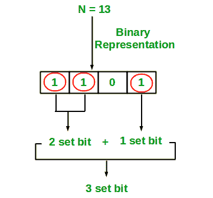

# 计数整数中的设定位

> 原文:[https://www.geeksforgeeks.org/count-set-bits-in-an-integer/](https://www.geeksforgeeks.org/count-set-bits-in-an-integer/)

写一个有效的程序来计算一个整数的二进制表示中 1 的个数。

**示例:**

```
Input : n = 6
Output : 2
Binary representation of 6 is 110 and has 2 set bits

Input : n = 13
Output : 3
Binary representation of 13 is 1101 and has 3 set bits
```



**1。简单方法**循环一个整数中的所有位，检查是否设置了一个位，如果设置了，则增加设置的位计数。请看下面的程序。

## C++

```
// C++ program to Count set
// bits in an integer
#include <bits/stdc++.h>
using namespace std;

/* Function to get no of set bits in binary
representation of positive integer n */
unsigned int countSetBits(unsigned int n)
{
    unsigned int count = 0;
    while (n) {
        count += n & 1;
        n >>= 1;
    }
    return count;
}

/* Program to test function countSetBits */
int main()
{
    int i = 9;
    cout << countSetBits(i);
    return 0;
}

// This code is contributed
// by Akanksha Rai
```

## C

```
// C program to Count set
// bits in an integer
#include <stdio.h>

/* Function to get no of set bits in binary
   representation of positive integer n */
unsigned int countSetBits(unsigned int n)
{
    unsigned int count = 0;
    while (n) {
        count += n & 1;
        n >>= 1;
    }
    return count;
}

/* Program to test function countSetBits */
int main()
{
    int i = 9;
    printf("%d", countSetBits(i));
    return 0;
}
```

## Java 语言(一种计算机语言，尤用于创建网站)

```
// Java program to Count set
// bits in an integer
import java.io.*;

class countSetBits {
    /* Function to get no of set
    bits in binary representation
    of positive integer n */
    static int countSetBits(int n)
    {
        int count = 0;
        while (n > 0) {
            count += n & 1;
            n >>= 1;
        }
        return count;
    }

    // driver program
    public static void main(String args[])
    {
        int i = 9;
        System.out.println(countSetBits(i));
    }
}

// This code is contributed by Anshika Goyal.
```

## 蟒蛇 3

```
# Python3 program to Count set
# bits in an integer

# Function to get no of set bits in binary
# representation of positive integer n */
def  countSetBits(n):
    count = 0
    while (n):
        count += n & 1
        n >>= 1
    return count

# Program to test function countSetBits */
i = 9
print(countSetBits(i))

# This code is contributed by
# Smitha Dinesh Semwal
```

## C#

```
// C# program to Count set
// bits in an integer
using System;

class GFG {
    // Function to get no of set
    // bits in binary representation
    // of positive integer n
    static int countSetBits(int n)
    {
        int count = 0;
        while (n > 0) {
            count += n & 1;
            n >>= 1;
        }
        return count;
    }

    // Driver Code
    public static void Main()
    {
        int i = 9;
        Console.Write(countSetBits(i));
    }
}

// This code is contributed by Sam007
```

## 服务器端编程语言（Professional Hypertext Preprocessor 的缩写）

```
<?php
// PHP program to Count set
// bits in an integer

// Function to get no of set 
// bits in binary representation
// of positive integer n
function countSetBits($n)
{
    $count = 0;
    while ($n)
    {
        $count += $n & 1;
        $n >>= 1;
    }
    return $count;
}

// Driver Code
$i = 9;
echo countSetBits($i);

// This code is contributed by ajit
?>
```

## java 描述语言

```
<script>
   // Javascript program to Count set
   // bits in an integer

   /* Function to get no of set bits in binary
   representation of positive integer n */
   function countSetBits(n)
   {
     var count = 0;
     while (n)
     {
       count += n & 1;
       n >>= 1;
     }
     return count;
   }

   /* Program to test function countSetBits */
   var i = 9;
   document.write(countSetBits(i));

     // This code is contributed by noob2000.
 </script>
```

**输出:**

```
2
```

**时间复杂度:**θ(logn)(logn 的θ)

**辅助空间:** O(1)

**递归方法:**

## C++

```
// cpp implementation of recursive
// approach to find the number
// of set bits in binary representation
// of positive integer n
#include <bits/stdc++.h>
using namespace std;

// recursive function to count set bits
int countSetBits(int n)
{
    // base case
    if (n == 0)
        return 0;

    else

        // if last bit set add 1 else add 0
        return (n & 1) + countSetBits(n >> 1);
}

// driver code
int main()
{
    // get value from user
    int n = 9;

    // function calling
    cout << countSetBits(n);

    return 0;
}

// This code is contributed by Raj.
```

## Java 语言(一种计算机语言，尤用于创建网站)

```
// Java implementation of recursive
// approach to find the number
// of set bits in binary representation
// of positive integer n
import java.io.*;

class GFG {

    // recursive function to count set bits
    public static int countSetBits(int n)
    {

        // base case
        if (n == 0)
            return 0;

        else

            // if last bit set add 1 else add 0
            return (n & 1) + countSetBits(n >> 1);
    }

    // Driver code
    public static void main(String[] args)
    {

        // get value from user
        int n = 9;

        // function calling
        System.out.println(countSetBits(n));
    }
}

// This code is contributes by sunnysingh
```

## 蟒蛇 3

```
# Python3 implementation of recursive
# approach to find the number of set
# bits in binary representation of
# positive integer n

def countSetBits( n):

    # base case
    if (n == 0):
        return 0

    else:

        # if last bit set add 1 else
        # add 0
        return (n & 1) + countSetBits(n >> 1)

# Get value from user
n = 9

# Function calling
print( countSetBits(n))    

# This code is contributed by sunnysingh
```

## C#

```
// C# implementation of recursive
// approach to find the number of
// set bits in binary representation
// of positive integer n
using System;

class GFG {

    // recursive function
    // to count set bits
    public static int countSetBits(int n)
    {

        // base case
        if (n == 0)
            return 0;

        else

            // if last bit set
            // add 1 else add 0
            return (n & 1) + countSetBits(n >> 1);
    }

    // Driver code
    static public void Main()
    {

        // get value
        // from user
        int n = 9;

        // function calling
        Console.WriteLine(countSetBits(n));
    }
}

// This code is contributed by aj_36
```

## 服务器端编程语言（Professional Hypertext Preprocessor 的缩写）

```
<?php
// PHP implementation of recursive
// approach to find the number of
// set bits in binary representation
// of positive integer n

// recursive function
// to count set bits
function countSetBits($n)
{
    // base case
    if ($n == 0)
        return 0;

    else

        // if last bit set
        // add 1 else add 0
        return ($n & 1) +
                countSetBits($n >> 1);
}

// Driver code

// get value from user
$n = 9;

// function calling
echo countSetBits($n);

// This code is contributed by m_kit.
?>
```

## java 描述语言

```
<script>

// Javascript implementation of recursive
// approach to find the number
// of set bits in binary representation
// of positive integer n

// recursive function to count set bits
function countSetBits(n)
{

    // base case
    if (n == 0)
        return 0;

    else

        // if last bit set add 1 else add 0
        return (n & 1) + countSetBits(n >> 1);
}

// driver code

    // get value from user
    let n = 9;

    // function calling
    document.write(countSetBits(n));

// This code is contributed by Mayank Tyagi
</script>
```

**输出:**

```
2
```

**2。布莱恩·克尼根的算法:**
从十进制数中减去 1 会翻转最右边设置位(即 1)之后的所有位，包括最右边的设置位。
例如:二进制中的
10 是 00001010
二进制中的 9 是 00001001
二进制中的 8 是 00001000
二进制中的 7 是 00000111
所以如果我们将一个数减去 1，并对其本身进行按位&(n&(n-1))，我们将最右边的设置位取消设置。如果我们在一个循环中做 n & (n-1)并计算循环执行的次数，我们得到设置的比特数。
这个解决方案的妙处在于它循环的次数等于给定整数中的设定位数。

```
   1  Initialize count: = 0
   2  If integer n is not zero
      (a) Do bitwise & with (n-1) and assign the value back to n
          n: = n&(n-1)
      (b) Increment count by 1
      (c) go to step 2
   3  Else return count
```

**布莱恩·克尼根算法的实现:**

## C++

```
// C++ program to Count set
// bits in an integer
#include <iostream>
using namespace std;
class gfg {
    /* Function to get no of set bits in binary
representation of passed binary no. */
public:
    unsigned int countSetBits(int n)
    {
        unsigned int count = 0;
        while (n) {
            n &= (n - 1);
            count++;
        }
        return count;
    }
};
/* Program to test function countSetBits */
int main()
{
    gfg g;
    int i = 9;
    cout << g.countSetBits(i);
    return 0;
}
```

## C

```
// C program to Count set
// bits in an integer
#include <stdio.h>

/* Function to get no of set bits in binary
   representation of passed binary no. */
unsigned int countSetBits(int n)
{
    unsigned int count = 0;
    while (n) {
        n &= (n - 1);
        count++;
    }
    return count;
}

/* Program to test function countSetBits */
int main()
{
    int i = 9;
    printf("%d", countSetBits(i));
    getchar();
    return 0;
}
```

## Java 语言(一种计算机语言，尤用于创建网站)

```
// Java program to Count set
// bits in an integer
import java.io.*;

class countSetBits {
    /* Function to get no of set
    bits in binary representation
    of passed binary no. */
    static int countSetBits(int n)
    {
        int count = 0;
        while (n > 0) {
            n &= (n - 1);
            count++;
        }
        return count;
    }

    // driver program
    public static void main(String args[])
    {
        int i = 9;
        System.out.println(countSetBits(i));
    }
}

// This code is contributed by Anshika Goyal.
```

## 蟒蛇 3

```
# Function to get no of set bits in binary
# representation of passed binary no. */
def countSetBits(n):

    count = 0
    while (n):
        n &= (n-1)
        count+= 1

    return count

# Program to test function countSetBits
i = 9
print(countSetBits(i))

# This code is contributed by
# Smitha Dinesh Semwal
```

## C#

```
// C# program to Count set
// bits in an integer
using System;

class GFG {

    /* Function to get no of set
    bits in binary representation
    of passed binary no. */
    static int countSetBits(int n)
    {
        int count = 0;
        while (n > 0) {
            n &= (n - 1);
            count++;
        }
        return count;
    }

    // Driver Code
    static public void Main()
    {
        int i = 9;
        Console.WriteLine(countSetBits(i));
    }
}

// This code is contributed by ajit
```

## 服务器端编程语言（Professional Hypertext Preprocessor 的缩写）

```
<?php

/* Function to get no of
set bits in binary
representation of passed
binary no. */
function countSetBits($n)
{
    $count = 0;
    while ($n)
    {
    $n &= ($n - 1) ;
    $count++;
    }
    return $count;
}

// Driver Code
$i = 9;
echo countSetBits($i);

// This code is contributed
// by akt_mit
?>
```

## java 描述语言

```
<script>

// JavaScript program to Count set
// bits in an integerclass

/* Function to get no of set
bits in binary representation
of passed binary no. */

function countSetBits(n)
{
    var count = 0;
    while (n > 0)
    {
        n &= (n - 1);
        count++;
    }
    return count;
}

// driver program
var i = 9;
document.write(countSetBits(i));

// This code is contributed by 29AjayKumar

</script>
```

**输出:**

```
2
```

**布莱恩·克尼根算法示例:**

```
   n =  9 (1001)
   count = 0

   Since 9 > 0, subtract by 1 and do bitwise & with (9-1)
   n = 9&8  (1001 & 1000)
   n = 8
   count  = 1

   Since 8 > 0, subtract by 1 and do bitwise & with (8-1)
   n = 8&7  (1000 & 0111)
   n = 0
   count = 2

   Since n = 0, return count which is 2 now.
```

**时间复杂度:** O(logn)

**递归方法:**

## C++

```
// CPP implementation for recursive
// approach to find the number of set
// bits using Brian Kernighan’s Algorithm
#include <bits/stdc++.h>
using namespace std;

// recursive function to count set bits
int countSetBits(int n)
{
    // base case
    if (n == 0)
        return 0;
    else
        return 1 + countSetBits(n & (n - 1));
}

// driver code
int main()
{
    // get value from user
    int n = 9;

    // function calling
    cout << countSetBits(n);

    return 0;
}

// This code is contributed by Raj.
```

## Java 语言(一种计算机语言，尤用于创建网站)

```
// Java implementation for recursive
// approach to find the number of set
// bits using Brian Kernighan Algorithm
import java.io.*;

class GFG {

    // recursive function to count set bits
    public static int countSetBits(int n)
    {

        // base case
        if (n == 0)
            return 0;
        else
            return 1 + countSetBits(n & (n - 1));
    }

    // Driver function
    public static void main(String[] args)
    {

        // get value from user
        int n = 9;

        // function calling
        System.out.println(countSetBits(n));
    }
}

// This code is contributed by sunnysingh
```

## 蟒蛇 3

```
# Python3 implementation for
# recursive approach to find
# the number of set bits using
# Brian Kernighan’s Algorithm

# recursive function to count
# set bits
def countSetBits(n):

    # base case
    if (n == 0):
        return 0
    else:
        return 1 + countSetBits(n & (n - 1))

# Get value from user
n = 9

# function calling
print(countSetBits(n))

# This code is contributed by sunnysingh
```

## C#

```
// C# implementation for recursive
// approach to find the number of set
// bits using Brian Kernighan Algorithm
using System;

class GFG {

    // recursive function
    // to count set bits
    public static int countSetBits(int n)
    {

        // base case
        if (n == 0)
            return 0;
        else
            return 1 + countSetBits(n & (n - 1));
    }

    // Driver Code
    static public void Main()
    {

        // get value from user
        int n = 9;

        // function calling
        Console.WriteLine(countSetBits(n));
    }
}

// This code is contributed by aj_36
```

## 服务器端编程语言（Professional Hypertext Preprocessor 的缩写）

```
<?php
// PHP implementation for
// recursive approach to
// find the number of set
// bits using Brian
// Kernighan’s Algorithm

// recursive function to
// count set bits
function countSetBits($n)
{
    // base case
    if ($n == 0)
        return 0;
    else
        return 1 +
          countSetBits($n &
                      ($n - 1));
}

// Driver Code

// get value from user
$n = 9;

// function calling
echo countSetBits($n);

// This code is contributed by ajit.
?>
```

## java 描述语言

```
<script>

// Javascript implementation for recursive
// approach to find the number of set
// bits using Brian Kernighan’s Algorithm

// recursive function to count set bits
function countSetBits(n)
{
    // base case
    if (n == 0)
        return 0;
    else
        return 1 + countSetBits(n & (n - 1));
}

// driver code
// get value from user

var n = 9;
// function calling

document.write(countSetBits(n));

</script>
```

**输出:**

```
2
```

**3。使用查找表:**我们可以使用查找表计算 0(1)时间的位数。
以下是上述办法的实施情况:

## C++

```
// C++ implementation of the approach
#include <bits/stdc++.h>
using namespace std;

int BitsSetTable256[256];

// Function to initialise the lookup table
void initialize()
{

    // To initially generate the
    // table algorithmically
    BitsSetTable256[0] = 0;
    for (int i = 0; i < 256; i++)
    {
        BitsSetTable256[i] = (i & 1) +
        BitsSetTable256[i / 2];
    }
}

// Function to return the count
// of set bits in n
int countSetBits(int n)
{
    return (BitsSetTable256[n & 0xff] +
            BitsSetTable256[(n >> 8) & 0xff] +
            BitsSetTable256[(n >> 16) & 0xff] +
            BitsSetTable256[n >> 24]);
}

// Driver code
int main()
{
    // Initialise the lookup table
    initialize();
    int n = 9;
    cout << countSetBits(n);
}

// This code is contributed by Sanjit_Kumar
```

## Java 语言(一种计算机语言，尤用于创建网站)

```
// Java implementation of the approach
class GFG {

    // Lookup table
    static int[] BitsSetTable256 = new int[256];

    // Function to initialise the lookup table
    public static void initialize()
    {

        // To initially generate the
        // table algorithmically
        BitsSetTable256[0] = 0;
        for (int i = 0; i < 256; i++) {
            BitsSetTable256[i] = (i & 1) + BitsSetTable256[i / 2];
        }
    }

    // Function to return the count
    // of set bits in n
    public static int countSetBits(int n)
    {
        return (BitsSetTable256[n & 0xff]
                + BitsSetTable256[(n >> 8) & 0xff]
                + BitsSetTable256[(n >> 16) & 0xff]
                + BitsSetTable256[n >> 24]);
    }

    // Driver code
    public static void main(String[] args)
    {

        // Initialise the lookup table
        initialize();
        int n = 9;
        System.out.print(countSetBits(n));
    }
}
```

## 计算机编程语言

```
# Python implementation of the approach
BitsSetTable256 = [0] * 256

# Function to initialise the lookup table
def initialize():

    # To initially generate the
    # table algorithmically
    BitsSetTable256[0] = 0
    for i in range(256):
        BitsSetTable256[i] = (i & 1) + BitsSetTable256[i // 2]

# Function to return the count
# of set bits in n
def countSetBits(n):
    return (BitsSetTable256[n & 0xff] +
            BitsSetTable256[(n >> 8) & 0xff] +
            BitsSetTable256[(n >> 16) & 0xff] +
            BitsSetTable256[n >> 24])

# Driver code

# Initialise the lookup table
initialize()
n = 9
print(countSetBits(n))

# This code is contributed by SHUBHAMSINGH10
```

## C#

```
// C# implementation of the approach
using System;
using System.Collections.Generic;

class GFG
{

    // Lookup table
    static int[] BitsSetTable256 = new int[256];

    // Function to initialise the lookup table
    public static void initialize()
    {

        // To initially generate the
        // table algorithmically
        BitsSetTable256[0] = 0;
        for (int i = 0; i < 256; i++)
        {
            BitsSetTable256[i] = (i & 1) + BitsSetTable256[i / 2];
        }
    }

    // Function to return the count
    // of set bits in n
    public static int countSetBits(int n)
    {
        return (BitsSetTable256[n & 0xff]
                + BitsSetTable256[(n >> 8) & 0xff]
                + BitsSetTable256[(n >> 16) & 0xff]
                + BitsSetTable256[n >> 24]);
    }

    // Driver code
    public static void Main(String[] args)
    {

        // Initialise the lookup table
        initialize();
        int n = 9;
        Console.Write(countSetBits(n));
    }
}

// This code is contributed by 29AjayKumar
```

## java 描述语言

```
<script>

// javascript implementation of the approach  

var BitsSetTable256 = Array.from({length: 256}, (_, i) => 0);

// Function to initialise the lookup table
function initialize()
{

    // To initially generate the
    // table algorithmically
    BitsSetTable256[0] = 0;
    for (var i = 0; i < 256; i++) {
        BitsSetTable256[i] = (i & 1) +
        BitsSetTable256[parseInt(i / 2)];
    }
}

// Function to return the count
// of set bits in n
function countSetBits(n)
{
    return (BitsSetTable256[n & 0xff]
            + BitsSetTable256[(n >> 8) & 0xff]
            + BitsSetTable256[(n >> 16) & 0xff]
            + BitsSetTable256[n >> 24]);
}

// Driver code
 // Initialise the lookup table
initialize();
var n = 9;
document.write(countSetBits(n));

// This code is contributed by 29AjayKumar

</script>
```

**Output:** 

```
2
```

我们可以在[找到计数设置位的一种用法计算要翻转的位数将 A 转换为 B](https://www.geeksforgeeks.org/count-number-of-bits-to-be-flipped-to-convert-a-to-b/)
**注意:**在 GCC 中，我们可以使用 __builtin_popcount()直接计数设置位。因此，我们可以避免使用单独的函数来计算集合位。

## C++

```
// C++ program to demonstrate __builtin_popcount()
#include <iostream>
using namespace std;

int main()
{
    cout << __builtin_popcount(4) << endl;
    cout << __builtin_popcount(15);

    return 0;
}
```

## Java 语言(一种计算机语言，尤用于创建网站)

```
// java program to demonstrate
// __builtin_popcount()

import java.io.*;

class GFG {

    // Driver code
    public static void main(String[] args)
    {

        System.out.println(Integer.bitCount(4));
        System.out.println(Integer.bitCount(15));
    }
}

// This code is contributed by Raj
```

## 蟒蛇 3

```
# Python3 program to demonstrate __builtin_popcount()

print(bin(4).count('1'));
print(bin(15).count('1'));

# This code is Contributed by mits
```

## C#

```
// C# program to demonstrate
// __builtin_popcount()
using System;
using System.Linq;

class GFG {

    // Driver code
    public static void Main()
    {

        Console.WriteLine(Convert.ToString(4, 2).Count(c = > c == '1'));
        Console.WriteLine(Convert.ToString(15, 2).Count(c = > c == '1'));
    }
}

// This code is contributed by mits
```

## 服务器端编程语言（Professional Hypertext Preprocessor 的缩写）

```
<?php
// PHP program to demonstrate
// __builtin_popcount()

// Driver code
$t = log10(4);
$x = log(15, 2);
$tt = ceil($t);
$xx = ceil($x);

echo ($tt), "\n";
echo ($xx), "\n";

// This code is contributed
// by jit_t
?>
```

## java 描述语言

```
<script>

// Javascript program to demonstrate
// __builtin_popcount()

document.write((4).toString(2).split('').
  filter(x => x == '1').length + "<br>");
document.write((15).toString(2).split('').
  filter(x => x == '1').length);

</script>
```

**输出:**

```
1
4
```

**4。用比特映射数字。**它只是维护一个半字节的数字到位的映射(或数组)。半字节包含 4 位。所以我们需要最多 15 个的数组。
int num _ to _ bit[16]= { 0，1，1，2，1，2，2，3，1，2，2，3，2，3，3，3，3，3，4 }；
现在我们只需要递归地获取给定 long/int/word 等的半字节。

## C++

```
// C++ program to count set bits by pre-storing
// count set bits in nibbles.
#include <bits/stdc++.h>
using namespace std;

int num_to_bits[16] = { 0, 1, 1, 2, 1, 2, 2, 3,
                        1, 2, 2, 3, 2, 3, 3, 4 };

/* Recursively get nibble of a given number
and map them in the array */
unsigned int countSetBitsRec(unsigned int num)
{
    int nibble = 0;
    if (0 == num)
        return num_to_bits[0];

    // Find last nibble
    nibble = num & 0xf;

    // Use pre-stored values to find count
    // in last nibble plus recursively add
    // remaining nibbles.
    return num_to_bits[nibble] + countSetBitsRec(num >> 4);
}

// Driver code
int main()
{
    int num = 31;
    cout << countSetBitsRec(num);
    return 0;
}

// This code is contributed by rathbhupendra
```

## C

```
// C program to count set bits by pre-storing
// count set bits in nibbles.
#include <stdio.h>

int num_to_bits[16] = { 0, 1, 1, 2, 1, 2, 2, 3,
                        1, 2, 2, 3, 2, 3, 3, 4 };

/* Recursively get nibble of a given number
  and map them in the array  */
unsigned int countSetBitsRec(unsigned int num)
{
    int nibble = 0;
    if (0 == num)
        return num_to_bits[0];

    // Find last nibble
    nibble = num & 0xf;

    // Use pre-stored values to find count
    // in last nibble plus recursively add
    // remaining nibbles.
    return num_to_bits[nibble] + countSetBitsRec(num >> 4);
}

// Driver code
int main()
{
    int num = 31;
    printf("%d\n", countSetBitsRec(num));
}
```

## Java 语言(一种计算机语言，尤用于创建网站)

```
// Java program to count set bits by pre-storing
// count set bits in nibbles.

class GFG {
    static int[] num_to_bits = new int[] { 0, 1, 1, 2, 1, 2, 2,
                                           3, 1, 2, 2, 3, 2, 3, 3, 4 };

    /* Recursively get nibble of a given number
and map them in the array */
    static int countSetBitsRec(int num)
    {
        int nibble = 0;
        if (0 == num)
            return num_to_bits[0];

        // Find last nibble
        nibble = num & 0xf;

        // Use pre-stored values to find count
        // in last nibble plus recursively add
        // remaining nibbles.
        return num_to_bits[nibble] + countSetBitsRec(num >> 4);
    }

    // Driver code
    public static void main(String[] args)
    {
        int num = 31;
        System.out.println(countSetBitsRec(num));
    }
}
// this code is contributed by mits
```

## 蟒蛇 3

```
# Python3 program to count set bits by pre-storing
# count set bits in nibbles.

num_to_bits =[0, 1, 1, 2, 1, 2, 2, 3, 1, 2, 2, 3, 2, 3, 3, 4];

# Recursively get nibble of a given number
# and map them in the array
def countSetBitsRec(num):
    nibble = 0;
    if(0 == num):
        return num_to_bits[0];

    # Find last nibble
    nibble = num & 0xf;

    # Use pre-stored values to find count
    # in last nibble plus recursively add
    # remaining nibbles.

    return num_to_bits[nibble] + countSetBitsRec(num >> 4);

# Driver code

num = 31;
print(countSetBitsRec(num));

# this code is contributed by mits
```

## C#

```
// C# program to count set bits by pre-storing
// count set bits in nibbles.

class GFG {
    static int[] num_to_bits = new int[16] { 0, 1, 1, 2, 1, 2, 2,
                                             3, 1, 2, 2, 3, 2, 3, 3, 4 };

    /* Recursively get nibble of a given number
and map them in the array */
    static int countSetBitsRec(int num)
    {
        int nibble = 0;
        if (0 == num)
            return num_to_bits[0];

        // Find last nibble
        nibble = num & 0xf;

        // Use pre-stored values to find count
        // in last nibble plus recursively add
        // remaining nibbles.
        return num_to_bits[nibble] + countSetBitsRec(num >> 4);
    }

    // Driver code
    static void Main()
    {
        int num = 31;
        System.Console.WriteLine(countSetBitsRec(num));
    }
}
// this code is contributed by mits
```

## 服务器端编程语言（Professional Hypertext Preprocessor 的缩写）

```
<?php
// PHP program to count set bits by
// pre-storing count set bits in nibbles.

$num_to_bits = array(0, 1, 1, 2, 1, 2, 2, 3,
                     1, 2, 2, 3, 2, 3, 3, 4);

/* Recursively get nibble of a given
number and map them in the array */
function countSetBitsRec( $num)
{
    global $num_to_bits;
    $nibble = 0;
    if (0 == $num)
        return $num_to_bits[0];

    // Find last nibble
    $nibble = $num & 0xf;

    // Use pre-stored values to find count
    // in last nibble plus recursively add
    // remaining nibbles.
    return $num_to_bits[$nibble] +
           countSetBitsRec($num >> 4);
}

// Driver code
$num = 31;
echo (countSetBitsRec($num));

// This code is contributed by mits
?>
```

## java 描述语言

```
<script>

// Javascript program to count set bits by pre-storing
// count set bits in nibbles.  
var num_to_bits =[ 0, 1, 1, 2, 1, 2, 2,
                   3, 1, 2, 2, 3, 2, 3, 3, 4 ];

/* Recursively get nibble of a given number
and map them in the array */
function countSetBitsRec(num)
{
    var nibble = 0;
    if (0 == num)
        return num_to_bits[0];

    // Find last nibble
    nibble = num & 0xf;

    // Use pre-stored values to find count
    // in last nibble plus recursively add
    // remaining nibbles.
    return num_to_bits[nibble] + countSetBitsRec(num >> 4);
}

// Driver code
var num = 31;
document.write(countSetBitsRec(num));

// This code is contributed by 29AjayKumar

</script>
```

**输出:**

```
5
```

**时间复杂度:** O(log n)，因为我们有 log(16，n)级的递归。
**存储复杂度:** O(1)无论给定的数字是短、int、long 还是 long long，我们只需要一个 16 个大小的数组，这个数组是常量。

**5。检查数字中的每一位:**

检查数字中的每一位是否置位。这个数是按位“与”的 2 次方，所以如果结果不等于零，我们就知道该位置的特定位被设置了。

## C

```
#include <stdio.h>

// Check each bit in a number is set or not
// and return the total count of the set bits.
int countSetBits(int N)
{
    int count = 0;

    // (1 << i) = pow(2, i)
    for (int i = 0; i < sizeof(int) * 8; i++) {
        if (N & (1 << i))
            count++;
    }
    return count;
}

// Driver Code
int main()
{
    int N = 15;

    printf("%d", countSetBits(N));
    return 0;
}
```

## C++

```
#include <iostream>
using namespace std;

// Check each bit in a number is set or not
// and return the total count of the set bits.
int countSetBits(int N)
{
    int count = 0;
    // (1 << i) = pow(2, i)
    for (int i = 0; i < sizeof(int) * 8; i++) {
        if (N & (1 << i))
            count++;
    }
    return count;
}

int main()
{

    int N = 15;

    cout << countSetBits(N) << endl;
    return 0;
}
```

## Java 语言(一种计算机语言，尤用于创建网站)

```
public class GFG
{

  // Check each bit in a number is set or not
  // and return the total count of the set bits.
  static int countSetBits(int N)
  {
    int count = 0;
    // (1 << i) = pow(2, i)
    for (int i = 0; i < 4 * 8; i++)
    {
      if ((N & (1 << i)) != 0)
        count++;
    }
    return count;
  }

  // Driver code
  public static void main(String[] args)
  {
    int N = 15;
    System.out.println(countSetBits(N));
  }
}

// This code is contributed by divyeshrabadiya07.
```

## 蟒蛇 3

```
# Check each bit in a number is set or not
# and return the total count of the set bits
def countSetBits(N):
  count = 0

  # (1 << i) = pow(2, i)
  for i in range(4*8):
    if(N & (1 << i)):
      count += 1
      return count

    # Driver code
    N = 15
    print(countSetBits(N))

    # This code is contributed by avanitrachhadiya2155
```

## C#

```
using System;
class GFG
{

  // Check each bit in a number is set or not
  // and return the total count of the set bits.
  static int countSetBits(int N)
  {
    int count = 0;

    // (1 << i) = pow(2, i)
    for (int i = 0; i < 4 * 8; i++)
    {
      if ((N & (1 << i)) != 0)
        count++;
    }
    return count;
  }

  // Driver code
  static void Main()
  {
    int N = 15;
    Console.WriteLine(countSetBits(N));
  }
}

// This code is contributed by divyesh072019.
```

## java 描述语言

```
<script>

  // Check each bit in a number is set or not
  // and return the total count of the set bits.
  function countSetBits(N)
  {
      var count = 0;
    // (1 << i) = pow(2, i)
    for (i = 0; i < 4 * 8; i++)
    {
        if ((N & (1 << i)) != 0)
        count++;
    }
    return count;
  }

  // Driver code
  var N = 15;
  document.write(countSetBits(N));

// This code is contributed by Amit Katiyar
</script>
```

**Output**

```
4
```

[**使用查找表**](https://www.geeksforgeeks.org/count-set-bits-integer-using-lookup-table/) 计算整数中的设定位

Asked in: [Adobe](https://practice.geeksforgeeks.org/company/Adobe/), [Brocade](https://practice.geeksforgeeks.org/company/Brocade/), [Cisco](https://practice.geeksforgeeks.org/company/Cisco/), [Juniper Networks](https://practice.geeksforgeeks.org/company/Juniper Networks/), [Qualcomm](https://practice.geeksforgeeks.org/company/Qualcomm/)