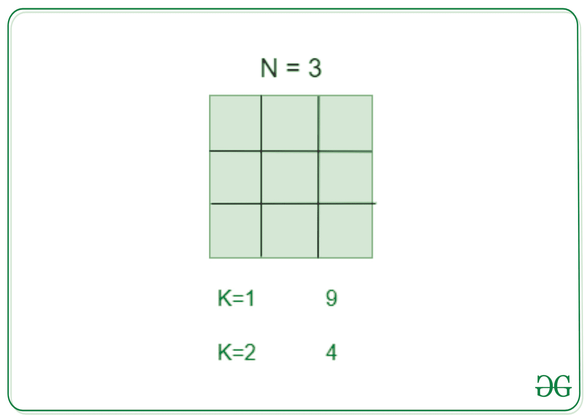
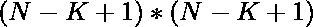

# 计算刻在 N 号正方形中的 K 号正方形

> 原文:[https://www . geesforgeks . org/count-size-k-in-a-square-size-n/](https://www.geeksforgeeks.org/count-squares-of-size-k-inscribed-in-a-square-of-size-n/)

给定两个整数 **N** 和 **K** ，任务是找出大小为 **K** 的正方形的数量，这些正方形被刻在大小为 **N** 的正方形中。

[](https://media.geeksforgeeks.org/wp-content/uploads/20200825082223/square.jpg)

**示例:**

> **输入:** N = 4，K = 2
> **输出:** 9
> **说明:**
> 一个大小为 4 的正方形内有 9 个大小为 2 的正方形。
> 
> **输入:** N = 5，K = 3
> **输出:** 9
> **说明:**
> 一个大小为 5 的正方形内有 9 个大小为 3 的正方形。

**进场:**解决问题的关键观察是一个大小为 **N** 的正方形中的正方形总数为 **(N * (N + 1)* (2*N + 1)) / 6** 。因此，从尺寸为 **N** 的正方形中可能的尺寸为 **K** 的正方形的总数为:

> 

下面是上述方法的实现:

## C++

```
// C++ implementation of the
// above approach

#include <iostream>
using namespace std;

// Function to calculate the number
// of squares of size K in a square
// of size N
int No_of_squares(int N, int K)
{
    // Stores the number of squares
    int no_of_squares = 0;

    no_of_squares
        = (N - K + 1) * (N - K + 1);

    return no_of_squares;
}

// Driver Code
int main()
{
    // Size of the
    // bigger square
    int N = 5;

    // Size of
    // smaller square
    int K = 3;
    cout << No_of_squares(N, K);
    return 0;
}
```

## Java 语言(一种计算机语言，尤用于创建网站)

```
// Java implementation of the
// above approach
import java.util.*;
class GFG{

// Function to calculate the
// number of squares of size
// K in a square of size N
static int No_of_squares(int N,
                         int K)
{
  // Stores the number
  // of squares
  int no_of_squares = 0;

  no_of_squares = (N - K + 1) *
                  (N - K + 1);

  return no_of_squares;
}

// Driver Code
public static void main(String[] args)
{
  // Size of the
  // bigger square
  int N = 5;

  // Size of
  // smaller square
  int K = 3;
  System.out.print(No_of_squares(N, K));
}
}

// This code is contributed by Princi Singh
```

## 蟒蛇 3

```
# Python3 implementation of the
# above approach

# Function to calculate the
# number of squares of size
# K in a square of size N
def No_of_squares(N, K):

    # Stores the number
    # of squares
    no_of_squares = 0;
    no_of_squares = (N - K + 1) * (N - K + 1);
    return no_of_squares;

# Driver Code
if __name__ == '__main__':

    # Size of the
    # bigger square
    N = 5;

    # Size of
    # smaller square
    K = 3;
    print(No_of_squares(N, K));

# This code is contributed by 29AjayKumar
```

## C#

```
// C# implementation of the
// above approach
using System;

class GFG{

// Function to calculate the
// number of squares of size
// K in a square of size N
static int No_of_squares(int N, int K)
{

    // Stores the number
    // of squares
    int no_of_squares = 0;

    no_of_squares = (N - K + 1) *
                    (N - K + 1);

    return no_of_squares;
}

// Driver Code
public static void Main(String[] args)
{

    // Size of the
    // bigger square
    int N = 5;

    // Size of
    // smaller square
    int K = 3;

    Console.Write(No_of_squares(N, K));
}
}

// This code is contributed by Amit Katiyar
```

## java 描述语言

```
<script>

// JavaScript program for
// the above approach

// Function to calculate the
// number of squares of size
// K in a square of size N
function No_of_squares(N, K)
{
  // Stores the number
  // of squares
  let no_of_squares = 0;

  no_of_squares = (N - K + 1) *
                  (N - K + 1);

  return no_of_squares;
}

// Driver code

    // Size of the
  // bigger square
  let N = 5;

  // Size of
  // smaller square
  let K = 3;
  document.write(No_of_squares(N, K));

  // This code is contributed by splevel62.
</script>
```

**Output:** 

```
9
```

***时间复杂度:**O(1)*
T5**辅助空间:** O(1)