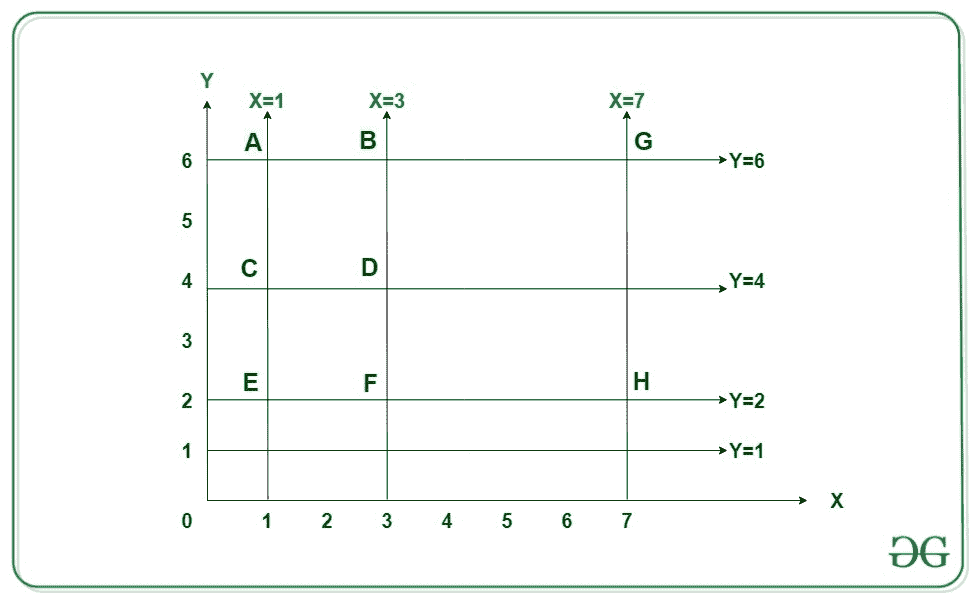

# 计算平行于轴的给定直线的唯一尺寸的平方

> 原文:[https://www . geeksforgeeks . org/count-唯一维度的平方-可能从给定的直线-平行于轴/](https://www.geeksforgeeks.org/count-squares-of-unique-dimensions-possible-from-given-straight-lines-parallel-to-the-axes/)

给定由 **N** 和 **M** 整数组成的两个[数组](https://www.geeksforgeeks.org/introduction-to-arrays/)**X【】**和**Y【】**，使得存在平行于 **y 轴**的 **N** 条直线和平行于 **x 轴**的 **M** 条直线，任务是找出具有唯一尺寸的正方形的总数，这些正方形可以从给定的[条直线生成](https://en.wikipedia.org/wiki/Line_(geometry))

> 阵列 **X[]** 中的每个整数(比如 **a** 表示具有等式 **x = a** 的线，平行于
> **y 轴**。
> 数组**中的每个整数(比如**b**)Y[]**表示具有等式 **y = b** 的线，平行于
> **x 轴**。

**示例:**

> **输入:** X[] = {1，3，7}，Y[] = {1，2，4，6}
> **输出:** 2
> **说明:**
> *3 条线与 Y 轴平行为 x = 1，x = 3 和 x = 7。*
> *4 条线平行于 x 轴为 y = 2、y = 4、y = 6 和 y = 1。*
> 
> [](https://media.geeksforgeeks.org/wp-content/cdn-uploads/20200930164106/graph1.jpg)
> 
> 从上图来看，有两种可能的独特维度的正方形是可能的:
> *1)正方形****ABDC****(x = 1，x = 3，y = 4，y = 6)，边= 2 个单位。*
> *2)正方形****BGHF****(x = 3，x = 7，y = 2，y = 6)，边= 4 个单位。*
> 
> **输入:** X[] = {2，6，7，8}，Y[] = {1，3，5，7 }
> T3】输出: 3

**天真方法:**最简单的方法是检查每个可能的垂直维度是否存在相等的水平维度。借助[地图](https://www.geeksforgeeks.org/map-associative-containers-the-c-standard-template-library-stl/)，可以降低该方法的时间复杂度。通过使用地图，我们可以得到所有不同的垂直/水平维度。
i > **时间复杂度:**O((N<sup>2</sup>)* log N)
***辅助空间:** O(N)*

**高效方法:**为了优化上述方法，思路是借助[位集](https://www.geeksforgeeks.org/c-bitset-and-its-application/)生成所有可能的维度。按照以下步骤解决此问题:

*   分别为阵列中的水平线和垂直线初始化[位组](https://www.geeksforgeeks.org/c-bitset-and-its-application/)**X[]**和 **Y[]** 。
*   设置位集中垂直线和水平线的位置。
*   维护另一个位组 **hdiff** 和 **vdiff** ，它们存储不同可能的方块尺寸。可以通过移动原始位集中的设置位来获得尺寸。
*   经过以上步骤，唯一的方块数就是 **hdiff** 和 **vdiff** 中公共元素的个数，由 **(hdiff & vdiff)计算。count()** 。

下面是上述方法的实现:

## C++

```
// C++ program for the above approach

#include <bits/stdc++.h>
using namespace std;
const int N = 100;

// Function to find the number of
// unique squares
int countSquares(int* hor, int* ver,
                 int n, int m)
{
    // Positions of the X[] and Y[]
    // are set in the bitsets hpos
    // and vpos respectively
    bitset<N> hpos, vpos;

    for (int i = 0; i < n; ++i) {
        hpos.set(hor[i]);
    }
    for (int i = 0; i < m; ++i) {
        vpos.set(ver[i]);
    }

    // Stores all possible sides of the
    // square are set in the bitsets
    // having difference hdiff & vdiff
    bitset<N> hdiff, vdiff;

    for (int i = 0; i < n; ++i) {
        hdiff = hdiff | (hpos >> hor[i]);
    }
    for (int i = 0; i < m; ++i) {
        vdiff = vdiff | (vpos >> ver[i]);
    }

    // Finding the number of square
    // sides which are common to both
    int common = (hdiff & vdiff).count();

    // Print the count of squares
    cout << common - 1;
}

// Driver Code
int main()
{
    // Given horizontal line segments
    int X[] = { 1, 3, 7 };

    // Given vertical line segments
    int Y[] = { 1, 2, 4, 6 };

    int N = (sizeof(X) / sizeof(X[0]));
    int M = (sizeof(Y) / sizeof(Y[0]));

    // Function Call
    countSquares(X, Y, N, M);

    return 0;
}
```

**Output:**

```
2

```

***时间复杂度:** O(N + M)*
***辅助空间:** O(maxE)，其中 maxE 是 X[]和 Y[]两个数组中最大的元素。*