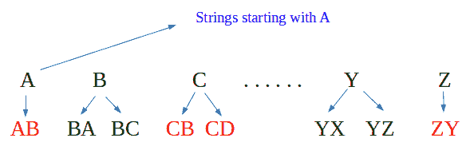
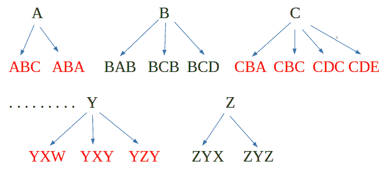
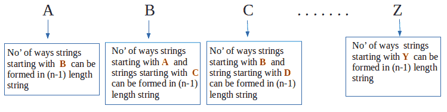

# 相邻字符相差一的字符串数

> 原文:[https://www . geesforgeks . org/count-strings-相邻-字符-差异-one/](https://www.geeksforgeeks.org/count-strings-adjacent-characters-difference-one/)

给定一个数字 n，计算长度为 n 的字符串的数量，这样每个字符串都有相邻的字符，ASCII 值之间的差值为 1。

**示例**:

```
Input :  N = 1
Output : Total strings are 26
         Explanation : For N=1, strings 
         are a, b, c,, ...., x, y, z 

Input :  N = 2
Output : Total strings are 50
         Explanation : For N = 2, strings
         are ab, ba, bc, cb, .., yx, yz, zy
```

对于以字符“A”和长度“I”开头的字符串，我们考虑长度为“i-1”且以字符“B”
开头的所有字符串对于以字符“G”和长度“I”开头的字符串，我们考虑长度为“i-1”且以字符“H”开头的所有字符串以及长度为“i-1”且以“F”开头的所有字符串。
我们取 n = 1 的基本情况，将所有 26 个字符的结果设置为 1。这仅仅意味着当考虑 1 个字符串时，a-z 中的所有字母只取一次。
为 **N = 2** ，



对于 **N = 3** ，



**结论**:对于**N = N**T4】



```
countAdjacent(n)
    dp[i][j] finally stores count of strings
             of length i and starting with 
             character j.

    Initialize dp[n+1][27] as 0
    Initialize dp[1][j] = 1 where j = 0 to 25
    for i = 2 to n
      for j = 0 to 25
         if (j = 0)
           dp[i][j] = dp[i-1][j+1];
         else
           dp[i][j] = dp[i-1][j-1] + dp[i-1][j+1];
    Sum of n-th row from 0 to 25 is the result.
```

## C++

```
// CPP Program to count strings with adjacent
// characters.
#include <bits/stdc++.h>
using namespace std;

int countStrs(int n)
{
    long int dp[n + 1][27];

    // Initializing arr[n+1][27] to 0
    memset(dp, 0, sizeof(dp));

    // Initialing 1st row all 1 from 0 to 25
    for (int i = 0; i <= 25; i++)
        dp[1][i] = 1;

    // Begin evaluating from i=2 since 1st row is set
    for (int i = 2; i <= n; i++) {
        for (int j = 0; j <= 25; j++)

            // j=0 is 'A' which can make strings
            // of length i using strings of length
            // i-1 and starting with 'B'
            if (j == 0)
                dp[i][j] = dp[i - 1][j + 1];
            else
                dp[i][j] = (dp[i - 1][j - 1] +
                            dp[i - 1][j + 1]);
    }

    // Our result is sum of last row.
    long int sum = 0;
    for (int i = 0; i <= 25; i++)
        sum = (sum + dp[n][i]);
    return sum;
}

// Driver's Code
int main()
{
    int n = 3;
    cout << "Total strings are : " << countStrs(n);
    return 0;
}
```

## Java 语言(一种计算机语言，尤用于创建网站)

```
// Java Program to count strings
// with adjacent characters.
class GFG
{

    static long countStrs(int n)
    {
        long[][] dp = new long[n + 1][27];

        // Initializing arr[n+1][27] to 0
        for (int i = 0; i < n + 1; i++)
        {
            for (int j = 0; j < 27; j++)
            {
                dp[i][j] = 0;
            }
        }

        // Initialing 1st row all 1 from 0 to 25
        for (int i = 0; i <= 25; i++)
        {
            dp[1][i] = 1;
        }

        // Begin evaluating from i=2
        // since 1st row is set
        for (int i = 2; i <= n; i++)
        {

            // j=0 is 'A' which can make strings
            for (int j = 0; j <= 25; j++) 

            // of length i using strings of length
            // i-1 and starting with 'B'
            {
                if (j == 0)
                {
                    dp[i][j] = dp[i - 1][j + 1];
                }
                else
                {
                    dp[i][j] = (dp[i - 1][j - 1]
                            + dp[i - 1][j + 1]);
                }
            }
        }

        // Our result is sum of last row.
        long sum = 0;
        for (int i = 0; i <= 25; i++)
        {
            sum = (sum + dp[n][i]);
        }
        return sum;
    }

    // Driver Code
    public static void main(String[] args)
    {
        int n = 3;
        System.out.println("Total strings are : " +
                                        countStrs(n));
    }
}

// This code is contributed by 29AjayKumar
```

## 蟒蛇 3

```
# Python3 Program to count strings with
# adjacent characters.
def countStrs(n):

    # Initializing arr[n+1][27] to 0
    dp = [[0 for j in range(27)]
             for i in range(n + 1)]

    # Initialing 1st row all 1 from 0 to 25
    for i in range(0, 26):
        dp[1][i] = 1

    # Begin evaluating from i=2 since
    # 1st row is set    
    for i in range(2, n + 1):
        for j in range(0, 26):

            # j=0 is 'A' which can make strings
            # of length i using strings of length
            # i-1 and starting with 'B'
            if(j == 0):
                dp[i][j] = dp[i - 1][j + 1];
            else:
                dp[i][j] = (dp[i - 1][j - 1] +
                            dp[i - 1][j + 1])

    # Our result is sum of last row.        
    sum = 0
    for i in range(0, 26):
        sum = sum + dp[n][i]

    return sum

# Driver's Code
if __name__ == "__main__":
    n = 3
    print("Total strings are : ", countStrs(n))

# This code is contributed by Sairahul Jella
```

## C#

```
// C# Program to count strings with 
// adjacent characters.
using System;

class GFG
{
    static long countStrs(int n)
    {
        long[,] dp = new long[n + 1, 27];

        // Initializing arr[n+1][27] to 0
        for(int i = 0; i < n + 1; i++)
            for(int j = 0; j < 27; j++)
                dp[i, j] = 0;

        // Initialing 1st row all 1 from 0 to 25
        for (int i = 0; i <= 25; i++)
            dp[1, i] = 1;

        // Begin evaluating from i=2 since 1st row is set
        for (int i = 2; i <= n; i++)
        {
            for (int j = 0; j <= 25; j++)

                // j=0 is 'A' which can make strings
                // of length i using strings of length
                // i-1 and starting with 'B'
                if (j == 0)
                    dp[i, j] = dp[i - 1, j + 1];
                else
                    dp[i, j] = (dp[i - 1, j - 1] +
                                dp[i - 1, j + 1]);
        }

        // Our result is sum of last row.
        long sum = 0;
        for (int i = 0; i <= 25; i++)
            sum = (sum + dp[n, i]);
        return sum;
    }

    // Driver Code
    static void Main()
    {
        int n = 3;
        Console.Write("Total strings are : " + countStrs(n));
    }
}

// This code is contributed by DrRoot_
```

## java 描述语言

```
<script>
// JavaScript Program to count strings
// with adjacent characters.

    function countStrs(n)
    {
        let dp = new Array(n + 1);
        // Loop to create 2D array using 1D array
        for (var i = 0; i < dp.length; i++) {
            dp[i] = new Array(2);
        }

        // Initializing arr[n+1][27] to 0
        for (let i = 0; i < n + 1; i++)
        {
            for (let j = 0; j < 27; j++)
            {
                dp[i][j] = 0;
            }
        }

        // Initialing 1st row all 1 from 0 to 25
        for (let i = 0; i <= 25; i++)
        {
            dp[1][i] = 1;
        }

        // Begin evaluating from i=2
        // since 1st row is set
        for (let i = 2; i <= n; i++)
        {

            // j=0 is 'A' which can make strings
            for (let j = 0; j <= 25; j++) 

            // of length i using strings of length
            // i-1 and starting with 'B'
            {
                if (j == 0)
                {
                    dp[i][j] = dp[i - 1][j + 1];
                }
                else
                {
                    dp[i][j] = (dp[i - 1][j - 1]
                            + dp[i - 1][j + 1]);
                }
            }
        }

        // Our result is sum of last row.
        let sum = 0;
        for (let i = 0; i <= 25; i++)
        {
            sum = (sum + dp[n][i]);
        }
        return sum;
    }

// Driver Code

    let n = 3;
    document.write("Total strings are : " +
                                        countStrs(n));

</script>
```

**输出:**

```
Total strings are : 98
```

本文由 [**舒巴姆拉纳**](https://auth.geeksforgeeks.org/profile.php?user=shubham_rana_77&list=practice) 供稿。如果你喜欢 GeeksforGeeks 并想投稿，你也可以使用[contribute.geeksforgeeks.org](http://www.contribute.geeksforgeeks.org)写一篇文章或者把你的文章邮寄到 contribute@geeksforgeeks.org。看到你的文章出现在极客博客主页上，帮助其他极客。
如果发现有不正确的地方，或者想分享更多关于上述话题的信息，请写评论。