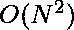

# 计数偶数和奇数元素相同的子阵列

> 原文:[https://www . geeksforgeeks . org/count-带有相同奇偶元素的子数组/](https://www.geeksforgeeks.org/count-subarrays-with-same-even-and-odd-elements/)

给定一个 N 个整数的数组，计算奇偶子数组的个数。偶数-奇数子阵列是包含相同数量的偶数和奇数整数的子阵列。
**例:**

```
Input : arr[] = {2, 5, 7, 8} 
Output : 3
Explanation : There are total 3 even-odd subarrays.
               1) {2, 5}
               2) {7, 8}
               3) {2, 5, 7, 8}

Input : arr[] = {3, 4, 6, 8, 1, 10} 
Output : 3
Explanation : In this case, 3 even-odd subarrays are:
               1) {3, 4}
               2) {8, 1}
               3) {1, 10}
```

这个问题主要是[计数 0 和 1 数量相等的子阵列的变体](https://www.geeksforgeeks.org/count-subarrays-equal-number-1s-0s/) s.
一种**天真的方法**是使用两个循环来检查所有可能的子阵列，无论它们是否是奇偶子阵列。这种方法需要时间。
一种**高效方法**解决了 O(N)时间内的问题，它基于以下思想:

*   偶-奇子阵列将总是偶数长度。
*   跟踪偶数和奇数的频率差。
*   这种频率差的散列在寻找偶-奇子阵列的数量时是有用的。

基本思想是利用奇数和偶数的频率差来获得最优解。我们将为差值的正值和负值维护两个整数散列数组。
- >更好理解的例子:
- >考虑差= freq(奇数)–freq(偶数)
- >要计算这个差，当有
一个奇数时，递增‘差’的值，当有一个偶数时，递减。(最初，差异= 0)
arr[] = {3，4，6，8，1，10}
索引 0 1 2 3 4 5 6
数组 3 4 6 8 1 10
差异 0 1 0 -1 -2 -1 -2
- >请注意，每当“差异”数组中重复出现值“k”时， 对于该值的每次先前出现存在一个
奇偶子阵列，即从
索引 i + 1 到 j 存在子阵列，其中差[i] = k 且差[j]= k。
->值“0”在索引 2 处的“差”阵列中重复，因此子阵列对于
(0，2)索引存在。 类似地，对于值“-1”(在索引 3 和 5)和“-2”(在
索引 4 和 6)的重复，子数组存在于(3，5)和(4，6)索引中。
以下是上述 **O(N)** 解决方案的实现。

## C++

```
/*C++ program to find total number of
even-odd subarrays present in given array*/
#include <bits/stdc++.h>
using namespace std;

// function that returns the count of subarrays that
// contain equal number of odd as well as even numbers
int countSubarrays(int arr[], int n)
{
    // initialize difference and answer with 0
    int difference = 0;
    int ans = 0;

    // create two auxiliary hash arrays to count frequency
    // of difference, one array for non-negative difference
    // and other array for negative difference. Size of these
    // two auxiliary arrays is 'n+1' because difference can
    // reach maximum value 'n' as well as minimum value '-n'
    int hash_positive[n + 1], hash_negative[n + 1];

    // initialize these auxiliary arrays with 0
    fill_n(hash_positive, n + 1, 0);
    fill_n(hash_negative, n + 1, 0);

    // since the difference is initially 0, we have to
    // initialize hash_positive[0] with 1
    hash_positive[0] = 1;

    // for loop to iterate through whole
    // array (zero-based indexing is used)
    for (int i = 0; i < n ; i++)
    {
        // incrementing or decrementing difference based on
        // arr[i] being even or odd, check if arr[i] is odd
        if (arr[i] & 1 == 1)
            difference++;
        else
            difference--;

        // adding hash value of 'difference' to our answer
        // as all the previous occurrences of the same
        // difference value will make even-odd subarray
        // ending at index 'i'. After that, we will increment
        // hash array for that 'difference' value for
        // its occurrence at index 'i'. if difference is
        // negative then use hash_negative
        if (difference < 0)
        {
            ans += hash_negative[-difference];
            hash_negative[-difference]++;
        }

        // else use hash_positive
        else
        {
            ans += hash_positive[difference];
            hash_positive[difference]++;
        }
    }

    // return total number of even-odd subarrays
    return ans;
}

// Driver code
int main()
{
    int arr[] = {3, 4, 6, 8, 1, 10, 5, 7};
    int n = sizeof(arr) / sizeof(arr[0]);

    // Printing total number of even-odd subarrays
    cout << "Total Number of Even-Odd subarrays"
        " are " << countSubarrays(arr,n);

    return 0;
}
```

## Java 语言(一种计算机语言，尤用于创建网站)

```
//Java program to find total
// number of even-odd subarrays
// present in given array
class GFG {

    // function that returns the
    // count of subarrays that
    // contain equal number of
    // odd as well as even numbers
    static int countSubarrays(int[] arr,
            int n) {
        // initialize difference
        // and answer with 0
        int difference = 0;
        int ans = 0;

        // create two auxiliary hash
        // arrays to count frequency
        // of difference, one array
        // for non-negative difference
        // and other array for negative
        // difference. Size of these
        // two auxiliary arrays is 'n+1'
        // because difference can
        // reach maximum value 'n' as
        // well as minimum value '-n'
        // initialize these
        // auxiliary arrays with 0
        int[] hash_positive = new int[n + 1];
        int[] hash_negative = new int[n + 1];

        // since the difference is
        // initially 0, we have to
        // initialize hash_positive[0] with 1
        hash_positive[0] = 1;

        // for loop to iterate
        // through whole array
        // (zero-based indexing is used)
        for (int i = 0; i < n; i++) {
            // incrementing or decrementing
            // difference based on
            // arr[i] being even or odd,
            // check if arr[i] is odd
            if ((arr[i] & 1) == 1) {
                difference++;
            } else {
                difference--;
            }

            // adding hash value of 'difference'
            // to our answer as all the previous
            // occurrences of the same difference
            // value will make even-odd subarray
            // ending at index 'i'. After that,
            // we will increment hash array for
            // that 'difference' value for its
            // occurrence at index 'i'. if
            // difference is negative then use
            // hash_negative
            if (difference < 0) {
                ans += hash_negative[-difference];
                hash_negative[-difference]++;
            } // else use hash_positive
            else {
                ans += hash_positive[difference];
                hash_positive[difference]++;
            }
        }

        // return total number
        // of even-odd subarrays
        return ans;
    }

    // Driver code
    public static void main(String[] args) {
        int[] arr = new int[]{3, 4, 6, 8,
            1, 10, 5, 7};
        int n = arr.length;

        // Printing total number
        // of even-odd subarrays
        System.out.println("Total Number of Even-Odd"
                + " subarrays are "
                + countSubarrays(arr, n));
    }
}

// This code is contributed by 29AjayKumar
```

## 蟒蛇 3

```
# Python3 program to find total
# number of even-odd subarrays
# present in given array

# function that returns the count
# of subarrays that contain equal
# number of odd as well as even numbers
def countSubarrays(arr, n):

    # initialize difference and
    # answer with 0
    difference = 0
    ans = 0

    # create two auxiliary hash
    # arrays to count frequency
    # of difference, one array
    # for non-negative difference
    # and other array for negative
    # difference. Size of these two
    # auxiliary arrays is 'n+1'
    # because difference can reach
    # maximum value 'n' as well as
    # minimum value '-n'
    hash_positive = [0] * (n + 1)
    hash_negative = [0] * (n + 1)

    # since the difference is
    # initially 0, we have to
    # initialize hash_positive[0] with 1
    hash_positive[0] = 1

    # for loop to iterate through
    # whole array (zero-based
    # indexing is used)
    for i in range(n):

        # incrementing or decrementing
        # difference based on arr[i]
        # being even or odd, check if
        # arr[i] is odd
        if (arr[i] & 1 == 1):
            difference = difference + 1
        else:
            difference = difference - 1

        # adding hash value of 'difference'
        # to our answer as all the previous
        # occurrences of the same difference
        # value will make even-odd subarray
        # ending at index 'i'. After that,
        # we will increment hash array for
        # that 'difference' value for
        # its occurrence at index 'i'. if
        # difference is negative then use
        # hash_negative
        if (difference < 0):
            ans += hash_negative[-difference]
            hash_negative[-difference] = hash_negative[-difference] + 1

        # else use hash_positive
        else:
            ans += hash_positive[difference]
            hash_positive[difference] = hash_positive[difference] + 1

    # return total number of
    # even-odd subarrays
    return ans

# Driver code
arr = [3, 4, 6, 8, 1, 10, 5, 7]
n = len(arr)

# Printing total number
# of even-odd subarrays
print("Total Number of Even-Odd subarrays are " +
                    str(countSubarrays(arr, n)))

# This code is contributed
# by Yatin Gupta
```

## C#

```
// C# program to find total
// number of even-odd subarrays
// present in given array
using System;

class GFG
{
    // function that returns the
    // count of subarrays that
    // contain equal number of
    // odd as well as even numbers
    static int countSubarrays(int []arr,
                              int n)
    {
        // initialize difference
        // and answer with 0
        int difference = 0;
        int ans = 0;

        // create two auxiliary hash
        // arrays to count frequency
        // of difference, one array
        // for non-negative difference
        // and other array for negative
        // difference. Size of these
        // two auxiliary arrays is 'n+1'
        // because difference can
        // reach maximum value 'n' as
        // well as minimum value '-n'
        int []hash_positive = new int[n + 1];
        int []hash_negative = new int[n + 1];

        // initialize these
        // auxiliary arrays with 0
        Array.Clear(hash_positive, 0, n + 1);
        Array.Clear(hash_negative, 0, n + 1);

        // since the difference is
        // initially 0, we have to
        // initialize hash_positive[0] with 1
        hash_positive[0] = 1;

        // for loop to iterate
        // through whole array
        // (zero-based indexing is used)
        for (int i = 0; i < n ; i++)
        {
            // incrementing or decrementing
            // difference based on
            // arr[i] being even or odd,
            // check if arr[i] is odd
            if ((arr[i] & 1) == 1)
                difference++;
            else
                difference--;

            // adding hash value of 'difference'
            // to our answer as all the previous
            // occurrences of the same difference
            // value will make even-odd subarray
            // ending at index 'i'. After that,
            // we will increment hash array for
            // that 'difference' value for its
            // occurrence at index 'i'. if
            // difference is negative then use
            // hash_negative
            if (difference < 0)
            {
                ans += hash_negative[-difference];
                hash_negative[-difference]++;
            }

            // else use hash_positive
            else
            {
                ans += hash_positive[difference];
                hash_positive[difference]++;
            }
        }

        // return total number
        // of even-odd subarrays
        return ans;
    }

    // Driver code
    static void Main()
    {
        int []arr = new int[]{3, 4, 6, 8,
                              1, 10, 5, 7};
        int n = arr.Length;

        // Printing total number
        // of even-odd subarrays
        Console.Write("Total Number of Even-Odd" +
                               " subarrays are " +
                           countSubarrays(arr,n));
    }
}

// This code is contributed by
// Manish Shaw(manishshaw1)
```

## 服务器端编程语言（Professional Hypertext Preprocessor 的缩写）

```
<?php
// PHP program to find total number of
// even-odd subarrays present in given array

// function that returns the count of subarrays
// that contain equal number of odd as well
// as even numbers
function countSubarrays(&$arr, $n)
{
    // initialize difference and
    // answer with 0
    $difference = 0;
    $ans = 0;

    // create two auxiliary hash arrays to count
    // frequency of difference, one array for
    // non-negative difference and other array
    // for negative difference. Size of these
    // two auxiliary arrays is 'n+1' because
    // difference can reach maximum value 'n'
    // as well as minimum value '-n'
    $hash_positive = array_fill(0, $n + 1, NULL);
    $hash_negative = array_fill(0, $n + 1, NULL);

    // since the difference is initially 0, we
    // have to initialize hash_positive[0] with 1
    $hash_positive[0] = 1;

    // for loop to iterate through whole
    // array (zero-based indexing is used)
    for ($i = 0; $i < $n ; $i++)
    {
        // incrementing or decrementing difference
        // based on arr[i] being even or odd, check
        // if arr[i] is odd
        if ($arr[$i] & 1 == 1)
            $difference++;
        else
            $difference--;

        // adding hash value of 'difference' to our
        // answer as all the previous occurrences of
        // the same difference value will make even-odd
        // subarray ending at index 'i'. After that, we
        // will increment hash array for that 'difference'
        // value for its occurrence at index 'i'. if
        // difference is negative then use hash_negative
        if ($difference < 0)
        {
            $ans += $hash_negative[-$difference];
            $hash_negative[-$difference]++;
        }

        // else use hash_positive
        else
        {
            $ans += $hash_positive[$difference];
            $hash_positive[$difference]++;
        }
    }

    // return total number of even-odd
    // subarrays
    return $ans;
}

// Driver code
$arr = array(3, 4, 6, 8, 1, 10, 5, 7);
$n = sizeof($arr);

// Printing total number of even-odd
// subarrays
echo "Total Number of Even-Odd subarrays".
     " are " . countSubarrays($arr, $n);

// This code is contributed by ita_c
?>
```

## java 描述语言

```
<script>
// Javascript program to find total
// number of even-odd subarrays
// present in given array

    // function that returns the
    // count of subarrays that
    // contain equal number of
    // odd as well as even numbers
    function countSubarrays(arr, n)
    {

        // initialize difference
        // and answer with 0
        let difference = 0;
        let ans = 0;

        // create two auxiliary hash
        // arrays to count frequency
        // of difference, one array
        // for non-negative difference
        // and other array for negative
        // difference. Size of these
        // two auxiliary arrays is 'n+1'
        // because difference can
        // reach maximum value 'n' as
        // well as minimum value '-n'
        // initialize these
        // auxiliary arrays with 0
        let hash_positive = new Array(n + 1);
        let hash_negative = new Array(n + 1);
        for(let i=0;i<n+1;i++)
        {
            hash_positive[i] = 0;
            hash_negative[i] = 0;

        }

        // since the difference is
        // initially 0, we have to
        // initialize hash_positive[0] with 1
        hash_positive[0] = 1;

        // for loop to iterate
        // through whole array
        // (zero-based indexing is used)
        for (let i = 0; i < n; i++)
        {

            // incrementing or decrementing
            // difference based on
            // arr[i] being even or odd,
            // check if arr[i] is odd
            if ((arr[i] & 1) == 1)
            {
                difference++;
            }
            else
            {
                difference--;
            }

            // adding hash value of 'difference'
            // to our answer as all the previous
            // occurrences of the same difference
            // value will make even-odd subarray
            // ending at index 'i'. After that,
            // we will increment hash array for
            // that 'difference' value for its
            // occurrence at index 'i'. if
            // difference is negative then use
            // hash_negative
            if (difference < 0)
            {
                ans += hash_negative[-difference];
                hash_negative[-difference]++;
            }

            // else use hash_positive
            else
            {
                ans += hash_positive[difference];
                hash_positive[difference]++;
            }
        }

        // return total number
        // of even-odd subarrays
        return ans;
    }

    // Driver code
    let arr = [3, 4, 6, 8,
            1, 10, 5, 7];
    let n = arr.length;

    // Printing total number
        // of even-odd subarrays
    document.write("Total Number of Even-Odd"
                + " subarrays are "
                + countSubarrays(arr, n));

    // This code is contributed by avanitrachhadiya2155
</script>
```

**Output:** 

```
Total Number of Even-Odd subarrays are 7
```

**时间复杂度:** O(N)，其中 N 为整数个数。
**辅助空间:** O(2N)，其中 N 为整数个数。