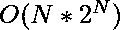
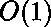

# 计数数组中具有奇数位或值的子序列

> 原文:[https://www . geesforgeks . org/count-subseries-having-bitwise-or-values in a array/](https://www.geeksforgeeks.org/count-subsequences-having-odd-bitwise-or-values-in-an-array/)

给定一个由 **N** 个正整数组成的[数组](https://www.geeksforgeeks.org/array-data-structure/) **arr[]** ，任务是从给定数组中找出[位“或”](https://www.geeksforgeeks.org/bitwise-operators-in-c-cpp/)值为奇数的[个子序列](https://www.geeksforgeeks.org/subarraysubstring-vs-subsequence-and-programs-to-generate-them/)的数量。

**示例:**

> ***输入:**arr =【2，4，1】*
> ***输出:** 4*
> ***解释:**具有奇数位 OR 值的子序列为{1}、{2，1}、{4，1}、{2，4，1}*
> 
> ***输入:**arr =【1，3，4】*
> ***输出:** 6*

**天真方法:**解决这个问题最简单的方法是[生成给定数组的所有子序列](https://www.geeksforgeeks.org/generating-all-possible-subsequences-using-recursion/)，对于每个子序列，检查其 Bitwise OR 值是否为奇数。如果是奇数，则将计数增加 1。检查所有子序列后，打印获得的计数。
***时间复杂度:*** 
***辅助空间:*** 

**有效方法:**给定的问题可以通过观察到对于具有奇数位或值的子序列，子序列的至少一个元素应该是奇数来解决。因此，子序列中至少有一个元素的最低有效位应该等于 1。按照以下步骤解决此问题:

*   将数组 arr **[]** 中出现的[偶数和奇数元素的计数分别存储在**偶数**和**奇数**变量中。](https://www.geeksforgeeks.org/count-number-even-odd-elements-array/)
*   [使用变量 **i** 遍历阵列](https://www.geeksforgeeks.org/count-number-even-odd-elements-array/)T2【A】
    *   如果**A【I】**的值为奇数，则将**奇数**的值增加 **1** 。
    *   否则，将**甚至**的值增加 **1** 。
*   具有至少一个奇数元素和任意数量的偶数元素的总组合可以由下式给出:【2^(odd 元素)–1】* 2^(even 元素)。因为至少需要一个奇数元素，所以排除了 1 的空组合集

以下是该方法的实施情况:

## C++

```
// C++ implementation for the above approach
#include <bits/stdc++.h>

using namespace std;

// Function to count the subsequences
// having odd bitwise OR value
int countSubsequences(vector<int> arr)
{
    // Stores count of odd elements
    int odd = 0;

    // Stores count of even elements
    int even = 0;

    // Traverse the array arr[]
    for (int x : arr) {

        // If element is odd
        if (x & 1)
            odd++;
        else
            even++;
    }

    // Return the final answer
    return ((1 << odd) - 1) *
              (1 << even);
}

// Driver Code
int main()
{
    // Given array arr[]
    vector<int> arr = {2, 4, 1};

    cout << countSubsequences(arr);
}
```

## Java 语言(一种计算机语言，尤用于创建网站)

```
// Java implementation for the above approach
import java.io.*;

class GFG {

      // Function to count the subsequences
    // having odd bitwise OR value
    static int countSubsequences(int arr[])
    {

        // Stores count of odd elements
        int odd = 0;

        // Stores count of even elements
        int even = 0;

        // Traverse the array arr[]
        for (int i = 0; i < arr.length; i++) {

            // If element is odd
            if ((arr[i] & 1) != 0)
                odd++;
            else
                even++;
        }

        // Return the final answer
        return ((1 << odd) - 1) *
                  (1 << even);
    }

    // Driver Code
    public static void main (String[] args) {
        // Given array arr[]
        int arr[] = {2, 4, 1};

        System.out.println(countSubsequences(arr));
    }
}

// This code is contributed by Dharanendra L V.
```

## 蟒蛇 3

```
# Python3 implementation for the above approach

# Function to count the subsequences
# having odd bitwise OR value
def countSubsequences(arr) :

    # Stores count of odd elements
    odd = 0;

    # Stores count of even elements
    even = 0;

    # Traverse the array arr[]
    for x in arr:

        # If element is odd
        if (x & 1) :
            odd += 1;
        else :
            even += 1;

    # Return the final answer
    return ((1 << odd) - 1) * (1 << even);

# Driver Code
if __name__ == "__main__" :

    # Given array arr[]
    arr = [2, 4, 1];

    print(countSubsequences(arr));

    # This code is contributed by AnkThon
```

## C#

```
// Java implementation for the above approach
using System;

class GFG {

      // Function to count the subsequences
    // having odd bitwise OR value
    static int countSubsequences(int []arr)
    {

        // Stores count of odd elements
        int odd = 0;

        // Stores count of even elements
        int even = 0;

        // Traverse the array arr[]
        for (int i = 0; i < arr.Length; i++) {

            // If element is odd
            if ((arr[i] & 1) != 0)
                odd++;
            else
                even++;
        }

        // Return the final answer
        return ((1 << odd) - 1) *
                  (1 << even);
    }

    // Driver Code
    public static void Main (String[] args) {
        // Given array arr[]
        int []arr = {2, 4, 1};

        Console.Write(countSubsequences(arr));
    }
}

// This code is contributed by shivanisinghss2110
```

## java 描述语言

```
    <script>
        // JavaScript Program to implement
        // the above approach

// Function to count the subsequences
// having odd bitwise OR value
function countSubsequences( arr)
{

    // Stores count of odd elements
    let odd = 0;

    // Stores count of even elements
    let even = 0;

    // Traverse the array arr[]
    for (let x of arr) {

        // If element is odd
        if (x & 1)
            odd++;
        else
            even++;
    }

    // Return the final answer
    return ((1 << odd) - 1) *
              (1 << even);
}

// Driver Code

    // Given array arr[]
    let arr = [2, 4, 1];

    document.write(countSubsequences(arr));

     // This code is contributed by Potta Lokesh

    </script>
```

**Output**

```
4
```

***时间复杂度:*** 
***辅助空间:*** 