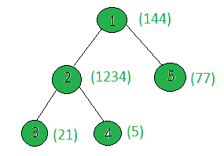

# 统计给定树中权重位数之和为奇数的节点

> 原文:[https://www . geeksforgeeks . org/count-给定树中权重位数之和为奇数的节点/](https://www.geeksforgeeks.org/count-the-nodes-in-the-given-tree-whose-sum-of-digits-of-weight-is-odd/)

给定一棵树和所有节点的权重，任务是计算权重位数之和为奇数的节点数。
**例:**

> **输入:**
> 
> 
> 
> **输出:** 3
> 节点 1: digitSum(144) = 1 + 4 + 4 = 9
> 节点 2: digitSum(1234) = 1 + 2 + 3 + 4 = 10
> 节点 3: digitSum(21) = 2 + 1 = 3
> 节点 4: digitSum(5) = 5
> 节点 5: digitSum(77) = 7 + 7 = 14
> 只有节点 1、3 权重的位数之和

**方法:**对树执行 [dfs](https://www.geeksforgeeks.org/depth-first-traversal-for-a-graph/) ，对于每个节点，检查其权重的位数之和是否为奇数。如果是，则增加计数。
以下是上述方法的实施:

## C++

```
// C++ implementation of the approach
#include <bits/stdc++.h>
using namespace std;

int ans = 0;

vector<int> graph[100];
vector<int> weight(100);

// Function to return the
// sum of the digits of n
int digitSum(int n)
{
    int sum = 0;
    while (n) {
        sum += n % 10;
        n = n / 10;
    }
    return sum;
}

// Function to perform dfs
void dfs(int node, int parent)
{
    // If sum of the digits of current node's
    // weight is odd then increment ans
    int sum = digitSum(weight[node]);
    if (sum % 2 == 1)
        ans += 1;

    for (int to : graph[node]) {
        if (to == parent)
            continue;
        dfs(to, node);
    }
}

// Driver code
int main()
{

    // Weights of the node
    weight[1] = 144;
    weight[2] = 1234;
    weight[3] = 21;
    weight[4] = 5;
    weight[5] = 77;

    // Edges of the tree
    graph[1].push_back(2);
    graph[2].push_back(3);
    graph[2].push_back(4);
    graph[1].push_back(5);

    dfs(1, 1);

    cout << ans;

    return 0;
}
```

## Java 语言(一种计算机语言，尤用于创建网站)

```
// Java implementation of the approach
import java.util.*;

class GFG
{
    static int ans = 0;

    static Vector<Integer>[] graph = new Vector[100];
    static Integer[] weight = new Integer[100];

    // Function to return the
    // sum of the digits of n
    static int digitSum(int n)
    {
        int sum = 0;
        while (n > 0)
        {
            sum += n % 10;
            n = n / 10;
        }
        return sum;
    }

    // Function to perform dfs
    static void dfs(int node, int parent)
    {

        // If sum of the digits of current node's
        // weight is odd then increment ans
        int sum = digitSum(weight[node]);
        if (sum % 2 == 1)
            ans += 1;

        for (int to : graph[node])
        {
            if (to == parent)
                continue;
            dfs(to, node);
        }
    }

    // Driver code
    public static void main(String[] args)
    {
        for (int i = 0; i < 100; i++)
            graph[i] = new Vector<Integer>();

        // Weights of the node
        weight[1] = 144;
        weight[2] = 1234;
        weight[3] = 21;
        weight[4] = 5;
        weight[5] = 77;

        // Edges of the tree
        graph[1].add(2);
        graph[2].add(3);
        graph[2].add(4);
        graph[1].add(5);

        dfs(1, 1);

        System.out.print(ans);
    }
}

// This code is contributed by Rajput-Ji
```

## 蟒蛇 3

```
# Python3 implementation of the approach
ans = 0

graph = [[] for i in range(100)]
weight = [0] * 100

# Function to return the
# sum of the digits of n
def digitSum(n):
    sum = 0
    while (n):
        sum += n % 10
        n = n // 10
    return sum

# Function to perform dfs
def dfs(node, parent):
    global ans

    # If sum of the digits of current node's
    # weight is odd then increment ans
    sum = digitSum(weight[node])
    if (sum % 2 == 1):
        ans += 1

    for to in graph[node]:
        if (to == parent):
            continue
        dfs(to, node)

# Driver code

# Weights of the node
weight[1] = 144
weight[2] = 1234
weight[3] = 21
weight[4] = 5
weight[5] = 77

# Edges of the tree
graph[1].append(2)
graph[2].append(3)
graph[2].append(4)
graph[1].append(5)

dfs(1, 1)
print(ans)

# This code is contributed by SHUBHAMSINGH10
```

## C#

```
// C# implementation of the approach
using System;
using System.Collections.Generic;

class GFG
{
    static int ans = 0;

    static List<int>[] graph = new List<int>[100];
    static int[] weight = new int[100];

    // Function to return the
    // sum of the digits of n
    static int digitSum(int n)
    {
        int sum = 0;
        while (n > 0)
        {
            sum += n % 10;
            n = n / 10;
        }
        return sum;
    }

    // Function to perform dfs
    static void dfs(int node, int parent)
    {

        // If sum of the digits of current node's
        // weight is odd then increment ans
        int sum = digitSum(weight[node]);
        if (sum % 2 == 1)
            ans += 1;

        foreach (int to in graph[node])
        {
            if (to == parent)
                continue;
            dfs(to, node);
        }
    }

    // Driver code
    public static void Main(String[] args)
    {
        for (int i = 0; i < 100; i++)
            graph[i] = new List<int>();

        // Weights of the node
        weight[1] = 144;
        weight[2] = 1234;
        weight[3] = 21;
        weight[4] = 5;
        weight[5] = 77;

        // Edges of the tree
        graph[1].Add(2);
        graph[2].Add(3);
        graph[2].Add(4);
        graph[1].Add(5);

        dfs(1, 1);

        Console.Write(ans);
    }
}

// This code is contributed by PrinciRaj1992
```

## java 描述语言

```
<script>

// JavaScript implementation of the approach
var ans = 0;
var graph = Array.from(Array(100), ()=>Array());
var weight = Array(100);
// Function to return the
// sum of the digits of n
function digitSum(n)
{
    var sum = 0;
    while (n > 0)
    {
        sum += n % 10;
        n = parseInt( n / 10);
    }
    return sum;
}
// Function to perform dfs
function dfs(node, parent)
{

    // If sum of the digits of current node's
    // weight is odd then increment ans
    var sum = digitSum(weight[node]);
    if (sum % 2 == 1)
        ans += 1;
    for(var to of graph[node])
    {
        if (to == parent)
            continue;
        dfs(to, node);
    }
}
// Driver code
for (var i = 0; i < 100; i++)
    graph[i] = [];

// Weights of the node
weight[1] = 144;
weight[2] = 1234;
weight[3] = 21;
weight[4] = 5;
weight[5] = 77;
// Edges of the tree
graph[1].push(2);
graph[2].push(3);
graph[2].push(4);
graph[1].push(5);
dfs(1, 1);
document.write(ans);

</script>
```

**Output:** 

```
3
```

**<u>复杂度分析:</u>**

*   **时间复杂度:** O(N)。
    在 dfs 中，树的每个节点都被处理一次，因此对于树中的 N 个节点，由于 DFS 而导致的复杂性是 O(N)。因此，时间复杂度为 O(N)。
*   **辅助空间:** O(1)。
    不需要任何额外的空间，所以空间复杂度不变。