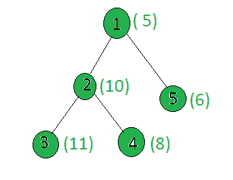

# 统计给定树中权重为 2 的幂的节点

> 原文:[https://www . geeksforgeeks . org/给定树中的节点数，其权重为 2 的幂/](https://www.geeksforgeeks.org/count-the-nodes-in-the-given-tree-whose-weight-is-a-power-of-two/)

给定一棵树和所有节点的权重，任务是计算权重为 2 的幂的节点数。
**例:**

> **输入:**
> 
> 
> 
> **输出:** 1
> 只有节点 4 的重量是 2 的幂。

**方法:**对树执行 [dfs](https://www.geeksforgeeks.org/depth-first-traversal-for-a-graph/) ，对于每个节点，检查其权重是否为 2 的幂，如果是，则增加计数。
以下是上述方法的实施:

## C++

```
// C++ implementation of the approach
#include <bits/stdc++.h>
using namespace std;

int ans = 0;

vector<int> graph[100];
vector<int> weight(100);

// Function to perform dfs
void dfs(int node, int parent)
{
    // If weight of the current node
    // is a power of 2
    int x = weight[node];
    if (x && (!(x & (x - 1))))
        ans += 1;

    for (int to : graph[node]) {
        if (to == parent)
            continue;
        dfs(to, node);
    }
}

// Driver code
int main()
{

    // Weights of the node
    weight[1] = 5;
    weight[2] = 10;
    weight[3] = 11;
    weight[4] = 8;
    weight[5] = 6;

    // Edges of the tree
    graph[1].push_back(2);
    graph[2].push_back(3);
    graph[2].push_back(4);
    graph[1].push_back(5);

    dfs(1, 1);

    cout << ans;

    return 0;
}
```

## Java 语言(一种计算机语言，尤用于创建网站)

```
// Java implementation of the approach
import java.util.*;

class GFG
{

    static int ans = 0;

    @SuppressWarnings("unchecked")
    static Vector<Integer>[] graph = new Vector[100];
    static int[] weight = new int[100];

    // Function to perform dfs
    static void dfs(int node, int parent)
    {
        // If weight of the current node
        // is a power of 2
        int x = weight[node];
        if (x != 0 && (x & (x - 1)) == 0)
            ans += 1;

        for (int to : graph[node])
        {
            if (to == parent)
                continue;
            dfs(to, node);
        }
    }

    // Driver Code
    public static void main(String[] args)
    {
        for (int i = 0; i < 100; i++)
            graph[i] = new Vector<>();

        // Weights of the node
        weight[1] = 5;
        weight[2] = 10;
        weight[3] = 11;
        weight[4] = 8;
        weight[5] = 6;

        // Edges of the tree
        graph[1].add(2);
        graph[2].add(3);
        graph[2].add(4);
        graph[1].add(5);

        dfs(1, 1);

        System.out.println(ans);
    }
}

// This code is contributed by
// sanjeev2552
```

## C#

```
// C# implementation of the approach
using System;
using System.Collections.Generic;

class GFG
{

static int ans = 0;
static List<List<int>> graph = new List<List<int>>();
static List<int> weight = new List<int>();

// Function to perform dfs
static void dfs(int node, int parent)
{

    // If weight of the current node
    // is a power of 2
    int x = weight[node];
    bool result = Convert.ToBoolean((x & (x - 1)));
    bool result1 = Convert.ToBoolean(x);
    if (result1 && (!result))
        ans += 1;

    for (int i = 0; i < graph[node].Count; i++)
    {
        if (graph[node][i] == parent)
            continue;
        dfs(graph[node][i], node);
    }
}

// Driver code
public static void Main(String []args)
{
    // Weights of the node
    weight.Add(0);
    weight.Add(5);
    weight.Add(10);;
    weight.Add(11);;
    weight.Add(8);
    weight.Add(6);

    for(int i = 0; i < 100; i++)
    graph.Add(new List<int>());

    // Edges of the tree
    graph[1].Add(2);
    graph[2].Add(3);
    graph[2].Add(4);
    graph[1].Add(5);

    dfs(1, 1);

    Console.WriteLine(ans);
}
}

// This code is contributed by shubhamsingh10
```

## 蟒蛇 3

```
# Python3 implementation of the approach
ans = 0

graph = [[] for i in range(100)]
weight = [0]*100

# Function to perform dfs
def dfs(node, parent):
    global mini, graph, weight, ans

    # If weight of the current node
    # is a power of 2
    x = weight[node]
    if (x and (not (x & (x - 1)))):
        ans += 1
    for to in graph[node]:
        if (to == parent):
            continue
        dfs(to, node)

        # Calculating the weighted
        # sum of the subtree
        weight[node] += weight[to]

# Driver code

# Weights of the node
weight[1] = 5
weight[2] = 10
weight[3] = 11
weight[4] = 8
weight[5] = 6

# Edges of the tree
graph[1].append(2)
graph[2].append(3)
graph[2].append(4)
graph[1].append(5)

dfs(1, 1)
print(ans)

# This code is contributed by SHUBHAMSINGH10
```

## java 描述语言

```
<script>

// Javascript implementation of the approach

let ans = 0;

let graph = new Array(100);
let weight = new Array(100);
for(let i = 0; i < 100; i++)
{
    graph[i] = [];
    weight[i] = 0;
}

// Function to perform dfs
function dfs(node, parent)
{
    // If weight of the current node
    // is a power of 2
    let x = weight[node];
    if (x && (!(x & (x - 1))))
        ans += 1;

    for(let to=0;to<graph[node].length;to++) {
        if(graph[node][to] == parent)
            continue
        dfs(graph[node][to], node); 
    }
}

// Driver code
    // Weights of the node
    weight[1] = 5;
    weight[2] = 10;
    weight[3] = 11;
    weight[4] = 8;
    weight[5] = 6;

    // Edges of the tree
    graph[1].push(2);
    graph[2].push(3);
    graph[2].push(4);
    graph[1].push(5);

    dfs(1, 1);

    document.write(ans);

    // This code is contributed by Dharanendra L V.

</script>
```

**Output:** 

```
1
```

**复杂度分析:**

*   **时间复杂度:** O(N)。
    在 DFS 中，树的每个节点都被处理一次，因此对于树中的 N 个节点，由于 DFS 而导致的复杂性是 O(N)。因此，时间复杂度为 O(N)。
*   **辅助空间:** O(1)。
    不需要任何额外的空间，所以空间复杂度不变。