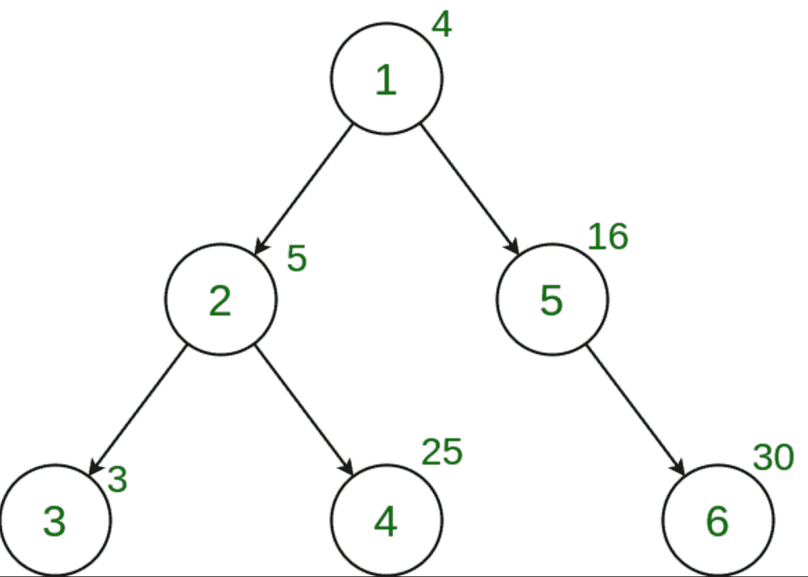

# 计算给定树中权重为一个强大数字的节点数

> 原文:[https://www . geeksforgeeks . org/计算给定树中的节点数，其权重是一个强大的数字/](https://www.geeksforgeeks.org/count-the-nodes-in-the-given-tree-whose-weight-is-a-powerful-number/)

给定**一棵树**，以及所有节点的**权重，任务是计算权重为[强子数](https://www.geeksforgeeks.org/powerful-number/)的节点数。**

> 如果一个数 n 的每一个质因数 p，p <sup>2</sup> 也对其进行除法运算，那么这个数 n 就被称为**强数**。

**示例:**

> **输入:**
> 
> 
> 
> **输出:** 3
> **说明:**
> 4、16、25 为树中强力砝码。

**方法:**为了解决上面提到的问题，我们必须在树上执行[深度优先搜索(DFS)](https://www.geeksforgeeks.org/depth-first-search-or-dfs-for-a-graph/) ，对于每个节点，检查它的权重是否是一个强大的数字。如果是，则增加计数。
以下是上述办法的实施情况:

## C++

```
// C++ implementation to Count the nodes in the
// given tree whose weight is a powerful number

#include <bits/stdc++.h>
using namespace std;

int ans = 0;
vector<int> graph[100];
vector<int> weight(100);

// Function to check if the number is powerful
bool isPowerful(int n)
{
    // First divide the number repeatedly by 2
    while (n % 2 == 0) {
        int power = 0;
        while (n % 2 == 0) {
            n /= 2;
            power++;
        }

        // Check if only 2^1 divides n,
        // then return false
        if (power == 1)
            return false;
   }

    // Check if n is not a power of 2
    // then this loop will execute
    for (int factor = 3; factor <= sqrt(n); factor += 2) {

        // Find highest power of "factor"
        // that divides n
        int power = 0;

        while (n % factor == 0) {
            n = n / factor;
            power++;
        }

        // Check if only factor^1 divides n,
        // then return false
        if (power == 1)
            return false;
    }

    // n must be 1 now
    // if it is not a prime number.
    // Since prime numbers are not powerful,
    // we return false if n is not 1.
    return (n == 1);
}

// Function to perform dfs
void dfs(int node, int parent)
{

    // Check if weight of the current node
    // is a powerful number
    if (isPowerful(weight[node]))
        ans += 1;

    for (int to : graph[node]) {
        if (to == parent)
            continue;
        dfs(to, node);
    }
}

// Driver code
int main()
{

    // Weights of the node
    weight[1] = 5;
    weight[2] = 10;
    weight[3] = 11;
    weight[4] = 8;
    weight[5] = 6;

    // Edges of the tree
    graph[1].push_back(2);
    graph[2].push_back(3);
    graph[2].push_back(4);
    graph[1].push_back(5);

    dfs(1, 1);
    cout << ans;

    return 0;
}
```

## Java 语言(一种计算机语言，尤用于创建网站)

```
//Java implementation to Count the nodes in the
//given tree whose weight is a powerful number

import java.util.*;

class GFG {

static int ans = 0;
static Vector<Integer>[] graph = new Vector[100];
static int[] weight = new int[100];

// Function to check if the number is powerful
static boolean isPowerful(int n) {

    // First divide the number repeatedly by 2
    while (n % 2 == 0) {
        int power = 0;
        while (n % 2 == 0) {
            n /= 2;
            power++;
        }

        // Check if only 2^1 divides n,
        // then return false
        if (power == 1)
            return false;
        }

    // Check if n is not a power of 2
    // then this loop will execute
    for (int factor = 3; factor <= Math.sqrt(n); factor += 2) {

        // Find highest power of "factor"
        // that divides n
        int power = 0;

        while (n % factor == 0) {
            n = n / factor;
            power++;
        }

        // Check if only factor^1 divides n,
        // then return false
        if (power == 1)
            return false;
    }

    // n must be 1 now
    // if it is not a prime number.
    // Since prime numbers are not powerful,
    // we return false if n is not 1.
    return (n == 1);
}

// Function to perform dfs
static void dfs(int node, int parent) {

    // Check if weight of the current node
    // is a powerful number
    if (isPowerful(weight[node]))
        ans += 1;

    for (int to : graph[node]) {
         if (to == parent)
         continue;
         dfs(to, node);
    }
}

// Driver code
public static void main(String[] args) {

    for (int i = 0; i < graph.length; i++)
         graph[i] = new Vector<Integer>();

    // Weights of the node
    weight[1] = 5;
    weight[2] = 10;
    weight[3] = 11;
    weight[4] = 8;
    weight[5] = 6;

    // Edges of the tree
    graph[1].add(2);
    graph[2].add(3);
    graph[2].add(4);
    graph[1].add(5);

    dfs(1, 1);
    System.out.print(ans);

}
}

// This code is contributed by Princi Singh
```

## 蟒蛇 3

```
# Python3 implementation to
# Count the Nodes in the given
# tree whose weight is a powerful
# number
graph = [[] for i in range(100)]
weight = [0] * 100
ans = 0

# Function to check if the
# number is powerful
def isPowerful(n):

    # First divide the number
    # repeatedly by 2
    while (n % 2 == 0):
        power = 0;
        while (n % 2 == 0):
            n /= 2;
            power += 1;

        # Check if only 2^1
        # divides n, then
        # return False
        if (power == 1):
            return False;

    # Check if n is not a
    # power of 2 then this
    # loop will execute
    factor = 3

    while(factor *factor <=n):

        # Find highest power of
        # "factor" that divides n
        power = 0;

        while (n % factor == 0):
            n = n / factor;
            power += 1;

        # Check if only factor^1
        # divides n, then return
        # False
        if (power == 1):
            return False;
        factor +=2;

    # n must be 1 now
    # if it is not a prime
    # number. Since prime
    # numbers are not powerful,
    # we return False if n is
    # not 1.
    return (n == 1);

# Function to perform dfs
def dfs(Node, parent):

    # Check if weight of
    # the current Node
    # is a powerful number
    global ans;

    if (isPowerful(weight[Node])):
        ans += 1;

    for to in graph[Node]:
        if (to == parent):
            continue;
        dfs(to, Node);

# Driver code
if __name__ == '__main__':

    # Weights of the Node
    weight[1] = 5;
    weight[2] = 10;
    weight[3] = 11;
    weight[4] = 8;
    weight[5] = 6;

    # Edges of the tree
    graph[1].append(2);
    graph[2].append(3);
    graph[2].append(4);
    graph[1].append(5);

    dfs(1, 1);
    print(ans);

# This code is contributed by 29AjayKumar
```

## C#

```
// C# implementation to count the
// nodes in thegiven tree whose weight
// is a powerful number
using System;
using System.Collections.Generic;

class GFG{

static int ans = 0;
static List<int>[] graph = new List<int>[100];
static int[] weight = new int[100];

// Function to check if the number
// is powerful
static bool isPowerful(int n)
{

    // First divide the number
    // repeatedly by 2
    while (n % 2 == 0)
    {
        int power = 0;
        while (n % 2 == 0)
        {
            n /= 2;
            power++;
        }

        // Check if only 2^1 divides n,
        // then return false
        if (power == 1)
            return false;
    }

    // Check if n is not a power of 2
    // then this loop will execute
    for(int factor = 3;
            factor <= Math.Sqrt(n);
            factor += 2)
    {

       // Find highest power of "factor"
       // that divides n
       int power = 0;

       while (n % factor == 0)
       {
           n = n / factor;
           power++;
       }

       // Check if only factor^1 divides n,
       // then return false
       if (power == 1)
           return false;
    }

    // n must be 1 now
    // if it is not a prime number.
    // Since prime numbers are not powerful,
    // we return false if n is not 1.
    return (n == 1);
}

// Function to perform dfs
static void dfs(int node, int parent)
{

    // Check if weight of the current node
    // is a powerful number
    if (isPowerful(weight[node]))
        ans += 1;

    foreach (int to in graph[node])
    {
        if (to == parent)
            continue;
        dfs(to, node);
    }
}

// Driver code
public static void Main(String[] args)
{
    for(int i = 0; i < graph.Length; i++)
       graph[i] = new List<int>();

    // Weights of the node
    weight[1] = 5;
    weight[2] = 10;
    weight[3] = 11;
    weight[4] = 8;
    weight[5] = 6;

    // Edges of the tree
    graph[1].Add(2);
    graph[2].Add(3);
    graph[2].Add(4);
    graph[1].Add(5);

    dfs(1, 1);
    Console.Write(ans);
}
}

// This code is contributed by amal kumar choubey
```

## java 描述语言

```
<script>

// Javascript implementation to Count the nodes in the
// given tree whose weight is a powerful number

var ans = 0;
var graph = Array.from(Array(100), ()=>Array());
var weight = Array.from(Array(100), ()=>Array());

// Function to check if the number is powerful
function isPowerful(n)
{
    // First divide the number repeatedly by 2
    while (n % 2 == 0) {
        var power = 0;
        while (n % 2 == 0) {
            n /= 2;
            power++;
        }

        // Check if only 2^1 divides n,
        // then return false
        if (power == 1)
            return false;
   }

    // Check if n is not a power of 2
    // then this loop will execute
    for (var factor = 3; factor <= Math.sqrt(n); factor += 2) {

        // Find highest power of "factor"
        // that divides n
        var power = 0;

        while (n % factor == 0) {
            n = n / factor;
            power++;
        }

        // Check if only factor^1 divides n,
        // then return false
        if (power == 1)
            return false;
    }

    // n must be 1 now
    // if it is not a prime number.
    // Since prime numbers are not powerful,
    // we return false if n is not 1.
    return (n == 1);
}

// Function to perform dfs
function dfs(node, parent)
{

    // Check if weight of the current node
    // is a powerful number
    if (isPowerful(weight[node]))
        ans += 1;
    graph[node].forEach(to => {

        if (to != parent)
            dfs(to, node);
    });
}

// Driver code
// Weights of the node
weight[1] = 5;
weight[2] = 10;
weight[3] = 11;
weight[4] = 8;
weight[5] = 6;
// Edges of the tree
graph[1].push(2);
graph[2].push(3);
graph[2].push(4);
graph[1].push(5);
dfs(1, 1);
document.write( ans);

</script>
```

**Output:** 

```
1
```

**<u>复杂度分析:</u>**

**时间复杂度:** O(N*logV)，其中 V 是树中节点的最大权重

在 dfs 中，树的每个节点都被处理一次，因此如果树中总共有 N 个节点，由于 dfs 而导致的复杂性是 O(N)。此外，在处理每个节点时，为了检查节点值是否是一个强大的数字，调用了 isPowerful(V)函数，其中 V 是节点的权重，该函数的复杂度为 O(logV)，因此对于每个节点，都增加了 O(logV)的复杂度。因此，时间复杂度为 O(N*logV)。

**辅助空间:** O(1)。

不需要任何额外的空间，因此空间复杂度是恒定的。