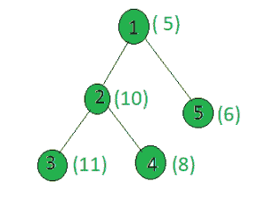

# 统计给定树中权重为偶数的节点

> 原文:[https://www . geeksforgeeks . org/计算给定树中权重为偶数的节点数/](https://www.geeksforgeeks.org/count-the-nodes-in-the-given-tree-whose-weight-is-even/)

给定一棵树和所有节点的权重，任务是计算权重为偶数的节点数。
**例:**

> **输入:**
> 
> 
> 
> **输出:** 3
> 只有节点 2、4、5 的权重是偶数。

**方法:**在树上执行 [dfs](https://www.geeksforgeeks.org/depth-first-traversal-for-a-graph/) ，对于每个节点，检查它的权重是否能被 2 整除。如果是，则递增计数。
以下是上述方法的实施:

## C++

```
// C++ implementation of the approach
#include <bits/stdc++.h>
using namespace std;

int ans = 0;

vector<int> graph[100];
vector<int> weight(100);

// Function to perform dfs
void dfs(int node, int parent)
{
    // If weight of the current node is even
    if (weight[node] % 2 == 0)
        ans += 1;

    for (int to : graph[node]) {
        if (to == parent)
            continue;
        dfs(to, node);
    }
}

// Driver code
int main()
{
    int x = 15;

    // Weights of the node
    weight[1] = 5;
    weight[2] = 10;
    weight[3] = 11;
    weight[4] = 8;
    weight[5] = 6;

    // Edges of the tree
    graph[1].push_back(2);
    graph[2].push_back(3);
    graph[2].push_back(4);
    graph[1].push_back(5);

    dfs(1, 1);

    cout << ans;

    return 0;
}
```

## Java 语言(一种计算机语言，尤用于创建网站)

```
// Java implementation of the approach
import java.util.*;

class GFG
{
    static int ans = 0;

    @SuppressWarnings("unchecked")
    static Vector<Integer>[] graph = new Vector[100];
    static int[] weight = new int[100];

    // Function to perform dfs
    static void dfs(int node, int parent)
    {
        // If weight of the current node is even
        if (weight[node] % 2 == 0)
            ans += 1;

        for (int to : graph[node])
        {
            if (to == parent)
                continue;
            dfs(to, node);
        }
    }

    // Driver code
    public static void main(String[] args)
    {
        int x = 15;

    for (int i = 0; i < 100; i++)
            graph[i] = new Vector<>();

        // Weights of the node
        weight[1] = 5;
        weight[2] = 10;
        weight[3] = 11;
        weight[4] = 8;
        weight[5] = 6;

        // Edges of the tree
        graph[1].add(2);
        graph[2].add(3);
        graph[2].add(4);
        graph[1].add(5);

        dfs(1, 1);

        System.out.println(ans);
    }
}

// This code is contributed by shubhamsingh10
```

## 蟒蛇 3

```
# Python3 implementation of the approach
ans = 0

graph = [[] for i in range(100)]
weight = [0] * 100

# Function to perform dfs
def dfs(node, parent):
    global ans

    # If weight of the current node is even
    if (weight[node] % 2 == 0):
        ans += 1

    for to in graph[node]:
        if (to == parent):
            continue
        dfs(to, node)

# Driver code
x = 15

# Weights of the node
weight[1] = 5
weight[2] = 10
weight[3] = 11
weight[4] = 8
weight[5] = 6

# Edges of the tree
graph[1].append(2)
graph[2].append(3)
graph[2].append(4)
graph[1].append(5)

dfs(1, 1)
print(ans)

# This code is contributed by SHUBHAMSINGH10
```

## C#

```
// C# implementation of the approach
using System;
using System.Collections.Generic;

class GFG
{
    static int ans = 0;
    static List<int>[] graph = new List<int>[100];
    static int[] weight = new int[100];

    // Function to perform dfs
    static void dfs(int node, int parent)
    {
        // If weight of the current node is even
        if (weight[node] % 2 == 0)
            ans += 1;

        foreach (int to in graph[node])
        {
            if (to == parent)
                continue;
            dfs(to, node);
        }
    }

    // Driver code
    public static void Main(String[] args)
    {     
        for (int i = 0; i < 100; i++)
            graph[i] = new List<int>();

        // Weights of the node
        weight[1] = 5;
        weight[2] = 10;
        weight[3] = 11;
        weight[4] = 8;
        weight[5] = 6;

        // Edges of the tree
        graph[1].Add(2);
        graph[2].Add(3);
        graph[2].Add(4);
        graph[1].Add(5);

        dfs(1, 1);

        Console.WriteLine(ans);
    }
}

// This code is contributed by Rajput-Ji
```

## java 描述语言

```
<script>
// Javascript implementation of the approach
    let ans = 0;
    let graph = new Array(100);
    let weight = new Array(100);
    for(let i = 0; i < 100; i++)
    {
        graph[i] = [];
        weight[i] = 0;
    }

    // Function to perform dfs
    function dfs(node, parent)
    {

        // If weight of the current node is even
        if (weight[node] % 2 == 0)
        {
            ans += 1;
        }

        for (let to=0;to<graph[node].length ;to++)
        {

            if (graph[node][to] == parent)
               {
                continue;
            }
            dfs(graph[node][to], node);
        }
    }

    // Driver code
    let x = 15;

    // Weights of the node
        weight[1] = 5;
        weight[2] = 10;
        weight[3] = 11;
        weight[4] = 8;
        weight[5] = 6;

        // Edges of the tree
        graph[1].push(2);
        graph[2].push(3);
        graph[2].push(4);
        graph[1].push(5);
        dfs(1, 1);
        document.write(ans);

    // This code is contributed by unknown2108
</script>
```

**Output:** 

```
3
```

**<u>复杂度分析:</u>**

*   **时间复杂度:** O(N)。
    在 dfs 中，树的每个节点都被处理一次，因此如果树中总共有 N 个节点，由于 dfs 而导致的复杂性是 O(N)。因此，时间复杂度为 O(N)。
*   **辅助空间:** O(1)。
    不需要任何额外的空间，所以空间复杂度不变。