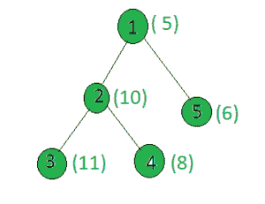

# 统计给定树中权重为质数的节点

> 原文:[https://www . geeksforgeeks . org/count-给定树中权重为质数的节点数/](https://www.geeksforgeeks.org/count-the-nodes-in-the-given-tree-whose-weight-is-prime/)

给定一棵树和所有节点的权重，任务是计算权重为质数的节点数。
**例:**

> **输入:**
> 
> 
> 
> **输出:** 2
> 只有节点 1 和 3 的权重是质数。

**方法:**在树上执行 [dfs](https://www.geeksforgeeks.org/depth-first-traversal-for-a-graph/) ，对于每个节点，检查它的权重是否为质数。
以下是上述方法的实施:

## C++

```
// C++ implementation of the approach
#include <bits/stdc++.h>
using namespace std;

int ans = 0;

vector<int> graph[100];
vector<int> weight(100);

// Function that returns true
// if n is prime
bool isprime(int n)
{
    for (int i = 2; i * i <= n; i++)
        if (n % i == 0)
            return false;
    return true;
}

// Function to perform dfs
void dfs(int node, int parent)
{
    // If weight of node is prime or not
    if (isprime(weight[node]))
        ans += 1;

    for (int to : graph[node]) {
        if (to == parent)
            continue;
        dfs(to, node);
    }
}

// Driver code
int main()
{
    // Weights of the node
    weight[1] = 5;
    weight[2] = 10;
    weight[3] = 11;
    weight[4] = 8;
    weight[5] = 6;

    // Edges of the tree
    graph[1].push_back(2);
    graph[2].push_back(3);
    graph[2].push_back(4);
    graph[1].push_back(5);

    dfs(1, 1);

    cout << ans;

    return 0;
}
```

## Java 语言(一种计算机语言，尤用于创建网站)

```
// Java implementation of the approach
import java.util.*;

class GFG{

static int ans = 0;

static Vector<Integer>[] graph = new Vector[100];
static int[] weight = new int[100];

// Function that returns true
// if n is prime
static boolean isprime(int n)
{
    for (int i = 2; i * i <= n; i++)
        if (n % i == 0)
            return false;
    return true;
}

// Function to perform dfs
static void dfs(int node, int parent)
{
    // If weight of node is prime or not
    if (isprime(weight[node]))
        ans += 1;

    for (int to : graph[node]) {
        if (to == parent)
            continue;
        dfs(to, node);
    }
}

// Driver code
public static void main(String[] args)
{
    for (int i = 0; i < 100; i++)
        graph[i] = new Vector<>();

    // Weights of the node
    weight[1] = 5;
    weight[2] = 10;
    weight[3] = 11;
    weight[4] = 8;
    weight[5] = 6;

    // Edges of the tree
    graph[1].add(2);
    graph[2].add(3);
    graph[2].add(4);
    graph[1].add(5);

    dfs(1, 1);

    System.out.print(ans);
}
}

// This code is contributed by Rajput-Ji
```

## 蟒蛇 3

```
# Python3 implementation of the approach
ans = 0

graph = [[] for i in range(100)]
weight = [0] * 100

# Function that returns true
# if n is prime
def isprime(n):
    i = 2
    while(i * i <= n):
        if (n % i == 0):
            return False
        i += 1
    return True

# Function to perform dfs
def dfs(node, parent):
    global ans

    # If weight of the current node is even
    if (isprime(weight[node])):
        ans += 1;

    for to in graph[node]:
        if (to == parent):
            continue
        dfs(to, node)

# Driver code

# Weights of the node
weight[1] = 5
weight[2] = 10
weight[3] = 11
weight[4] = 8
weight[5] = 6

# Edges of the tree
graph[1].append(2)
graph[2].append(3)
graph[2].append(4)
graph[1].append(5)

dfs(1, 1)
print(ans)

# This code is contributed by SHUBHAMSINGH10
```

## C#

```
// C# implementation of the approach
using System;
using System.Collections;
using System.Collections.Generic;
using System.Text;

class GFG{

static int ans = 0;
static ArrayList[] graph = new ArrayList[100];
static int[] weight = new int[100];

// Function that returns true
// if n is prime
static bool isprime(int n)
{
    for(int i = 2; i * i <= n; i++)
        if (n % i == 0)
            return false;

    return true;
}

// Function to perform dfs
static void dfs(int node, int parent)
{

    // If weight of node is prime or not
    if (isprime(weight[node]))
        ans += 1;

    foreach(int to in graph[node])
    {
        if (to == parent)
            continue;

        dfs(to, node);
    }
}

// Driver Code
public static void Main(string[] args)
{
    for(int i = 0; i < 100; i++)
        graph[i] = new ArrayList();

    // Weights of the node
    weight[1] = 5;
    weight[2] = 10;
    weight[3] = 11;
    weight[4] = 8;
    weight[5] = 6;

    // Edges of the tree
    graph[1].Add(2);
    graph[2].Add(3);
    graph[2].Add(4);
    graph[1].Add(5);

    dfs(1, 1);

    Console.Write(ans);
}
}

// This code is contributed by rutvik_56
```

## java 描述语言

```
<script>

// Javascript implementation of the approach

    let ans=0;

    let graph = new Array(100);

    let weight = new Array(100);
    for(let i=0;i<100;i++)
    {
        graph[i]=[];
        weight[i]=0;
    }

    // Function that returns true
    // if n is prime
    function isprime(n)
    {
        for (let i = 2; i * i <= n; i++)
            if (n % i == 0)
                return false;
        return true;
    }

    // Function to perform dfs
    function dfs(node,parent)
    {
         // If weight of node is prime or not
        if (isprime(weight[node]))
            ans += 1;
        for(let to=0;to<graph[node].length;to++)
        {
            if(graph[node][to] == parent)
                continue
            dfs(graph[node][to], node);  
        }

    }

    // Driver code

    x = 15;

    // Weights of the node
    weight[1] = 5;
    weight[2] = 10;
    weight[3] = 11;
    weight[4] = 8;
    weight[5] = 6;

    // Edges of the tree
    graph[1].push(2);
    graph[2].push(3);
    graph[2].push(4);
    graph[1].push(5);

    dfs(1, 1);

    document.write( ans);

    // This code is contributed by unknown2108

</script>
```

**Output:** 

```
2
```

**复杂度分析:**

*   **时间复杂度:** O(N*sqrt(V))，其中 V 是给定树中节点的最大权重。
    在 DFS 中，树的每个节点都被处理一次，因此当树中总共有 N 个节点时，由于 DFS 而导致的复杂性是 O(N)。此外，在处理每个节点时，为了检查节点值是否为质数，会运行一个直到 sqrt(V)的循环，其中 V 是节点的权重。因此，对于每个节点，都有一个额外的复杂性。因此，时间复杂度为 O(N*sqrt(V))。
*   **辅助空间:** O(1)。
    不需要任何额外的空间，所以空间复杂度不变。