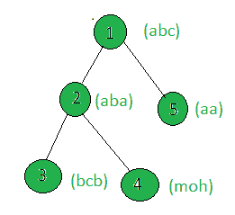

# 统计加权字符串不包含任何重复字符的树的节点数

> 原文:[https://www . geeksforgeeks . org/count-tree-其加权字符串不包含任何重复字符的节点数/](https://www.geeksforgeeks.org/count-the-nodes-of-a-tree-whose-weighted-string-does-not-contain-any-duplicate-characters/)

给定一棵树和所有节点的权重(以字符串的形式)，任务是计算权重不包含任何重复字符的节点。
**例:**

> **输入:**
> 
> 
> 
> **输出:** 2
> 只有节点 1 和 4 的字符串包含唯一的字符串。

**方法:**在树上执行 [dfs](https://www.geeksforgeeks.org/depth-first-traversal-for-a-graph/) ，对于每个节点，检查其字符串是否包含重复字符，如果不包含，则增加计数。
以下是上述方法的实施:

## C++

```
// C++ implementation of the approach
#include <bits/stdc++.h>
using namespace std;

int cnt = 0;

vector<int> graph[100];
vector<string> weight(100);

// Function that returns true if the
// string contains unique characters
bool uniqueChars(string x)
{
    map<char, int> mp;
    int n = x.size();

    for (int i = 0; i < n; i++)
        mp[x[i]]++;
    if (mp.size() == x.size())
        return true;
    else
        return false;
}

// Function to perform dfs
void dfs(int node, int parent)
{
    // If weighted string of the current
    // node contains unique characters
    if (uniqueChars(weight[node]))
        cnt += 1;

    for (int to : graph[node]) {
        if (to == parent)
            continue;
        dfs(to, node);
    }
}

// Driver code
int main()
{

    // Weights of the nodes
    weight[1] = "abc";
    weight[2] = "aba";
    weight[3] = "bcb";
    weight[4] = "moh";
    weight[5] = "aa";

    // Edges of the tree
    graph[1].push_back(2);
    graph[2].push_back(3);
    graph[2].push_back(4);
    graph[1].push_back(5);

    dfs(1, 1);

    cout << cnt;

    return 0;
}
```

## Java 语言(一种计算机语言，尤用于创建网站)

```
// Java implementation of the approach
import java.util.*;

class GFG
{

    static int cnt = 0;

    static Vector<Integer>[] graph = new Vector[100];
    static String[] weight = new String[100];

    // Function that returns true if the
    // String contains unique characters
    static boolean uniqueChars(char[] arr)
    {
        HashMap<Character, Integer> mp =
        new HashMap<Character, Integer>();
        int n = arr.length;

        for (int i = 0; i < n; i++)
            if (mp.containsKey(arr[i]))
            {
                mp.put(arr[i], mp.get(arr[i]) + 1);
            }
            else
            {
                mp.put(arr[i], 1);
            }
        if (mp.size() == arr.length)
            return true;
        else
            return false;
    }

    // Function to perform dfs
    static void dfs(int node, int parent)
    {
        // If weighted String of the current
        // node contains unique characters
        if (uniqueChars(weight[node].toCharArray()))
            cnt += 1;

        for (int to : graph[node])
        {
            if (to == parent)
                continue;
            dfs(to, node);
        }
    }

    // Driver code
    public static void main(String[] args)
    {

        for (int i = 0; i < 100; i++)
            graph[i] = new Vector<Integer>();

        // Weights of the nodes
        weight[1] = "abc";
        weight[2] = "aba";
        weight[3] = "bcb";
        weight[4] = "moh";
        weight[5] = "aa";

        // Edges of the tree
        graph[1].add(2);
        graph[2].add(3);
        graph[2].add(4);
        graph[1].add(5);

        dfs(1, 1);

        System.out.print(cnt);
    }
}

// This code is contributed by Rajput-Ji
```

## 蟒蛇 3

```
# Python3 implementation of the approach
cnt = 0

graph = [[] for i in range(100)]
weight = [0] * 100

# Function that returns true if the
# string contains unique characters
def uniqueChars(x):
    mp = {}
    n = len(x)
    for i in range(n):
        if x[i] not in mp:
            mp[x[i]] = 0
        mp[x[i]] += 1
    if (len(mp) == len(x)):
        return True
    else:
        return False

# Function to perform dfs
def dfs(node, parent):
    global cnt, x

    # If weight of the current node
    # node contains unique characters
    if (uniqueChars(weight[node])):
        cnt += 1
    for to in graph[node]:
        if (to == parent):
            continue
        dfs(to, node)

# Driver code
x = 5

# Weights of the node
weight[1] = "abc"
weight[2] = "aba"
weight[3] = "bcb"
weight[4] = "moh"
weight[5] = "aa"

# Edges of the tree
graph[1].append(2)
graph[2].append(3)
graph[2].append(4)
graph[1].append(5)

dfs(1, 1)
print(cnt)

# This code is contributed by SHUBHAMSINGH10
```

## C#

```
// C# implementation of the approach
using System;
using System.Collections.Generic;

class GFG
{

    static int cnt = 0;

    static List<int>[] graph = new List<int>[100];
    static String[] weight = new String[100];

    // Function that returns true if the
    // String contains unique characters
    static bool uniqueChars(char[] arr)
    {
        Dictionary<char, int> mp =
        new Dictionary<char, int>();
        int n = arr.Length;

        for (int i = 0; i < n; i++)
            if (mp.ContainsKey(arr[i]))
            {
                mp[arr[i]] = mp[arr[i]] + 1;
            }
            else
            {
                mp.Add(arr[i], 1);
            }
        if (mp.Count == arr.Length)
            return true;
        else
            return false;
    }

    // Function to perform dfs
    static void dfs(int node, int parent)
    {
        // If weighted String of the current
        // node contains unique characters
        if (uniqueChars(weight[node].ToCharArray()))
            cnt += 1;

        foreach (int to in graph[node])
        {
            if (to == parent)
                continue;
            dfs(to, node);
        }
    }

    // Driver code
    public static void Main(String[] args)
    {

        for (int i = 0; i < 100; i++)
            graph[i] = new List<int>();

        // Weights of the nodes
        weight[1] = "abc";
        weight[2] = "aba";
        weight[3] = "bcb";
        weight[4] = "moh";
        weight[5] = "aa";

        // Edges of the tree
        graph[1].Add(2);
        graph[2].Add(3);
        graph[2].Add(4);
        graph[1].Add(5);

        dfs(1, 1);

        Console.Write(cnt);
    }
}

// This code is contributed by PrinciRaj1992
```

## java 描述语言

```
<script>

// JavaScript implementation of the approach

let cnt = 0;

let graph = new Array();
for (let i = 0; i < 100; i++) {
    graph.push([])
}

let weight = new Array(100);

// Function that returns true if the
// string contains unique characters
function uniqueChars(x) {
    let mp = new Map();
    let n = x.length;

    for (let i = 0; i < n; i++) {
        if (mp.has(x[i])) {
            mp.set(x[i], mp.get(x[i]) + 1)
        } else {
            mp.set(x[i], 1)
        }
    }
    if (mp.size == x.length)
        return true;
    else
        return false;
}

// Function to perform dfs
function dfs(node, parent) {
    // If weighted string of the current
    // node contains unique characters
    if (uniqueChars(weight[node]))
        cnt += 1;

    for (let to of graph[node]) {
        if (to == parent)
            continue;
        dfs(to, node);
    }
}

// Driver code

// Weights of the nodes
weight[1] = "abc";
weight[2] = "aba";
weight[3] = "bcb";
weight[4] = "moh";
weight[5] = "aa";

// Edges of the tree
graph[1].push(2);
graph[2].push(3);
graph[2].push(4);
graph[1].push(5);

dfs(1, 1);

document.write(cnt);

// This code is contributed by _saurabh_jaiswal

</script>
```

**Output:** 

```
2
```

**<u>复杂度分析:</u>**

*   **时间复杂度:** O(N*Len)，其中 Len 是给定树中节点的加权串的最大长度。
    在 dfs 中，树的每个节点都被处理一次，因此如果树中总共有 N 个节点，由于 dfs 而导致的复杂性是 O(N)。此外，每个节点的处理都涉及遍历该节点的加权字符串，因此增加了 O(Len)的复杂性，其中 Len 是加权字符串的长度。因此，时间复杂度为 O(N*Len)。
*   **辅助空间:** O(1)。
    不需要任何额外的空间，所以空间复杂度不变。