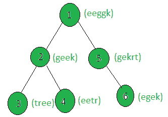

# 计算一棵树的节点，该树的加权字符串是给定字符串的字谜

> 原文:[https://www . geesforgeks . org/count-the-nodes-of-a-tree-其加权字符串是给定字符串的字谜/](https://www.geeksforgeeks.org/count-the-nodes-of-a-tree-whose-weighted-string-is-an-anagram-of-the-given-string/)

给定一棵树，以及所有节点的权重(以字符串的形式)，任务是用给定的字符串 **str** 计算权重字符串为字谜的节点。
**例:**

> **输入:**
> 
> 
> 
> str = "geek"
> **输出:** 2
> 只有节点 2 和 6
> 的加权字符串是给定字符串“geek”的字谜。

**方法:**在树上执行 [dfs](https://www.geeksforgeeks.org/depth-first-traversal-for-a-graph/) ，对于每个节点，检查它的加权字符串是否是给定字符串的字谜，如果不是，则增加计数。
以下是上述方法的实施:

## C++

```
// C++ implementation of the approach
#include <bits/stdc++.h>
using namespace std;

string s;
int cnt = 0;

vector<int> graph[100];
vector<string> weight(100);

// Function that return true if both
// the strings are anagram of each other
bool anagram(string x, string s)
{
    sort(x.begin(), x.end());
    sort(s.begin(), s.end());
    if (x == s)
        return true;
    else
        return false;
}

// Function to perform dfs
void dfs(int node, int parent)
{
    // If current node's weighted
    // string is an anagram of
    // the given string s
    if (anagram(weight[node], s))
        cnt += 1;

    for (int to : graph[node]) {
        if (to == parent)
            continue;
        dfs(to, node);
    }
}

// Driver code
int main()
{
    s = "geek";

    // Weights of the nodes
    weight[1] = "eeggk";
    weight[2] = "geek";
    weight[3] = "gekrt";
    weight[4] = "tree";
    weight[5] = "eetr";
    weight[6] = "egek";

    // Edges of the tree
    graph[1].push_back(2);
    graph[2].push_back(3);
    graph[2].push_back(4);
    graph[1].push_back(5);
    graph[5].push_back(6);

    dfs(1, 1);

    cout << cnt;

    return 0;
}
```

## Java 语言(一种计算机语言，尤用于创建网站)

```
// Java implementation of the approach
import java.util.*;

class GFG
{

    static String s;
    static int cnt = 0;

    static Vector<Integer>[] graph = new Vector[100];
    static String[] weight = new String[100];

    // Function that return true if both
    // the Strings are anagram of each other
    static boolean anagram(String x, String s)
    {
        x = sort(x);
        s = sort(s);
        if (x.equals(s))
            return true;
        else
            return false;
    }

    static String sort(String inputString)
    {
        // convert input string to char array
        char tempArray[] = inputString.toCharArray();

        // sort tempArray
        Arrays.sort(tempArray);

        // return new sorted string
        return new String(tempArray);
    }

    // Function to perform dfs
    static void dfs(int node, int parent)
    {
        // If current node's weighted
        // String is an anagram of
        // the given String s
        if (anagram(weight[node], s))
            cnt += 1;

        for (int to : graph[node])
        {
            if (to == parent)
                continue;
            dfs(to, node);
        }
    }

    // Driver code
    public static void main(String[] args)
    {
        s = "geek";
        for (int i = 0; i < 100; i++)
            graph[i] = new Vector<Integer>();

        // Weights of the nodes
        weight[1] = "eeggk";
        weight[2] = "geek";
        weight[3] = "gekrt";
        weight[4] = "tree";
        weight[5] = "eetr";
        weight[6] = "egek";

        // Edges of the tree
        graph[1].add(2);
        graph[2].add(3);
        graph[2].add(4);
        graph[1].add(5);
        graph[5].add(6);

        dfs(1, 1);

        System.out.print(cnt);
    }
}

// This code is contributed by Rajput-Ji
```

## 蟒蛇 3

```
# Python3 implementation of the approach
cnt = 0

graph = [[] for i in range(100)]
weight = [0] * 100

# Function that return true if both
# the strings are anagram of each other
def anagram(x, s):
    x = sorted(list(x))
    s = sorted(list(s))
    if (x == s):
        return True
    else:
        return False

# Function to perform dfs
def dfs(node, parent):
    global cnt, s

    # If weight of the current node
    # string is an anagram of
    # the given string s
    if (anagram(weight[node], s)):
        cnt += 1
    for to in graph[node]:
        if (to == parent):
            continue
        dfs(to, node)

# Driver code
s = "geek"

# Weights of the nodes
weight[1] = "eeggk"
weight[2] = "geek"
weight[3] = "gekrt"
weight[4] = "tree"
weight[5] = "eetr"
weight[6] = "egek"

# Edges of the tree
graph[1].append(2)
graph[2].append(3)
graph[2].append(4)
graph[1].append(5)
graph[5].append(6)

dfs(1, 1)
print(cnt)

# This code is contributed by SHUBHAMSINGH10
```

## C#

```
// C# implementation of the approach
using System;
using System.Collections.Generic;

class GFG
{

    static String s;
    static int cnt = 0;

    static List<int>[] graph = new List<int>[100];
    static String[] weight = new String[100];

    // Function that return true if both
    // the Strings are anagram of each other
    static bool anagram(String x, String s)
    {
        x = sort(x);
        s = sort(s);
        if (x.Equals(s))
            return true;
        else
            return false;
    }

    static String sort(String inputString)
    {
        // convert input string to char array
        char []tempArray = inputString.ToCharArray();

        // sort tempArray
        Array.Sort(tempArray);

        // return new sorted string
        return new String(tempArray);
    }

    // Function to perform dfs
    static void dfs(int node, int parent)
    {
        // If current node's weighted
        // String is an anagram of
        // the given String s
        if (anagram(weight[node], s))
            cnt += 1;

        foreach (int to in graph[node])
        {
            if (to == parent)
                continue;
            dfs(to, node);
        }
    }

    // Driver code
    public static void Main(String[] args)
    {
        s = "geek";
        for (int i = 0; i < 100; i++)
            graph[i] = new List<int>();

        // Weights of the nodes
        weight[1] = "eeggk";
        weight[2] = "geek";
        weight[3] = "gekrt";
        weight[4] = "tree";
        weight[5] = "eetr";
        weight[6] = "egek";

        // Edges of the tree
        graph[1].Add(2);
        graph[2].Add(3);
        graph[2].Add(4);
        graph[1].Add(5);
        graph[5].Add(6);

        dfs(1, 1);

        Console.Write(cnt);
    }
}

// This code is contributed by PrinciRaj1992
```

## java 描述语言

```
<script>

// Javascript implementation of the approach
let s;
let cnt = 0;

let graph = new Array(100);
let weight = new Array(100);
for(let i = 0; i < 100; i++)
{
    graph[i] = [];
    weight[i] = 0;
}

const sort1 = str => str.split('').sort((a, b) => a.localeCompare(b)).join('');

// Function that return true if both
// the strings are anagram of each other
function anagram(x, s)
{
    x = sort1(x);
    s = sort1(s);

    if (x == s)
        return true;
    else
        return false;
}

// Function to perform dfs
function dfs(node, parent)
{
    // If current node's weighted
    // string is an anagram of
    // the given string s
    if (anagram(weight[node], s))
        cnt += 1;

    for(let to = 0; to < graph[node].length; to++)
    {
        if(graph[node][to] == parent)
            continue
        dfs(graph[node][to], node); 
    }
}

// Driver code
    s = "geek";

    // Weights of the nodes
    weight[1] = "eeggk";
    weight[2] = "geek";
    weight[3] = "gekrt";
    weight[4] = "tree";
    weight[5] = "eetr";
    weight[6] = "egek";

    // Edges of the tree
    graph[1].push(2);
    graph[2].push(3);
    graph[2].push(4);
    graph[1].push(5);
    graph[5].push(6);

    dfs(1, 1);
    document.write(cnt);

    // This code is contributed by Dharanendra L V.

</script>
```

**Output:** 

```
2
```

**<u>复杂度分析:</u>**

*   **时间复杂度:** O(N*(S*log(S)))。
    在 dfs 中，树的每个节点都被处理一次，因此如果树中总共有 N 个节点，由于 dfs 而导致的复杂性是 O(N)。此外，为了处理每个节点，使用了 sort()函数，其复杂度为 O(S*log(S))，其中 S 是加权字符串的长度。因此，时间复杂度为 O(N*(S*log(S)))，其中 S 是树中权重字符串的最大长度。
*   **辅助空间:** O(1)。
    不需要任何额外的空间，所以空间复杂度不变。