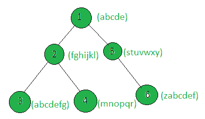

# 计算与子树节点连接时构成庞加莱的树的节点数

> 原文:[https://www . geeksforgeeks . org/count-the-the-tree-nodes-当与-sub-tree-nodes/](https://www.geeksforgeeks.org/count-the-nodes-of-the-tree-which-make-a-pangram-when-concatenated-with-the-sub-tree-nodes/) 连接时，会生成一个 pangram

给定一棵树和所有节点的权重(以字符串的形式)，任务是计算节点，当这些节点的加权字符串与子树节点的字符串连接在一起时，这些节点就变成了一个 pangram。
**Pangram:**Pangram 是包含英语字母表中每个字母的句子。

**例:**

> **输入:**
> 
> 
> 
> **输出:** 1
> 只有节点 1 的子树的加权串构成庞加莱。

**方法:**对树执行 [dfs](https://www.geeksforgeeks.org/depth-first-traversal-for-a-graph/) 并更新每个节点的权重，使其存储与子树节点的权重相连接的权重。然后，计算其更新的加权字符串形成 pangram 的节点数。

下面是上述方法的实现:

## C++

```
// C++ implementation of the approach
#include <bits/stdc++.h>
using namespace std;

vector<int> graph[100];
vector<string> weight(100);

// Function that returns if the
// string x is a pangram
bool Pangram(string x)
{
    map<char, int> mp;
    int n = x.size();

    for (int i = 0; i < n; i++)
        mp[x[i]]++;
    if (mp.size() == 26)
        return true;
    else
        return false;
}

// Function to return the count of nodes
// which make pangram with the
// sub-tree nodes
int countTotalPangram(int n)
{
    int cnt = 0;
    for (int i = 1; i <= n; i++)
        if (Pangram(weight[i]))
            cnt++;
    return cnt;
}

// Function to perform dfs and update the nodes
// such that weight[i] will store the weight[i]
// concatenated with the weights of
// all the nodes in the sub-tree
void dfs(int node, int parent)
{

    for (int to : graph[node]) {
        if (to == parent)
            continue;
        dfs(to, node);
        weight[node] += weight[to];
    }
}

// Driver code
int main()
{
    int n = 6;

    // Weights of the nodes
    weight[1] = "abcde";
    weight[2] = "fghijkl";
    weight[3] = "abcdefg";
    weight[4] = "mnopqr";
    weight[5] = "stuvwxy";
    weight[6] = "zabcdef";

    // Edges of the tree
    graph[1].push_back(2);
    graph[2].push_back(3);
    graph[2].push_back(4);
    graph[1].push_back(5);
    graph[5].push_back(6);

    dfs(1, 1);

    cout << countTotalPangram(n);

    return 0;
}
```

## Java 语言(一种计算机语言，尤用于创建网站)

```
// Java implementation of the approach
import java.util.*;

class GFG{

@SuppressWarnings("unchecked")
static Vector<Integer> []graph = new Vector[100];
static String []weight = new String[100];

// Function that returns if the
// String x is a pangram
static boolean Pangram(String x)
{
    HashMap<Character, Integer> mp = new HashMap<>();
    int n = x.length();

    for(int i = 0 ; i < n; i++)
    {
        if (mp.containsKey(x.charAt(i)))
        {
            mp.put(x.charAt(i),
            mp.get(x.charAt(i)) + 1);
        }
        else
        {
            mp.put(x.charAt(i), 1);
        }
    }
    if (mp.size() == 26)
        return true;
    else
        return false;
}

// Function to return the count of nodes
// which make pangram with the
// sub-tree nodes
static int countTotalPangram(int n)
{
    int cnt = 0;
    for(int i = 1; i <= n; i++)
        if (Pangram(weight[i]))
            cnt++;

    return cnt;
}

// Function to perform dfs and update the nodes
// such that weight[i] will store the weight[i]
// concatenated with the weights of
// all the nodes in the sub-tree
static void dfs(int node, int parent)
{
    for(int to : graph[node])
    {
        if (to == parent)
            continue;

        dfs(to, node);
        weight[node] += weight[to];
    }
}

// Driver code
public static void main(String[] args)
{
    int n = 6;

    // Weights of the nodes
    weight[1] = "abcde";
    weight[2] = "fghijkl";
    weight[3] = "abcdefg";
    weight[4] = "mnopqr";
    weight[5] = "stuvwxy";
    weight[6] = "zabcdef";

    for(int i = 0; i < graph.length; i++)
        graph[i] = new Vector<Integer>();

    // Edges of the tree
    graph[1].add(2);
    graph[2].add(3);
    graph[2].add(4);
    graph[1].add(5);
    graph[5].add(6);

    dfs(1, 1);

    System.out.print(countTotalPangram(n));
}
}

// This code is contributed by Amit Katiyar
```

## 蟒蛇 3

```
# Python3 implementation of the approach
graph = [[] for i in range(100)]
weight = [0] * 100

# Function that returns if the
# string x is a pangram
def Pangram(x):
    mp = {}
    n = len(x)
    for i in range(n):
        if x[i] not in mp:
            mp[x[i]] = 0
        mp[x[i]] += 1
    if (len(mp)== 26):
        return True
    else:
        return False

# Function to return the count of nodes
# which make pangram with the
# sub-tree nodes
def countTotalPangram(n):
    cnt = 0
    for i in range(1, n + 1):
        if (Pangram(weight[i])):
            cnt += 1
    return cnt

# Function to perform dfs and update the nodes
# such that weight[i] will store the weight[i]
# concatenated with the weights of
# all the nodes in the sub-tree
def dfs(node, parent):
    for to in graph[node]:
        if (to == parent):
            continue
        dfs(to, node)
        weight[node] += weight[to]

# Driver code
n = 6

# Weights of the nodes
weight[1] = "abcde"
weight[2] = "fghijkl"
weight[3] = "abcdefg"
weight[4] = "mnopqr"
weight[5] = "stuvwxy"
weight[6] = "zabcdef"

# Edges of the tree
graph[1].append(2)
graph[2].append(3)
graph[2].append(4)
graph[1].append(5)
graph[5].append(6)

dfs(1, 1)
print(countTotalPangram(n))

# This code is contributed by SHUBHAMSINGH10
```

## C#

```
// C# implementation of
// the above approach
using System;
using System.Collections.Generic;
class GFG{   

static List<int> []graph =
            new List<int>[100];
static String []weight =
                new String[100];

// Function that returns if the
// String x is a pangram
static bool Pangram(String x)
{
  Dictionary<char,
             int> mp = new Dictionary<char,
                                      int>();
  int n = x.Length;

  for(int i = 0 ; i < n; i++)
  {
    if (mp.ContainsKey(x[i]))
    {
      mp[x[i]] = mp[x[i]] + 1;
    }
    else
    {
      mp.Add(x[i], 1);
    }
  }
  if (mp.Count == 26)
    return true;
  else
    return false;
}

// Function to return the
// count of nodes which
// make pangram with the
// sub-tree nodes
static int countTotalPangram(int n)
{
  int cnt = 0;
  for(int i = 1; i <= n; i++)
    if (Pangram(weight[i]))
      cnt++;

  return cnt;
}

// Function to perform dfs and
// update the nodes such that
// weight[i] will store the weight[i]
// concatenated with the weights of
// all the nodes in the sub-tree
static void dfs(int node, int parent)
{
  foreach(int to in graph[node])
  {
    if (to == parent)
      continue;

    dfs(to, node);
    weight[node] += weight[to];
  }
}

// Driver code
public static void Main(String[] args)
{
  int n = 6;

  // Weights of the nodes
  weight[1] = "abcde";
  weight[2] = "fghijkl";
  weight[3] = "abcdefg";
  weight[4] = "mnopqr";
  weight[5] = "stuvwxy";
  weight[6] = "zabcdef";

  for(int i = 0;
          i < graph.Length; i++)
    graph[i] = new List<int>();

  // Edges of the tree
  graph[1].Add(2);
  graph[2].Add(3);
  graph[2].Add(4);
  graph[1].Add(5);
  graph[5].Add(6);

  dfs(1, 1);
  Console.Write(countTotalPangram(n));
}
}

// This code is contributed by shikhasingrajput
```

## java 描述语言

```
<script>

// JavaScript implementation of the approach

let graph = new Array();

for (let i = 0; i < 100; i++) {
    graph.push([])
}
let weight = new Array(100).fill(0);

// Function that returns if the
// string x is a pangram
function Pangram(x) {
    let mp = new Map();
    let n = x.length;

    for (let i = 0; i < n; i++) {
        if (mp.has(x[i])) {
            mp.set(x[i], mp.get(x[i]) + 1)
        } else {
            mp.set(x[i], 1)
        }
    }

    if (mp.size == 26)
        return true;
    else
        return false;
}

// Function to return the count of nodes
// which make pangram with the
// sub-tree nodes
function countTotalPangram(n) {
    let cnt = 0;
    for (let i = 1; i <= n; i++)
        if (Pangram(weight[i]))
            cnt++;
    return cnt;
}

// Function to perform dfs and update the nodes
// such that weight[i] will store the weight[i]
// concatenated with the weights of
// all the nodes in the sub-tree
function dfs(node, parent) {

    for (let to of graph[node]) {
        if (to == parent)
            continue;
        dfs(to, node);
        weight[node] += weight[to];
    }
}

// Driver code

let n = 6;

// Weights of the nodes
weight[1] = "abcde";
weight[2] = "fghijkl";
weight[3] = "abcdefg";
weight[4] = "mnopqr";
weight[5] = "stuvwxy";
weight[6] = "zabcdef";

// Edges of the tree
graph[1].push(2);
graph[2].push(3);
graph[2].push(4);
graph[1].push(5);
graph[5].push(6);

dfs(1, 1);

document.write(countTotalPangram(n));

// This code is contributed by gfgking

</script>
```

**Output:** 

```
1
```

**<u>复杂度分析:</u>**

*   **时间复杂度:** O(N*S)。
    在 dfs 中，树的每个节点都被处理一次，因此如果树中总共有 N 个节点，由于 dfs 而导致的复杂性是 O(N)。此外，为了处理每个节点，Pangram()函数用于复杂度为 O(S)的每个节点，其中 S 是子树中所有权重字符串的长度之和，由于这是针对每个节点完成的，因此这部分的总时间复杂度变为 O(N*S)。因此，最终的时间复杂度是 O(N*S)。
*   **辅助空间:** O(1)。
    不需要任何额外的空间，所以空间复杂度不变。