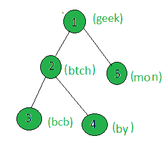

# 计算加权字符串包含元音的树的节点数

> 原文:[https://www . geesforgeks . org/count-the-nodes-of-the-tree-其加权字符串包含一个元音/](https://www.geeksforgeeks.org/count-the-nodes-of-the-tree-whose-weighted-string-contains-a-vowel/)

给定一棵树和所有节点的权重(以字符串的形式)，任务是计算权重包含元音的节点。

**示例:**

> **输入:**
> 
> 
> 
> **输出:** 2
> 只有节点 1 和 5 的字符串包含元音。

**方法:**在树上执行 [dfs](https://www.geeksforgeeks.org/depth-first-traversal-for-a-graph/) ，对于每个节点，检查它的字符串是否包含元音，如果是，则增加计数。

下面是上述方法的实现:

## C++

```
// C++ implementation of the approach
#include <bits/stdc++.h>
using namespace std;

int cnt = 0;

vector<int> graph[100];
vector<string> weight(100);

// Function that returns true
// if the string contains any vowel
bool containsVowel(string str)
{
    for (int i = 0; i < str.length(); i++)
    {
        char ch = tolower(str[i]);
        if (ch == 'a' || ch == 'e' || ch == 'i' || ch == 'o'
            || ch == 'u')
            return true;
    }
    return false;
}

// Function to perform dfs
void dfs(int node, int parent)
{

    // Weight of the current node
    string x = weight[node];

    // If the weight contains any vowel
    if (containsVowel(x))
        cnt += 1;

    for (int to : graph[node])
    {
        if (to == parent)
            continue;
        dfs(to, node);
    }
}

// Driver code
int main()
{

    // Weights of the node
    weight[1] = "geek";
    weight[2] = "btch";
    weight[3] = "bcb";
    weight[4] = "by";
    weight[5] = "mon";

    // Edges of the tree
    graph[1].push_back(2);
    graph[2].push_back(3);
    graph[2].push_back(4);
    graph[1].push_back(5);

    // Function call
    dfs(1, 1);

    cout << cnt;

    return 0;
}
```

## Java 语言(一种计算机语言，尤用于创建网站)

```
// Java implementation of the approach
import java.util.*;

class GFG {

    static int cnt = 0;

    static Vector<Vector<Integer> > graph
        = new Vector<Vector<Integer> >();
    static Vector<String> weight = new Vector<String>();

    // Function that returns true
    // if the String contains any vowel
    static boolean containsVowel(String str)
    {
        for (int i = 0; i < str.length(); i++)
        {
            char ch = str.charAt(i);
            if (ch < 97)
                ch += 32;
            if (ch == 'a' || ch == 'e' || ch == 'i'
                || ch == 'o' || ch == 'u')
                return true;
        }
        return false;
    }

    // Function to perform dfs
    static void dfs(int node, int parent)
    {

        // Weight of the current node
        String x = weight.get(node);

        // If the weight contains any vowel
        if (containsVowel(x))
            cnt += 1;

        for (int i = 0; i < graph.get(node).size(); i++)
        {
            if (graph.get(node).get(i) == parent)
                continue;
            dfs(graph.get(node).get(i), node);
        }
    }

    // Driver code
    public static void main(String args[])
    {

        // Weights of the node
        weight.add("");
        weight.add("geek");
        weight.add("btch");
        weight.add("bcb");
        weight.add("by");
        weight.add("mon");

        for (int i = 0; i < 100; i++)
            graph.add(new Vector<Integer>());

        // Edges of the tree
        graph.get(1).add(2);
        graph.get(2).add(3);
        graph.get(2).add(4);
        graph.get(1).add(5);

        // Function call
        dfs(1, 1);

        System.out.println(cnt);
    }
}

// This code is contributed by andrew1234
```

## 蟒蛇 3

```
# Python3 implementation of the approach
cnt = 0

graph = [[] for i in range(100)]
weight = [0 for i in range(100)]

# Function that returns True
# if the contains any vowel

def containsVowel(Str):

    for i in range(len(Str)):
        ch = Str[i]
        if (ch == 'a' or ch == 'e' or ch == 'i' or
                ch == 'o' or ch == 'u'):
            return True

    return False

# Function to perform dfs
def dfs(node, parent):
    global cnt

    # Weight of the current node
    x = weight[node]

    # If the weight contains any vowel
    if (containsVowel(x)):
        cnt += 1

    for to in graph[node]:
        if (to == parent):
            continue
        dfs(to, node)

# Driver code

# Weights of the node
weight[1] = "geek"
weight[2] = "btch"
weight[3] = "bcb"
weight[4] = "by"
weight[5] = "mon"

# Edges of the tree
graph[1].append(2)
graph[2].append(3)
graph[2].append(4)
graph[1].append(5)

# Function call
dfs(1, 1)

print(cnt)

# This code is contributed by mohit kumar 29
```

## C#

```
// C# implementation of the approach
using System;
using System.Collections.Generic;

class GFG {

    static int cnt = 0;

    static List<List<int> > graph = new List<List<int> >();
    static List<String> weight = new List<String>();

    // Function that returns true
    // if the String contains any vowel
    static Boolean containsVowel(String str)
    {
        for (int i = 0; i < str.Length; i++)
        {
            char ch = str[i];
            if (ch < 97)
                ch += (char)32;
            if (ch == 'a' || ch == 'e' || ch == 'i'
                || ch == 'o' || ch == 'u')
                return true;
        }
        return false;
    }

    // Function to perform dfs
    static void dfs(int node, int parent)
    {

        // Weight of the current node
        String x = weight[node];

        // If the weight contains any vowel
        if (containsVowel(x))
            cnt += 1;

        for (int i = 0; i < graph[node].Count; i++)
        {
            if (graph[node][i] == parent)
                continue;
            dfs(graph[node][i], node);
        }
    }

    // Driver code
    public static void Main(String[] args)
    {

        // Weights of the node
        weight.Add("");
        weight.Add("geek");
        weight.Add("btch");
        weight.Add("bcb");
        weight.Add("by");
        weight.Add("mon");

        for (int i = 0; i < 100; i++)
            graph.Add(new List<int>());

        // Edges of the tree
        graph[1].Add(2);
        graph[2].Add(3);
        graph[2].Add(4);
        graph[1].Add(5);

        // Function call
        dfs(1, 1);

        Console.WriteLine(cnt);
    }
}

// This code has been contributed by 29AjayKumar
```

## java 描述语言

```
<script>

// Javascript implementation of the approach
let cnt = 0;
let graph = [];
let weight = [];

// Function that returns true
// if the String contains any vowel
function containsVowel(str)
{
    for(let i = 0; i < str.length; i++)
    {
        let ch = str[i];
        if (ch < 97)
            ch += 32;
        if (ch == 'a' || ch == 'e' || ch == 'i' ||
            ch == 'o' || ch == 'u')
            return true;
    }
    return false;
}

// Function to perform dfs
function dfs(node, parent)
{

    // Weight of the current node
    let x = weight[node];

    // If the weight contains any vowel
    if (containsVowel(x))
        cnt += 1;

    for(let i = 0; i < graph[node].length; i++)
    {
        if (graph[node][i] == parent)
            continue;

        dfs(graph[node][i], node);
    }
}

// Driver code

// Weights of the node
weight.push("");
weight.push("geek");
weight.push("btch");
weight.push("bcb");
weight.push("by");
weight.push("mon");

for(let i = 0; i < 100; i++)
    graph.push([]);

// Edges of the tree
graph[1].push(2);
graph[2].push(3);
graph[2].push(4);
graph[1].push(5);

// Function call
dfs(1, 1);

document.write(cnt);

// This code is contributed by patel2127

</script>
```

**Output**

```
2
```

**<u>复杂度分析:</u>**

**时间复杂度:** O(N*Len)，其中 Len 是给定树中节点的加权串的最大长度。
在 DFS 中，树的每个节点都被处理一次，因此对于树中的 N 个节点，由于 DFS 而导致的复杂性是 O(N)。此外，每个节点的处理都涉及遍历该节点的加权字符串一次，因此增加了 O(Len)的复杂性，其中 Len 是加权字符串的长度。因此，总时间复杂度为 O(N*Len)。

**辅助空间:** O(1)。
不需要任何额外的空间，所以空间复杂度不变。