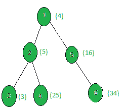

# 计算与 X 之和为斐波那契数的节点数

> 原文:[https://www . geesforgeks . org/count-the-nodes-with-x-sum-is-Fibonacci-number/](https://www.geeksforgeeks.org/count-the-nodes-whose-sum-with-x-is-a-fibonacci-number/)

给定一棵树，所有节点的权重和一个整数 **X** ，任务是统计所有节点 **i** ，使得**(权重[i] + X)** 是一个[斐波那契数](https://www.geeksforgeeks.org/program-for-nth-fibonacci-number/)。
首先，很少有斐波那契数是:

> 0, 1, 1, 2, 3, 5, 8, 13, 21, 34, 55, 89, 141, …

**示例:**

> **输入:**
> 
> 
> 
> X = 5
> **输出:** 2
> 只有节点 3 和 5 在加上 5 时给出一个斐波那契数。
> 即(3 + 5) = 8 和(16 + 5) = 21 都是斐波那契数。

**方法:**在树上执行 [dfs](https://www.geeksforgeeks.org/depth-first-search-or-dfs-for-a-graph/) 并计算其权重与 **x** 之和为斐波那契数的所有节点。

下面是上述方法的实现:

## C++

```
// C++ implementation of the approach
#include <bits/stdc++.h>
using namespace std;

int ans = 0, x;

vector<int> graph[100];
vector<int> weight(100);

// Function that returns true if
// x is a perfect square
bool isPerfectSquare(long double x)
{
    // Find floating point value of
    // square root of x
    long double sr = sqrt(x);

    // If square root is an integer
    return ((sr - floor(sr)) == 0);
}

// Function that returns true
// if n is a fibonacci number
bool isFibonacci(int n)
{
    return isPerfectSquare(5 * n * n + 4)
           || isPerfectSquare(5 * n * n - 4);
}

// Function to perform dfs
void dfs(int node, int parent)
{
    // If weight of the current node
    // gives a fibonacci number
    // when x is added to it
    if (isFibonacci(weight[node] + x))
        ans += 1;

    for (int to : graph[node]) {
        if (to == parent)
            continue;
        dfs(to, node);
    }
}

// Driver code
int main()
{
    x = 5;

    // Weights of the node
    weight[1] = 4;
    weight[2] = 5;
    weight[3] = 3;
    weight[4] = 25;
    weight[5] = 16;
    weight[6] = 34;

    // Edges of the tree
    graph[1].push_back(2);
    graph[2].push_back(3);
    graph[2].push_back(4);
    graph[1].push_back(5);
    graph[5].push_back(6);

    dfs(1, 1);

    cout << ans;

    return 0;
}
```

## Java 语言(一种计算机语言，尤用于创建网站)

```
// Java implementation of the
// above approach
import java.util.*;

@SuppressWarnings("unchecked")

class GFG{

static int ans = 0, x;

static ArrayList []graph = new ArrayList[100];
static ArrayList weight = new ArrayList();

// Function that returns true if
// x is a perfect square
static boolean isPerfectSquare(double x)
{

  // Find floating point value of
  // square root of x
  double sr = Math.sqrt(x);

  // If square root is an integer
  return ((sr - Math.floor(sr)) == 0);
}

// Function that returns true
// if n is a fibonacci number
static boolean isFibonacci(int n)
{
  return isPerfectSquare(5 * n * n + 4) ||
         isPerfectSquare(5 * n * n - 4);
}

// Function to perform dfs
static void dfs(int node, int parent)
{

  // If weight of the current node
  // gives a fibonacci number
  // when x is added to it
  if (isFibonacci((int)weight.get(node) + x))
    ans += 1;

  for(int to : (ArrayList<Integer>)graph[node])
  {
    if (to == parent)
      continue;

    dfs(to, node);
  }
}

// Driver Code
public static void main(String[] args)
{
  x = 5;

  for(int i = 0; i < 100; i++)
  {
    weight.add(0);
    graph[i] = new ArrayList();
  }

  // Weights of the node
  weight.add(1, 4);
  weight.add(2, 5);
  weight.add(3, 3);
  weight.add(4, 25);
  weight.add(5, 16);
  weight.add(6, 34);

  // Edges of the tree
  graph[1].add(2);
  graph[2].add(3);
  graph[2].add(4);
  graph[1].add(5);
  graph[5].add(6);

  dfs(1, 1);

  System.out.println(ans);
}
}

// This code is contributed by pratham76
```

## 蟒蛇 3

```
# Python3 implementation of the approach
import math
ans, x = 0, 0

graph = [[] for i in range(100)]
weight = [0]*(100)

# Function that returns true if
# x is a perfect square
def isPerfectSquare(x):

    # Find floating point value of
    # square root of x
    sr = math.sqrt(x);

    # If square root is an integer
    return ((sr - math.floor(sr)) == 0)

# Function that returns true
# if n is a fibonacci number
def isFibonacci(n):
    return isPerfectSquare(5 * n * n + 4) or isPerfectSquare(5 * n * n - 4)

# Function to perform dfs
def dfs(node, parent):
    global ans
    # If weight of the current node
    # gives a fibonacci number
    # when x is added to it
    if (isFibonacci(weight[node] + x)):
        ans += 1

    for to in graph[node]:
        if (to == parent):
            continue
        dfs(to, node)

x = 5

# Weights of the node
weight[1] = 4
weight[2] = 5
weight[3] = 3
weight[4] = 25
weight[5] = 16
weight[6] = 34

# Edges of the tree
graph[1].append(2)
graph[2].append(3)
graph[2].append(4)
graph[1].append(5)
graph[5].append(6)

dfs(1, 1)

print(ans)

# This code is contributed by divyesh072019.
```

## C#

```
// C# implementation of the
// above approach
using System;
using System.Collections;
class GFG{

static int ans = 0, x;
static ArrayList []graph = new ArrayList[100];
static ArrayList weight = new ArrayList();

// Function that returns true if
// x is a perfect square
static bool isPerfectSquare(double x)
{
  // Find floating point value of
  // square root of x
  double sr = Math.Sqrt(x);

  // If square root is an integer
  return ((sr - Math.Floor(sr)) == 0);
}

// Function that returns true
// if n is a fibonacci number
static bool isFibonacci(int n)
{
    return isPerfectSquare(5 * n * n + 4) ||
           isPerfectSquare(5 * n * n - 4);
}

// Function to perform dfs
static void dfs(int node, int parent)
{
  // If weight of the current node
  // gives a fibonacci number
  // when x is added to it
  if (isFibonacci((int)weight[node] + x))
    ans += 1;

  foreach (int to in graph[node])
  {
    if (to == parent)
      continue;
    dfs(to, node);
  }
}

// Driver Code
public static void Main(string[] args)
{
  x = 5;

  for(int i = 0; i < 100; i++)
  {
    weight.Add(0);
    graph[i] = new ArrayList();
  }

  // Weights of the node
  weight[1] = 4;
  weight[2] = 5;
  weight[3] = 3;
  weight[4] = 25;
  weight[5] = 16;
  weight[6] = 34;

  // Edges of the tree
  graph[1].Add(2);
  graph[2].Add(3);
  graph[2].Add(4);
  graph[1].Add(5);
  graph[5].Add(6);

  dfs(1, 1);
  Console.Write(ans);
}
}

// This code is contributed by rutvik_56
```

## java 描述语言

```
<script>

// JavaScript implementation of the
// above approach

var ans = 0, x;
var graph = Array.from(Array(100), ()=>Array());
var weight = [];

// Function that returns true if
// x is a perfect square
function isPerfectSquare(x)
{
  // Find floating point value of
  // square root of x
  var sr = Math.sqrt(x);

  // If square root is an integer
  return ((sr - Math.floor(sr)) == 0);
}

// Function that returns true
// if n is a fibonacci number
function isFibonacci(n)
{
    return isPerfectSquare(5 * n * n + 4) ||
           isPerfectSquare(5 * n * n - 4);
}

// Function to perform dfs
function dfs(node, parent)
{
  // If weight of the current node
  // gives a fibonacci number
  // when x is added to it
  if (isFibonacci(weight[node] + x))
    ans += 1;

  for(var to of graph[node])
  {
    if (to == parent)
      continue;
    dfs(to, node);
  }
}

// Driver Code
x = 5;
for(var i = 0; i < 100; i++)
{
  weight.push(0);
  graph[i] = [];
}
// Weights of the node
weight[1] = 4;
weight[2] = 5;
weight[3] = 3;
weight[4] = 25;
weight[5] = 16;
weight[6] = 34;
// Edges of the tree
graph[1].push(2);
graph[2].push(3);
graph[2].push(4);
graph[1].push(5);
graph[5].push(6);
dfs(1, 1);
document.write(ans);

</script>
```

**Output:** 

```
2
```