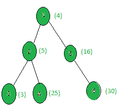

# 统计权重为完美平方的节点

> 原文:[https://www . geesforgeks . org/count-the-nodes-of-weight-is-a-perfect-square/](https://www.geeksforgeeks.org/count-the-nodes-whose-weight-is-a-perfect-square/)

给定一棵树和所有节点的权重，任务是计算权重为完美平方的节点数。
**例:**

> **输入:**
> 
> 
> 
> **输出:** 3
> 只有节点 1、4、5 的权重是完美平方。

**方法:**在树上执行 [dfs](https://www.geeksforgeeks.org/depth-first-traversal-for-a-graph/) ，对于每个节点，检查它的权重是否是一个完美的正方形。
以下是上述方法的实施:

## C++

```
// C++ implementation of the approach
#include <bits/stdc++.h>
using namespace std;

int ans = 0;

vector<int> graph[100];
vector<int> weight(100);

// Function that returns true
// if n is a perfect square
bool isPerfectSquare(int n)
{
    double x = sqrt(n);
    if (floor(x) != ceil(x))
        return false;
    return true;
}

// Function to perform dfs
void dfs(int node, int parent)
{
    // If weight of the current node
    // is a perfect square
    if (isPerfectSquare(weight[node]))
        ans += 1;

    for (int to : graph[node]) {
        if (to == parent)
            continue;
        dfs(to, node);
    }
}

// Driver code
int main()
{
    int x = 15;

    // Weights of the node
    weight[1] = 4;
    weight[2] = 5;
    weight[3] = 3;
    weight[4] = 25;
    weight[5] = 16;
    weight[6] = 30;

    // Edges of the tree
    graph[1].push_back(2);
    graph[2].push_back(3);
    graph[2].push_back(4);
    graph[1].push_back(5);
    graph[5].push_back(6);

    dfs(1, 1);

    cout << ans;

    return 0;
}
```

## Java 语言(一种计算机语言，尤用于创建网站)

```
// Java implementation of the approach
import java.util.*;

class GFG{

static int ans = 0;

static Vector<Integer>[] graph = new Vector[100];
static int[] weight = new int[100];

// Function that returns true
// if n is a perfect square
static boolean isPerfectSquare(int n)
{
    double x = Math.sqrt(n);
    if (Math.floor(x) != Math.ceil(x))
        return false;
    return true;
}

// Function to perform dfs
static void dfs(int node, int parent)
{
    // If weight of the current node
    // is a perfect square
    if (isPerfectSquare(weight[node]))
        ans += 1;

    for (int to : graph[node]) {
        if (to == parent)
            continue;
        dfs(to, node);
    }
}

// Driver code
public static void main(String[] args)
{
    int x = 15;
    for (int i = 0; i < 100; i++)
        graph[i] = new Vector<>();

    // Weights of the node
    weight[1] = 4;
    weight[2] = 5;
    weight[3] = 3;
    weight[4] = 25;
    weight[5] = 16;
    weight[6] = 30;

    // Edges of the tree
    graph[1].add(2);
    graph[2].add(3);
    graph[2].add(4);
    graph[1].add(5);
    graph[5].add(6);

    dfs(1, 1);

    System.out.print(ans);
}
}

// This code is contributed by Rajput-Ji
```

## 蟒蛇 3

```
# Python3 implementation of the approach
from math import *
ans = 0

graph = [[] for i in range(100)]
weight = [0] * 100

# Function that returns true
# if n is a perfect square
def isPerfectSquare(n):
    x = sqrt(n)
    if (floor(x) != ceil(x)):
        return False
    return True

# Function to perform dfs
def dfs(node, parent):
    global ans

    # If weight of the current node
    # is a perfect square
    if (isPerfectSquare(weight[node])):
        ans += 1;

    for to in graph[node]:
        if (to == parent):
            continue
        dfs(to, node)

# Driver code

x = 15

# Weights of the node
weight[1] = 4
weight[2] = 5
weight[3] = 3
weight[4] = 25
weight[5] = 16
weight[6] = 30

# Edges of the tree
graph[1].append(2)
graph[2].append(3)
graph[2].append(4)
graph[1].append(5)
graph[5].append(6)

dfs(1, 1)
print(ans)

# This code is contributed by SHUBHAMSINGH10
```

## C#

```
// C# program for the above approach
using System;
using System.Collections;
using System.Collections.Generic;
using System.Text;

class GFG{

static int ans = 0;

static ArrayList[] graph = new ArrayList[100];
static int[] weight = new int[100];

// Function that returns true
// if n is a perfect square
static bool isPerfectSquare(int n)
{
    double x = Math.Sqrt(n);

    if (Math.Floor(x) != Math.Ceiling(x))
        return false;

    return true;
}

// Function to perform dfs
static void dfs(int node, int parent)
{

    // If weight of the current node
    // is a perfect square
    if (isPerfectSquare(weight[node]))
        ans += 1;

    foreach(int to in graph[node])
    {
        if (to == parent)
            continue;

        dfs(to, node);
    }
}

// Driver Code
public static void Main(string[] args)
{
    //int x = 15;
    for(int i = 0; i < 100; i++)
        graph[i] = new ArrayList();

    // Weights of the node
    weight[1] = 4;
    weight[2] = 5;
    weight[3] = 3;
    weight[4] = 25;
    weight[5] = 16;
    weight[6] = 30;

    // Edges of the tree
    graph[1].Add(2);
    graph[2].Add(3);
    graph[2].Add(4);
    graph[1].Add(5);
    graph[5].Add(6);

    dfs(1, 1);

    Console.Write(ans);
}
}

// This code is contributed by rutvik_56
```

## java 描述语言

```
<script>

// Javascript implementation of the approach

    let ans=0;

    let graph = new Array(100);

    let weight = new Array(100);
    for(let i=0;i<100;i++)
    {
        graph[i]=[];
        weight[i]=0;
    }

    // Function that returns true
    // if n is a perfect square
    function isPerfectSquare(n)
    {
        let x = Math.sqrt(n);
        if (Math.floor(x) != Math.ceil(x))
            return false;
        return true;
    }

    // Function to perform dfs
    function dfs(node,parent)
    {
        // If weight of the current node
        // is a perfect square
        if (isPerfectSquare(weight[node]))
            ans += 1;
        for(let to=0;to<graph[node].length;to++)
        {
            if(graph[node][to] == parent)
                continue
            dfs(graph[node][to], node);  
        }

    }

    // Driver code

    x = 15;

    // Weights of the node
    weight[1] = 4;
    weight[2] = 5;
    weight[3] = 3;
    weight[4] = 25;
    weight[5] = 16;
    weight[6] = 30;

    // Edges of the tree
    graph[1].push(2);
    graph[2].push(3);
    graph[2].push(4);
    graph[1].push(5);
    graph[5].push(6);

    dfs(1, 1);

    document.write( ans);

    // This code is contributed by unknown2108

</script>
```

**Output:** 

```
3
```

**复杂度分析:**

*   **时间复杂度:** O(N*logV)，其中 V 是树中节点的最大权重。
    在 DFS 中，树的每个节点都被处理一次，因此对于树中的 N 个节点，由于 DFS 而导致的复杂性是 O(N)。此外，在处理每个节点时，为了检查节点值是否是完美的正方形，调用了内置的 sqrt(V)，其中 V 是节点的权重，该函数的复杂度为 O(log V)。因此，对于每个节点，都有一个额外的复杂性。因此，总时间复杂度为 O(N*logV)。
*   **辅助空间:** O(1)。
    不需要任何额外的空间，所以空间复杂度不变。