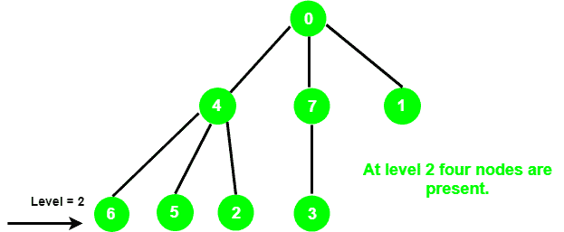

# 使用 DFS

计算树中给定级别的节点数

> 原文:[https://www . geeksforgeeks . org/count-使用 dfs 计算树中给定级别的节点数/](https://www.geeksforgeeks.org/count-the-number-of-nodes-at-a-given-level-in-a-tree-using-dfs/)

给定一个整数 **l** 和一个以顶点 0 为根的无向图表示的树。任务是打印出现在 **l** 级的节点数。

**示例:**

> **输入:** l = 2
> 
> 
> 
> **输出:** 4

我们已经讨论了 [BFS](https://www.geeksforgeeks.org/count-number-nodes-given-level-using-bfs/) 方法，在这篇文章中，我们将使用 DFS 解决它。

**方法:**想法是以 [DFS](https://www.geeksforgeeks.org/depth-first-traversal-for-a-graph/) 方式遍历图。取两个变量，**计数**和 **curr_level** 。每当 **curr_level = l 时**增加**计数**的值。

下面是上述方法的实现:

## C++

```
// C++ implementation of the approach
#include <bits/stdc++.h>
using namespace std;

// Class to represent a graph
class Graph {

    // No. of vertices
    int V;

    // Pointer to an array containing
    // adjacency lists
    list<int>* adj;

    // A function used by NumOfNodes
    void DFS(vector<bool>& visited, int src, int& curr_level,
             int level, int& NumberOfNodes);

public:
    // Constructor
    Graph(int V);

    // Function to add an edge to graph
    void addEdge(int src, int des);

    // Returns the no. of nodes
    int NumOfNodes(int level);
};

Graph::Graph(int V)
{
    this->V = V;
    adj = new list<int>[V];
}

void Graph::addEdge(int src, int des)
{
    adj[src].push_back(des);
    adj[des].push_back(src);
}

// DFS function to keep track of
// number of nodes
void Graph::DFS(vector<bool>& visited, int src, int& curr_level,
                int level, int& NumberOfNodes)
{
    // Mark the current vertex as visited
    visited[src] = true;

    // If current level is equal
    // to the given level, increment
    // the no. of nodes
    if (level == curr_level) {
        NumberOfNodes++;
    }
    else if (level < curr_level)
        return;
    else {
        list<int>::iterator i;

        // Recur for the vertices
        // adjacent to the current vertex
        for (i = adj[src].begin(); i != adj[src].end(); i++) {
            if (!visited[*i]) {
                curr_level++;
                DFS(visited, *i, curr_level, level, NumberOfNodes);
            }
        }
    }
    curr_level--;
}

// Function to return the number of nodes
int Graph::NumOfNodes(int level)
{
    // To keep track of current level
    int curr_level = 0;

    // For keeping track of visited
    // nodes in DFS
    vector<bool> visited(V, false);

    // To store count of nodes at a
    // given level
    int NumberOfNodes = 0;

    DFS(visited, 0, curr_level, level, NumberOfNodes);

    return NumberOfNodes;
}

// Driver code
int main()
{
    int V = 8;

    Graph g(8);
    g.addEdge(0, 1);
    g.addEdge(0, 4);
    g.addEdge(0, 7);
    g.addEdge(4, 6);
    g.addEdge(4, 5);
    g.addEdge(4, 2);
    g.addEdge(7, 3);

    int level = 2;

    cout << g.NumOfNodes(level);

    return 0;
}
```

## 蟒蛇 3

```
# Python3 implementation of the approach

# Class to represent a graph
class Graph:

    def __init__(self, V):

        # No. of vertices
        self.V = V

        # Pointer to an array containing
        # adjacency lists
        self.adj = [[] for i in range(self.V)]

    def addEdge(self, src, des):

        self.adj[src].append(des)
        self.adj[des].append(src)

    # DFS function to keep track of
    # number of nodes
    def DFS(self, visited, src, curr_level,
            level, NumberOfNodes):

        # Mark the current vertex as visited
        visited[src] = True

        # If current level is equal
        # to the given level, increment
        # the no. of nodes
        if (level == curr_level):
            NumberOfNodes += 1

        elif (level < curr_level):
            return
        else:

            # Recur for the vertices
            # adjacent to the current vertex
            for i in self.adj[src]:

                if (not visited[i]):
                    curr_level += 1
                    curr_level, NumberOfNodes = self.DFS(
                        visited, i, curr_level,
                        level, NumberOfNodes)

        curr_level -= 1

        return curr_level, NumberOfNodes

    # Function to return the number of nodes
    def NumOfNodes(self, level):

        # To keep track of current level
        curr_level = 0

        # For keeping track of visited
        # nodes in DFS
        visited = [False for i in range(self.V)]

        # To store count of nodes at a
        # given level
        NumberOfNodes = 0

        curr_level, NumberOfNodes = self.DFS(
            visited, 0, curr_level,
            level, NumberOfNodes)

        return NumberOfNodes

# Driver code
if __name__=='__main__':

    V = 8

    g = Graph(8)
    g.addEdge(0, 1)
    g.addEdge(0, 4)
    g.addEdge(0, 7)
    g.addEdge(4, 6)
    g.addEdge(4, 5)
    g.addEdge(4, 2)
    g.addEdge(7, 3)

    level = 2

    print(g.NumOfNodes(level))

# This code is contributed by pratham76
```

**Output:** 

```
4
```

**时间复杂度:** O(N)，其中 N 为图中节点总数。
**辅助空间:** O(N)