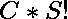

# 统计不包含连续数字的有序集数量

> 原文:[https://www . geesforgeks . org/count-不包含连续数字的有序集数/](https://www.geeksforgeeks.org/count-the-number-of-ordered-sets-not-containing-consecutive-numbers/)

给定正整数 **N** 。计算任意大小的有序集合的总数，这样集合中就不会出现连续的数字，所有的数字都是< = N。

> **有序集:**所有数字都不同的数组，并且考虑了元素的顺序，例如{1，2，3}不同于{1，3，2}。

**示例:**

> **输入:** N = 3
> **输出:** 5
> **解释:**
> 有序集为:
> {1}、{2}、{3}、{1，3}、{3，1}
> 
> **输入:**N = 6
> T3】输出: 50

**天真方法:**

*   我们将使用[递归](https://www.geeksforgeeks.org/recursion/)来解决这个问题。如果我们得到一个有序集合的计数，比如 C，其中元素按升序/降序排列，集合大小为 S，那么这个大小的总计数将



*   。我们将对每个不同大小的有序集合执行此操作。
*   迭代所有有序集的大小，对于每个大小，计算有序集的数量，然后乘以大小的阶乘(S！).在每个递归步骤中，我们有两个选项–
    1.  包含当前元素 x，并移动到下一个位置，此时可以包含最大元素 x–2。
    2.  不要包含当前元素 x，停留在当前位置，最大元素现在可以包含为 x–1。
*   所以递归关系是:

```
countSets(x, pos) = countSets(x-2, pos-1) + countSets(x-1, pos)
```

## C++

```
// C++ program to Count the number of
// ordered sets not containing
// consecutive numbers
#include <bits/stdc++.h>
using namespace std;

// Function to calculate the count
// of ordered set for a given size
int CountSets(int x, int pos)
{
    // Base cases
    if (x <= 0) {
        if (pos == 0)
            return 1;
        else
            return 0;
    }
    if (pos == 0)
        return 1;

    int answer = CountSets(x - 1, pos)
              + CountSets(x - 2, pos - 1);

    return answer;
}
// Function returns the count
// of all ordered sets
int CountOrderedSets(int n)
{
    // Prestore the factorial value
    int factorial[10000];
    factorial[0] = 1;

    for (int i = 1; i < 10000; i++)
        factorial[i] = factorial[i - 1] * i;

    int answer = 0;

    // Iterate all ordered set sizes and find
    // the count for each one maximum ordered
    // set size will be smaller than N as all
    // elements are distinct and non consecutive
    for (int i = 1; i <= n; i++) {

        // Multiply ny size! for all the
        // arrangements because sets are ordered
        int sets = CountSets(n, i) * factorial[i];

        // Add to total answer
        answer = answer + sets;
    }
    return answer;
}
// Driver code
int main()
{
    int N = 3;

    cout << CountOrderedSets(N);

    return 0;
}
```

## Java 语言(一种计算机语言，尤用于创建网站)

```
// Java program to count the number 
// of ordered sets not containing
// consecutive numbers
class GFG{

// Function to calculate the count
// of ordered set for a given size
static int CountSets(int x, int pos)
{

    // Base cases
    if (x <= 0)
    {
        if (pos == 0)
            return 1;
        else
            return 0;
    }
    if (pos == 0)
        return 1;

    int answer = CountSets(x - 1, pos) +
                 CountSets(x - 2, pos - 1);
    return answer;
}

// Function returns the count
// of all ordered sets
static int CountOrderedSets(int n)
{

    // Prestore the factorial value
    int []factorial = new int[10000];
    factorial[0] = 1;

    for(int i = 1; i < 10000; i++)
       factorial[i] = factorial[i - 1] * i;

    int answer = 0;

    // Iterate all ordered set sizes and find
    // the count for each one maximum ordered
    // set size will be smaller than N as all
    // elements are distinct and non consecutive
    for(int i = 1; i <= n; i++)
    {

       // Multiply ny size! for all the
       // arrangements because sets are ordered
       int sets = CountSets(n, i) * factorial[i];

       // Add to total answer
       answer = answer + sets;
    }
    return answer;
}

// Driver code
public static void main(String[] args)
{
    int N = 3;

    System.out.print(CountOrderedSets(N));
}
}

// This code is contributed by sapnasingh4991
```

## 蟒蛇 3

```
# Python3 program to count the number of
# ordered sets not containing
# consecutive numbers

# Function to calculate the count
# of ordered set for a given size
def CountSets(x, pos):

    # Base cases
    if (x <= 0):
        if (pos == 0):
            return 1
        else:
            return 0
    if (pos == 0):
        return 1

    answer = (CountSets(x - 1, pos) +
              CountSets(x - 2, pos - 1))

    return answer

# Function returns the count
# of all ordered sets
def CountOrderedSets(n):

    # Prestore the factorial value
    factorial = [1 for i in range(10000)]
    factorial[0] = 1

    for i in range(1, 10000, 1):
        factorial[i] = factorial[i - 1] * i

    answer = 0

    # Iterate all ordered set sizes and find
    # the count for each one maximum ordered
    # set size will be smaller than N as all
    # elements are distinct and non consecutive
    for i in range(1, n + 1, 1):

        # Multiply ny size! for all the
        # arrangements because sets are ordered
        sets = CountSets(n, i) * factorial[i]

        # Add to total answer
        answer = answer + sets

    return answer

# Driver code
if __name__ == '__main__':

    N = 3
    print(CountOrderedSets(N))

# This code is contributed by Samarth
```

## C#

```
// C# program to count the number
// of ordered sets not containing
// consecutive numbers
using System;
class GFG{

// Function to calculate the count
// of ordered set for a given size
static int CountSets(int x, int pos)
{

    // Base cases
    if (x <= 0)
    {
        if (pos == 0)
            return 1;
        else
            return 0;
    }
    if (pos == 0)
        return 1;

    int answer = CountSets(x - 1, pos) +
                 CountSets(x - 2, pos - 1);
    return answer;
}

// Function returns the count
// of all ordered sets
static int CountOrderedSets(int n)
{

    // Prestore the factorial value
    int []factorial = new int[10000];
    factorial[0] = 1;

    for(int i = 1; i < 10000; i++)
    factorial[i] = factorial[i - 1] * i;

    int answer = 0;

    // Iterate all ordered set sizes and find
    // the count for each one maximum ordered
    // set size will be smaller than N as all
    // elements are distinct and non consecutive
    for(int i = 1; i <= n; i++)
    {

        // Multiply ny size! for all the
        // arrangements because sets are ordered
        int sets = CountSets(n, i) * factorial[i];

        // Add to total answer
        answer = answer + sets;
    }
    return answer;
}

// Driver code
public static void Main(String[] args)
{
    int N = 3;

    Console.Write(CountOrderedSets(N));
}
}

// This code is contributed by sapnasingh4991
```

## java 描述语言

```
<script>

// Javascript program to count the number 
// of ordered sets not containing
// consecutive numbers   

// Function to calculate the count
// of ordered set for a given size
    function CountSets(x , pos)
    {

        // Base cases
        if (x <= 0) {
            if (pos == 0)
                return 1;
            else
                return 0;
        }
        if (pos == 0)
            return 1;

        var answer = CountSets(x - 1, pos) +
        CountSets(x - 2, pos - 1);
        return answer;
    }

    // Function returns the count
    // of all ordered sets
    function CountOrderedSets(n) {

        // Prestore the factorial value
        var factorial = Array(10000).fill(0);
        factorial[0] = 1;

        for (i = 1; i < 10000; i++)
            factorial[i] = factorial[i - 1] * i;

        var answer = 0;

        // Iterate all ordered set sizes and find
        // the count for each one maximum ordered
        // set size will be smaller than N as all
        // elements are distinct and non consecutive
        for (i = 1; i <= n; i++) {

            // Multiply ny size! for all the
            // arrangements because sets are ordered
            var sets = CountSets(n, i) * factorial[i];

            // Add to total answer
            answer = answer + sets;
        }
        return answer;
    }

    // Driver code

        var N = 3;

        document.write(CountOrderedSets(N));

// This code contributed by umadevi9616

</script>
```

**Output:** 

```
5
```

**时间复杂度:** *O(2 <sup>N</sup> )*

**有效方法:**

*   在递归方法中，我们多次求解子问题，即遵循[动态规划](https://www.geeksforgeeks.org/overlapping-subproblems-property-in-dynamic-programming-dp-1/)中的重叠子问题性质。因此，我们可以使用记忆表或缓存来提高解决方案的效率。

## C++

```
// C++ program to Count the number
// of ordered sets not containing
// consecutive numbers
#include <bits/stdc++.h>
using namespace std;

// DP table
int dp[500][500];

// Function to calculate the count
// of ordered set for a given size
int CountSets(int x, int pos)
{
    // Base cases
    if (x <= 0) {
        if (pos == 0)
            return 1;
        else
            return 0;
    }
    if (pos == 0)
        return 1;

    // If subproblem has been
    // soved before
    if (dp[x][pos] != -1)
        return dp[x][pos];

    int answer = CountSets(x - 1, pos)
        + CountSets(x - 2, pos - 1);

    // Store and return answer to
    // this subproblem
    return dp[x][pos] = answer;
}

// Function returns the count
// of all ordered sets
int CountOrderedSets(int n)
{
    // Prestore the factorial value
    int factorial[10000];
    factorial[0] = 1;

    for (int i = 1; i < 10000; i++)
        factorial[i] = factorial[i - 1] * i;

    int answer = 0;

    // Initialise the dp table
    memset(dp, -1, sizeof(dp));

    // Iterate all ordered set sizes and find
    // the count for each one maximum ordered
    // set size will be smaller than N as all
    // elements are distinct and non consecutive.
    for (int i = 1; i <= n; i++) {

        // Multiply ny size! for all the
        // arrangements because sets
        // are ordered.
        int sets = CountSets(n, i) * factorial[i];

        // Add to total answer
        answer = answer + sets;
    }
    return answer;
}
// Driver code
int main()
{
    int N = 3;

    cout << CountOrderedSets(N);

    return 0;
}
```

## Java 语言(一种计算机语言，尤用于创建网站)

```
// Java program to count the number
// of ordered sets not containing
// consecutive numbers
import java.util.*;

class GFG{

// DP table
static int [][]dp = new int[500][500];

// Function to calculate the count
// of ordered set for a given size
static int CountSets(int x, int pos)
{

    // Base cases
    if (x <= 0)
    {
        if (pos == 0)
            return 1;
        else
            return 0;
    }
    if (pos == 0)
        return 1;

    // If subproblem has been
    // soved before
    if (dp[x][pos] != -1)
        return dp[x][pos];

    int answer = CountSets(x - 1, pos) +
                 CountSets(x - 2, pos - 1);

    // Store and return answer to
    // this subproblem
    return dp[x][pos] = answer;
}

// Function returns the count
// of all ordered sets
static int CountOrderedSets(int n)
{

    // Prestore the factorial value
    int []factorial = new int[10000];
    factorial[0] = 1;

    for(int i = 1; i < 10000; i++)
        factorial[i] = factorial[i - 1] * i;

    int answer = 0;

    // Initialise the dp table
    for(int i = 0; i < 500; i++)
    {
        for(int j = 0; j < 500; j++)
        {
            dp[i][j] = -1;
        }
    }

    // Iterate all ordered set sizes and find
    // the count for each one maximum ordered
    // set size will be smaller than N as all
    // elements are distinct and non consecutive.
    for(int i = 1; i <= n; i++)
    {

        // Multiply ny size! for all the
        // arrangements because sets
        // are ordered.
        int sets = CountSets(n, i) * factorial[i];

        // Add to total answer
        answer = answer + sets;
    }
    return answer;
}

// Driver code
public static void main(String[] args)
{
    int N = 3;

    System.out.print(CountOrderedSets(N));
}
}

// This code is contributed by Rajput-Ji
```

## 蟒蛇 3

```
# Python3 program to count the number
# of ordered sets not containing
# consecutive numbers

# DP table
dp = [[-1 for j in range(500)]
          for i in range(500)]

# Function to calculate the count
# of ordered set for a given size
def CountSets(x, pos):

    # Base cases
    if (x <= 0):
        if (pos == 0):
            return 1
        else:
            return 0

    if (pos == 0):
        return 1

    # If subproblem has been
    # soved before
    if (dp[x][pos] != -1):
        return dp[x][pos]

    answer = (CountSets(x - 1, pos) +
              CountSets(x - 2, pos - 1))

    # Store and return answer to
    # this subproblem
    dp[x][pos] = answer

    return answer

# Function returns the count
# of all ordered sets
def CountOrderedSets(n):

    # Prestore the factorial value
    factorial = [0 for i in range(10000)]
    factorial[0] = 1

    for i in range(1, 10000):
        factorial[i] = factorial[i - 1] * i

    answer = 0

    # Iterate all ordered set sizes and find
    # the count for each one maximum ordered
    # set size will be smaller than N as all
    # elements are distinct and non consecutive.
    for i in range(1, n + 1):

        # Multiply ny size! for all the
        # arrangements because sets
        # are ordered.
        sets = CountSets(n, i) * factorial[i]

        # Add to total answer
        answer = answer + sets

    return answer

# Driver code
if __name__=="__main__":

    N = 3

    print(CountOrderedSets(N))

# This code is contributed by rutvik_56
```

## C#

```
// C# program to count the number
// of ordered sets not containing
// consecutive numbers
using System;
class GFG{

// DP table
static int [,]dp = new int[500, 500];

// Function to calculate the count
// of ordered set for a given size
static int CountSets(int x, int pos)
{

    // Base cases
    if (x <= 0)
    {
        if (pos == 0)
            return 1;
        else
            return 0;
    }
    if (pos == 0)
        return 1;

    // If subproblem has been
    // soved before
    if (dp[x,pos] != -1)
        return dp[x, pos];

    int answer = CountSets(x - 1, pos) +
                 CountSets(x - 2, pos - 1);

    // Store and return answer to
    // this subproblem
    return dp[x, pos] = answer;
}

// Function returns the count
// of all ordered sets
static int CountOrderedSets(int n)
{

    // Prestore the factorial value
    int []factorial = new int[10000];
    factorial[0] = 1;

    for(int i = 1; i < 10000; i++)
        factorial[i] = factorial[i - 1] * i;

    int answer = 0;

    // Initialise the dp table
    for(int i = 0; i < 500; i++)
    {
        for(int j = 0; j < 500; j++)
        {
            dp[i, j] = -1;
        }
    }

    // Iterate all ordered set sizes and find
    // the count for each one maximum ordered
    // set size will be smaller than N as all
    // elements are distinct and non consecutive.
    for(int i = 1; i <= n; i++)
    {

        // Multiply ny size! for all the
        // arrangements because sets
        // are ordered.
        int sets = CountSets(n, i) * factorial[i];

        // Add to total answer
        answer = answer + sets;
    }
    return answer;
}

// Driver code
public static void Main(String[] args)
{
    int N = 3;

    Console.Write(CountOrderedSets(N));
}
}

// This code is contributed by sapnasingh4991
```

## java 描述语言

```
<script>

// JavaScript program to Count the number
// of ordered sets not containing
// consecutive numbers

// DP table
var dp = Array.from(Array(500), ()=>Array(500));

// Function to calculate the count
// of ordered set for a given size
function CountSets(x, pos)
{
    // Base cases
    if (x <= 0) {
        if (pos == 0)
            return 1;
        else
            return 0;
    }
    if (pos == 0)
        return 1;

    // If subproblem has been
    // soved before
    if (dp[x][pos] != -1)
        return dp[x][pos];

    var answer = CountSets(x - 1, pos)
        + CountSets(x - 2, pos - 1);

    // Store and return answer to
    // this subproblem
    return dp[x][pos] = answer;
}

// Function returns the count
// of all ordered sets
function CountOrderedSets(n)
{
    // Prestore the factorial value
    var factorial = Array(10000).fill(0);
    factorial[0] = 1;

    for (var i = 1; i < 10000; i++)
        factorial[i] = factorial[i - 1] * i;

    var answer = 0;

    // Initialise the dp table
    dp = Array.from(Array(500), ()=>Array(500).fill(-1));

    // Iterate all ordered set sizes and find
    // the count for each one maximum ordered
    // set size will be smaller than N as all
    // elements are distinct and non consecutive.
    for (var i = 1; i <= n; i++) {

        // Multiply ny size! for all the
        // arrangements because sets
        // are ordered.
        var sets = CountSets(n, i) * factorial[i];

        // Add to total answer
        answer = answer + sets;
    }
    return answer;
}
// Driver code
var N = 3;
document.write( CountOrderedSets(N));

</script>
```

**Output:** 

```
5
```

**时间复杂度:** *O(N <sup>2</sup> )*