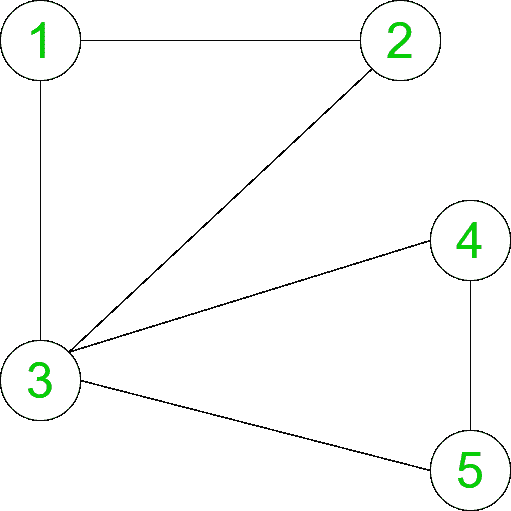

# 计算无向图中素数团的数量

> 原文:[https://www . geeksforgeeks . org/count-在无向图中计算主要派系的数量/](https://www.geeksforgeeks.org/count-the-number-of-prime-cliques-in-an-undirected-graph/)

给定一个有 **N** 个节点和 **E** 条边的图，任务是计算给定图中具有素数或素数节点大小的团的数量。

> 一个**团**是一个给定图的完全子图。

**示例:**

> **输入:** N = 5，边[] = { {1，2}，{2，3}，{3，1}，{4，3}，{4，5}，{5，3} }
> 
> 
> 
> **输出:** 8
> **说明:**
> 在给定的无向图中，1- > 2- > 3 和 3- > 4- > 5 是两个完整的子图，它们都是大小为 3 的素数。
> 同样，1-2，2- > 3，3- > 1，4- > 3，4- > 5 和 5- > 3 是大小为 2 的完全子图。
> 因此有 8 个主要派系。

**方法:**解决上述问题，主要思路是使用[递归](https://www.geeksforgeeks.org/recursion/)。找到度大于或等于(K-1)的所有顶点，并检查 K 个顶点的哪个子集形成团。当另一个边被添加到当前列表时，检查通过添加该边，列表是否仍然形成团。可以按照以下步骤计算结果:

*   为了检查团的大小是否是质数，想法是使用埃拉托斯特尼的[筛](https://www.geeksforgeeks.org/sieve-of-eratosthenes/)。创建一个筛子，帮助我们识别大小是否在 **O(1)时间**内。
*   形成一个递归函数，它有三个参数:起始节点、当前节点集的长度和素数数组(用来检查素数)。
*   起始索引类似于不能向当前集合添加少于该索引的节点。所以从那个索引到 n 循环。
*   发现**在当前集合**中增加一个节点后，该节点集合仍然是一个团。如果是，则添加该节点，然后检查当前团的大小，如果是素数，则答案增加 1，然后使用新添加的节点的参数索引+ 1、当前集的长度+ 1 和素数数组调用递归函数。
*   顶点被添加，直到列表没有形成团。最后，打印包含主要派系数量的答案。

**以下是上述方法的实现:**

## C++

```
// C++ implementation to Count the number
// of Prime Cliques in an undirected graph

#include <bits/stdc++.h>
using namespace std;

const int MAX = 100;

// Stores the vertices
int store[MAX], n;

// Graph
int graph[MAX][MAX];

// Degree of the vertices
int d[MAX];

// To store the count of prime cliques
int ans;

// Function to create
// Sieve to check primes
void SieveOfEratosthenes(
    bool prime[], int p_size)
{
    // false here indicates
    // that it is not prime
    prime[0] = false;
    prime[1] = false;

    for (int p = 2; p * p <= p_size; p++) {

        // Condition if prime[p]
        // is not changed,
        // then it is a prime
        if (prime[p]) {

            // Update all multiples of p,
            // set them to non-prime
            for (int i = p * 2; i <= p_size; i += p)
                prime[i] = false;
        }
    }
}

// Function to check
// if the given set of
// vertices in store array
// is a clique or not
bool is_clique(int b)
{

    // Run a loop for all set of edges
    for (int i = 1; i < b; i++) {
        for (int j = i + 1; j < b; j++)

            // If any edge is missing
            if (graph[store[i]][store[j]] == 0)
                return false;
    }
    return true;
}

// Function to find the count of
// all the cliques having prime size
void primeCliques(int i, int l,
                  bool prime[])
{
    // Check if any vertices from i+1
    // can be inserted
    for (int j = i + 1; j <= n; j++) {

        // Add the vertex to store
        store[l] = j;

        // If the graph is not
        // a clique of size k then
        // it cannot be a clique
        // by adding another edge
        if (is_clique(l + 1)) {

            // increase the count of
            // prime cliques if the size
            // of current clique is prime
            if (prime[l])
                ans++;

            // Check if another edge
            // can be added
            primeCliques(j, l + 1, prime);
        }
    }
}

// Driver code
int main()
{
    int edges[][2] = { { 1, 2 },
                       { 2, 3 },
                       { 3, 1 },
                       { 4, 3 },
                       { 4, 5 },
                       { 5, 3 } };

    int size = sizeof(edges)
               / sizeof(edges[0]);
    n = 5;

    bool prime[n + 1];
    memset(prime, true, sizeof(prime));

    SieveOfEratosthenes(prime, n + 1);

    for (int i = 0; i < size; i++) {
        graph[edges[i][0]][edges[i][1]] = 1;
        graph[edges[i][1]][edges[i][0]] = 1;
        d[edges[i][0]]++;
        d[edges[i][1]]++;
    }

    ans = 0;
    primeCliques(0, 1, prime);

    cout << ans << "\n";

    return 0;
}
```

## Java 语言(一种计算机语言，尤用于创建网站)

```
// Java implementation to Count the number
// of Prime Cliques in an undirected graph
import java.io.*;
import java.util.*;

class GFG {

static final int MAX = 100;

// Stores the vertices
static int[] store = new int[MAX];
static int n;

// Graph
static int[][] graph = new int[MAX][MAX];

// Degree of the vertices
static int[] d = new int[MAX];

// To store the count of prime cliques
static int ans;

// Function to create
// Sieve to check primes
static void SieveOfEratosthenes(boolean prime[],
                                int p_size)
{

    // False here indicates
    // that it is not prime
    prime[0] = false;
    prime[1] = false;

    for(int p = 2; p * p <= p_size; p++)
    {

       // Condition if prime[p]
       // is not changed,
       // then it is a prime
       if (prime[p])
       {

           // Update all multiples of p,
           // set them to non-prime
            for(int i = p * 2; i <= p_size; i += p)
               prime[i] = false;
       }
    }
}

// Function to check
// if the given set of
// vertices in store array
// is a clique or not
static boolean is_clique(int b)
{

    // Run a loop for all set of edges
    for(int i = 1; i < b; i++)
    {
       for(int j = i + 1; j < b; j++)

          // If any edge is missing
          if (graph[store[i]][store[j]] == 0)
             return false;
    }
    return true;
}

// Function to find the count of
// all the cliques having prime size
static void primeCliques(int i, int l,
                         boolean prime[])
{

    // Check if any vertices from i+1
    // can be inserted
    for(int j = i + 1; j <= n; j++)
    {

       // Add the vertex to store
       store[l] = j;

       // If the graph is not
       // a clique of size k then
       // it cannot be a clique
       // by adding another edge
       if (is_clique(l + 1))
       {

           // Increase the count of
           // prime cliques if the size
           // of current clique is prime
           if (prime[l])
               ans++;

           // Check if another edge
           // can be added
           primeCliques(j, l + 1, prime);
       }
    }
}

// Driver code
public static void main(String[] args)
{
    int edges[][] = { { 1, 2 },
                      { 2, 3 },
                      { 3, 1 },
                      { 4, 3 },
                      { 4, 5 },
                      { 5, 3 } };

    int size = edges.length;
    n = 5;

    boolean[] prime = new boolean[n + 1];
    Arrays.fill(prime, true);

    SieveOfEratosthenes(prime, n);

    for(int i = 0; i < size; i++)
    {
       graph[edges[i][0]][edges[i][1]] = 1;
       graph[edges[i][1]][edges[i][0]] = 1;
       d[edges[i][0]]++;
       d[edges[i][1]]++;
    }

    ans = 0;
    primeCliques(0, 1, prime);

    System.out.println(ans);
}
}

// This code is contributed by coder001
```

## 蟒蛇 3

```
# Python3 implementation to Count the number
# of Prime Cliques in an undirected graph
MAX = 100

# Stores the vertices
store = [0 for i in range(MAX)]
n = 0

# Graph
graph = [[0 for j in range(MAX)]
            for i in range(MAX)]

# Degree of the vertices
d = [0 for i in range(MAX)]

# To store the count of prime cliques
ans = 0

# Function to create
# Sieve to check primes
def SieveOfEratosthenes(prime, p_size):

    # false here indicates
    # that it is not prime
    prime[0] = False
    prime[1] = False

    p = 2

    while (p * p <= p_size):

        # Condition if prime[p]
        # is not changed,
        # then it is a prime
        if (prime[p]):

            # Update all multiples of p,
            # set them to non-prime
            for i in range(p * 2, p_size + 1, p):
                prime[i] = False

        p += 1

# Function to check if the given
# set of vertices in store array
# is a clique or not
def is_clique(b):

    # Run a loop for all set of edges
    for i in range(1, b):
        for j in range(i + 1, b):

            # If any edge is missing
            if (graph[store[i]][store[j]] == 0):
                return False

    return True

# Function to find the count of
# all the cliques having prime size
def primeCliques(i, l, prime):

    global ans

    # Check if any vertices from i+1
    # can be inserted
    for j in range(i + 1, n + 1):

        # Add the vertex to store
        store[l] = j

        # If the graph is not
        # a clique of size k then
        # it cannot be a clique
        # by adding another edge
        if (is_clique(l + 1)):

            # Increase the count of
            # prime cliques if the size
            # of current clique is prime
            if (prime[l]):
                ans += 1

            # Check if another edge
            # can be added
            primeCliques(j, l + 1, prime)

# Driver code
if __name__=='__main__':

    edges = [ [ 1, 2 ], [ 2, 3 ],
              [ 3, 1 ], [ 4, 3 ],
              [ 4, 5 ], [ 5, 3 ] ]

    size = len(edges)

    n = 5

    prime = [True for i in range(n + 2)]

    SieveOfEratosthenes(prime, n + 1)

    for i in range(size):
        graph[edges[i][0]][edges[i][1]] = 1
        graph[edges[i][1]][edges[i][0]] = 1
        d[edges[i][0]] += 1
        d[edges[i][1]] += 1

    ans = 0
    primeCliques(0, 1, prime)

    print(ans)

# This code is contributed by rutvik_56
```

## C#

```
// C# implementation to count the number
// of Prime Cliques in an undirected graph
using System;

class GFG{

static readonly int MAX = 100;

// Stores the vertices
static int[] store = new int[MAX];
static int n;

// Graph
static int[,] graph = new int[MAX, MAX];

// Degree of the vertices
static int[] d = new int[MAX];

// To store the count of prime cliques
static int ans;

// Function to create
// Sieve to check primes
static void SieveOfEratosthenes(bool []prime,
                                int p_size)
{

    // False here indicates
    // that it is not prime
    prime[0] = false;
    prime[1] = false;

    for(int p = 2; p * p <= p_size; p++)
    {

       // Condition if prime[p]
       // is not changed,
       // then it is a prime
       if (prime[p])
       {

           // Update all multiples of p,
           // set them to non-prime
           for(int i = p * 2; i <= p_size;
                   i += p)
              prime[i] = false;
       }
    }
}

// Function to check if the given
// set of vertices in store array
// is a clique or not
static bool is_clique(int b)
{

    // Run a loop for all set of edges
    for(int i = 1; i < b; i++)
    {
       for(int j = i + 1; j < b; j++)

          // If any edge is missing
          if (graph[store[i],store[j]] == 0)
              return false;
    }
    return true;
}

// Function to find the count of
// all the cliques having prime size
static void primeCliques(int i, int l,
                         bool []prime)
{

    // Check if any vertices from i+1
    // can be inserted
    for(int j = i + 1; j <= n; j++)
    {

       // Add the vertex to store
       store[l] = j;

       // If the graph is not
       // a clique of size k then
       // it cannot be a clique
       // by adding another edge
       if (is_clique(l + 1))
       {

           // Increase the count of
           // prime cliques if the size
           // of current clique is prime
           if (prime[l])
               ans++;

           // Check if another edge
           // can be added
           primeCliques(j, l + 1, prime);
       }
    }
}

// Driver code
public static void Main(String[] args)
{
    int [,]edges = { { 1, 2 },
                     { 2, 3 },
                     { 3, 1 },
                     { 4, 3 },
                     { 4, 5 },
                     { 5, 3 } };

    int size = edges.GetLength(0);
    n = 5;

    bool[] prime = new bool[n + 1];
    for(int i = 0; i < prime.Length; i++)
       prime[i] = true;

    SieveOfEratosthenes(prime, n);

    for(int i = 0; i < size; i++)
    {
       graph[edges[i, 0],edges[i, 1]] = 1;
       graph[edges[i, 1],edges[i, 0]] = 1;
       d[edges[i, 0]]++;
       d[edges[i, 1]]++;
    }

    ans = 0;
    primeCliques(0, 1, prime);

    Console.WriteLine(ans);
}
}

// This code is contributed by Princi Singh
```

## java 描述语言

```
<script>
    // Javascript implementation to count the number
    // of Prime Cliques in an undirected graph

    let MAX = 100;

    // Stores the vertices
    let store = new Array(MAX);
    store.fill(0);
    let n;

    // Graph
    let graph = new Array(MAX);
    for(let i = 0; i < MAX; i++)
    {
        graph[i] = new Array(MAX);
    }

    // Degree of the vertices
    let d = new Array(MAX);
    d.fill(0);

    // To store the count of prime cliques
    let ans;

    // Function to create
    // Sieve to check primes
    function SieveOfEratosthenes(prime, p_size)
    {

        // False here indicates
        // that it is not prime
        prime[0] = false;
        prime[1] = false;

        for(let p = 2; p * p <= p_size; p++)
        {

           // Condition if prime[p]
           // is not changed,
           // then it is a prime
           if (prime[p])
           {

               // Update all multiples of p,
               // set them to non-prime
               for(let i = p * 2; i <= p_size;
                       i += p)
                  prime[i] = false;
           }
        }
    }

    // Function to check if the given
    // set of vertices in store array
    // is a clique or not
    function is_clique(b)
    {

        // Run a loop for all set of edges
        for(let i = 1; i < b; i++)
        {
           for(let j = i + 1; j < b; j++)

              // If any edge is missing
              if (graph[store[i]][store[j]] == 0)
              {
                  return false;
              }
        }
        return true;
    }

    // Function to find the count of
    // all the cliques having prime size
    function primeCliques(i, l, prime)
    {

        // Check if any vertices from i+1
        // can be inserted
        for(let j = i + 1; j <= n; j++)
        {

           // Add the vertex to store
           store[l] = j;

           // If the graph is not
           // a clique of size k then
           // it cannot be a clique
           // by adding another edge
           if (is_clique(l + 1))
           {

               // Increase the count of
               // prime cliques if the size
               // of current clique is prime
               if (prime[l])
                   ans++;
               else
               {
                   ans-=1.3;
               }

               // Check if another edge
               // can be added
               primeCliques(j, l + 1, prime);
           }
        }
    }

    let edges = [ [ 1, 2 ],
                     [ 2, 3 ],
                     [ 3, 1 ],
                     [ 4, 3 ],
                     [ 4, 5 ],
                     [ 5, 3 ] ];

    let size = edges.length;
    n = 5;

    let prime = new Array(n + 1);
    for(let i = 0; i < prime.length; i++)
       prime[i] = true;

    SieveOfEratosthenes(prime, n);

    for(let i = 0; i < size; i++)
    {
       graph[edges[i][0],edges[i][1]] = 1;
       graph[edges[i][1],edges[i][0]] = 1;
       d[edges[i][0]]++;
       d[edges[i][1]]++;
    }

    ans = 0;
    primeCliques(0, 1, prime);

    document.write(ans);

// This code is contributed by suresh07.
</script>
```

**Output:** 

```
8
```