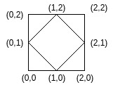

# 计算给定尺寸矩形内菱形的可能数量

> 原文:[https://www . geeksforgeeks . org/count-给定尺寸矩形内可能的菱形数量/](https://www.geeksforgeeks.org/count-the-number-of-rhombi-possible-inside-a-rectangle-of-given-size/)

给定高度 **H** 和宽度 **W** 的矩形，其左下角在 **(0，0)** 。任务是计算满足以下条件的矩形内部或边界上的所有点存在的不同菱形的数量:

*   有非零面积。
*   对角线平行于 x 轴和 y 轴。
*   有整数坐标。

**例:**

> **输入:** H = 2，W = 2
> **输出:** 2
> 坐标(0，1)、(1，0)、(2，1)和(1，2)可能只有一个菱形。
> 
> 
> 
> **输入:** H = 4，W = 4
> T3】输出: 16

**逼近:**既然对角线与轴平行，那就试着固定对角线，在对角线上创建菱形。菱形要有整数坐标，对角线的长度必须是偶数。让我们将对角线的长度固定为 **i** 和 **j** ，我们可以用这些对角线长度在矩形内形成的菱形的数量将是**(H–I+1)*(W–j+1)**。因此，我们迭代 **i** 和 **j** 的所有可能值，并更新计数。
以下是上述方法的实施:

## C++

```
// C++ implementation of the approach
#include <bits/stdc++.h>
using namespace std;

// Function to return the count of rhombi possible
long long countRhombi(int h, int w)
{
    long long ct = 0;

    // All possible diagonal lengths
    for (int i = 2; i <= h; i += 2)
        for (int j = 2; j <= w; j += 2)

            // Update rhombi possible with
            // the current diagonal lengths
            ct += (h - i + 1) * (w - j + 1);

    // Return the total count
    // of rhombi possible
    return ct;
}

// Driver code
int main()
{
    int h = 2, w = 2;

    cout << countRhombi(h, w);

    return 0;
}
```

## Java 语言(一种计算机语言，尤用于创建网站)

```
// Java implementation of the approach
import java.io.*;

class GFG
{

// Function to return the count of rhombi possible
static int countRhombi(int h, int w)
{
    int ct = 0;

    // All possible diagonal lengths
    for (int i = 2; i <= h; i += 2)
        for (int j = 2; j <= w; j += 2)

            // Update rhombi possible with
            // the current diagonal lengths
            ct += (h - i + 1) * (w - j + 1);

    // Return the total count
    // of rhombi possible
    return ct;
}

    // Driver code
    public static void main (String[] args)
    {
    int h = 2, w = 2;
    System.out.println (countRhombi(h, w));
    }
}

// This code is contributed by jit_t
```

## 蟒蛇 3

```
# Python 3 implementation of the approach

# Function to return the count of
# rhombi possible
def countRhombi(h, w):

    ct = 0;

    # All possible diagonal lengths
    for i in range(2, h + 1, 2):
        for j in range(2, w + 1, 2):

            # Update rhombi possible with
            # the current diagonal lengths
            ct += (h - i + 1) * (w - j + 1)

    # Return the total count
    # of rhombi possible
    return ct

# Driver code
if __name__ == "__main__":

    h = 2
    w = 2

    print(countRhombi(h, w))

# This code is contributed by ita_c
```

## C#

```
// C# program to find the frequency of
// minimum element in the array
using System;

class GFG
{

    // Function to return the count
    // of rhombi possible
    static int countRhombi(int h, int w)
    {
        int ct = 0;

        // All possible diagonal lengths
        for (int i = 2; i <= h; i += 2)
            for (int j = 2; j <= w; j += 2)

                // Update rhombi possible with
                // the current diagonal lengths
                ct += (h - i + 1) * (w - j + 1);

        // Return the total count
        // of rhombi possible
        return ct;
    }

    // Driver code
    public static void Main()
    {
        int h = 2, w = 2;

        Console.WriteLine(countRhombi(h, w));
    }
}

// This code is contributed by Ryuga
```

## 服务器端编程语言（Professional Hypertext Preprocessor 的缩写）

```
<?php
// PHP implementation of the approach

// Function to return the count of
// rhombi possible
function countRhombi($h, $w)
{
    $ct = 0;

    // All possible diagonal lengths
    for ($i = 2; $i <= $h; $i += 2)
        for ($j = 2; $j <= $w; $j += 2)

            // Update rhombi possible with
            // the current diagonal lengths
            $ct += ($h - $i + 1) * ($w - $j + 1);

    // Return the total count
    // of rhombi possible
    return $ct;
}

// Driver code
$h = 2; $w = 2;
echo(countRhombi($h, $w));

// This code is contributed by Code_Mech
?>
```

## java 描述语言

```
<script>
    // Javascript program to find the frequency of
    // minimum element in the array 

    // Function to return the count
    // of rhombi possible
    function countRhombi(h, w)
    {
        let ct = 0;

        // All possible diagonal lengths
        for (let i = 2; i <= h; i += 2)
            for (let j = 2; j <= w; j += 2)

                // Update rhombi possible with
                // the current diagonal lengths
                ct += (h - i + 1) * (w - j + 1);

        // Return the total count
        // of rhombi possible
        return ct;
    }

    let h = 2, w = 2;

      document.write(countRhombi(h, w));

</script>
```

**Output:** 

```
1
```

**时间复杂度:** O(H * W)