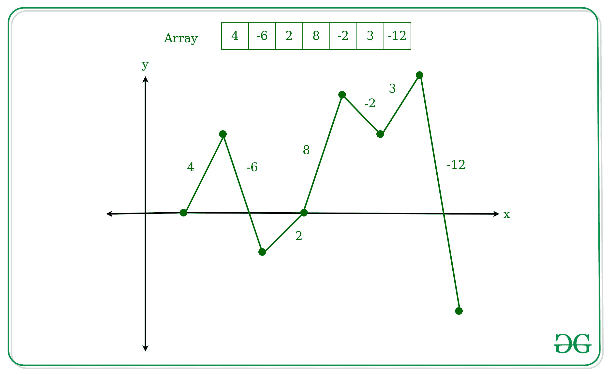

# 统计图形穿过 X 轴的次数

> 原文:[https://www . geesforgeks . org/count-次数-图表-交叉-x 轴/](https://www.geeksforgeeks.org/count-the-number-of-times-graph-crosses-x-axis/)

给定一个大小为 N 的整数数组 **arr[]** ，任务是找出图形穿过 X 轴的次数，其中正数表示超出其当前位置该值，负数表示超出该值。最初，当前位置在原点。

**示例:**

> **输入:** arr[] = {4，-6，2，8，-2，3，-12}
> **输出:**3
> T6】解释:
> 
> 
> 
> 所以这个图穿过 X 轴 3 次。
> 
> **输入:** arr[] = {1，1，-3，2}
> **输出:** 2

**方法:**迭代[数组](https://www.geeksforgeeks.org/introduction-to-arrays/)，将上一级和当前级的值保持为两个变量。最初，这两个水平都为零。根据数组中给出的值增加/减少级别，并在以下两种情况下增加计数。

*   如果前一个级别小于零，而当前级别大于或等于零。
*   如果前一个级别大于零，而当前级别小于或等于零。

下面是上述方法的实现。

## C++

```
// C++ implementation to count the
// number of times the graph
// crosses the x-axis.

#include <bits/stdc++.h>
using namespace std;

// Function to to count the
// number of times the graph
// crosses the x-axis.
int times(int steps[], int n)
{

    int current_level = 0;
    int previous_level = 0;
    int count = 0;

    // Iterate over the steps array
    for (int i = 0; i < n; i++) {

        // Update the previous level and
        // current level by value given
        // in the steps array
        previous_level = current_level;
        current_level = current_level
                        + steps[i];

        // Condition to check that the
        // graph crosses the origin.
        if ((previous_level < 0
             && current_level >= 0)
            || (previous_level > 0
                && current_level <= 0)) {
            count++;
        }
    }
    return count;
}

// Driver Code
int main()
{
    int steps[12] = { 1, -1, 0, 0, 1, 1, -3, 2 };
    int n = sizeof(steps) / sizeof(int);

    cout << times(steps, n);
    return 0;
}
```

## Java 语言(一种计算机语言，尤用于创建网站)

```
// Java implementation to count the
// number of times the graph
// crosses the x-axis.
class GFG
{

    // Function to to count the
    // number of times the graph
    // crosses the x-axis.
    static int times(int []steps, int n)
    {
        int current_level = 0;
        int previous_level = 0;
        int count = 0;

        // Iterate over the steps array
        for (int i = 0; i < n; i++)
        {

            // Update the previous level and
            // current level by value given
            // in the steps array
            previous_level = current_level;
            current_level = current_level + steps[i];

            // Condition to check that the
            // graph crosses the origin.
            if ((previous_level < 0 &&
                current_level >= 0)
                || (previous_level > 0
                && current_level <= 0))
            {
                count++;
            }
        }
        return count;
    }

    // Driver Code
    public static void main (String[] args)
    {
        int steps[] = { 1, -1, 0, 0, 1, 1, -3, 2 };
        int n = steps.length;

        System.out.println(times(steps, n));
    }
}

// This code is contributed by AnkitRai01
```

## 蟒蛇 3

```
# Python3 implementation to count the
# number of times the graph
# crosses the x-axis.

# Function to to count the
# number of times the graph
# crosses the x-axis.
def times(steps, n):

    current_level = 0
    previous_level = 0
    count = 0

    # Iterate over the steps array
    for i in range(n):

        # Update the previous level and
        # current level by value given
        #in the steps array
        previous_level = current_level
        current_level = current_level+ steps[i]

        # Condition to check that the
        # graph crosses the origin.
        if ((previous_level < 0
            and current_level >= 0)
            or (previous_level > 0
                and current_level <= 0)):
            count += 1

    return count

# Driver Code
steps = [1, -1, 0, 0, 1, 1, -3, 2]
n = len(steps)

print(times(steps, n))

# This code is contributed by mohit kumar 29
```

## C#

```
// C# implementation to count the
// number of times the graph
// crosses the x-axis.
using System;

class GFG
{

    // Function to to count the
    // number of times the graph
    // crosses the x-axis.
    static int times(int []steps, int n)
    {
        int current_level = 0;
        int previous_level = 0;
        int count = 0;

        // Iterate over the steps array
        for (int i = 0; i < n; i++)
        {

            // Update the previous level and
            // current level by value given
            // in the steps array
            previous_level = current_level;
            current_level = current_level + steps[i];

            // Condition to check that the
            // graph crosses the origin.
            if ((previous_level < 0 &&
                current_level >= 0)
                || (previous_level > 0
                && current_level <= 0))
            {
                count++;
            }
        }
        return count;
    }

    // Driver Code
    public static void Main ()
    {
        int []steps = { 1, -1, 0, 0, 1, 1, -3, 2 };
        int n = steps.Length;

        Console.WriteLine(times(steps, n));
    }
}

// This code is contributed by AnkitRai01
```

## java 描述语言

```
<script>
// Javascript implementation to count the
// number of times the graph
// crosses the x-axis.

// Function to to count the
// number of times the graph
// crosses the x-axis.
function times(steps, n) {

    let current_level = 0;
    let previous_level = 0;
    let count = 0;

    // Iterate over the steps array
    for (let i = 0; i < n; i++) {

        // Update the previous level and
        // current level by value given
        // in the steps array
        previous_level = current_level;
        current_level = current_level
            + steps[i];

        // Condition to check that the
        // graph crosses the origin.
        if ((previous_level < 0
            && current_level >= 0)
            || (previous_level > 0
                && current_level <= 0)) {
            count++;
        }
    }
    return count;
}

// Driver Code

let steps = [1, -1, 0, 0, 1, 1, -3, 2];
let n = steps.length;

document.write(times(steps, n));

// This code is contributed by _saurabh_jaiswal
</script>
```

**Output:** 

```
3
```