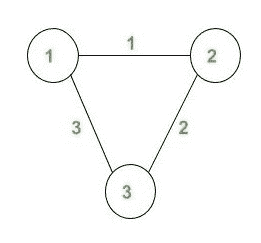
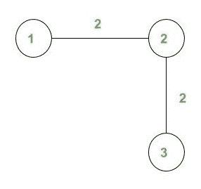
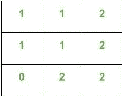

# 计算长度为 N 的行走次数，其中每次行走的成本等于给定的次数

> 原文:[https://www . geesforgeks . org/count-每次行走的行走次数 n-其中每次行走的成本等于给定的次数/](https://www.geeksforgeeks.org/count-the-number-of-walks-of-length-n-where-cost-of-each-walk-is-equal-to-a-given-number/)

给定一个加权无向图，行走的长度 N 和成本 X。任务是计算长度 N 的不同行走的数量 W，使得**成本(W) = X** 。
我们将行走的成本定义为沿行走的边的权重的最大值。
节点从 1 到 n 编号。该图不包含任何多条边或自循环。

**示例:**

> **输入:**
> 
> 
> 
> 。
> N = 4，X = 2
> **输出:** 10
> **解释:**
> 图中的行走 W 是顶点序列(允许重复顶点和边)，使得序列中的每一对相邻顶点都是图的一条边。
> 对于 X = 2，下面列出了所有可能的 10 次行走:
> 
> 1.  1 -> 2 -> 1 -> 2 -> 3
> 2.  1 -> 2 -> 3 -> 2 -> 1
> 3.  1 -> 2 -> 3 -> 2 -> 3
> 4.  2 -> 1 -> 2 -> 3 -> 2
> 5.  2 -> 3 -> 2 -> 1 -> 2
> 6.  2 -> 3 -> 2 -> 3 -> 2
> 7.  3 -> 2 -> 1 -> 2 -> 1
> 8.  3 -> 2 -> 1 -> 2 -> 3
> 9.  3 -> 2 -> 3 -> 2 -> 1
> 10.  3 -> 2 -> 3 -> 2 -> 3
> 
> **输入:**
> 
> 
> 
> N = 4，X = 2
> **输出:** 12

*   其思想是预先计算所有可能成本的每个顶点的长度为 N 的行走次数，并将它们存储在二维矩阵中。让我们称这个矩阵为 B。这些值可以通过在给定的无向图上运行 DFS 来计算。
    例如



矩阵 B 的给定快照显示了存储在其中的值。这里，B(i，j)表示从顶点 I 开始的长度为 N 的路的数量，具有路 j 的成本

*   我们维持一个一维数组 **Maxedge** ，其中我们保持行走长度 N 的代价，当行走长度小于 N 并且有一些代价 X 与 edge(u，v)相关联时，我们调用相同的函数。
    我们为**长度== N** 设置一个基本条件，为此我们更新数组 **B** 并返回调用。
*   在计算矩阵 B 之后，我们简单地通过将所有具有**成本= x** 的 vextex 的行走次数相加来计算行走总数。

> ans+= B[I][x]；
> 这里 I 的范围从 1 到 n，其中 n 是顶点的数量。

下面是上述方法的实现

## C++

```
// C++ program to count the number of walks
// of length N where cost of each walk is
// equal to k
#include <bits/stdc++.h>
using namespace std;
int G[250][250] = {0};
int Maxedge[250] = {0};
int B[250][250] = {0};
int l = 0, n, m;

// Function return total
// walk of length N
int TotalWalks(int cost)
{
     int ans=0;

    // Add values of all
    // node with cost X
     for(int i=1;i<=n;i++)
     {
        ans+=B[i][cost];
     }

     return ans;
}

// Function to precompute array B
// meantioned above
void DFS(int u, int v,int len)
{
    // Base condition
    if (l == len)             
    {
        // Updating the matrix B when
        // we get a walk of length N.
        B[u][ Maxedge[len]]++;
        return ;
    }
    for (int i = 1; i <= n; i++)
    {
        if (G[v][i] !=0)
        {
            // Incrementing the length
            // of the walk
            l++;

            // Updating the cost of the walk
            Maxedge[l] = max(Maxedge[l - 1],
                             G[v][i]);
            DFS(u, i, len);
            l--;
        }
    }
}

// Function to calculate total
// number of walks of length N
void NumberOfWalks(int cost,int len)
{
    for (int i = 1; i <= n; i++)
    {
        // Calling the function DFS
        DFS(i, i, len); 
    }

    int ans = TotalWalks(cost);

    // Print the answer
    cout<< ans << endl;
}

// Driver code
int main()
{
    int Cost = 2;
    n = 3, m = 3;
    int length = 4;

    // Create a graph given in
    // the above diagram
    G[1][2] = 1;
    G[2][1] = 1;
    G[2][3] = 2;
    G[3][2] = 2;
    G[1][3] = 3;
    G[3][1] = 3;

    NumberOfWalks(Cost, length) ;
}
```

## Java 语言(一种计算机语言，尤用于创建网站)

```
// Java program to count the number of walks
// of length N where cost of each walk is
// equal to k
import java.util.*;

class GFG{

static int [][]G = new int[250][250];
static int []Maxedge = new int[250];
static int [][]B = new int[250][250];
static int l = 0, n, m;

// Function return total
// walk of length N
static int TotalWalks(int cost)
{
    int ans = 0;

    // Add values of all
    // node with cost X
    for(int i = 1; i <= n; i++)
    {
        ans += B[i][cost];
    }

    return ans;
}

// Function to precompute array B
// meantioned above
static void DFS(int u, int v, int len)
{
    // Base condition
    if (l == len)            
    {

        // Updating the matrix B when
        // we get a walk of length N.
        B[u][ Maxedge[len]]++;
        return;
    }

    for (int i = 1; i <= n; i++)
    {
        if (G[v][i] !=0)
        {

            // Incrementing the length
            // of the walk
            l++;

            // Updating the cost of the walk
            Maxedge[l] = Math.max(Maxedge[l - 1],
                                        G[v][i]);
            DFS(u, i, len);
            l--;
        }
    }
}

// Function to calculate total
// number of walks of length N
static void NumberOfWalks(int cost,int len)
{
    for(int i = 1; i <= n; i++)
    {

       // Calling the function DFS
       DFS(i, i, len);
    }

    int ans = TotalWalks(cost);

    // Print the answer
    System.out.print(ans + "\n");
}

// Driver code
public static void main(String[] args)
{
    int Cost = 2;
    n = 3; m = 3;
    int length = 4;

    // Create a graph given in
    // the above diagram
    G[1][2] = 1;
    G[2][1] = 1;
    G[2][3] = 2;
    G[3][2] = 2;
    G[1][3] = 3;
    G[3][1] = 3;

    NumberOfWalks(Cost, length);
}
}

// This code is contributed by 29AjayKumar
```

## 蟒蛇 3

```
# Python3 program to count the number of walks
# of length N where cost of each walk is
# equal to k
G = [[0 for i in range(250)]
        for j in range(250)]
Maxedge = [0 for i in range(250)]
B = [[0 for i in range(250)]
        for j in range(250)]
l = 0
n = 0
m = 0

# Function return total
# walk of length N
def TotalWalks(cost):

    ans = 0

    # Add values of all
    # node with cost X
    for i in range(1, n + 1):
        ans += B[i][cost]

    return ans

# Function to precompute array B
# meantioned above
def DFS(u, v, len):

    global l

    # Base condition
    if (l == len):

        # Updating the matrix B when
        # we get a walk of length N.
        B[u][ Maxedge[len]] += 1
        return

    for i in range(1, n + 1):
        if (G[v][i] != 0):

            # Incrementing the length
            # of the walk
            l += 1

            # Updating the cost of the walk
            Maxedge[l] = max(Maxedge[l - 1], G[v][i])
            DFS(u, i, len)
            l -= 1

# Function to calculate total
# number of walks of length N
def NumberOfWalks(cost, len):

    for i in range(1, n + 1):

        # Calling the function DFS
        DFS(i, i, len) 

    ans = TotalWalks(cost)

    # Print the answer
    print(ans)

# Driver code
if __name__=='__main__':

    Cost = 2
    n = 3
    m = 3
    length = 4

    # Create a graph given in
    # the above diagram
    G[1][2] = 1
    G[2][1] = 1
    G[2][3] = 2
    G[3][2] = 2
    G[1][3] = 3
    G[3][1] = 3

    NumberOfWalks(Cost, length)

# This code is contributed by rutvik_56
```

## C#

```
// C# program to count the number of walks
// of length N where cost of each walk is
// equal to k
using System;

class GFG{

static int [,]G = new int[250, 250];
static int []Maxedge = new int[250];
static int [,]B = new int[250, 250];
static int l = 0, n;

// Function return total
// walk of length N
static int TotalWalks(int cost)
{
    int ans = 0;

    // Add values of all
    // node with cost X
    for(int i = 1; i <= n; i++)
    {
       ans += B[i, cost];
    }
    return ans;
}

// Function to precompute array B
// meantioned above
static void DFS(int u, int v, int len)
{

    // Base condition
    if (l == len)            
    {

        // Updating the matrix B when
        // we get a walk of length N.
        B[u, Maxedge[len]]++;
        return;
    }

    for(int i = 1; i <= n; i++)
    {
       if (G[v, i] != 0)
       {

           // Incrementing the length
           // of the walk
           l++;

           // Updating the cost of the walk
           Maxedge[l] = Math.Max(Maxedge[l - 1],
                                       G[v, i]);
           DFS(u, i, len);
           l--;
       }
    }
}

// Function to calculate total
// number of walks of length N
static void NumberOfWalks(int cost, int len)
{
    for(int i = 1; i <= n; i++)
    {

       // Calling the function DFS
       DFS(i, i, len);
    }

    int ans = TotalWalks(cost);

    // Print the answer
    Console.Write(ans + "\n");
}

// Driver code
public static void Main(String[] args)
{
    int Cost = 2;
    n = 3;
    int length = 4;

    // Create a graph given in
    // the above diagram
    G[1, 2] = 1;
    G[2, 1] = 1;
    G[2, 3] = 2;
    G[3, 2] = 2;
    G[1, 3] = 3;
    G[3, 1] = 3;

    NumberOfWalks(Cost, length);
}
}

// This code is contributed by gauravrajput1
```

## java 描述语言

```
<script>

// JavaScript program to count the number of walks
// of length N where cost of each walk is
// equal to k

let G = new Array(250);
let B = new Array(250);
for(let i=0;i<250;i++)
{
    G[i]=new Array(250);
    B[i]=new Array(250);
    for(let j=0;j<250;j++)
    {
        G[i][j]=0;
        B[i][j]=0;
    }
}

let Maxedge = new Array(250);
for(let i=0;i<250;i++)
    Maxedge[i]=0;
let l = 0, n, m;

// Function return total
// walk of length N
function TotalWalks(cost)
{
    let ans = 0;

    // Add values of all
    // node with cost X
    for(let i = 1; i <= n; i++)
    {
        ans += B[i][cost];
    }

    return ans;
}

// Function to precompute array B
// meantioned above
function DFS(u,v,len)
{
    // Base condition
    if (l == len)           
    {

        // Updating the matrix B when
        // we get a walk of length N.
        B[u][ Maxedge[len]]++;
        return;
    }

    for (let i = 1; i <= n; i++)
    {
        if (G[v][i] !=0)
        {

            // Incrementing the length
            // of the walk
            l++;

            // Updating the cost of the walk
            Maxedge[l] = Math.max(Maxedge[l - 1],
                                        G[v][i]);
            DFS(u, i, len);
            l--;
        }
    }
}

// Function to calculate total
// number of walks of length N
function NumberOfWalks(cost,len)
{
    for(let i = 1; i <= n; i++)
    {

       // Calling the function DFS
       DFS(i, i, len);
    }

    let ans = TotalWalks(cost);

    // Print the answer
    document.write(ans + "<br>");
}

// Driver code
let Cost = 2;
n = 3; m = 3;
let length = 4;

// Create a graph given in
// the above diagram
G[1][2] = 1;
G[2][1] = 1;
G[2][3] = 2;
G[3][2] = 2;
G[1][3] = 3;
G[3][1] = 3;

NumberOfWalks(Cost, length);

// This code is contributed by unknown2108

</script>
```

**Output:** 

```
10
```