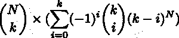

# 统计用 N 个不同项目填充 K 个盒子的方法数量

> 原文:[https://www . geeksforgeeks . org/count-用 n 个不同的项目填充 k 个盒子的方法数/](https://www.geeksforgeeks.org/count-the-number-of-ways-to-fill-k-boxes-with-n-distinct-items/)

给定两个值 **N** 和 **K** 。找出排列盒子中 N 个不同项目的方法，以便从 N 个不同的盒子中准确地使用 K (K < N)个盒子。答案可能很大，所以返回模 10 <sup>9</sup> + 7 的答案。
**注:**1<=**N**<=**K**<= 10<sup>5</sup>。
**先决条件:** [一个数的阶乘](https://www.geeksforgeeks.org/program-for-factorial-of-a-number/)、[计算 nCr % p](https://www.geeksforgeeks.org/compute-ncr-p-set-3-using-fermat-little-theorem/)

**示例:**

> **输入:** N = 5，k = 5
> T3】输出: 120
> 
> **输入:** N = 5，k = 3
> T3】输出: 1500

**方法:**我们将使用[包含-排除原则](https://www.geeksforgeeks.org/inclusion-exclusion-various-applications/)来计算方式。

1.  让我们假设盒子编号为 1 到 N，现在我们必须选择任意 K 个盒子并使用它们。做到这一点的方法有**N<sub>CK</sub>T3。**
2.  现在任何物品都可以放在任何一个选择的盒子里，因此排列它们的方法有**K<sup>N</sup>T3【但是在这里，我们可以计算一些空盒子的排列。因此，我们将使用包含-排除原则来确保我们计算所有 K 个盒子至少填充一个项目的方式。**
3.  让我们理解包含-排除原则的应用:
    *   所以出 **K <sup>N</sup>** 的方式，我们减去至少 1 个箱子(出 K)是空的情况。于是，减去
        T5(K<sub>C1</sub>)*((K-1)<sup>N</sup>)。
    *   请注意，这里将恰好两个框为空的情况减去两次(当我们在(**K<sub>【C1】</sub>**)方式中选择第一个元素时减去一次，然后当我们在( **K <sub>C1</sub>** )方式中选择第二个元素时减去一次)。
    *   因此，我们一次性添加这些方式来进行补偿。所以我们加上**(K<sub>C2</sub>)*((K–2)<sup>N</sup>)**。
    *   同样，这里我们需要添加当至少 3 个盒子是空的时候的路数，以此类推…
4.  因此，途径总数:



## C++

```
// C++ program to calculate the
// above formula
#include <bits/stdc++.h>
#define mod 1000000007
#define int long long

using namespace std;

// To store the factorials
// of all numbers
int factorial[100005];

// Function to calculate factorial
// of all numbers
void StoreFactorials(int n)
{
    factorial[0] = 1;
    for (int i = 1; i <= n; i++)
    {
        factorial[i] =
          (i * factorial[i - 1])
            % mod;

    }
}

// Calculate x to the power y
// in O(log n) time
int Power(int x, int y)
{
    int ans = 1;
    while (y > 0) {
        if (y % 2 == 1) {
            ans = (ans * x) % mod;
        }
        x = (x * x) % mod;
        y /= 2;
    }
    return ans;
}

// Function to find inverse mod of
// a number x
int invmod(int x)
{
    return Power(x, mod - 2);
}

// Calculate (n C r)
int nCr(int n, int r)
{
    return (factorial[n]
            * invmod((factorial[r]
            * factorial[n - r]) % mod))
            % mod;
}

int CountWays(int n,int k)
{
    StoreFactorials(n);

    // Loop to compute the formula
    // evaluated
    int ans = 0;
    for (int i = k; i >= 0; i--)
    {
        if (i % 2 == k % 2)
        {
            // Add even power terms
            ans = (ans + (Power(i, n)
                  * nCr(k, i)) % mod)
                  % mod;
        }
        else
        {
            // Subtract odd power terms
            ans = (ans + mod - (Power(i, n)
                  * nCr(k, i)) % mod) % mod;
        }
    }

    // Choose the k boxes which
    // were used
    ans = (ans * nCr(n, k)) % mod;

    return ans;
}

// Driver code
signed main()
{
    int N = 5;
    int K = 5;

    cout << CountWays(N, K) << "\n";

    return 0;
}
```

## Java 语言(一种计算机语言，尤用于创建网站)

```
// Java program to calculate the
// above formula    
import java.util.*;

class GFG{        

static long mod = 1000000007;

// To store the factorials
// of all numbers
static long factorial[] = new long[100005];

// Function to calculate factorial
// of all numbers
static void StoreFactorials(int n)
{
    factorial[0] = 1;

    for(int i = 1; i <= n; i++)
    {
        factorial[i] = (i *
        factorial[i - 1]) % mod;
    }
}

// Calculate x to the power y
// in O(log n) time
static long Power(long x, long y)
{
    long ans = 1;

    while (y > 0)
    {
        if (y % 2 == 1)
        {
            ans = (ans * x) % mod;
        }
        x = (x * x) % mod;
        y /= 2;
    }
    return ans;
}

// Function to find inverse mod of
// a number x
static long invmod(long x)
{
    return Power(x, mod - 2);
}

// Calculate (n C r)
static long nCr(int n, int r)
{
    return (factorial[n] *
    invmod((factorial[r] *
            factorial[n - r]) % mod)) % mod;
}

static long CountWays(int n,int k)
{
    StoreFactorials(n);

    // Loop to compute the formula
    // evaluated
    long ans = 0;
    for(int i = k; i >= 0; i--)
    {
        if (i % 2 == k % 2)
        {

            // Add even power terms
            ans = (ans + (Power(i, n) *
                   nCr(k, i)) % mod) % mod;
        }
        else
        {

            // Subtract odd power terms
            ans = (ans + mod - (Power(i, n) *
                   nCr(k, i)) % mod) % mod;
        }
    }

    // Choose the k boxes which
    // were used
    ans = (ans * nCr(n, k)) % mod;

    return ans;
}    

// Driver Code        
public static void main (String[] args)
{        
    int N = 5;
    int K = 5;

    System.out.print(CountWays(N, K) + "\n");
}        
}

// This code is contributed by math_lover
```

## 蟒蛇 3

```
# Python3 program to calculate the
# above formula

mod = 1000000007

# To store the factorials
# of all numbers
factorial = [0 for i in range(100005)]

# Function to calculate factorial
# of all numbers
def StoreFactorials(n):

    factorial[0] = 1
    for i in range(1, n + 1, 1):
        factorial[i] = (i * factorial[i - 1]) % mod

# Calculate x to the power y
# in O(log n) time
def Power(x, y):

    ans = 1
    while (y > 0):

        if (y % 2 == 1):
            ans = (ans * x) % mod

        x = (x * x) % mod
        y //= 2

    return ans

# Function to find inverse mod
# of a number x
def invmod(x):

    return Power(x, mod - 2)

# Calculate (n C r)
def nCr(n, r):
    return ((factorial[n] * invmod((factorial[r] *
                                    factorial[n - r]) %
                                    mod)) % mod)

def CountWays(n, k):

    StoreFactorials(n)

    # Loop to compute the formula
    # evaluated
    ans = 0
    i = k

    while(i >= 0):
        if (i % 2 == k % 2):

            # Add even power terms
            ans = ((ans + (Power(i, n) *
                           nCr(k, i)) % mod) % mod)
        else:

            # Subtract odd power terms
            ans = ((ans + mod - (Power(i, n) *
                                 nCr(k, i)) %
                                 mod) % mod)
        i -= 1

    # Choose the k boxes which
    # were used
    ans = (ans * nCr(n, k)) % mod

    return ans

# Driver code
if __name__ == '__main__':

    N = 5
    K = 5

    print(CountWays(N, K))

# This code is contributed by Surendra_Gangwar
```

## C#

```
// C# program to calculate the
// above formula    
using System;
using System.Collections;
using System.Collections.Generic;

class GFG{        

static long mod = 1000000007;

// To store the factorials
// of all numbers
static long []factorial = new long[100005];

// Function to calculate factorial
// of all numbers
static void StoreFactorials(int n)
{
    factorial[0] = 1;

    for(int i = 1; i <= n; i++)
    {
        factorial[i] = (i *
        factorial[i - 1]) % mod;
    }
}

// Calculate x to the power y
// in O(log n) time
static long Power(long x, long y)
{
    long ans = 1;

    while (y > 0)
    {
        if (y % 2 == 1)
        {
            ans = (ans * x) % mod;
        }
        x = (x * x) % mod;
        y /= 2;
    }
    return ans;
}

// Function to find inverse mod of
// a number x
static long invmod(long x)
{
    return Power(x, mod - 2);
}

// Calculate (n C r)
static long nCr(int n, int r)
{
    return (factorial[n] *
    invmod((factorial[r] *
            factorial[n - r]) % mod)) % mod;
}

static long CountWays(int n,int k)
{
    StoreFactorials(n);

    // Loop to compute the formula
    // evaluated
    long ans = 0;
    for(int i = k; i >= 0; i--)
    {
        if (i % 2 == k % 2)
        {

            // Add even power terms
            ans = (ans + (Power(i, n) *
                  nCr(k, i)) % mod) % mod;
        }
        else
        {

            // Subtract odd power terms
            ans = (ans + mod - (Power(i, n) *
                  nCr(k, i)) % mod) % mod;
        }
    }

    // Choose the k boxes which
    // were used
    ans = (ans * nCr(n, k)) % mod;

    return ans;
}    

// Driver Code        
public static void Main (string[] args)
{        
    int N = 5;
    int K = 5;

    Console.Write(CountWays(N, K) + "\n");
}        
}

// This code is contributed by rutvik_56
```

**Output:** 

```
120
```

**时间复杂度:** O(N*log N)

**辅助空间:** O(10 <sup>5</sup> )