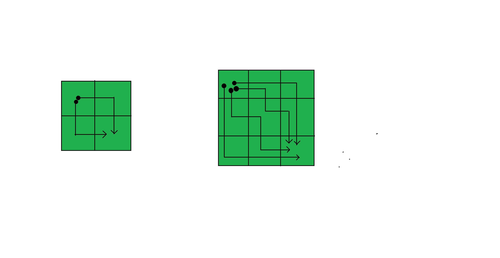

# 计算遍历矩阵的次数

> 原文:[https://www . geeksforgeeks . org/count-遍历矩阵的路数/](https://www.geeksforgeeks.org/count-the-number-of-ways-to-traverse-a-matrix/)

给定一个二维矩阵，怎样才能有人从左上角到右下角遍历它？
条件-在任何特定的单元格，可能的移动要么向下，要么向右，没有其他可能的步骤。
到达终点时停止。



**示例:**

```
Input : 3 3
Output : 6

Input : 5 5
Output : 70
```

如果我们仔细观察，我们会发现一个单元格可以到达的次数是=它可以到达它上面的单元格的次数+它可以到达它剩下的单元格的次数。

因此，根据它开始填充 2D 数组，并在完全填充数组后返回最后一个单元格。

下面是上述方法的实现:

## C++

```
// C++ program using recursive solution to count
// number of ways to reach mat[m-1][n-1] from
// mat[0][0] in a matrix mat[][]
#include <bits/stdc++.h>
using namespace std;

// Returns The number of way from top-left
// to mat[m-1][n-1]
int countPaths(int m, int n)
{
    // Return 1 if it is the first row or
    // first column
    if (m == 1 || n == 1)
        return 1;

    // Recursively find the no of way to
    // reach the last cell.
    return countPaths(m - 1, n) +
           countPaths(m, n - 1);
}

// Driver code
int main()
{
    int n = 5;
    int m = 5;
    cout << countPaths(n, m);
    return 0;
}
```

## Java 语言(一种计算机语言，尤用于创建网站)

```
// Java program using recursive
// solution to count number of
// ways to reach mat[m-1][n-1] from
// mat[0][0] in a matrix mat[][]
import java.lang.*;
import java.util.*;

class GFG
{
// Returns The number of way
// from top-left to mat[m-1][n-1]
public int countPaths(int m, int n)
{
    // Return 1 if it is the first
    // row or first column
    if (m == 1 || n == 1)
        return 1;

    // Recursively find the no of
    // way to reach the last cell.
    return countPaths(m - 1, n) +
           countPaths(m, n - 1);
}

// Driver Code
public static void main(String args[])
{
    GFG g = new GFG();

    int n = 5, m = 5;
    System.out.println(g.countPaths(n, m));
}
}

// This code is contributed
// by Akanksha Rai(Abby_akku)
```

## 蟒蛇 3

```
# Python3 program using recursive solution to count
# number of ways to reach mat[m-1][n-1] from
# mat[0][0] in a matrix mat[][]

# Returns The number of way from top-left
# to mat[m-1][n-1]
def countPaths(m, n) :

    # Return 1 if it is the first row or
    # first column
    if m == 1 or n == 1 :
        return 1

    # Recursively find the no of way to
    # reach the last cell.
    return (countPaths(m - 1, n) +
            countPaths(m, n - 1))

# Driver code    
if __name__ == "__main__" :

    n = 5
    m = 5
    print(countPaths(n, m))

# This code is contributed by ANKITRAI1
```

## C#

```
// C# program using recursive
// solution to count number of
// ways to reach mat[m-1][n-1] from
// mat[0][0] in a matrix mat[][]
using System;

class GFG
{
// Returns The number of way
// from top-left to mat[m-1][n-1]
public int countPaths(int m, int n)
{
    // Return 1 if it is the first
    // row or first column
    if (m == 1 || n == 1)
        return 1;

    // Recursively find the no of
    // way to reach the last cell.
    return countPaths(m - 1, n) +
        countPaths(m, n - 1);
}

// Driver Code
public static void Main()
{
    GFG g = new GFG();

    int n = 5, m = 5;
    Console.WriteLine(g.countPaths(n, m));
    Console.Read();
}
}

// This code is contributed
// by SoumikMondal
```

## 服务器端编程语言（Professional Hypertext Preprocessor 的缩写）

```
<?php
// PHP program using recursive
// solution to count number of
// ways to reach mat[m-1][n-1] from
// mat[0][0] in a matrix mat[][]

// Returns The number of way
// from top-left to mat[m-1][n-1]

function countPaths($m, $n)
{
    // Return 1 if it is the
    // first row or first column
    if ($m == 1 || $n == 1)
        return 1;

    // Recursively find the no of
    // way to reach the last cell.
    return countPaths($m - 1, $n) +
           countPaths($m, $n - 1);
}

// Driver code
$n = 5;
$m = 5;
echo countPaths($n, $m);

// This code is contributed by jit_t
?>
```

## java 描述语言

```
<script>
    // Javascript program using recursive
    // solution to count number of
    // ways to reach mat[m-1][n-1] from
    // mat[0][0] in a matrix mat[][]

    // Returns The number of way
    // from top-left to mat[m-1][n-1]
    function countPaths(m, n)
    {

        // Return 1 if it is the first
        // row or first column
        if (m == 1 || n == 1)
            return 1;

        // Recursively find the no of
        // way to reach the last cell.
        return countPaths(m - 1, n) +
            countPaths(m, n - 1);
    }

    let n = 5, m = 5;
    document.write(countPaths(n, m));

// This code is contributed by suresh07.
</script>
```

**Output**

```
70
```

上述解具有指数时间复杂度。它可以使用动态规划进行优化，因为有重叠的子问题(在下面的部分递归树中突出显示 m=3，n=3)

```
            CP(3, 3)
          /        \
     CP(2, 3)     CP(3, 2)
     /    \        /     \
 CP(1,3) CP(2,2) CP(2,2) CP(3,1)
```

## C++

```
// A simple recursive solution to count
// number of ways to reach mat[m-1][n-1] from
// mat[0][0] in a matrix mat[][]
#include <bits/stdc++.h>
using namespace std;

// Returns The number of way from top-left
// to mat[m-1][n-1]
int countPaths(int m, int n)
{
    int dp[m+1][n+1];

    for (int i=1; i<=m; i++)
    {
        for (int j=1; j<=n; j++)
        {
           if (i==1 || j == 1)
              dp[i][j] = 1;
            else
              dp[i][j] = dp[i-1][j] + dp[i][j-1];             
        }
    }

    return dp[m][n];
}

// Driver code
int main()
{
    int n = 5;
    int m = 5;
    cout << countPaths(n, m);
    return 0;
}
```

## Java 语言(一种计算机语言，尤用于创建网站)

```
// A simple recursive solution to count
// number of ways to reach mat[m-1][n-1] from
// mat[0][0] in a matrix mat[][]

class GFG
{
    // Returns The number of way from top-left
    // to mat[m-1][n-1]
    static int countPaths(int m, int n)
    {
        int [][]dp=new int[m+1][n+1];

        for (int i=1; i<=m; i++)
        {
            for (int j=1; j<=n; j++)
            {
            if (i==1 || j == 1)
                dp[i][j] = 1;
                else
                dp[i][j] = dp[i-1][j] + dp[i][j-1];            
            }
        }

        return dp[m][n];
    }

    // Driver code
    public static void main(String []args)
    {
        int n = 5;
        int m = 5;
        System.out.println(countPaths(n, m));

    }
}

// This code is contributed
// by ihritik (Hritik Raj)
```

## 蟒蛇 3

```
# A simple recursive solution to
# count number of ways to reach
# mat[m-1][n-1] from mat[0][0]
# in a matrix mat[][]

# Returns The number of way
# from top-left to mat[m-1][n-1]
def countPaths(m, n):

    dp = [[0 for i in range(m + 1)]
             for j in range(n + 1)]

    for i in range(1, m + 1):
        for j in range(1, n + 1):
            if (i == 1 or j == 1):
                dp[i][j] = 1
            else:
                dp[i][j] = (dp[i - 1][j] +
                            dp[i][j - 1])            

    return dp[m][n]

# Driver code
if __name__ =="__main__":

    n = 5
    m = 5
    print(countPaths(n, m))

# This code is contributed
# by ChitraNayal
```

## C#

```
// A simple recursive solution to count
// number of ways to reach mat[m-1][n-1] from
// mat[0][0] in a matrix mat[][]

using System;
class GFG
{
    // Returns The number of way from top-left
    // to mat[m-1][n-1]
    static int countPaths(int m, int n)
    {
        int [,]dp=new int[m+1,n+1];

        for (int i=1; i<=m; i++)
        {
            for (int j=1; j<=n; j++)
            {
            if (i==1 || j == 1)
                dp[i,j] = 1;
                else
                dp[i,j] = dp[i-1,j] + dp[i,j-1];            
            }
        }

        return dp[m,n];
    }

    // Driver code
    public static void Main()
    {
        int n = 5;
        int m = 5;
        Console.WriteLine(countPaths(n, m));

    }
}

// This code is contributed
// by ihritik (Hritik Raj)
```

## 服务器端编程语言（Professional Hypertext Preprocessor 的缩写）

```
<?php
// A simple recursive solution to count
// number of ways to reach mat[m-1][n-1]
// from mat[0][0] in a matrix mat[][]

// Returns The number of way from top-left
// to mat[m-1][n-1]
function countPaths($m, $n)
{
    $dp;

    for ($i = 1; $i <= $m; $i++)
    {
        for ($j = 1; $j <= $n; $j++)
        {
            if ($i == 1 || $j == 1)
                $dp[$i][$j] = 1;
            else
                $dp[$i][$j] = $dp[$i - 1][$j] +
                              $dp[$i][$j - 1];            
        }
    }

    return $dp[$m][$n];
}

// Driver code
$n = 5;
$m = 5;
echo countPaths($n, $m);

// This code is contributed by Rajput-Ji
?>
```

## java 描述语言

```
<script>
    // A simple recursive solution to count
    // number of ways to reach mat[m-1][n-1] from
    // mat[0][0] in a matrix mat[][]

    // Returns The number of way from top-left
    // to mat[m-1][n-1]
    function countPaths(m, n)
    {
        let dp = new Array(m+1);
        for (let i=0; i<=m; i++)
        {
            dp[i] = new Array(n + 1);
            for (let j=0; j<=n; j++)
            {
                dp[i][j] = 0;
            }
        }

        for (let i=1; i<=m; i++)
        {
            for (let j=1; j<=n; j++)
            {
            if (i==1 || j == 1)
                dp[i][j] = 1;
                else
                dp[i][j] = dp[i-1][j] + dp[i][j-1];           
            }
        }

        return dp[m][n];
    }

    let n = 5;
    let m = 5;
    document.write(countPaths(n, m));

</script>
```

**Output**

```
70
```

**时间复杂度:** O(m * n)

**另一种方法(高效):**

在 O(m)或 O(n)中，有一种更有效的方法来获得解，以较大者为准。

我们可以改变右操作和下操作的数量。

> 解释:
> 
> 在给定的图中，我们可以看到，对于一个 3×3 的矩阵，我们需要 2 个右操作和 2 个下操作。
> 
> 因此，我们可以按任何顺序排列这些操作，但我们仍然可以到达右下角。
> 
> RRDD、RDRD、RDDR、DR、DDR、DRRD

设列数为 m，行数为 n，则排列数= (m+n)！/ (m！*n！)

下面是上述逻辑的实现。

## C++

```
// C++ program for above approach
#include<bits/stdc++.h>
using namespace std;

// Find factorial
int factorial(int n)
{
    int res = 1, i;

    for(i = 2; i <= n; i++)
        res *= i;

    return res;
}

// Find number of ways to reach
// mat[m-1][n-1] from mat[0][0]
// in a matrix mat[][]]
 int countWays(int m, int n)
{
    m = m - 1;
    n = n - 1;

    return factorial(m + n) /
          (factorial(m) *
           factorial(n));
}

// Driver Code
int main()
{
    int m = 5;
    int n = 5;

    // Function call
    int result = countWays(m, n);

    cout << result;
}

// This code is contributed by chahattekwani71
```

## Java 语言(一种计算机语言，尤用于创建网站)

```
// Java Program for above approach
import java.io.*;

class GFG {

    // Find factorial
    static int factorial(int n)
    {
        int res = 1, i;
        for (i = 2; i <= n; i++)
            res *= i;
        return res;
    }
    // Find number of ways to reach
    // mat[m-1][n-1] from mat[0][0]
    // in a matrix mat[][]]
    static int countWays(int m, int n)
    {
        m = m - 1;
        n = n - 1;
        return factorial(m + n)
            / (factorial(m) * factorial(n));
    }

    // Driver Code
    public static void main(String[] args)
    {
        int m = 5;
        int n = 5;

        // Function Call
        int result = countWays(m, n);
        System.out.println(result);
    }
}
```

## 蟒蛇 3

```
# Python3 program for
# the above approach

# Find factorial
def factorial(n):

    res = 1

    for i in range(2, n + 1):
        res *= i

    return res

# Find number of ways to reach
# mat[m-1][n-1] from mat[0][0]
# in a matrix mat[][]]
def countWays(m, n):

    m = m - 1
    n = n - 1   
    return (factorial(m + n) //
           (factorial(m) *
            factorial(n)))

# Driver code  
m = 5
n = 5

# Function call
result = countWays(m, n)

print(result)

# This code is contributed by divyeshrabadiya07
```

## C#

```
// C# Program for above approach
using System;

class GFG{

// Find factorial
static int factorial(int n)
{
    int res = 1, i;
    for(i = 2; i <= n; i++)
        res *= i;

    return res;
}

// Find number of ways to reach
// mat[m-1][n-1] from mat[0][0]
// in a matrix mat[][]]
static int countWays(int m, int n)
{
    m = m - 1;
    n = n - 1;

    return factorial(m + n) /
          (factorial(m) * factorial(n));
}

// Driver code
static void Main()
{
    int m = 5;
    int n = 5;

    // Function Call
    int result = countWays(m, n);

    Console.WriteLine(result);
}
}

// This code is contributed by divyesh072019
```

## java 描述语言

```
<script>

// JavaScript Program for above approach

// Find factorial
function factorial( n)
{
    var res = 1, i;
    for(i = 2; i <= n; i++)
        res *= i;

    return res;
}

// Find number of ways to reach
// mat[m-1][n-1] from mat[0][0]
// in a matrix mat[][]]
function countWays( m,  n)
{
    m = m - 1;
    n = n - 1;

    return factorial(m + n) /
          (factorial(m) * factorial(n));
}

// Driver code

    var m = 5;
    var n = 5;

    // Function Call
    var result = countWays(m, n);

    document.write(result);

</script>
```

**Output**

```
70
```

**时间复杂度:** O(n)